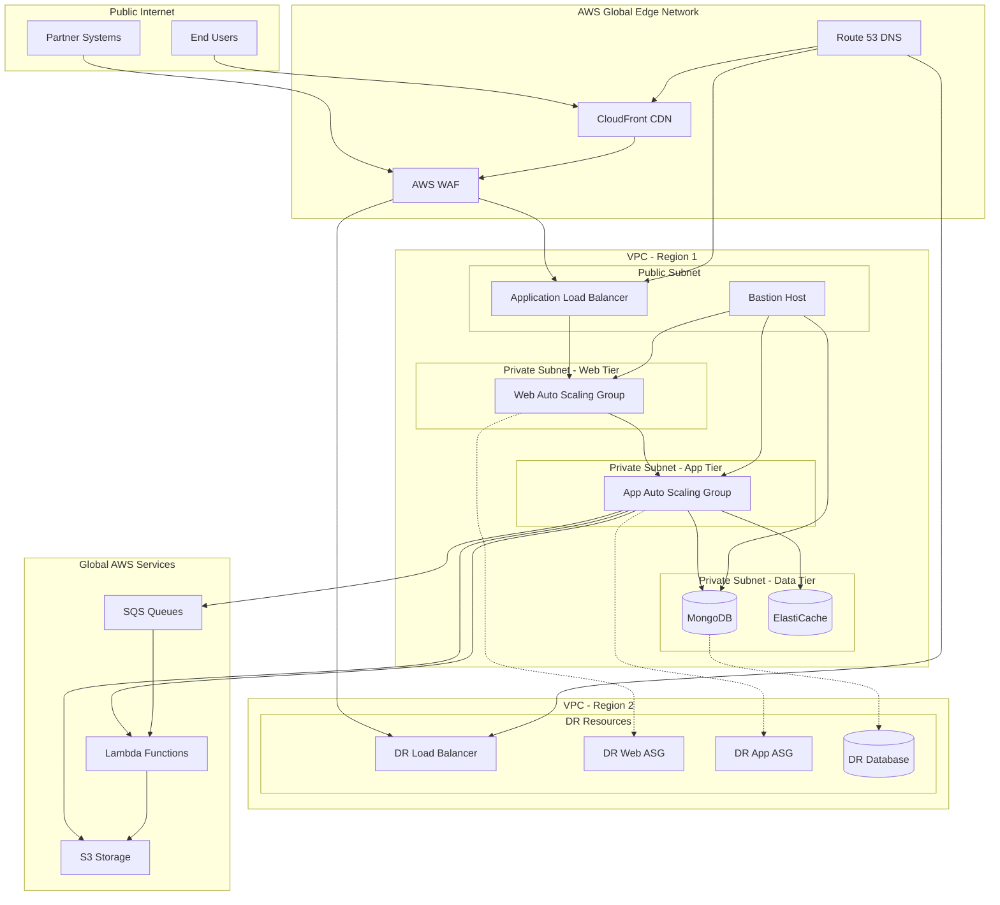

# PROJECT OVERVIEW

The IndiVillage.com website redesign project is a comprehensive initiative to create a modern, visually stunning digital platform that effectively showcases the company's AI-as-a-service and scalable back-office capabilities while highlighting its social impact mission. The current website fails to adequately represent IndiVillage's technological sophistication and social impact initiatives, limiting customer engagement and business growth.

## Project Purpose

IndiVillage operates in the competitive AI services market with a unique "AI for Good" value proposition, combining technical excellence with social impact. The redesigned website aims to:

1. Increase qualified leads by at least 30%
2. Improve conversion rates for demo requests
3. Strengthen brand perception as a technology leader
4. Better communicate IndiVillage's dual mission of providing cutting-edge AI services while creating positive social impact

## Key Stakeholders

- **Potential enterprise clients** seeking AI solutions
- **IndiVillage leadership team**
- **Technical implementation teams**
- **Communities benefiting** from IndiVillage's social impact initiatives

## Core Features

The IndiVillage.com website implements several key features to achieve its business objectives:

1. **Modern, Responsive Design**: A clean, contemporary design that reflects IndiVillage's technological sophistication and adapts seamlessly to all devices (mobile, tablet, desktop).

2. **AI-as-a-Service Portfolio Showcase**: Comprehensive presentation of IndiVillage's AI service offerings including:
   - Data Collection
   - Data Preparation
   - AI Model Development
   - Human-in-the-Loop solutions

3. **Sample Data Upload Functionality**: Interactive capability allowing potential clients to upload sample datasets for preliminary analysis, accelerating the sales cycle by enabling prospects to experience service value quickly.

4. **Demo/Quote Request System**: Automated system for visitors to request service demonstrations or price quotes, generating qualified leads and streamlining the sales process.

5. **Social Impact Storytelling**: Compelling presentation of IndiVillage's "AI for Good" mission, incorporating content that showcases the company's social impact initiatives and community transformation efforts.

6. **Case Studies and Success Stories**: Detailed case studies showcasing successful client implementations across different AI service categories to build credibility and demonstrate proven capabilities.

7. **CRM Integration**: Seamless integration with HubSpot CRM for efficient lead management and tracking.

## Technology Stack

The IndiVillage.com website is built using a modern technology stack designed for performance, security, and maintainability:

### Frontend
- **Next.js 13.4+**: React framework with server-side rendering for SEO optimization
- **React 18.2+**: Component-based UI library
- **TypeScript 4.9+**: Type-safe JavaScript for improved developer experience
- **TailwindCSS 3.3+**: Utility-first CSS framework for rapid UI development

### Backend
- **Python 3.10+**: Backend programming language
- **Flask 2.3+**: Lightweight API framework
- **PostgreSQL**: Relational database for structured data
- **Redis**: In-memory caching for performance optimization

### Infrastructure
- **AWS**: Cloud infrastructure (EC2, S3, RDS, CloudFront, etc.)
- **Docker**: Containerization for consistent environments
- **Terraform**: Infrastructure as Code for reproducible deployments
- **GitHub Actions**: CI/CD automation

## Architecture Overview

The IndiVillage.com website implements a modern JAMstack architecture with decoupled frontend and backend components, connected through APIs and supported by cloud infrastructure.

### High-Level Architecture

The system architecture follows these key principles:
- **Separation of Concerns**: Decoupling the presentation layer from business logic and data services
- **API-First Design**: All data interactions occur through well-defined APIs
- **Progressive Enhancement**: Core functionality works without JavaScript, with enhanced experiences for modern browsers
- **Security by Design**: Security considerations integrated throughout the architecture
- **Performance Optimization**: Leveraging CDN, caching, and optimized assets for fast global delivery

### Frontend Architecture

The frontend follows a component-based architecture with:
- **Pages**: Next.js page components that define routes and layout
- **UI Components**: Reusable interface elements like buttons, forms, cards
- **Feature Components**: Specific functionality like file upload, service showcase
- **Context Providers**: Global state management for features like analytics
- **Custom Hooks**: Encapsulate complex logic and state management

### Backend Architecture

The backend follows a service-oriented architecture with:
- **API Layer**: Handles HTTP requests, routing, and response formatting
- **Service Layer**: Implements business logic and orchestrates operations
- **Data Layer**: Manages data persistence and retrieval
- **Integration Layer**: Connects with external services and systems

### Infrastructure Architecture

The infrastructure uses a multi-tier, multi-region AWS design:
- **Multi-Region Strategy**: Primary (US East) and secondary (US West) regions
- **Multi-AZ Deployment**: Resources distributed across availability zones
- **Content Delivery**: CloudFront CDN for global content delivery
- **Security**: WAF, Shield, IAM, and KMS for comprehensive security

## Development Approach

The IndiVillage.com website is developed following modern software development practices:

### Development Methodology
- **Feature-based development** with clear requirements and acceptance criteria
- **Pull request workflow** with code reviews and automated checks
- **Continuous Integration** with automated testing and quality checks
- **Continuous Deployment** with automated deployment pipelines

### Testing Strategy
- **Unit Testing**: Component and function testing with Jest and pytest
- **Integration Testing**: API and service integration testing
- **End-to-End Testing**: Critical user journeys with Cypress
- **Accessibility Testing**: WCAG 2.1 AA compliance testing
- **Performance Testing**: Load testing and frontend performance optimization

### Quality Assurance
- **Code Quality**: ESLint, Prettier, Black, and flake8 for code quality
- **Type Safety**: TypeScript and Python type hints
- **Security Scanning**: Dependency scanning, SAST, and DAST
- **Performance Monitoring**: Real User Monitoring and synthetic testing

## Deployment Strategy

The IndiVillage.com website uses a robust deployment strategy:

### Environments
- **Development**: For ongoing development and feature testing
- **Staging**: Pre-production validation and testing
- **Production**: Live environment for end users

### Deployment Process
- **CI/CD Pipeline**: Automated build, test, and deployment
- **Blue-Green Deployment**: Zero-downtime updates
- **Rollback Capability**: Immediate rollback if issues detected
- **Monitoring**: Comprehensive monitoring and alerting

## Project Timeline and Milestones

The IndiVillage.com website redesign project follows a phased approach:

1. **Discovery and Planning**: Requirements gathering, architecture design, and project planning
2. **Design and Prototyping**: UI/UX design, wireframing, and prototyping
3. **Development**: Frontend and backend implementation
4. **Testing and QA**: Comprehensive testing and quality assurance
5. **Deployment**: Staged deployment to production
6. **Post-Launch**: Monitoring, optimization, and continuous improvement

## Success Metrics

The success of the IndiVillage.com website redesign will be measured by:

- **30% increase** in qualified leads
- **25% improvement** in time-on-site
- **40% increase** in demo/quote requests
- **20% reduction** in bounce rate
- **Enhanced brand perception** as measured by user surveys
- **Improved user satisfaction** as measured by feedback and analytics
- **Clearer communication** of service offerings and social impact story

# PROJECT STATUS

The IndiVillage.com website project is in an advanced stage of development with most core features implemented and ready for final review before production deployment.


## Engineering Hours Breakdown

| Category | Hours |
|----------|-------|
| Estimated Total Engineering Hours | 1,200 |
| Hours Completed by Blitzy | 1,104 |
| Hours Remaining | 96 |

## Completion Status by Component

| Component | Completion | Status |
|-----------|------------|--------|
| Frontend Development | 95% | Core UI components, pages, and forms implemented; final polish needed |
| Backend API Services | 90% | API endpoints functional; performance optimization in progress |
| Infrastructure Setup | 95% | AWS infrastructure defined in Terraform; final security audits pending |
| Integration Services | 90% | CRM, file processing, and email integrations complete; final testing needed |
| Documentation | 85% | Comprehensive documentation available; needs final updates |
| Testing | 90% | Unit and integration tests in place; final E2E tests in progress |

## Remaining Tasks

1. **Performance Optimization (20 hours)**
   - Frontend bundle size optimization
   - API response time improvements
   - Database query optimization

2. **Security Hardening (25 hours)**
   - Final security audit
   - Penetration testing
   - Vulnerability remediation

3. **Final Testing (30 hours)**
   - End-to-end testing
   - Cross-browser compatibility testing
   - Accessibility compliance verification

4. **Documentation Updates (10 hours)**
   - Final API documentation updates
   - Deployment procedure refinement
   - User guide completion

5. **Production Deployment (11 hours)**
   - Final infrastructure provisioning
   - Database migration
   - DNS configuration and SSL setup

The project is on track for completion with approximately 92% of the work finished. The remaining tasks focus on optimization, security, final testing, and production deployment preparations.

# TECHNOLOGY STACK

The IndiVillage.com website implements a modern, scalable technology stack designed to deliver exceptional performance, security, and user experience while enabling the team to efficiently develop and maintain the platform.

## 3.1 PROGRAMMING LANGUAGES

| Component | Language | Version | Justification |
|-----------|----------|---------|---------------|
| Frontend | JavaScript/TypeScript | TypeScript 4.9+ | Type safety, improved developer experience, and better maintainability for complex interactive features like data upload functionality |
| Backend | Python | 3.10+ | Excellent for API development, data processing capabilities for sample data analysis, and integration with AI services |
| CSS Preprocessing | SCSS | 1.58+ | Enhanced styling capabilities for creating visually stunning designs with maintainable code structure |
| Build Tools | Node.js | 18.x LTS | Required for modern frontend build processes and package management |

## 3.2 FRAMEWORKS & LIBRARIES

### Frontend

| Framework/Library | Version | Purpose | Justification |
|-------------------|---------|---------|---------------|
| React | 18.2+ | UI framework | Component-based architecture ideal for creating interactive elements and reusable UI components |
| Next.js | 13.4+ | React framework | Server-side rendering for SEO optimization, image optimization, and improved performance |
| TailwindCSS | 3.3+ | CSS framework | Utility-first approach for rapid UI development and consistent design implementation |
| Framer Motion | 10.12+ | Animation library | Creating smooth, professional animations for enhanced user experience |
| React Dropzone | 14.2+ | File upload | Handling sample data uploads with drag-and-drop functionality |
| React Hook Form | 7.45+ | Form handling | Efficient form validation for demo/quote requests with minimal re-renders |
| React Query | 4.29+ | Data fetching | Managing server state and API interactions with built-in caching |

### Backend

| Framework/Library | Version | Purpose | Justification |
|-------------------|---------|---------|---------------|
| Flask | 2.3+ | API framework | Lightweight, flexible framework for building RESTful APIs |
| Flask-RESTful | 0.3.10+ | REST extension | Simplifies API development with resource-based routing |
| PyJWT | 2.7+ | Authentication | Secure token handling for protected API endpoints |
| Pandas | 2.0+ | Data processing | Processing and analyzing uploaded sample datasets |
| Pillow | 10.0+ | Image processing | Handling image optimization and processing for the website |
| Requests | 2.31+ | HTTP client | Making API calls to external services and CRM integration |

## 3.3 DATABASES & STORAGE

| Type | Technology | Version | Purpose | Justification |
|------|------------|---------|---------|---------------|
| Content Database | MongoDB | 6.0+ | CMS data storage | Flexible schema for varied content types including case studies and service descriptions |
| File Storage | AWS S3 | N/A | Sample data storage | Secure, scalable storage for user-uploaded sample datasets with lifecycle policies |
| Caching | Redis | 7.0+ | Performance optimization | Improving response times for frequently accessed content and API responses |
| Search | Elasticsearch | 8.8+ | Content search | Powerful full-text search capabilities for case studies and blog content |

## 3.4 THIRD-PARTY SERVICES

| Service | Purpose | Integration Points | Justification |
|---------|---------|-------------------|---------------|
| Contentful | Headless CMS | Content management | Structured content delivery with robust API for managing service descriptions and case studies |
| HubSpot | CRM | Lead management | Existing CRM system for tracking demo/quote requests and managing sales pipeline |
| Auth0 | Authentication | User authentication | Secure, scalable authentication for admin access to the CMS |
| AWS CloudFront | CDN | Content delivery | Global content delivery with edge caching for optimal performance |
| Google Analytics 4 | Analytics | User tracking | Comprehensive analytics for measuring website performance and user behavior |
| Mailchimp | Email marketing | Newsletter signup | Managing email subscriptions and marketing communications |
| Sentry | Error tracking | Application monitoring | Real-time error tracking and performance monitoring |
| reCAPTCHA | Security | Form protection | Preventing spam submissions on demo/quote request forms |

## 3.5 DEVELOPMENT & DEPLOYMENT

| Category | Technology | Version | Purpose | Justification |
|----------|------------|---------|---------|---------------|
| Code Repository | GitHub | N/A | Version control | Collaborative development with pull request workflow |
| CI/CD | GitHub Actions | N/A | Automated pipeline | Automated testing and deployment processes |
| Containerization | Docker | 24.0+ | Environment consistency | Consistent development and production environments |
| Infrastructure as Code | Terraform | 1.5+ | Infrastructure management | Reproducible infrastructure deployment across environments |
| Hosting | AWS | N/A | Cloud infrastructure | Scalable, reliable hosting with comprehensive service offerings |
| Web Server | Nginx | 1.24+ | HTTP server | High-performance web server with caching capabilities |
| SSL | Let's Encrypt | N/A | Security | Automated SSL certificate management |
| Monitoring | AWS CloudWatch | N/A | System monitoring | Integrated monitoring for AWS-hosted components |

## 3.6 ARCHITECTURE DIAGRAM


# 4. File Upload System

## 4.1 Overview

The IndiVillage.com website implements a secure and user-friendly file upload system that allows potential clients to upload sample datasets for preliminary analysis. This feature accelerates the sales cycle by enabling prospects to experience IndiVillage's AI services quickly and tangibly.

The file upload system supports multiple file formats, implements comprehensive security measures, and provides real-time feedback to users throughout the upload and processing workflow.

## 4.2 Architecture

The file upload system follows a multi-tier architecture with clear separation of concerns:


## 4.3 Key Components

### 4.3.1 Frontend Components

| Component | Purpose | Key Features |
|-----------|---------|--------------|
| `FileUploadForm` | Main form component for file uploads | User information collection, file selection, form validation |
| `FileDropzone` | Drag-and-drop interface for file selection | Visual feedback, file type validation, size validation |
| `ProgressBar` | Displays upload and processing progress | Real-time progress updates, processing step indication |
| `useFileUpload` | Custom hook for file upload logic | File validation, upload state management, progress tracking |
| `useUploadStatus` | Custom hook for tracking upload status | Polling for status updates, processing state management |

### 4.3.2 Backend Components

| Component | Purpose | Key Features |
|-----------|---------|--------------|
| `FileUploadService` | Manages file upload workflow | Upload creation, status tracking, security scanning initiation |
| `FileScanner` | Scans files for security threats | Malware detection, file type verification |
| `FileProcessingService` | Processes uploaded files | Data analysis, result generation |
| `EmailService` | Sends email notifications | Upload confirmation, processing completion, failure notifications |
| `S3Client` | Manages S3 storage operations | Presigned URL generation, file storage, retrieval |

### 4.3.3 Database Models

| Model | Purpose | Key Fields |
|-------|---------|------------|
| `FileUpload` | Tracks file uploads and their status | id, user_id, filename, size, mime_type, status, storage_path |
| `FileAnalysis` | Stores analysis results for processed files | id, upload_id, summary, details_path |
| `User` | Stores user information for uploads | id, name, email, company, phone |

## 4.4 Upload Workflow

The file upload process follows a comprehensive workflow that ensures security, reliability, and user feedback:


## 4.5 Security Measures

The file upload system implements multiple layers of security to protect against various threats:

| Security Measure | Implementation | Purpose |
|------------------|----------------|---------|
| File Type Validation | MIME type checking, extension validation | Prevent upload of malicious file types |
| Size Limits | 50MB maximum file size | Prevent DoS attacks and resource exhaustion |
| Malware Scanning | Server-side scanning of all uploaded files | Detect and quarantine malicious content |
| Secure Storage | S3 with server-side encryption | Protect file contents at rest |
| Access Control | Temporary signed URLs with short expiration | Prevent unauthorized access |
| CAPTCHA Verification | Google reCAPTCHA integration | Prevent automated uploads and spam |
| Rate Limiting | IP-based and user-based limits | Prevent abuse of upload system |

## 4.6 Supported File Formats

The file upload system supports the following file formats:

| Category | Formats | Use Cases |
|----------|---------|-----------|
| Structured Data | CSV, JSON, XML | Tabular data, configuration files, data exports |
| Images | JPG, JPEG, PNG, TIFF | Image classification, object detection, OCR |
| Audio | MP3, WAV | Speech recognition, audio classification |

## 4.7 Processing Pipeline

Once a file is uploaded and passes security checks, it undergoes a processing pipeline:


## 4.8 User Experience

The file upload system provides a seamless user experience with clear feedback throughout the process:

1. **Form Completion**: Users provide contact information and select service interest
2. **File Selection**: Users can drag-and-drop or browse to select a file
3. **Validation**: Immediate feedback on file type and size validation
4. **Upload**: Progress bar shows upload status in real-time
5. **Processing**: Status updates indicate current processing step
6. **Completion**: Success message and next steps are displayed
7. **Email Notification**: Users receive email confirmation and results

## 4.9 Integration Points

The file upload system integrates with several other systems:

| System | Integration Purpose | Data Exchange |
|--------|---------------------|---------------|
| HubSpot CRM | Lead tracking and management | Contact information, upload metadata, analysis results |
| Email Service | User notifications | Upload confirmation, processing results, security alerts |
| Analytics | Usage tracking and conversion | Upload events, completion rates, error rates |
| Content Service | Service information | Service descriptions, supported file types |

## 4.10 Configuration Options

The file upload system is highly configurable through environment variables and settings:

| Setting | Description | Default Value |
|---------|-------------|---------------|
| `MAX_UPLOAD_SIZE_MB` | Maximum allowed file size in MB | 50 |
| `ALLOWED_UPLOAD_EXTENSIONS` | Comma-separated list of allowed file extensions | csv,json,xml,jpg,jpeg,png,tiff,mp3,wav |
| `AWS_S3_UPLOAD_BUCKET_NAME` | S3 bucket for temporary file uploads | indivillage-uploads |
| `AWS_S3_PROCESSED_BUCKET_NAME` | S3 bucket for processed file storage | indivillage-processed |
| `AWS_S3_QUARANTINE_BUCKET_NAME` | S3 bucket for quarantined files | indivillage-quarantine |

## 4.11 Error Handling

The file upload system implements comprehensive error handling:

| Error Type | Handling Approach | User Feedback |
|------------|-------------------|---------------|
| File Too Large | Client-side validation prevents upload | Clear error message with size limit |
| Invalid File Type | Client-side and server-side validation | Error message with supported formats |
| Upload Failure | Retry with exponential backoff | Error message with retry option |
| Security Threat | Quarantine file, log security event | Security alert message |
| Processing Error | Log error, notify administrators | Error message with support contact |

## 4.12 Performance Considerations

The file upload system is designed for optimal performance:

| Consideration | Implementation | Benefit |
|---------------|----------------|---------|
| Direct-to-S3 Upload | Presigned URLs for client-to-S3 uploads | Reduces server load, improves scalability |
| Asynchronous Processing | Background processing of uploaded files | Responsive user experience, efficient resource usage |
| Chunked Uploads | File splitting for large uploads | Reliable uploads, resume capability |
| Parallel Processing | Concurrent processing of multiple files | Efficient resource utilization |
| Result Caching | Cache analysis results | Faster response times for repeated queries |

## 4.13 Monitoring and Metrics

The file upload system includes comprehensive monitoring:

| Metric | Purpose | Alert Threshold |
|--------|---------|----------------|
| Upload Success Rate | Track reliability of upload process | < 95% success rate |
| Processing Success Rate | Track reliability of file processing | < 90% success rate |
| Average Upload Time | Monitor upload performance | > 30 seconds average |
| Average Processing Time | Monitor processing performance | > 5 minutes average |
| Security Scan Results | Track security threats | Any quarantined file |
| Storage Utilization | Monitor storage capacity | > 80% capacity |

## 4.14 Future Enhancements

Planned enhancements for the file upload system include:

1. **Batch Upload Support**: Allow uploading multiple files simultaneously
2. **Advanced File Analysis**: More sophisticated analysis of uploaded data
3. **Interactive Results**: Interactive visualization of analysis results
4. **AI-Powered Recommendations**: Automated service recommendations based on uploaded data
5. **Resume Upload Capability**: Allow resuming interrupted uploads
6. **Additional File Formats**: Support for more specialized file formats
7. **Multi-language Support**: Localized interface and error messages

# IndiVillage.com Project Guide

## 1. System Architecture Overview

IndiVillage.com implements a modern, decoupled architecture following the JAMstack (JavaScript, APIs, Markup) approach. This architecture was selected for its ability to deliver exceptional performance, security, and scalability while enabling a rich, interactive user experience.

### 1.1 Architecture Principles

The architecture is guided by the following key principles:

- **Separation of Concerns**: Clear separation between presentation layer, API layer, service layer, data layer, and infrastructure layer
- **API-First Design**: All data interactions occur through well-defined APIs
- **Progressive Enhancement**: Core functionality works without JavaScript, with enhanced experiences for modern browsers
- **Security by Design**: Security considerations integrated throughout the architecture
- **Performance Optimization**: CDN, caching, and optimized assets for fast global delivery
- **Scalability and Resilience**: Containerized services that can scale independently with fault tolerance

### 1.2 High-Level Architecture Diagram


### 1.3 Component Overview

The architecture consists of the following major components:

- **Frontend Application**: Next.js-based React application with server-side rendering and static generation capabilities
- **Backend API**: Flask-based RESTful API services for form handling, file processing, and CRM integration
- **Content Management**: Contentful headless CMS for structured content management
- **Data Storage**: MongoDB for structured data, Redis for caching, and S3 for file storage
- **External Integrations**: HubSpot CRM, Google Analytics, and other third-party services
- **Infrastructure**: AWS cloud services with containerized deployment on ECS

## 2. Technology Stack

### 2.1 Frontend Technologies

| Technology | Version | Purpose |
|------------|---------|---------|
| Next.js | 13.4+ | React framework with SSR and SSG capabilities |
| React | 18.2+ | UI component library |
| TypeScript | 4.9+ | Type-safe JavaScript |
| TailwindCSS | 3.3+ | Utility-first CSS framework |
| Framer Motion | 10.12+ | Animation library |
| React Hook Form | 7.45+ | Form handling and validation |
| React Query | 4.29+ | Data fetching and caching |

### 2.2 Backend Technologies

| Technology | Version | Purpose |
|------------|---------|---------|
| Python | 3.10+ | Backend programming language |
| Flask | 2.3+ | Web framework |
| Flask-RESTful | 0.3.10+ | REST API extension |
| PyJWT | 2.7+ | JWT authentication |
| Pandas | 2.0+ | Data processing |
| MongoDB | 6.0+ | Database |
| Redis | 7.0+ | Caching |

### 2.3 Infrastructure Technologies

| Technology | Version | Purpose |
|------------|---------|---------|
| AWS | N/A | Cloud infrastructure provider |
| Docker | 24.0+ | Containerization |
| Terraform | 1.5+ | Infrastructure as Code |
| GitHub Actions | N/A | CI/CD |
| Nginx | 1.24+ | Web server |
| CloudFront | N/A | Content Delivery Network |

## 3. Frontend Architecture

### 3.1 Component Architecture

The frontend follows a component-based architecture with a clear hierarchy:


### 3.2 Key Components

| Component Type | Examples | Purpose |
|----------------|----------|---------|
| Layout Components | Header, Footer, Navigation | Provide consistent structure across pages |
| UI Components | Button, Input, Card, Modal | Reusable interface elements |
| Form Components | ContactForm, DemoRequestForm, FileUploadForm | Handle user input and submission |
| Feature Components | ServiceCard, CaseStudyCard, ImpactStory | Display specific content types |
| Shared Components | ErrorBoundary, MetaTags, Carousel | Utility components used across features |

### 3.3 Rendering Strategies

The application uses a hybrid rendering approach:

- **Static Site Generation (SSG)**: For content-heavy pages that don't change frequently
- **Server-Side Rendering (SSR)**: For pages that need fresh data on each request
- **Incremental Static Regeneration (ISR)**: For pages that change occasionally
- **Client-Side Rendering (CSR)**: For highly interactive components

### 3.4 State Management

State management is implemented using a combination of:

- **Local Component State**: For component-specific state
- **React Context**: For global state shared across components
- **Custom Hooks**: For encapsulating related state and logic

Key context providers include:
- **AnalyticsContext**: Provides analytics tracking throughout the application
- **ToastContext**: Manages toast notifications
- **UploadContext**: Manages global upload state for cross-component communication

## 4. Backend Architecture

### 4.1 API Design

The API follows RESTful design principles:

- **Resource-Based URLs**: Clear, hierarchical resource paths
- **HTTP Methods**: Appropriate use of GET, POST, PUT, DELETE
- **Status Codes**: Standard HTTP status codes for responses
- **Versioning**: API versioning through URL path (/api/v1/)

Key API endpoints include:
- `/api/v1/services`: Service catalog information
- `/api/v1/case-studies`: Case study content
- `/api/v1/impact-stories`: Social impact narratives
- `/api/v1/contact`: Contact form submissions
- `/api/v1/demo-request`: Service demonstration requests
- `/api/v1/quote-request`: Service quote requests
- `/api/v1/uploads`: File upload and processing

### 4.2 Service Architecture

The backend follows a service-oriented architecture with clear separation of concerns:


### 4.3 Core Services

The backend implements several core services:

- **Content Service**: Manages content retrieval and caching
- **Form Processing Service**: Handles form submissions and validation
- **File Upload Service**: Manages secure file uploads and tracking
- **File Processing Service**: Processes uploaded files for analysis
- **Email Service**: Handles email notifications
- **CRM Service**: Integrates with HubSpot for lead management

### 4.4 Data Processing Pipeline

The file processing pipeline handles uploaded sample datasets:


## 5. Data Architecture

### 5.1 Data Storage Solutions

| Data Type | Storage Solution | Justification |
|-----------|------------------|---------------|
| Content | MongoDB | Flexible schema for varied content types, good for content-heavy applications |
| User Files | AWS S3 | Scalable object storage, designed for file storage and retrieval |
| Form Data | MongoDB | Structured storage for form submissions with flexible schema |
| Session Data | Redis | In-memory storage for fast access to session information |
| Cache | Redis | High-performance caching for API responses and frequent queries |

### 5.2 Database Schema

The MongoDB database uses the following collections:

- **services**: Service catalog information
- **case_studies**: Case study content
- **impact_stories**: Social impact narratives
- **users**: User information
- **file_uploads**: Uploaded file metadata and status
- **file_analysis**: Analysis results for uploaded files
- **form_submissions**: Form submission data

### 5.3 File Storage Organization

AWS S3 is used for file storage with the following bucket organization:

| Bucket | Purpose | Lifecycle Policy | Security |
|--------|---------|-----------------|----------|
| `indivillage-uploads` | User-uploaded files | 30-day retention | Private, encrypted |
| `indivillage-processed` | Processed results | 90-day retention | Private, encrypted |
| `indivillage-assets` | Static assets | No expiration | Public-read, cached |
| `indivillage-logs` | Access logs | 90-day retention | Private, encrypted |

### 5.4 Caching Strategy

The system implements a multi-level caching strategy:

- **CDN Caching**: CloudFront caches static assets and content at edge locations
- **Application Caching**: Redis caches API responses and frequent database queries
- **Browser Caching**: HTTP headers control client-side caching of assets

## 6. Infrastructure Architecture

### 6.1 Cloud Infrastructure

The IndiVillage.com website is hosted on AWS infrastructure, leveraging various services for compute, storage, networking, and security.



### 6.2 Containerization and Orchestration

The application is containerized using Docker and orchestrated with Amazon ECS:

- **Container Images**: Separate images for frontend, backend, and workers
- **ECS Cluster**: Managed container orchestration
- **Task Definitions**: Container configurations and resource allocations
- **Services**: Long-running container deployments with auto-scaling
- **Auto Scaling**: Dynamic adjustment of container count based on load

### 6.3 Networking and Security

The network architecture implements defense in depth:

- **VPC**: Isolated network environment
- **Subnets**: Public and private subnets across multiple AZs
- **Security Groups**: Instance-level firewall rules
- **NACLs**: Subnet-level access controls
- **WAF**: Protection against common web vulnerabilities

### 6.4 High Availability and Disaster Recovery

The infrastructure is designed for high availability and disaster recovery:

- **Multi-AZ Deployment**: Resources distributed across availability zones
- **Auto-Scaling**: Dynamic adjustment of capacity
- **Load Balancing**: Distribution of traffic across instances
- **Multi-Region**: Secondary region for disaster recovery
- **Data Replication**: Cross-region replication of data
- **Backup Strategy**: Regular backups with point-in-time recovery

## 7. Security Architecture

### 7.1 Security Layers


### 7.2 Authentication and Authorization

The system implements a comprehensive authentication and authorization framework:

- **Public Content**: No authentication required
- **Form Submissions**: CAPTCHA verification to prevent spam
- **File Uploads**: Temporary tokens for upload authorization
- **Admin Access**: JWT-based authentication with role-based access control

### 7.3 Data Protection

Data protection measures include:

- **Encryption at Rest**: All databases and storage encrypted
- **Encryption in Transit**: TLS for all communications
- **Field-Level Encryption**: Additional encryption for sensitive fields
- **Data Minimization**: Collection of only necessary data
- **Retention Policies**: Appropriate data retention periods

### 7.4 Security Monitoring

Security monitoring is implemented to detect and respond to security events:

- **Threat Detection**: GuardDuty for continuous monitoring
- **CloudWatch Logs**: For log analysis
- **Security Hub**: For security findings
- **Alerting**: CloudWatch Alarms for security metrics
- **Incident Response**: Documented response procedures

## 8. Integration Architecture

### 8.1 External Integrations

Key external integrations include:

- **Contentful CMS**: Content management and delivery
- **HubSpot CRM**: Lead management and tracking
- **SendGrid**: Email delivery and tracking
- **Google Analytics**: User analytics and tracking
- **Google reCAPTCHA**: Form security and spam prevention

### 8.2 File Upload Integration


### 8.3 CRM Integration


## 9. Deployment Architecture

### 9.1 CI/CD Pipeline


### 9.2 Deployment Environments

The system is deployed across three distinct environments:

**Development Environment**:
- Purpose: For ongoing development and feature testing
- Configuration: Minimal but sufficient for testing
- Resource sizing: t3.medium instances, single-AZ database
- Access: Development team and CI/CD pipeline
- Update frequency: Multiple times per day (on each merge to develop)

**Staging Environment**:
- Purpose: Pre-production validation and testing
- Configuration: Similar to production but at lower scale
- Resource sizing: t3.large instances, multi-AZ database
- Access: Limited to development team, QA, and project managers
- Update frequency: Several times per week

**Production Environment**:
- Purpose: Live environment for end users
- Configuration: Optimized for performance and user load
- Resource sizing: m5.large instances, multi-AZ with read replicas
- Access: Strictly limited to operations team and automated processes
- Update frequency: Weekly or bi-weekly (scheduled releases)

### 9.3 Deployment Strategies

Different deployment strategies are used for different environments:

- **Development**: Rolling updates for simplicity and speed
- **Staging**: Blue-green deployment for testing production-like deployments
- **Production**: Blue-green deployment with traffic shifting for zero-downtime updates

## 10. Monitoring and Observability

### 10.1 Monitoring Architecture


### 10.2 Key Metrics

| Metric Category | Key Metrics | Alert Threshold |
|-----------------|------------|-----------------|
| Frontend | First Contentful Paint, Time to Interactive, Cumulative Layout Shift | FCP > 2.5s, TTI > 5s, CLS > 0.25 |
| API Services | Response time, throughput, error rate | 95th percentile > 1s, Error rate > 1% |
| Database | Query time, connection utilization, cache hit ratio | 95th percentile > 500ms, Connections > 90%, Cache hits < 60% |
| File Processing | Processing time, queue depth, success rate | 95th percentile > 2min, Queue depth > 200, Success rate < 95% |

### 10.3 Alerting Strategy

| Severity | Response Time | Notification Channel | Escalation |
|----------|---------------|---------------------|------------|
| Critical | 15 minutes | PagerDuty | Engineering manager after 30 minutes |
| High | 30 minutes | PagerDuty | Engineering manager after 2 hours |
| Medium | 4 hours | Slack | On-call engineer after 8 hours |
| Low | Next business day | Email | Support team after 3 business days |

## 11. Development Workflow

### 11.1 Branching Strategy

The IndiVillage.com project follows a modified GitFlow branching strategy:


### 11.2 Feature Development Process


### 11.3 Release Management

The IndiVillage.com project follows a regular release cycle:

- **Development**: Continuous deployment of merged features
- **Staging**: Weekly releases for testing and validation
- **Production**: Bi-weekly releases for end users

## 12. Quick Start Guide

### Prerequisites

- Node.js 18.x or higher
- Python 3.10 or higher
- Docker and Docker Compose
- AWS CLI (for deployment)

### Local Development Setup

1. Clone the repository
   ```bash
   git clone https://github.com/your-organization/indivillage-website.git
   cd indivillage-website
   ```

2. Set up the backend
   ```bash
   cd src/backend
   python -m venv venv
   source venv/bin/activate  # On Windows: venv\Scripts\activate
   pip install -r requirements.txt
   cp .env.example .env  # Update with your configuration
   flask run
   ```

3. Set up the frontend
   ```bash
   cd src/web
   npm install
   cp .env.example .env.local  # Update with your configuration
   npm run dev
   ```

4. Using Docker Compose (alternative)
   ```bash
   docker-compose up -d
   ```

The application will be available at:
- Frontend: http://localhost:3000
- Backend API: http://localhost:5000

### Testing

#### Backend Tests
```bash
# Run all tests
cd src/backend
pytest

# Run with coverage report
pytest --cov=app
```

#### Frontend Tests
```bash
cd src/web
npm test

# Run with coverage report
npm test -- --coverage
```

## 13. Documentation Resources

Comprehensive documentation is available in the `docs/` directory:

- Architecture overview: `docs/architecture.md`
- Backend documentation: `docs/backend/`
- Frontend documentation: `docs/web/`
- Deployment guides: `docs/deployment/`
- Infrastructure details: `docs/infrastructure/`
- Operations procedures: `docs/operations/`
- Development guidelines: `docs/development/`
- Integration documentation: `docs/integrations/`

# PROJECT STRUCTURE

The IndiVillage.com website project follows a well-organized, modular structure designed to support maintainability, scalability, and clear separation of concerns. This section provides a detailed overview of the project's organization, key directories, and file structure.

## High-Level Directory Structure

The project is organized into the following top-level directories:

```
indivillage-website/
 docs/                  # Comprehensive project documentation
 infrastructure/        # Infrastructure as Code (Terraform)
 src/                   # Source code
    backend/           # Python Flask backend API
    web/               # Next.js frontend application
 .github/               # GitHub workflows and templates
 .gitignore             # Git ignore configuration
 LICENSE                # Project license information
 README.md              # Project overview
```

## Documentation Structure

The `docs/` directory contains comprehensive documentation for all aspects of the project:

```
docs/
 architecture.md                # System architecture overview
 README.md                      # Documentation index
 backend/                       # Backend documentation
    api.md                     # API reference
    database.md                # Database schema and models
    file-processing.md         # File upload and processing
    README.md                  # Backend overview
    security.md                # Backend security measures
    services.md                # Backend services
 deployment/                    # Deployment documentation
    ci-cd.md                   # CI/CD pipeline details
    environments.md            # Environment configurations
    README.md                  # Deployment overview
 development/                   # Development guidelines
    getting-started.md         # Setup instructions
    security.md                # Security best practices
    standards.md               # Coding standards
    testing.md                 # Testing strategies
    workflows.md               # Development workflows
 infrastructure/                # Infrastructure documentation
    aws.md                     # AWS services configuration
    network.md                 # Network architecture
    README.md                  # Infrastructure overview
    security.md                # Infrastructure security
 integrations/                  # External integrations
    aws.md                     # AWS integration details
    contentful.md              # Contentful CMS integration
    hubspot.md                 # HubSpot CRM integration
 operations/                    # Operations procedures
    backup-restore.md          # Backup and restore procedures
    disaster-recovery.md       # Disaster recovery plans
    monitoring.md              # Monitoring and alerting
 web/                           # Frontend documentation
     accessibility.md           # Accessibility guidelines
     components.md              # Component library
     pages.md                   # Page structure and routing
     README.md                  # Frontend overview
     state-management.md        # State management approach
```

## Infrastructure Structure

The `infrastructure/` directory contains Terraform code for provisioning and managing the AWS infrastructure:

```
infrastructure/
 environments/                  # Environment-specific configurations
    common/                    # Shared configurations
    development/               # Development environment
       main.tf                # Main Terraform configuration
       terraform.tfvars       # Environment variables
       variables.tf           # Variable definitions
    production/                # Production environment
       main.tf                # Main Terraform configuration
       terraform.tfvars       # Environment variables
       variables.tf           # Variable definitions
    staging/                   # Staging environment
        main.tf                # Main Terraform configuration
        terraform.tfvars       # Environment variables
        variables.tf           # Variable definitions
 modules/                       # Reusable Terraform modules
    cdn/                       # CDN configuration
    compute/                   # EC2 and container services
    database/                  # RDS and database services
    monitoring/                # CloudWatch and monitoring
    networking/                # VPC and network configuration
    security/                  # Security groups and IAM
    storage/                   # S3 and storage services
 scripts/                       # Infrastructure management scripts
    backup.sh                  # Database backup script
    deploy.sh                  # Deployment script
    restore.sh                 # Restoration script
 monitoring/                    # Monitoring configuration
    alerting-rules.yml         # Alert definitions
    grafana-dashboards/        # Grafana dashboard definitions
    prometheus.yml             # Prometheus configuration
 main.tf                        # Main Terraform configuration
 outputs.tf                     # Output definitions
 providers.tf                   # Provider configurations
 README.md                      # Infrastructure documentation
 variables.tf                   # Variable definitions
 versions.tf                    # Terraform version constraints
```

## Backend Structure

The `src/backend/` directory contains the Flask-based API application:

```
src/backend/
 app/                           # Main application package
    __init__.py                # Application factory
    api/                       # API endpoints
       __init__.py            # API package initialization
       routes.py              # API route definitions
       v1/                    # API version 1
           __init__.py        # API v1 initialization
           endpoints/         # API endpoint implementations
           models/            # Data models
           schemas/           # Request/response schemas
    cache/                     # Caching functionality
       __init__.py            # Cache package initialization
       decorators.py          # Cache decorators
       redis_cache.py         # Redis cache implementation
    core/                      # Core application components
       __init__.py            # Core package initialization
       config.py              # Configuration management
       errors.py              # Error definitions
       events.py              # Event handling
       exceptions.py          # Custom exceptions
       logging.py             # Logging configuration
       security.py            # Security utilities
    db/                        # Database components
       __init__.py            # Database package initialization
       base.py                # Base model definitions
       init_db.py             # Database initialization
       migrations/            # Database migrations
       session.py             # Database session management
    extensions.py              # Flask extensions
    integrations/              # External service integrations
       __init__.py            # Integrations package initialization
       aws_s3.py              # AWS S3 integration
       contentful.py          # Contentful CMS integration
       google_analytics.py    # Google Analytics integration
       hubspot.py             # HubSpot CRM integration
       sendgrid.py            # SendGrid email integration
    main.py                    # Application entry point
    middlewares/               # Request/response middlewares
       __init__.py            # Middleware package initialization
       cors_middleware.py     # CORS handling
       error_handler.py       # Error handling
       rate_limiter.py        # Rate limiting
       request_logger.py      # Request logging
       security_middleware.py # Security middleware
    monitoring/                # Monitoring and observability
       __init__.py            # Monitoring package initialization
       alerting.py            # Alert configuration
       logging.py             # Logging utilities
       metrics.py             # Metrics collection
       tracing.py             # Distributed tracing
    queue/                     # Asynchronous task processing
       __init__.py            # Queue package initialization
       tasks.py               # Task definitions
       worker.py              # Worker implementation
    security/                  # Security components
       __init__.py            # Security package initialization
       captcha.py             # CAPTCHA verification
       file_scanner.py        # File security scanning
       input_validation.py    # Input validation
       jwt.py                 # JWT authentication
       rate_limiting.py       # Rate limiting implementation
    services/                  # Business logic services
       __init__.py            # Services package initialization
       analytics_service.py   # Analytics service
       content_service.py     # Content management service
       crm_service.py         # CRM integration service
       email_service.py       # Email service
       file_processing_service.py # File processing service
       file_upload_service.py # File upload service
       form_processing_service.py # Form processing service
       security_service.py    # Security service
    templates/                 # Email templates
       __init__.py            # Templates package initialization
       email/                 # Email templates
    utils/                     # Utility functions
        __init__.py            # Utils package initialization
        aws_utils.py           # AWS utilities
        crm_utils.py           # CRM utilities
        email_utils.py         # Email utilities
        file_utils.py          # File handling utilities
        logging_utils.py       # Logging utilities
        security_utils.py      # Security utilities
        validation_utils.py    # Validation utilities
 migrations/                    # Alembic migrations
    env.py                     # Migration environment
    README.md                  # Migrations documentation
    script.py.mako             # Migration script template
    versions/                  # Migration versions
 scripts/                       # Utility scripts
    __init__.py                # Scripts package initialization
    db_backup.py               # Database backup script
    generate_api_docs.py       # API documentation generator
    performance_test.py        # Performance testing script
    seed_data.py               # Test data seeding script
 tests/                         # Test suite
    __init__.py                # Tests package initialization
    api/                       # API tests
    conftest.py                # Test fixtures
    integrations/              # Integration tests
    security/                  # Security tests
    services/                  # Service tests
    test_config.py             # Configuration tests
    utils/                     # Utility tests
 .dockerignore                  # Docker ignore file
 .env.example                   # Example environment variables
 .flaskenv                      # Flask environment variables
 alembic.ini                    # Alembic configuration
 config.py                      # Application configuration
 docker-compose.yml             # Docker Compose configuration
 Dockerfile                     # Docker configuration
 pyproject.toml                 # Python project metadata
 pytest.ini                     # Pytest configuration
 README.md                      # Backend documentation
 requirements-dev.txt           # Development dependencies
 requirements.txt               # Production dependencies
 setup.py                       # Package setup script
 wsgi.py                        # WSGI entry point
```

## Frontend Structure

The `src/web/` directory contains the Next.js frontend application:

```
src/web/
 public/                        # Static assets
    favicon.ico                # Site favicon
    images/                    # Static images
       case-studies/          # Case study images
       impact/                # Impact story images
       partners/              # Partner logos
       sdg/                   # SDG icons
       services/              # Service icons
       team/                  # Team member photos
       hero-background.jpg    # Hero section background
       logo.svg               # Company logo
    robots.txt                 # Robots configuration
    sitemap.xml                # XML sitemap
 src/                           # Source code
    app/                       # Next.js App Router pages
       about/                 # About pages
          careers/           # Careers page
          leadership/        # Leadership team page
          page.tsx           # About page
       api/                   # API route handlers
          contact/           # Contact form endpoint
          demo-request/      # Demo request endpoint
          quote-request/     # Quote request endpoint
          revalidate/        # Cache revalidation endpoint
          upload/            # File upload endpoints
       blog/                  # Blog pages
          [slug]/            # Individual blog post
          loading.tsx        # Blog loading state
          page.tsx           # Blog listing page
       case-studies/          # Case studies pages
          [slug]/            # Individual case study
          loading.tsx        # Case studies loading state
          page.tsx           # Case studies listing page
       contact/               # Contact page
          page.tsx           # Contact page
       impact/                # Impact pages
          [slug]/            # Individual impact story
          loading.tsx        # Impact loading state
          page.tsx           # Impact listing page
       request-demo/          # Demo request page
          page.tsx           # Demo request page
       services/              # Services pages
          [slug]/            # Individual service
          loading.tsx        # Services loading state
          page.tsx           # Services listing page
       upload-sample/         # File upload pages
          processing/        # Upload processing page
          success/           # Upload success page
          page.tsx           # Upload form page
       error.tsx              # Error page
       global-error.tsx       # Global error handler
       layout.tsx             # Root layout
       loading.tsx            # Root loading state
       not-found.tsx          # 404 page
       page.tsx               # Homepage
    components/                # React components
       case-studies/          # Case study components
          CaseStudyCard.tsx  # Case study card
          CaseStudyDetail.tsx # Case study detail
          CaseStudyResults.tsx # Case study results
          FilterBar.tsx      # Case study filter
          RelatedServices.tsx # Related services
       forms/                 # Form components
          Captcha.tsx        # reCAPTCHA component
          ContactForm.tsx    # Contact form
          DemoRequestForm.tsx # Demo request form
          FileDropzone.tsx   # File upload dropzone
          FileUploadForm.tsx # File upload form
          FormError.tsx      # Form error display
          FormField.tsx      # Form field wrapper
          FormSuccess.tsx    # Form success message
          ProgressBar.tsx    # Progress indicator
          QuoteRequestForm.tsx # Quote request form
       home/                  # Homepage components
          CaseStudyHighlight.tsx # Featured case study
          CTASection.tsx     # Call-to-action section
          Hero.tsx           # Hero section
          ImpactOverview.tsx # Impact overview
          PartnerLogos.tsx   # Partner logos
          ServiceOverview.tsx # Services overview
       impact/                # Impact components
          ImpactGallery.tsx  # Impact image gallery
          ImpactMetrics.tsx  # Impact metrics
          ImpactStory.tsx    # Impact story
          MissionStatement.tsx # Mission statement
          SDGSection.tsx     # SDG alignment section
       layout/                # Layout components
          Footer.tsx         # Site footer
          Header.tsx         # Site header
          MainLayout.tsx     # Main layout wrapper
          MobileNavigation.tsx # Mobile navigation
          Navigation.tsx     # Desktop navigation
       services/              # Service components
          HowItWorks.tsx     # Service process
          RelatedCaseStudies.tsx # Related case studies
          ServiceCard.tsx    # Service card
          ServiceDetail.tsx  # Service detail
          ServiceFeature.tsx # Service feature
       shared/                # Shared components
          AnimatedCounter.tsx # Animated counter
          Carousel.tsx       # Image carousel
          ErrorBoundary.tsx  # Error boundary
          ImageWithFallback.tsx # Image with fallback
          MetaTags.tsx       # SEO meta tags
          PageHeader.tsx     # Page header
          ResponsiveVideo.tsx # Responsive video
          SectionHeader.tsx  # Section header
       ui/                    # UI components
           Alert.tsx          # Alert component
           Avatar.tsx         # Avatar component
           Badge.tsx          # Badge component
           Breadcrumb.tsx     # Breadcrumb navigation
           Button.tsx         # Button component
           Card.tsx           # Card component
           Checkbox.tsx       # Checkbox component
           Icon.tsx           # Icon component
           Input.tsx          # Input component
           Loader.tsx         # Loading indicator
           Modal.tsx          # Modal dialog
           RadioButton.tsx    # Radio button
           Select.tsx         # Select dropdown
           Tabs.tsx           # Tabbed interface
           Textarea.tsx       # Textarea component
           Tooltip.tsx        # Tooltip component
    constants/                 # Application constants
       apiEndpoints.ts        # API endpoint URLs
       impact.ts              # Impact-related constants
       index.ts               # Exported constants
       routes.ts              # Route definitions
       services.ts            # Service-related constants
       validationMessages.ts  # Form validation messages
    context/                   # React context providers
       AnalyticsContext.tsx   # Analytics context
       ToastContext.tsx       # Toast notification context
       UploadContext.tsx      # File upload context
    hooks/                     # Custom React hooks
       useAnalytics.ts        # Analytics hook
       useBreakpoint.ts       # Responsive breakpoint hook
       useClickOutside.ts     # Click outside detection
       useFileUpload.ts       # File upload hook
       useForm.ts             # Form handling hook
       useIntersectionObserver.ts # Intersection observer
       useKeyPress.ts         # Keyboard event hook
       useLocalStorage.ts     # Local storage hook
       useScrollToTop.ts      # Scroll to top hook
       useUploadStatus.ts     # Upload status hook
    lib/                       # Library integrations
       analytics.ts           # Analytics integration
       contentful.ts          # Contentful integration
       recaptcha.ts           # reCAPTCHA integration
    middleware.ts              # Next.js middleware
    services/                  # API services
       analyticsService.ts    # Analytics service
       api.ts                 # API client
       contentService.ts      # Content service
       formSubmissionService.ts # Form submission service
       uploadService.ts       # File upload service
    styles/                    # Global styles
       animations.css         # Animation definitions
       forms.css              # Form styles
       globals.css            # Global styles
       typography.css         # Typography styles
       variables.css          # CSS variables
    types/                     # TypeScript types
       api.ts                 # API types
       common.ts              # Common types
       content.ts             # Content types
       forms.ts               # Form types
       index.ts               # Exported types
       upload.ts              # Upload types
    utils/                     # Utility functions
        accessibility.ts       # Accessibility utilities
        animations.ts          # Animation utilities
        dates.ts               # Date formatting
        errorHandling.ts       # Error handling
        fetcher.ts             # Data fetching
        formatting.ts          # Text formatting
        responsive.ts          # Responsive utilities
        seo.ts                 # SEO utilities
        testing.ts             # Testing utilities
        validation.ts          # Form validation
 tests/                         # Test files
    components/                # Component tests
    hooks/                     # Hook tests
    mocks/                     # Test mocks
    pages/                     # Page tests
    services/                  # Service tests
    utils/                     # Utility tests
    setup.ts                   # Test setup
    tsconfig.json              # Test TypeScript config
 .dockerignore                  # Docker ignore file
 .env.development               # Development environment variables
 .env.example                   # Example environment variables
 .env.production                # Production environment variables
 .env.test                      # Test environment variables
 .eslintrc.js                   # ESLint configuration
 .gitignore                     # Git ignore file
 .prettierrc                    # Prettier configuration
 docker-compose.yml             # Docker Compose configuration
 Dockerfile                     # Docker configuration
 jest.config.ts                 # Jest configuration
 next-env.d.ts                  # Next.js type definitions
 next.config.js                 # Next.js configuration
 nginx.conf                     # Nginx configuration
 package.json                   # Package dependencies
 postcss.config.js              # PostCSS configuration
 README.md                      # Frontend documentation
 tailwind.config.ts             # TailwindCSS configuration
 tsconfig.json                  # TypeScript configuration
 yarn.lock                      # Yarn lock file
```

## CI/CD Workflow Structure

The `.github/` directory contains GitHub Actions workflows and templates:

```
.github/
 CODEOWNERS                     # Code ownership definitions
 ISSUE_TEMPLATE/                # Issue templates
    bug_report.md              # Bug report template
    feature_request.md         # Feature request template
 PULL_REQUEST_TEMPLATE.md       # Pull request template
 workflows/                     # GitHub Actions workflows
     cd-development.yml         # Development deployment
     cd-production.yml          # Production deployment
     cd-staging.yml             # Staging deployment
     ci.yml                     # Continuous integration
     dependency-updates.yml     # Dependency updates
     security-scan.yml          # Security scanning
```

## Key Design Patterns

The project implements several architectural and design patterns:

1. **Modular Architecture**: The system is divided into independent modules with clear responsibilities.

2. **Service-Oriented Design**: Business logic is encapsulated in service classes with well-defined interfaces.

3. **Repository Pattern**: Data access is abstracted through repository interfaces.

4. **Factory Pattern**: Used for creating complex objects, particularly in the application factory.

5. **Dependency Injection**: Components receive their dependencies rather than creating them.

6. **Middleware Pattern**: Request processing is handled through a chain of middleware components.

7. **Observer Pattern**: Event-driven communication between loosely coupled components.

8. **Strategy Pattern**: Interchangeable algorithms for file processing and validation.

9. **Decorator Pattern**: Used for cross-cutting concerns like caching and logging.

10. **Command Pattern**: Encapsulating operations as objects for queuing and execution.

## Component Relationships

The system's components interact through well-defined interfaces:

1. **Frontend to Backend**: The Next.js frontend communicates with the Flask backend through RESTful APIs.

2. **Backend to External Services**: The backend integrates with external services like HubSpot, Contentful, and AWS S3.

3. **Infrastructure to Application**: The infrastructure provides the runtime environment for both frontend and backend components.

4. **CI/CD to Deployment**: GitHub Actions workflows automate the testing and deployment process.

This modular structure enables independent development, testing, and deployment of components while maintaining clear boundaries and responsibilities.

# CODE GUIDE: IndiVillage.com Website

This guide provides a comprehensive overview of the IndiVillage.com website codebase, designed to help developers understand the project structure, architecture, and implementation details.

## Project Overview

The IndiVillage.com website is a modern, responsive platform showcasing the company's AI-as-a-service capabilities and social impact initiatives. The website features:

- Modern, visually appealing design with intuitive navigation
- Comprehensive service portfolio presentation
- Interactive data upload functionality
- Automated quote/demo request system
- Compelling presentation of the "AI for Good" social impact story
- Seamless integration with backend systems for lead management

The project follows a JAMstack architecture with a decoupled frontend and backend, connected through APIs and supported by cloud infrastructure.

## Technology Stack

### Frontend
- **Next.js 13.4+**: React framework with server-side rendering and static site generation
- **React 18.2+**: UI component library
- **TypeScript 4.9+**: Type-safe JavaScript
- **TailwindCSS 3.3+**: Utility-first CSS framework

### Backend
- **Python 3.10+**: Programming language
- **FastAPI**: Modern, high-performance web framework
- **SQLAlchemy**: SQL toolkit and ORM
- **PostgreSQL**: Relational database
- **Redis**: In-memory data store for caching

### Infrastructure
- **AWS**: Cloud infrastructure (EC2, S3, RDS, CloudFront, etc.)
- **Docker**: Containerization
- **Terraform**: Infrastructure as Code
- **GitHub Actions**: CI/CD

## Project Structure

The project is organized into the following main directories:

```
 docs/                  # Project documentation
 infrastructure/        # Infrastructure as Code (Terraform)
 src/                   # Source code
    backend/           # Python FastAPI backend
    web/               # Next.js frontend
 .github/               # GitHub workflows and templates
```

Let's explore each major section in detail.

## Frontend (src/web/)

The frontend is built with Next.js, React, and TypeScript, following modern web development practices to create a responsive, accessible, and performant user experience.

### Directory Structure

```
src/web/
 public/               # Static assets (images, fonts, etc.)
 src/                  # Source code
    app/              # Next.js app directory (pages)
    components/       # React components
    context/          # React context providers
    hooks/            # Custom React hooks
    lib/              # Library code and third-party integrations
    services/         # Service layer for API communication
    styles/           # Global styles and CSS variables
    types/            # TypeScript type definitions
    utils/            # Utility functions
 tests/                # Test files
 next.config.js        # Next.js configuration
 tailwind.config.ts    # TailwindCSS configuration
 package.json          # Dependencies and scripts
```

### Key Components

#### App Directory (src/web/src/app/)

The `app` directory contains Next.js pages using the App Router pattern. Each page is a React component that represents a route in the application.

- `layout.tsx`: Root layout component that wraps all pages
- `page.tsx`: Homepage component
- `services/[slug]/page.tsx`: Dynamic route for service details
- `upload-sample/page.tsx`: File upload page
- `request-demo/page.tsx`: Demo request page
- `impact/page.tsx`: Social impact page
- `case-studies/page.tsx`: Case studies page

#### Components (src/web/src/components/)

Components are organized by type and feature:

- **UI Components** (`components/ui/`): Reusable interface elements
  - `Button.tsx`: Button component with variants
  - `Input.tsx`: Form input component
  - `Select.tsx`: Dropdown select component
  - `Card.tsx`: Card container component
  - `Modal.tsx`: Modal dialog component

- **Form Components** (`components/forms/`):
  - `FileUploadForm.tsx`: Form for uploading sample data
  - `DemoRequestForm.tsx`: Form for requesting demos
  - `QuoteRequestForm.tsx`: Form for requesting quotes
  - `ContactForm.tsx`: Contact form
  - `FileDropzone.tsx`: Drag-and-drop file upload component

- **Layout Components** (`components/layout/`):
  - `MainLayout.tsx`: Main layout wrapper
  - `Header.tsx`: Site header with navigation
  - `Footer.tsx`: Site footer
  - `Navigation.tsx`: Main navigation menu

- **Feature Components**:
  - `services/`: Service-related components
  - `impact/`: Social impact components
  - `case-studies/`: Case study components
  - `home/`: Homepage-specific components

#### Context Providers (src/web/src/context/)

Context providers manage global state:

- `AnalyticsContext.tsx`: Provides analytics tracking
- `ToastContext.tsx`: Manages toast notifications
- `UploadContext.tsx`: Manages file upload state

#### Custom Hooks (src/web/src/hooks/)

Custom hooks encapsulate reusable logic:

- `useForm.ts`: Form state management and validation
- `useFileUpload.ts`: File upload logic
- `useAnalytics.ts`: Analytics tracking
- `useBreakpoint.ts`: Responsive breakpoint detection

#### Services (src/web/src/services/)

Services handle API communication:

- `api.ts`: Base API client
- `uploadService.ts`: File upload API methods
- `formSubmissionService.ts`: Form submission API methods
- `contentService.ts`: Content retrieval API methods

### Key Files

#### Layout (src/web/src/app/layout.tsx)

The root layout component that wraps all pages with HTML structure, global styles, and context providers:

```tsx
export default function RootLayout({ children }: RootLayoutProps): JSX.Element {
  return (
    <html lang="en">
      <body className={inter.variable}>
        <AnalyticsProvider>
          <UploadProvider>
            <ToastProvider>
              <MainLayout meta={metadata}>
                <main id="main-content" className="main-content" role="main">
                  {children}
                </main>
              </MainLayout>
            </ToastProvider>
          </UploadProvider>
        </AnalyticsProvider>
      </body>
    </html>
  );
}
```

#### File Upload Form (src/web/src/components/forms/FileUploadForm.tsx)

A comprehensive form component for uploading sample data files with user information:

```tsx
const FileUploadForm: React.FC<FileUploadFormProps> = ({
  onSuccess,
  className,
  ...rest
}) => {
  const {
    uploadState,
    validateFile,
    handleFileSelect,
    startUpload,
    cancelUpload,
    resetUpload
  } = useFileUpload(DEFAULT_UPLOAD_CONFIG);

  const {
    formState,
    handleChange,
    handleBlur,
    handleSubmit,
    validateForm: validateFormFields,
    resetForm: resetFormFields,
    setStatus: setFormStatus,
    setError: setFormError
  } = useForm({
    initialValues: {
      name: '',
      email: '',
      company: '',
      phone: '',
      serviceInterest: '',
      description: ''
    },
    validationRules: {
      name: { required: true, minLength: 2, maxLength: 100 },
      email: { required: true, email: true },
      company: { required: true, minLength: 2, maxLength: 100 },
      phone: { required: true, phone: true },
      serviceInterest: { required: true },
      description: { maxLength: 500 }
    }
  });

  // Form submission logic and rendering...
}
```

#### File Upload Hook (src/web/src/hooks/useFileUpload.ts)

Custom hook that encapsulates file upload logic:

```tsx
export function useFileUpload(config: UploadConfig) {
  const [uploadState, setUploadState] = useState<UploadState>({
    file: null,
    status: UploadStatus.IDLE,
    progress: 0,
    error: FileValidationError.NONE,
    errorMessage: null,
    uploadId: null,
    processingStep: null,
    estimatedTimeRemaining: null
  });

  // File validation, upload, and status tracking logic...
}
```

## Backend (src/backend/)

The backend is built with FastAPI, providing RESTful API services for form handling, file processing, and integration with external systems.

### Directory Structure

```
src/backend/
 app/                  # Application code
    api/              # API endpoints
       v1/           # API version 1
           endpoints/# API endpoint modules
           models/   # Database models
           schemas/  # Pydantic schemas
    core/             # Core application modules
    db/               # Database configuration
    integrations/     # External service integrations
    middlewares/      # Middleware components
    monitoring/       # Monitoring and logging
    security/         # Security components
    services/         # Business logic services
    templates/        # Email templates
    utils/            # Utility functions
 migrations/           # Database migrations
 tests/                # Test files
 requirements.txt      # Dependencies
 main.py               # Application entry point
```

### Key Components

#### API Endpoints (src/backend/app/api/v1/endpoints/)

API endpoints define the REST API interface:

- `uploads.py`: File upload endpoints
- `demo_request.py`: Demo request endpoints
- `quote_request.py`: Quote request endpoints
- `contact.py`: Contact form endpoints
- `services.py`: Service information endpoints
- `case_studies.py`: Case study endpoints
- `impact_stories.py`: Impact story endpoints

#### Services (src/backend/app/services/)

Services implement business logic:

- `file_upload_service.py`: File upload handling
- `file_processing_service.py`: File processing and analysis
- `form_processing_service.py`: Form submission processing
- `crm_service.py`: CRM integration
- `email_service.py`: Email notification handling
- `content_service.py`: Content retrieval and caching

#### Integrations (src/backend/app/integrations/)

Integrations connect with external services:

- `aws_s3.py`: AWS S3 integration for file storage
- `hubspot.py`: HubSpot CRM integration
- `sendgrid.py`: SendGrid email integration
- `contentful.py`: Contentful CMS integration
- `google_analytics.py`: Google Analytics integration

#### Security (src/backend/app/security/)

Security components ensure secure operations:

- `captcha.py`: CAPTCHA verification
- `file_scanner.py`: File security scanning
- `input_validation.py`: Input validation utilities
- `jwt.py`: JWT authentication
- `rate_limiting.py`: Rate limiting implementation

### Key Files

#### Main Application (src/backend/app/main.py)

The main application entry point that configures FastAPI:

```python
def create_app() -> FastAPI:
    """
    Creates and configures the FastAPI application
    """
    app = FastAPI(title=settings.PROJECT_NAME, debug=settings.DEBUG, docs_url='/docs', redoc_url='/redoc')

    # Configure middleware
    setup_cors(app)
    setup_error_handlers(app)
    app.add_middleware(RequestLoggerMiddleware)
    setup_rate_limiting(app)
    setup_security_middleware(app)

    # Include API router
    api_router = get_api_router()
    app.include_router(api_router)

    # Startup and shutdown events
    @app.on_event("startup")
    async def startup_event():
        logger.info("Starting up application...")
        initialize_app(app)

    @app.on_event("shutdown")
    async def shutdown_event():
        logger.info("Shutting down application...")
        cleanup_extensions()

    return app
```

#### File Upload Endpoint (src/backend/app/api/v1/endpoints/uploads.py)

API endpoints for file upload functionality:

```python
@router.post("/request", response_model=UploadResponseSchema, status_code=status.HTTP_201_CREATED)
@require_captcha(threshold=0.5)
async def request_upload(
    upload_request: UploadRequestSchema,
    request: Request,
    db_session: Session = Depends(get_db),
) -> UploadResponseSchema:
    """Endpoint to request a file upload URL and create an upload record"""
    try:
        # Extract file metadata from request
        filename = request.headers.get("X-Filename")
        content_type = request.headers.get("Content-Type")
        size_str = request.headers.get("Content-Length")

        # Validate and process upload request
        # ...

        # Return upload response with presigned URL
        return UploadResponseSchema(
            upload_id=uuid.UUID(upload_response["upload_id"]),
            presigned_url=upload_response["upload_url"],
            presigned_fields=upload_response["upload_fields"],
            expires_at=upload_response["expiration"],
            status="pending",
        )
    except Exception as e:
        # Error handling
        # ...
```

#### File Upload Service (src/backend/app/services/file_upload_service.py)

Service class for managing file uploads:

```python
class FileUploadService:
    """Service class for managing file uploads in the application"""

    def __init__(self, Session: SessionLocal):
        """Initializes the FileUploadService with necessary dependencies"""
        self._s3_client = S3Client()
        self._file_scanner = FileScanner()
        self._processing_service = FileProcessingService()
        self._email_service = EmailService()
        self.Session = Session

    def create_upload(self, upload_data: Dict, filename: str, content_type: str, size: int) -> Dict:
        """Creates a new file upload record and generates presigned upload URL"""
        try:
            # Validate upload request
            is_valid, error_message = self.validate_upload_request(filename, content_type, size)
            if not is_valid:
                return {"status": "error", "message": error_message}

            # Create upload record
            file_upload = create_upload_record(upload_data, self.Session)

            # Generate presigned upload URL
            presigned_data = generate_presigned_upload_url(filename, content_type, file_upload.id)

            # Send upload confirmation email
            self.send_upload_notifications(
                upload_id=file_upload.id,
                notification_type="confirmation",
                additional_data={"email": upload_data.get("email"), "name": upload_data.get("name")}
            )

            # Return response
            return {
                "status": "success",
                "upload_id": str(file_upload.id),
                "upload_url": presigned_data["url"],
                "upload_fields": presigned_data["fields"],
                "object_key": presigned_data["object_key"],
                "expiration": presigned_data["expiration"],
            }
        except Exception as e:
            # Error handling
            # ...
```

## Infrastructure (infrastructure/)

The infrastructure is defined using Terraform, providing Infrastructure as Code for AWS resources.

### Directory Structure

```
infrastructure/
 terraform/            # Terraform configuration
    modules/          # Reusable Terraform modules
       acm/          # SSL/TLS certificates
       cdn/          # CloudFront distribution
       compute/      # EC2, Auto Scaling, Load Balancers
       database/     # RDS database
       monitoring/   # CloudWatch dashboards and alarms
       networking/   # VPC, subnets, security groups
       security/     # WAF, KMS, IAM
       storage/      # S3 buckets
    environments/     # Environment-specific configurations
       development/  # Development environment
       staging/      # Staging environment
       production/   # Production environment
    main.tf           # Main Terraform configuration
    variables.tf      # Input variables
    outputs.tf        # Output values
 scripts/              # Infrastructure scripts
    backup.sh         # Database backup script
    restore.sh        # Database restore script
    deploy.sh         # Deployment script
 monitoring/           # Monitoring configuration
     alerting-rules.yml # Alerting rules
     prometheus.yml     # Prometheus configuration
     grafana-dashboards/ # Grafana dashboards
```

### Key Components

#### Main Terraform Configuration (infrastructure/terraform/main.tf)

The main Terraform configuration file that defines the infrastructure:

```hcl
terraform {
  required_version = ">= 1.0.0"
  
  required_providers {
    aws = {
      source  = "hashicorp/aws"
      version = "~> 4.0"
    }
    # Other providers...
  }
  
  backend "s3" {
    bucket         = "${var.project_name}-terraform-state"
    key            = "${var.environment}/terraform.tfstate"
    region         = "${var.aws_regions.primary}"
    encrypt        = true
    dynamodb_table = "${var.project_name}-terraform-locks"
  }
}

# Networking module for primary region
module "networking_primary" {
  source = "./modules/networking"
  
  project_name = var.project_name
  environment  = var.environment
  vpc_cidr     = var.vpc_cidr
  az_count     = 3
  region       = var.aws_regions.primary
  
  providers = {
    aws = aws.primary
  }
}

# Other modules...
```

#### Modules

Terraform modules provide reusable infrastructure components:

- **Networking**: VPC, subnets, route tables, security groups
- **Compute**: EC2 instances, Auto Scaling Groups, Load Balancers
- **Database**: RDS PostgreSQL database
- **Storage**: S3 buckets for uploads, processed files, logs
- **CDN**: CloudFront distribution for content delivery
- **Security**: WAF, KMS keys, security groups
- **Monitoring**: CloudWatch dashboards, alarms, log groups

## Documentation (docs/)

The documentation provides comprehensive information about the project:

```
docs/
 architecture.md           # Architecture overview
 backend/                  # Backend documentation
    api.md                # API documentation
    database.md           # Database schema
    file-processing.md    # File processing details
    security.md           # Security implementation
    services.md           # Service layer details
 deployment/               # Deployment guides
    ci-cd.md              # CI/CD pipeline
    environments.md       # Environment setup
    README.md             # Deployment overview
 development/              # Development guidelines
    getting-started.md    # Getting started guide
    security.md           # Security guidelines
    standards.md          # Coding standards
    testing.md            # Testing guidelines
    workflows.md          # Development workflows
 infrastructure/           # Infrastructure documentation
    aws.md                # AWS resources
    network.md            # Network architecture
    security.md           # Security architecture
    README.md             # Infrastructure overview
 integrations/             # Integration documentation
    aws.md                # AWS integration
    contentful.md         # Contentful integration
    hubspot.md            # HubSpot integration
 operations/               # Operations procedures
    backup-restore.md     # Backup and restore
    disaster-recovery.md  # Disaster recovery
    monitoring.md         # Monitoring and alerting
 web/                      # Frontend documentation
     accessibility.md      # Accessibility guidelines
     components.md         # Component documentation
     pages.md              # Page documentation
     state-management.md   # State management
     README.md             # Frontend overview
```

## CI/CD (.github/)

The CI/CD pipeline is implemented using GitHub Actions:

```
.github/
 workflows/                # GitHub Actions workflows
    ci.yml                # Continuous Integration
    cd-development.yml    # Deployment to development
    cd-staging.yml        # Deployment to staging
    cd-production.yml     # Deployment to production
    security-scan.yml     # Security scanning
    dependency-updates.yml # Dependency updates
 ISSUE_TEMPLATE/           # Issue templates
    bug_report.md         # Bug report template
    feature_request.md    # Feature request template
 CODEOWNERS                # Code ownership definitions
 PULL_REQUEST_TEMPLATE.md  # Pull request template
```

## Key Workflows

### Development Workflow

1. Developers work on feature branches created from `develop`
2. Pull requests are created for code review
3. CI pipeline runs tests and checks
4. After approval, changes are merged into `develop`
5. CD pipeline deploys to development environment

### Deployment Workflow

1. Changes in `develop` are deployed to development environment
2. After testing, changes are promoted to `staging` branch
3. CD pipeline deploys to staging environment
4. After validation, changes are promoted to `main` branch
5. CD pipeline deploys to production environment

## Common Development Tasks

### Running the Frontend Locally

```bash
cd src/web
npm install
cp .env.example .env.local  # Update with your configuration
npm run dev
```

### Running the Backend Locally

```bash
cd src/backend
python -m venv venv
source venv/bin/activate  # On Windows: venv\Scripts\activate
pip install -r requirements.txt
cp .env.example .env  # Update with your configuration
python -m app.main
```

### Running Tests

Frontend tests:
```bash
cd src/web
npm test
```

Backend tests:
```bash
cd src/backend
pytest
```

### Creating a New Component

1. Create a new file in the appropriate directory under `src/web/src/components/`
2. Implement the component with TypeScript and React
3. Create a test file in `src/web/tests/components/`
4. Import and use the component where needed

### Creating a New API Endpoint

1. Create a new file in `src/backend/app/api/v1/endpoints/` or add to an existing one
2. Define the endpoint using FastAPI decorators
3. Implement the endpoint logic, using services for business logic
4. Add appropriate error handling and validation
5. Update the API router to include the new endpoint

## Conclusion

This guide provides a comprehensive overview of the IndiVillage.com website codebase. The project follows modern web development practices with a clear separation of concerns, making it maintainable and scalable.

Key architectural decisions include:
- JAMstack architecture with Next.js frontend and FastAPI backend
- API-first design for all data interactions
- Security by design with comprehensive validation and protection
- Performance optimization through caching and CDN distribution
- Infrastructure as Code for consistent environment management

By understanding the structure and components outlined in this guide, developers should be able to navigate the codebase effectively and contribute to the project.

# DEVELOPMENT GUIDELINES

## Overview

The IndiVillage.com website project follows a structured development approach with clearly defined workflows, coding standards, and best practices. These guidelines ensure consistency, quality, and maintainability across the codebase while facilitating collaboration among team members.

## Development Environment Setup

### Prerequisites

Before starting development, ensure you have the following tools installed:

- **Git**: Version control system (v2.30.0+)
- **Docker**: Containerization platform (v20.10.0+)
- **Docker Compose**: Multi-container Docker applications (v2.0.0+)
- **Node.js**: JavaScript runtime (v18.x) - for local frontend development
- **Python**: Programming language (v3.10+) - for local backend development
- **Visual Studio Code** (recommended) or your preferred IDE

### Repository Structure

The project follows a monorepo structure with clear separation between frontend and backend components:

```
/
 .github/            # GitHub Actions workflows and templates
 docs/               # Project documentation
 infrastructure/     # Infrastructure as Code (Terraform)
    terraform/      # Terraform configurations
    scripts/        # Infrastructure scripts
    monitoring/     # Monitoring configurations
 src/                # Source code
    backend/        # Backend application (FastAPI)
    web/            # Frontend application (Next.js)
 .gitignore
 LICENSE
 README.md
```

### Setting Up Your Development Environment

#### Docker-based Setup (Recommended)

```bash
# Start the backend services
cd src/backend
cp .env.example .env  # Copy and modify with your local settings
docker-compose up -d

# Start the frontend services
cd ../web
cp .env.example .env.development  # Copy and modify with your local settings
docker-compose up -d
```

This will start:
- FastAPI backend on http://localhost:8000
- Next.js frontend on http://localhost:3000
- PostgreSQL database on port 5432
- Redis cache on port 6379

#### Local Setup (Alternative)

**Backend Setup:**
```bash
cd src/backend
python -m venv venv
source venv/bin/activate  # On Windows: venv\Scripts\activate
pip install -r requirements-dev.txt
cp .env.example .env  # Modify with your local settings
alembic upgrade head
uvicorn app.main:app --reload --port 8000
```

**Frontend Setup:**
```bash
cd src/web
yarn install
cp .env.example .env.development  # Modify with your local settings
yarn dev
```

## Development Workflow

### Branching Strategy

The project follows a modified GitFlow branching strategy:

- `main`: Production-ready code, deployed to the production environment
- `staging`: Pre-production code, deployed to the staging environment
- `develop`: Development code, deployed to the development environment
- `feature/*`: Feature branches for new development
- `bugfix/*`: Bug fix branches for non-critical fixes
- `hotfix/*`: Hotfix branches for critical production issues
- `release/*`: Release preparation branches

### Branch Flow Diagram


### Feature Development Process

1. Create a feature branch from `develop`:
   ```bash
   git checkout develop
   git pull
   git checkout -b feature/your-feature-name
   ```

2. Implement your feature, following the coding standards

3. Write appropriate tests according to the testing guidelines

4. Commit your changes with clear, descriptive commit messages:
   ```bash
   git add .
   git commit -m "Add feature: clear description of changes"
   ```

5. Push your branch to GitHub:
   ```bash
   git push -u origin feature/your-feature-name
   ```

6. Create a pull request to merge your feature branch into `develop`

7. Address any feedback from code reviews

8. Once approved, your PR will be merged using the "Squash and merge" option

### Pull Request Process

Pull requests should include:
- A clear description of the changes
- Reference to related issues
- Screenshots for UI changes
- Notes on any breaking changes
- Test coverage for new functionality

All pull requests must:
- Pass all CI checks
- Receive approval from at least one reviewer
- Maintain or improve code coverage
- Follow project coding standards

## Coding Standards

### General Principles

- Write clean, readable, and maintainable code
- Follow the DRY (Don't Repeat Yourself) principle
- Follow the SOLID principles for object-oriented design
- Keep functions and methods focused on a single responsibility
- Write self-documenting code with clear naming conventions
- Include appropriate comments for complex logic

### Frontend Standards

#### TypeScript

- Use TypeScript for all frontend code
- Define proper types for all variables, parameters, and return values
- Avoid using `any` type except when absolutely necessary
- Use interfaces for defining object shapes
- Use type guards for runtime type checking
- Use generics for reusable components and functions

```typescript
// Good example
interface User {
  id: string;
  name: string;
  email: string;
  role: 'admin' | 'user';
}

function getUserName(user: User): string {
  return user.name;
}

// Bad example
function getUserName(user: any): any {
  return user.name;
}
```

#### React and Next.js

- Use functional components with hooks
- Use Next.js pages and API routes appropriately
- Implement proper error boundaries
- Use React Query for data fetching and caching
- Use Context API for state management when appropriate
- Optimize rendering with useMemo and useCallback
- Use server-side rendering (SSR) or static site generation (SSG) appropriately

#### CSS and Styling

- Use TailwindCSS for styling
- Follow the utility-first approach
- Create custom components for reusable UI elements
- Use CSS modules for component-specific styles when needed
- Follow responsive design principles
- Ensure proper color contrast for accessibility

#### Frontend Testing

- Write unit tests for all components and utilities
- Use React Testing Library for component testing
- Use Jest for utility function testing
- Write integration tests for critical user flows
- Aim for at least 80% code coverage
- Test accessibility with jest-axe

### Backend Standards

#### Python

- Use Python 3.10+ for all backend code
- Follow PEP 8 style guide
- Use type hints for all functions and methods
- Use docstrings for all modules, classes, and functions
- Use virtual environments for dependency management
- Keep functions and methods focused and small

```python
# Good example
from typing import List, Optional

def get_active_users(limit: int = 10, offset: int = 0) -> List[dict]:
    """Retrieve a list of active users.
    
    Args:
        limit: Maximum number of users to return
        offset: Number of users to skip
        
    Returns:
        List of user dictionaries with id, name, and email
    """
    # Implementation
    return []
```

#### FastAPI

- Use FastAPI for all API endpoints
- Define proper request and response models using Pydantic
- Use dependency injection for common functionality
- Implement proper error handling and status codes
- Document all endpoints with appropriate descriptions and examples
- Implement proper authentication and authorization

#### Database and ORM

- Use SQLAlchemy as the ORM
- Define clear and consistent database models
- Use migrations for database schema changes
- Implement proper indexing for performance
- Use transactions for data consistency
- Implement proper error handling for database operations

#### Backend Testing

- Write unit tests for all functions and methods
- Write integration tests for API endpoints
- Use pytest for all testing
- Use fixtures for test setup
- Mock external dependencies
- Aim for at least 80% code coverage

### Code Style and Formatting

#### Frontend Code Style

- Use ESLint for linting with the project's `.eslintrc.js` configuration
- Use Prettier for code formatting with the project's `.prettierrc` configuration
- Run linting and formatting before committing code
- Fix all linting errors and warnings

**ESLint Configuration Highlights:**
- React hooks rules enabled
- Accessibility (jsx-a11y) rules enabled
- TypeScript-specific rules enabled
- No console statements (except warn and error)
- Consistent import ordering

**Prettier Configuration Highlights:**
- Single quotes
- 2 space indentation
- 100 character line length
- Trailing commas in ES5 mode
- No JSX brackets on the same line

#### Backend Code Style

- Use Black for code formatting
- Use isort for import sorting
- Use flake8 for linting
- Use mypy for type checking
- Run linting and formatting before committing code
- Fix all linting errors and warnings

### Naming Conventions

**Frontend Naming Conventions:**
- Use PascalCase for component names: `UserProfile.tsx`
- Use camelCase for variables, functions, and instances: `getUserData()`
- Use camelCase for file names of non-component files: `apiService.ts`
- Use kebab-case for CSS class names: `user-profile-container`
- Use UPPER_SNAKE_CASE for constants: `MAX_UPLOAD_SIZE`

**Backend Naming Conventions:**
- Use snake_case for variables, functions, and file names: `get_user_data()`
- Use PascalCase for class names: `UserService`
- Use UPPER_SNAKE_CASE for constants: `MAX_UPLOAD_SIZE`
- Use snake_case for database table and column names: `user_profiles`
- Use descriptive names that reflect purpose and functionality

### Comments and Documentation

**Frontend Documentation:**
- Use JSDoc comments for functions, components, and complex logic
- Document props for React components
- Include type information in comments
- Document non-obvious behavior and edge cases

**Backend Documentation:**
- Use docstrings for all modules, classes, and functions
- Follow Google-style docstrings
- Include type information in docstrings
- Document parameters, return values, and exceptions
- Document non-obvious behavior and edge cases

## Testing Standards

### Testing Requirements

- Write tests for all new code
- Maintain minimum 80% code coverage
- Write unit tests for all functions and components
- Write integration tests for critical flows
- Write end-to-end tests for key user journeys
- Run tests before committing code

### Frontend Testing

**Running Frontend Tests:**

```bash
cd src/web
yarn test              # Run all tests
yarn test --watch      # Run tests in watch mode
yarn test --coverage   # Run tests with coverage
```

### Backend Testing

**Running Backend Tests:**

```bash
cd src/backend
pytest                 # Run all tests
pytest tests/unit      # Run unit tests
pytest tests/api       # Run API tests
pytest --cov=app       # Run tests with coverage
```

### End-to-End Testing

**Running E2E Tests:**

```bash
cd src/web
yarn cypress:open      # Open Cypress test runner
yarn cypress:run       # Run Cypress tests headlessly
```

## Continuous Integration and Deployment

### CI Pipeline

When you push changes or create a pull request, the CI pipeline will automatically:

1. Run linting and static analysis
2. Run unit and integration tests
3. Build the application
4. Run security scans

### CD Pipeline

When changes are merged to specific branches, the CD pipeline will automatically:

- `develop` branch: Deploy to the development environment
- `staging` branch: Deploy to the staging environment
- `main` branch: Deploy to the production environment (after approval)

## Security Standards

### Authentication and Authorization

- Use JWT for authentication
- Implement proper role-based access control
- Use secure password hashing (Argon2id)
- Implement proper session management
- Validate user permissions for all protected operations

### Input Validation

- Validate all user inputs
- Use Pydantic models for API request validation
- Implement proper file validation for uploads
- Sanitize inputs to prevent injection attacks
- Validate data types, formats, and ranges

### Secure Communications

- Use HTTPS for all communications
- Implement proper CORS configuration
- Use secure cookies with appropriate flags
- Implement proper authentication for API endpoints
- Use secure headers (X-XSS-Protection, X-Frame-Options, etc.)

### Sensitive Data Handling

- Never store sensitive data in client-side code
- Use environment variables for secrets
- Encrypt sensitive data at rest
- Implement proper access controls for sensitive data
- Mask or truncate sensitive data in logs
- Implement proper data retention policies

## Accessibility Standards

The IndiVillage.com website must be accessible to all users, including those with disabilities.

### WCAG 2.1 AA Compliance

All user interfaces must comply with WCAG 2.1 AA standards, including:

- **Perceivable**: Information and user interface components must be presentable to users in ways they can perceive
- **Operable**: User interface components and navigation must be operable
- **Understandable**: Information and the operation of the user interface must be understandable
- **Robust**: Content must be robust enough to be interpreted by a wide variety of user agents, including assistive technologies

### Semantic HTML

- Use appropriate HTML elements for their intended purpose
- Use heading elements (h1-h6) to create a logical document outline
- Use lists (ul, ol, dl) for list content
- Use tables for tabular data with proper headers
- Use buttons for interactive elements
- Use form elements with proper labels

### Keyboard Navigation

- Ensure all interactive elements are keyboard accessible
- Implement proper focus management
- Use logical tab order
- Provide visible focus indicators
- Implement skip links for navigation
- Test keyboard navigation thoroughly

### Screen Reader Support

- Provide appropriate alt text for images
- Use ARIA attributes when necessary
- Implement proper form labels
- Use appropriate landmark roles
- Test with screen readers
- Provide text alternatives for non-text content

### Color and Contrast

- Ensure sufficient color contrast (minimum 4.5:1 for normal text, 3:1 for large text)
- Do not rely on color alone to convey information
- Provide additional indicators (icons, text, etc.)
- Test color contrast with accessibility tools
- Support high contrast mode

## Performance Standards

### Frontend Performance

- Optimize bundle size with code splitting
- Implement lazy loading for components and routes
- Optimize images and assets
- Minimize render blocking resources
- Use appropriate caching strategies
- Implement performance monitoring

**Performance Targets:**
- First Contentful Paint (FCP): < 1.5s
- Largest Contentful Paint (LCP): < 2.5s
- Time to Interactive (TTI): < 3.5s
- Cumulative Layout Shift (CLS): < 0.1
- First Input Delay (FID): < 100ms

### Backend Performance

- Optimize database queries
- Implement appropriate indexing
- Use caching for frequently accessed data
- Optimize API response times
- Implement pagination for large data sets
- Use asynchronous processing for long-running tasks

**Performance Targets:**
- API Response Time: < 300ms (95th percentile)
- Database Query Time: < 100ms (95th percentile)
- File Processing Time: < 30s for standard files

## Troubleshooting

### Docker Issues

**Container not starting:**

```bash
# Check container logs
docker-compose logs api

# Rebuild container
docker-compose build api
docker-compose up -d api

# Check container status
docker-compose ps
```

**Port conflicts:**

If you see an error like "port is already allocated", you have another service using the same port:

```bash
# Find process using the port (Linux/Mac)
sudo lsof -i :8000

# Find process using the port (Windows)
netstat -ano | findstr :8000

# Stop the process or change the port in docker-compose.yml
```

### Frontend Issues

**Next.js build errors:**

```bash
# Clear Next.js cache
cd src/web
rm -rf .next
yarn dev
```

**Module not found errors:**

```bash
# Reinstall dependencies
cd src/web
rm -rf node_modules
yarn install
```

### Backend Issues

**Database migration errors:**

```bash
# Reset migrations (development only)
cd src/backend
alembic downgrade base
alembic upgrade head
```

**Module import errors:**

```bash
# Verify Python path
cd src/backend
python -c "import sys; print(sys.path)"

# Reinstall dependencies
pip install -r requirements-dev.txt
```

## Additional Resources

- [Next.js Documentation](https://nextjs.org/docs)
- [React Documentation](https://reactjs.org/docs)
- [FastAPI Documentation](https://fastapi.tiangolo.com/)
- [SQLAlchemy Documentation](https://docs.sqlalchemy.org/)
- [Docker Documentation](https://docs.docker.com/)
- [TypeScript Handbook](https://www.typescriptlang.org/docs/handbook/intro.html)
- [React Hooks Guide](https://reactjs.org/docs/hooks-intro.html)
- [TailwindCSS Documentation](https://tailwindcss.com/docs)
- [Python Type Hints Guide](https://mypy.readthedocs.io/en/stable/cheat_sheet_py3.html)

# HUMAN INPUTS NEEDED

| Task | Description | Priority | Estimated Hours |
|------|-------------|----------|----------------|
| QA/Bug Fixes | Examine the generated code and fix compilation and package dependency issues in the codebase | High | 16 |
| Environment Configuration | Set up environment variables for development, staging, and production environments (.env files) | High | 4 |
| API Key Configuration | Obtain and configure API keys for third-party services (HubSpot, Contentful, SendGrid, reCAPTCHA) | High | 3 |
| AWS Infrastructure Setup | Set up AWS resources according to Terraform configuration (S3 buckets, RDS, ECS, etc.) | High | 8 |
| Database Schema Migration | Create and test database migration scripts for initial deployment | High | 6 |
| SSL Certificate Setup | Obtain and configure SSL certificates for all environments | High | 2 |
| CI/CD Pipeline Configuration | Set up GitHub Actions secrets and configure deployment workflows | High | 4 |
| Content Management Setup | Configure Contentful CMS with content models and initial content | Medium | 6 |
| File Upload Security | Implement and test file scanning and security measures for user uploads | High | 5 |
| Monitoring Configuration | Set up CloudWatch dashboards, alerts, and logging | Medium | 4 |
| Performance Testing | Conduct load testing and optimize performance bottlenecks | Medium | 8 |
| Security Audit | Perform security audit and implement fixes for vulnerabilities | High | 10 |
| Cross-browser Testing | Test and fix issues across different browsers and devices | Medium | 6 |
| Accessibility Compliance | Ensure WCAG 2.1 AA compliance and fix accessibility issues | Medium | 8 |
| Documentation Review | Review and update documentation for developers and operations | Low | 4 |
| Backup and Recovery Testing | Test backup and recovery procedures for all environments | Medium | 3 |
| DNS Configuration | Configure DNS records and routing policies | High | 2 |
| Email Template Setup | Create and test email templates for notifications | Medium | 4 |
| Analytics Integration | Set up Google Analytics and configure event tracking | Low | 3 |
| User Acceptance Testing | Coordinate and support UAT with stakeholders | High | 8 |