# Technical Specifications

## 1. INTRODUCTION

### EXECUTIVE SUMMARY

The IndiVillage.com website redesign project aims to create a modern, visually stunning digital platform that effectively showcases the company's AI-as-a-service and scalable back-office capabilities. The current website fails to adequately represent IndiVillage's technological sophistication and social impact mission, limiting customer engagement and business growth.

Key stakeholders include potential enterprise clients seeking AI solutions, the IndiVillage leadership team, technical implementation teams, and the communities benefiting from IndiVillage's social impact initiatives. The primary users will be prospective clients, existing customers, potential employees, and those interested in IndiVillage's social mission.

The redesigned website is expected to increase qualified leads by at least 30%, improve conversion rates for demo requests, strengthen brand perception as a technology leader, and better communicate IndiVillage's dual mission of providing cutting-edge AI services while creating positive social impact.

### SYSTEM OVERVIEW

#### Project Context

| Aspect | Description |
|--------|-------------|
| Business Context | IndiVillage operates in the competitive AI services market with a unique "AI for Good" value proposition, combining technical excellence with social impact. |
| Current Limitations | The existing website lacks modern design elements, interactive capabilities for customer engagement, and fails to effectively communicate the company's dual mission. |
| Enterprise Integration | The new website must integrate with existing CRM systems, data security protocols, and marketing automation tools while maintaining brand consistency across digital properties. |

#### High-Level Description

The new IndiVillage.com will be a responsive, user-centric website showcasing the company's AI capabilities and social impact initiatives. The system will feature:

- Modern, visually appealing design with intuitive navigation
- Comprehensive service portfolio presentation (data collection, preparation, AI model development, Human-in-the-loop solutions)
- Interactive elements allowing potential clients to upload sample datasets
- Automated quote/demo request functionality
- Compelling presentation of the "AI for Good" social impact story
- Seamless integration with backend systems for lead management

The architecture will employ a headless CMS approach with a modern frontend framework, RESTful APIs for system integration, and secure cloud infrastructure for data handling and storage.

#### Success Criteria

| Criteria Type | Metrics |
|--------------|---------|
| Quantitative | - 30% increase in qualified leads<br>- 25% improvement in time-on-site<br>- 40% increase in demo/quote requests<br>- 20% reduction in bounce rate |
| Qualitative | - Enhanced brand perception<br>- Improved user satisfaction<br>- Clearer communication of service offerings<br>- Stronger presentation of social impact story |
| Technical | - 99.9% uptime<br>- Page load times under 2 seconds<br>- Successful integration with CRM and marketing systems<br>- Secure handling of uploaded data samples |

### SCOPE

#### In-Scope

**Core Features and Functionalities:**

- Responsive, modern website design with intuitive navigation
- Comprehensive service portfolio presentation
- Interactive data upload functionality for sample analysis
- Automated quote/demo request system
- Social impact storytelling section
- Case studies and success stories
- Blog/content marketing platform
- Contact and location information
- Integration with CRM and marketing automation tools

**Implementation Boundaries:**

| Boundary Type | Coverage |
|--------------|----------|
| System | Website frontend, CMS, data handling backend, integration APIs |
| User Groups | Potential clients, existing customers, partners, job seekers, social impact stakeholders |
| Geographic | Global reach with emphasis on primary markets (North America, Europe, Asia) |
| Data Domains | Client information, sample datasets, service descriptions, impact metrics, case studies |

#### Out-of-Scope

- Full client portal for existing customers (future phase)
- E-commerce functionality for direct service purchase
- Real-time AI model testing on the website
- Mobile application development
- Integration with non-essential third-party systems
- Multilingual support beyond English (planned for future phases)
- Internal operational tools and dashboards
- Complete rebranding of visual identity (limited to website implementation)

## 2. PRODUCT REQUIREMENTS

### 2.1 FEATURE CATALOG

#### F-001: Modern Website Design

**Feature Metadata**
| Attribute | Value |
|-----------|-------|
| Feature ID | F-001 |
| Feature Name | Modern Website Design |
| Feature Category | User Interface |
| Priority Level | Critical |
| Status | Proposed |

**Description**
| Aspect | Details |
|--------|---------|
| Overview | A visually stunning, responsive website design with intuitive navigation that reflects IndiVillage's technological sophistication |
| Business Value | Establishes brand credibility and positions IndiVillage as a modern technology leader |
| User Benefits | Provides an engaging, easy-to-navigate experience across all devices |
| Technical Context | Requires responsive design principles, modern frontend frameworks, and optimization for various screen sizes |

**Dependencies**
| Type | Details |
|------|---------|
| Prerequisite Features | None |
| System Dependencies | Content Management System |
| External Dependencies | Design assets, brand guidelines |
| Integration Requirements | Analytics tracking, performance monitoring |

#### F-002: AI-as-a-Service Portfolio Showcase

**Feature Metadata**
| Attribute | Value |
|-----------|-------|
| Feature ID | F-002 |
| Feature Name | AI-as-a-Service Portfolio Showcase |
| Feature Category | Content |
| Priority Level | Critical |
| Status | Proposed |

**Description**
| Aspect | Details |
|--------|---------|
| Overview | Comprehensive presentation of IndiVillage's AI service offerings including data collection, data preparation, AI model development, and Human-in-the-loop solutions |
| Business Value | Clearly communicates service capabilities to potential clients |
| User Benefits | Helps visitors understand the full range of services and identify relevant solutions |
| Technical Context | Requires structured content management and visual presentation of technical concepts |

**Dependencies**
| Type | Details |
|------|---------|
| Prerequisite Features | F-001: Modern Website Design |
| System Dependencies | Content Management System |
| External Dependencies | Service documentation, case studies |
| Integration Requirements | None |

#### F-003: Sample Data Upload Functionality

**Feature Metadata**
| Attribute | Value |
|-----------|-------|
| Feature ID | F-003 |
| Feature Name | Sample Data Upload Functionality |
| Feature Category | Interactive Tool |
| Priority Level | High |
| Status | Proposed |

**Description**
| Aspect | Details |
|--------|---------|
| Overview | Interactive functionality allowing potential clients to upload sample datasets for preliminary analysis or demonstration purposes |
| Business Value | Accelerates sales cycle by enabling prospects to experience service value quickly |
| User Benefits | Provides immediate engagement and tangible understanding of service capabilities |
| Technical Context | Requires secure file handling, storage, and processing capabilities |

**Dependencies**
| Type | Details |
|------|---------|
| Prerequisite Features | F-001: Modern Website Design |
| System Dependencies | Secure file storage, data processing backend |
| External Dependencies | None |
| Integration Requirements | Security protocols, data handling policies |

#### F-004: Demo/Quote Request System

**Feature Metadata**
| Attribute | Value |
|-----------|-------|
| Feature ID | F-004 |
| Feature Name | Demo/Quote Request System |
| Feature Category | Lead Generation |
| Priority Level | Critical |
| Status | Proposed |

**Description**
| Aspect | Details |
|--------|---------|
| Overview | Automated system for visitors to request service demonstrations or price quotes |
| Business Value | Generates qualified leads and streamlines the sales process |
| User Benefits | Provides a clear path to engagement with IndiVillage services |
| Technical Context | Requires form handling, data validation, and CRM integration |

**Dependencies**
| Type | Details |
|------|---------|
| Prerequisite Features | F-001: Modern Website Design |
| System Dependencies | CRM system |
| External Dependencies | Email notification system |
| Integration Requirements | CRM API integration, lead routing rules |

#### F-005: Social Impact Storytelling

**Feature Metadata**
| Attribute | Value |
|-----------|-------|
| Feature ID | F-005 |
| Feature Name | Social Impact Storytelling |
| Feature Category | Content |
| Priority Level | High |
| Status | Proposed |

**Description**
| Aspect | Details |
|--------|---------|
| Overview | Compelling presentation of IndiVillage's "AI for Good" mission, incorporating content from IndiVillageFoundation.com |
| Business Value | Differentiates IndiVillage from competitors and strengthens brand value proposition |
| User Benefits | Helps socially conscious clients align purchasing decisions with values |
| Technical Context | Requires content integration, multimedia presentation, and impact metrics visualization |

**Dependencies**
| Type | Details |
|------|---------|
| Prerequisite Features | F-001: Modern Website Design |
| System Dependencies | Content Management System |
| External Dependencies | IndiVillageFoundation.com content, impact metrics |
| Integration Requirements | Possible content syndication from foundation website |

#### F-006: Case Studies and Success Stories

**Feature Metadata**
| Attribute | Value |
|-----------|-------|
| Feature ID | F-006 |
| Feature Name | Case Studies and Success Stories |
| Feature Category | Content |
| Priority Level | High |
| Status | Proposed |

**Description**
| Aspect | Details |
|--------|---------|
| Overview | Detailed case studies showcasing successful client implementations across different AI service categories |
| Business Value | Builds credibility and demonstrates proven capabilities |
| User Benefits | Provides concrete examples of how IndiVillage solutions solve real business problems |
| Technical Context | Requires structured content templates and filtering capabilities |

**Dependencies**
| Type | Details |
|------|---------|
| Prerequisite Features | F-001: Modern Website Design, F-002: AI-as-a-Service Portfolio Showcase |
| System Dependencies | Content Management System |
| External Dependencies | Client approvals, case study content |
| Integration Requirements | None |

#### F-007: CRM Integration

**Feature Metadata**
| Attribute | Value |
|-----------|-------|
| Feature ID | F-007 |
| Feature Name | CRM Integration |
| Feature Category | System Integration |
| Priority Level | High |
| Status | Proposed |

**Description**
| Aspect | Details |
|--------|---------|
| Overview | Seamless integration with existing CRM systems for lead management and tracking |
| Business Value | Ensures efficient lead handling and sales process management |
| User Benefits | Provides timely follow-up to user inquiries |
| Technical Context | Requires API integration, data mapping, and secure information transfer |

**Dependencies**
| Type | Details |
|------|---------|
| Prerequisite Features | F-004: Demo/Quote Request System |
| System Dependencies | Existing CRM platform |
| External Dependencies | CRM API documentation |
| Integration Requirements | Authentication, data mapping, error handling |

### 2.2 FUNCTIONAL REQUIREMENTS TABLE

#### F-001: Modern Website Design

**Requirement Details**
| Attribute | Value |
|-----------|-------|
| Requirement ID | F-001-RQ-001 |
| Description | The website must implement responsive design principles that adapt to desktop, tablet, and mobile devices |
| Acceptance Criteria | Website renders correctly on standard device sizes with no horizontal scrolling or content overflow |
| Priority | Must-Have |
| Complexity | Medium |

**Technical Specifications**
| Aspect | Details |
|--------|---------|
| Input Parameters | Device screen dimensions, browser capabilities |
| Output/Response | Appropriately formatted layout and content |
| Performance Criteria | Page load time under 2 seconds on standard connections |
| Data Requirements | Design assets, navigation structure |

**Validation Rules**
| Type | Details |
|------|---------|
| Business Rules | Must adhere to brand guidelines |
| Data Validation | N/A |
| Security Requirements | HTTPS implementation |
| Compliance Requirements | WCAG 2.1 AA accessibility standards |

#### F-003: Sample Data Upload Functionality

**Requirement Details**
| Attribute | Value |
|-----------|-------|
| Requirement ID | F-003-RQ-001 |
| Description | System must allow users to upload sample datasets in common formats (CSV, JSON, XML, etc.) |
| Acceptance Criteria | Users can successfully upload files up to 50MB in specified formats |
| Priority | Must-Have |
| Complexity | High |

**Technical Specifications**
| Aspect | Details |
|--------|---------|
| Input Parameters | File data, file type, user contact information |
| Output/Response | Confirmation message, follow-up instructions |
| Performance Criteria | Upload processing within 30 seconds |
| Data Requirements | Secure temporary storage for uploaded files |

**Validation Rules**
| Type | Details |
|------|---------|
| Business Rules | Files must be scanned for malware before processing |
| Data Validation | File size, format validation |
| Security Requirements | Encrypted transfer, secure storage, automatic file purging after processing |
| Compliance Requirements | Data protection regulations compliance |

#### F-004: Demo/Quote Request System

**Requirement Details**
| Attribute | Value |
|-----------|-------|
| Requirement ID | F-004-RQ-001 |
| Description | System must provide forms for users to request service demonstrations or price quotes |
| Acceptance Criteria | Completed forms are successfully submitted and routed to appropriate sales team members |
| Priority | Must-Have |
| Complexity | Medium |

**Technical Specifications**
| Aspect | Details |
|--------|---------|
| Input Parameters | Contact information, service interests, project details |
| Output/Response | Confirmation message, expected response timeframe |
| Performance Criteria | Form submission processing within 5 seconds |
| Data Requirements | Lead information storage and classification |

**Validation Rules**
| Type | Details |
|------|---------|
| Business Rules | Required fields must be completed |
| Data Validation | Email format, phone number format |
| Security Requirements | CAPTCHA implementation, form submission rate limiting |
| Compliance Requirements | GDPR/CCPA compliance for data collection |

### 2.3 FEATURE RELATIONSHIPS

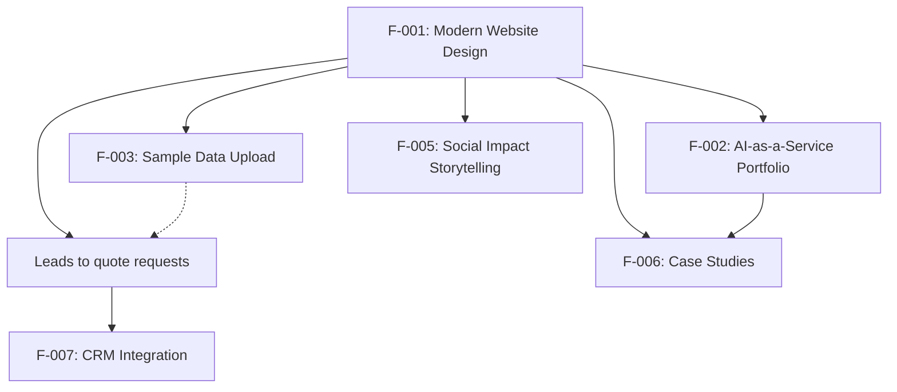
```mermaid
graph TD
    F001[F-001: Modern Website Design] --> F002[F-002: AI-as-a-Service Portfolio]
    F001 --> F003[F-003: Sample Data Upload]
    F001 --> F004[F-004: Demo/Quote Request]
    F001 --> F005[F-005: Social Impact Storytelling]
    F001 --> F006[F-006: Case Studies]
    F002 --> F006
    F004 --> F007[F-007: CRM Integration]
    F003 -.-> F004[Leads to quote requests]
```

**Integration Points**
| Feature | Integration Points |
|---------|-------------------|
| F-003: Sample Data Upload | Secure file storage, data processing pipeline |
| F-004: Demo/Quote Request | Email notification system, CRM system |
| F-007: CRM Integration | Lead management system, sales workflow |

**Shared Components**
| Component | Used By Features |
|-----------|------------------|
| Form Handling System | F-003, F-004 |
| Content Management | F-002, F-005, F-006 |
| User Analytics | All features |

### 2.4 IMPLEMENTATION CONSIDERATIONS

#### F-001: Modern Website Design

| Consideration | Details |
|---------------|---------|
| Technical Constraints | Browser compatibility requirements (support for modern browsers and IE11+) |
| Performance Requirements | Page load time under 2 seconds, First Contentful Paint under 1 second |
| Scalability Considerations | Design must accommodate future content expansion |
| Security Implications | Implementation of Content Security Policy |
| Maintenance Requirements | Regular updates to frontend frameworks and libraries |

#### F-003: Sample Data Upload Functionality

| Consideration | Details |
|---------------|---------|
| Technical Constraints | File size limitations, supported format restrictions |
| Performance Requirements | Upload handling without timeout for files within size limits |
| Scalability Considerations | Storage capacity planning for increased usage |
| Security Implications | Malware scanning, secure storage, access controls |
| Maintenance Requirements | Regular security audits of file handling system |

#### F-005: Social Impact Storytelling

| Consideration | Details |
|---------------|---------|
| Technical Constraints | Content synchronization with foundation website |
| Performance Requirements | Efficient loading of multimedia content |
| Scalability Considerations | Accommodation for growing impact metrics and stories |
| Security Implications | Protection of sensitive community information |
| Maintenance Requirements | Regular content updates and impact metric refreshes |

### 2.5 TRACEABILITY MATRIX

| Requirement ID | Business Need | Feature | Acceptance Test |
|----------------|---------------|---------|-----------------|
| F-001-RQ-001 | Modern brand representation | Modern Website Design | Responsive design validation |
| F-002-RQ-001 | Service offering clarity | AI-as-a-Service Portfolio | Service description completeness |
| F-003-RQ-001 | Interactive client engagement | Sample Data Upload | File upload functionality testing |
| F-004-RQ-001 | Lead generation | Demo/Quote Request | Form submission and routing verification |
| F-005-RQ-001 | Social mission communication | Social Impact Storytelling | Impact story presentation review |
| F-006-RQ-001 | Credibility building | Case Studies | Case study display and filtering test |
| F-007-RQ-001 | Sales process efficiency | CRM Integration | Lead data transfer validation |

## 3. TECHNOLOGY STACK

### 3.1 PROGRAMMING LANGUAGES

| Component | Language | Version | Justification |
|-----------|----------|---------|---------------|
| Frontend | JavaScript/TypeScript | TypeScript 4.9+ | Type safety, improved developer experience, and better maintainability for complex interactive features like data upload functionality |
| Backend | Python | 3.10+ | Excellent for API development, data processing capabilities for sample data analysis, and integration with AI services |
| CSS Preprocessing | SCSS | 1.58+ | Enhanced styling capabilities for creating visually stunning designs with maintainable code structure |
| Build Tools | Node.js | 18.x LTS | Required for modern frontend build processes and package management |

### 3.2 FRAMEWORKS & LIBRARIES

#### Frontend

| Framework/Library | Version | Purpose | Justification |
|-------------------|---------|---------|---------------|
| React | 18.2+ | UI framework | Component-based architecture ideal for creating interactive elements and reusable UI components |
| Next.js | 13.4+ | React framework | Server-side rendering for SEO optimization, image optimization, and improved performance |
| TailwindCSS | 3.3+ | CSS framework | Utility-first approach for rapid UI development and consistent design implementation |
| Framer Motion | 10.12+ | Animation library | Creating smooth, professional animations for enhanced user experience |
| React Dropzone | 14.2+ | File upload | Handling sample data uploads with drag-and-drop functionality |
| React Hook Form | 7.45+ | Form handling | Efficient form validation for demo/quote requests with minimal re-renders |
| React Query | 4.29+ | Data fetching | Managing server state and API interactions with built-in caching |

#### Backend

| Framework/Library | Version | Purpose | Justification |
|-------------------|---------|---------|---------------|
| Flask | 2.3+ | API framework | Lightweight, flexible framework for building RESTful APIs |
| Flask-RESTful | 0.3.10+ | REST extension | Simplifies API development with resource-based routing |
| PyJWT | 2.7+ | Authentication | Secure token handling for protected API endpoints |
| Pandas | 2.0+ | Data processing | Processing and analyzing uploaded sample datasets |
| Pillow | 10.0+ | Image processing | Handling image optimization and processing for the website |
| Requests | 2.31+ | HTTP client | Making API calls to external services and CRM integration |

### 3.3 DATABASES & STORAGE

| Type | Technology | Version | Purpose | Justification |
|------|------------|---------|---------|---------------|
| Content Database | MongoDB | 6.0+ | CMS data storage | Flexible schema for varied content types including case studies and service descriptions |
| File Storage | AWS S3 | N/A | Sample data storage | Secure, scalable storage for user-uploaded sample datasets with lifecycle policies |
| Caching | Redis | 7.0+ | Performance optimization | Improving response times for frequently accessed content and API responses |
| Search | Elasticsearch | 8.8+ | Content search | Powerful full-text search capabilities for case studies and blog content |

### 3.4 THIRD-PARTY SERVICES

| Service | Purpose | Integration Points | Justification |
|---------|---------|-------------------|---------------|
| Contentful | Headless CMS | Content management | Structured content delivery with robust API for managing service descriptions and case studies |
| HubSpot | CRM | Lead management | Existing CRM system for tracking demo/quote requests and managing sales pipeline |
| Auth0 | Authentication | User authentication | Secure, scalable authentication for admin access to the CMS |
| AWS CloudFront | CDN | Content delivery | Global content delivery with edge caching for optimal performance |
| Google Analytics 4 | Analytics | User tracking | Comprehensive analytics for measuring website performance and user behavior |
| Mailchimp | Email marketing | Newsletter signup | Managing email subscriptions and marketing communications |
| Sentry | Error tracking | Application monitoring | Real-time error tracking and performance monitoring |
| reCAPTCHA | Security | Form protection | Preventing spam submissions on demo/quote request forms |

### 3.5 DEVELOPMENT & DEPLOYMENT

| Category | Technology | Version | Purpose | Justification |
|----------|------------|---------|---------|---------------|
| Code Repository | GitHub | N/A | Version control | Collaborative development with pull request workflow |
| CI/CD | GitHub Actions | N/A | Automated pipeline | Automated testing and deployment processes |
| Containerization | Docker | 24.0+ | Environment consistency | Consistent development and production environments |
| Infrastructure as Code | Terraform | 1.5+ | Infrastructure management | Reproducible infrastructure deployment across environments |
| Hosting | AWS | N/A | Cloud infrastructure | Scalable, reliable hosting with comprehensive service offerings |
| Web Server | Nginx | 1.24+ | HTTP server | High-performance web server with caching capabilities |
| SSL | Let's Encrypt | N/A | Security | Automated SSL certificate management |
| Monitoring | AWS CloudWatch | N/A | System monitoring | Integrated monitoring for AWS-hosted components |

### 3.6 ARCHITECTURE DIAGRAM

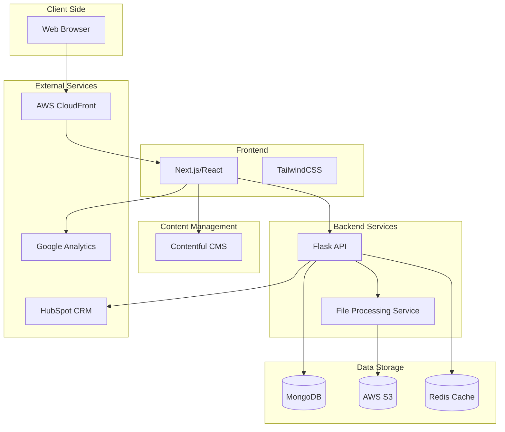
```mermaid
graph TD
    subgraph "Client Side"
        Browser[Web Browser]
    end
    
    subgraph "Frontend"
        NextJS[Next.js/React]
        TailwindCSS[TailwindCSS]
    end
    
    subgraph "Content Management"
        Contentful[Contentful CMS]
    end
    
    subgraph "Backend Services"
        Flask[Flask API]
        FileProcessor[File Processing Service]
    end
    
    subgraph "Data Storage"
        MongoDB[(MongoDB)]
        S3[(AWS S3)]
        Redis[(Redis Cache)]
    end
    
    subgraph "External Services"
        HubSpot[HubSpot CRM]
        Analytics[Google Analytics]
        CDN[AWS CloudFront]
    end
    
    Browser --> CDN
    CDN --> NextJS
    NextJS --> Contentful
    NextJS --> Flask
    Flask --> FileProcessor
    FileProcessor --> S3
    Flask --> MongoDB
    Flask --> Redis
    Flask --> HubSpot
    NextJS --> Analytics
```

## 4. PROCESS FLOWCHART

### 4.1 SYSTEM WORKFLOWS

#### 4.1.1 Core Business Processes

##### Website Visitor Journey

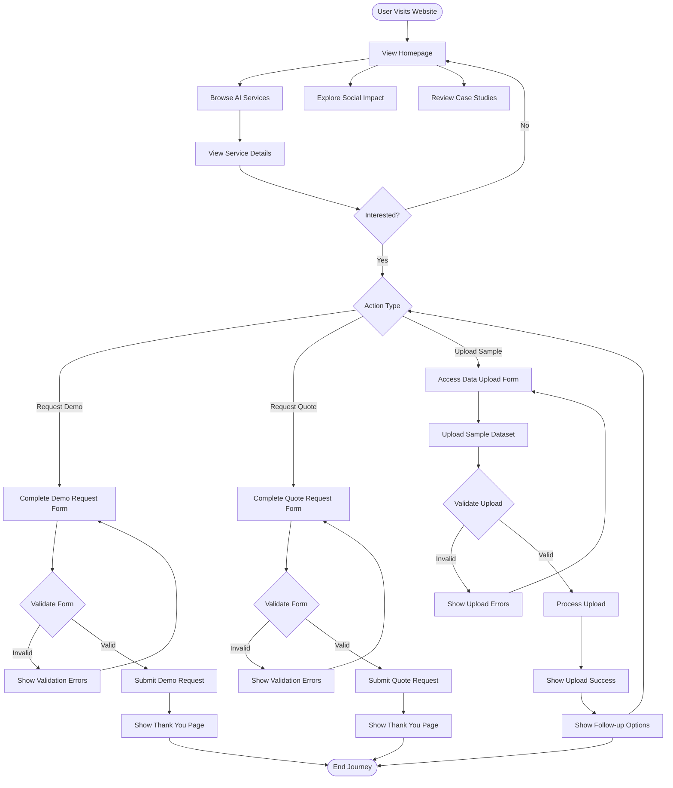
```mermaid
flowchart TD
    Start([User Visits Website]) --> Homepage[View Homepage]
    Homepage --> Services[Browse AI Services]
    Homepage --> Impact[Explore Social Impact]
    Homepage --> CaseStudies[Review Case Studies]
    
    Services --> ServiceDetails[View Service Details]
    ServiceDetails --> A{Interested?}
    A -->|Yes| B{Action Type}
    A -->|No| Homepage
    
    B -->|Request Demo| DemoForm[Complete Demo Request Form]
    B -->|Request Quote| QuoteForm[Complete Quote Request Form]
    B -->|Upload Sample| UploadForm[Access Data Upload Form]
    
    DemoForm --> ValidateDemo{Validate Form}
    QuoteForm --> ValidateQuote{Validate Form}
    UploadForm --> UploadData[Upload Sample Dataset]
    UploadData --> ValidateUpload{Validate Upload}
    
    ValidateDemo -->|Invalid| DemoErrors[Show Validation Errors]
    DemoErrors --> DemoForm
    ValidateDemo -->|Valid| SubmitDemo[Submit Demo Request]
    
    ValidateQuote -->|Invalid| QuoteErrors[Show Validation Errors]
    QuoteErrors --> QuoteForm
    ValidateQuote -->|Valid| SubmitQuote[Submit Quote Request]
    
    ValidateUpload -->|Invalid| UploadErrors[Show Upload Errors]
    UploadErrors --> UploadForm
    ValidateUpload -->|Valid| ProcessUpload[Process Upload]
    
    SubmitDemo --> ThankYouDemo[Show Thank You Page]
    SubmitQuote --> ThankYouQuote[Show Thank You Page]
    ProcessUpload --> UploadSuccess[Show Upload Success]
    
    ThankYouDemo --> End([End Journey])
    ThankYouQuote --> End
    UploadSuccess --> FollowUpOptions[Show Follow-up Options]
    FollowUpOptions --> B
    FollowUpOptions --> End
```

##### Lead Management Process

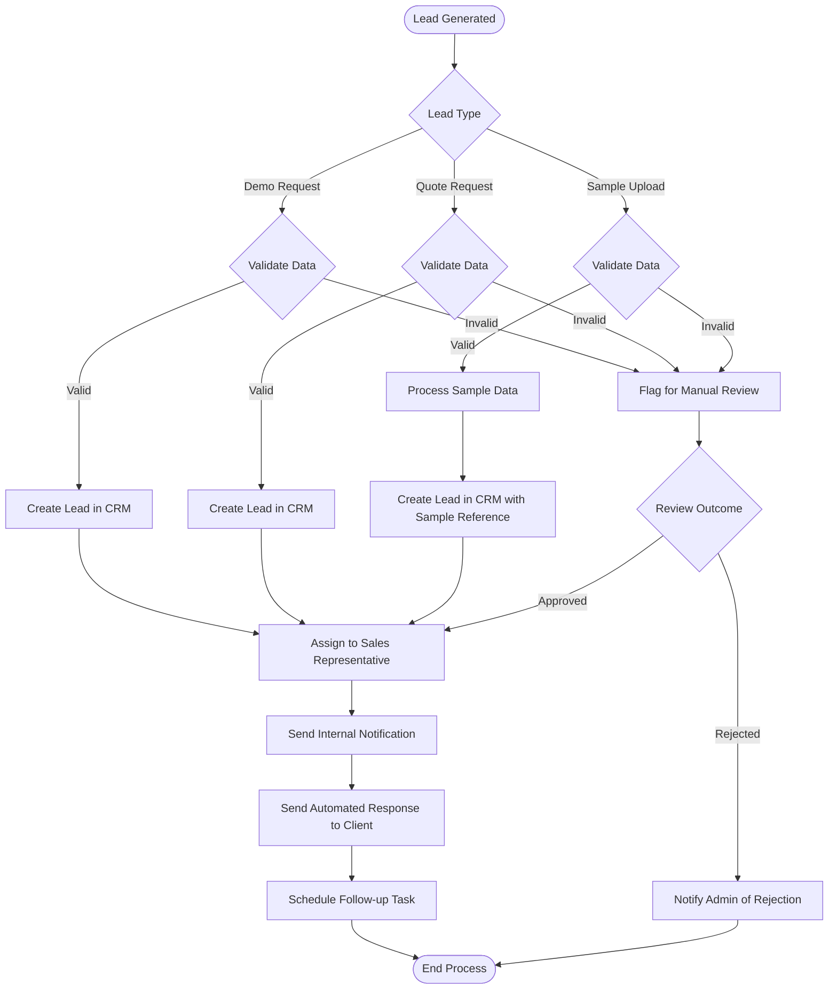
```mermaid
flowchart TD
    Start([Lead Generated]) --> LeadType{Lead Type}
    
    LeadType -->|Demo Request| ValidateDemo{Validate Data}
    LeadType -->|Quote Request| ValidateQuote{Validate Data}
    LeadType -->|Sample Upload| ValidateUpload{Validate Data}
    
    ValidateDemo -->|Invalid| ManualReview[Flag for Manual Review]
    ValidateDemo -->|Valid| CreateDemoLead[Create Lead in CRM]
    
    ValidateQuote -->|Invalid| ManualReview
    ValidateQuote -->|Valid| CreateQuoteLead[Create Lead in CRM]
    
    ValidateUpload -->|Invalid| ManualReview
    ValidateUpload -->|Valid| ProcessSample[Process Sample Data]
    ProcessSample --> CreateUploadLead[Create Lead in CRM with Sample Reference]
    
    CreateDemoLead --> AssignSalesRep[Assign to Sales Representative]
    CreateQuoteLead --> AssignSalesRep
    CreateUploadLead --> AssignSalesRep
    ManualReview --> ReviewComplete{Review Outcome}
    
    ReviewComplete -->|Approved| AssignSalesRep
    ReviewComplete -->|Rejected| NotifyRejection[Notify Admin of Rejection]
    
    AssignSalesRep --> SendNotification[Send Internal Notification]
    SendNotification --> SendAutoResponse[Send Automated Response to Client]
    
    SendAutoResponse --> ScheduleFollowUp[Schedule Follow-up Task]
    ScheduleFollowUp --> End([End Process])
    
    NotifyRejection --> End
```

#### 4.1.2 Integration Workflows

##### CRM Integration Flow

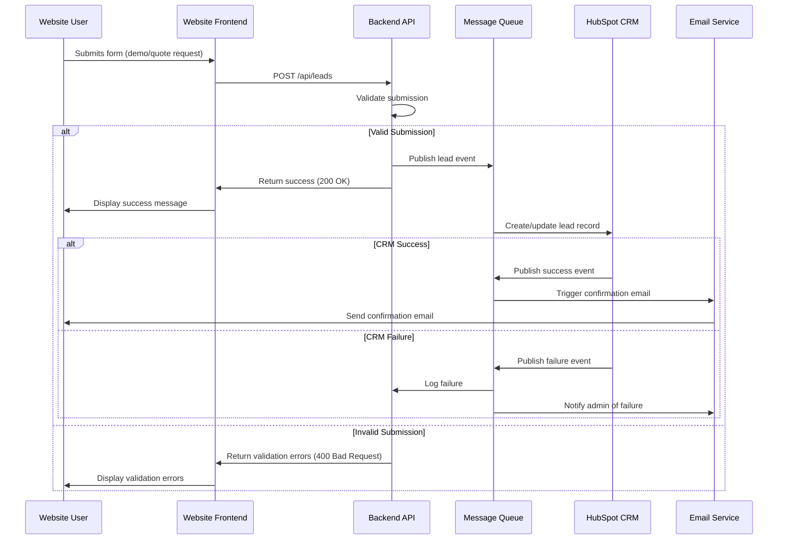
```mermaid
sequenceDiagram
    participant User as Website User
    participant Web as Website Frontend
    participant API as Backend API
    participant Queue as Message Queue
    participant CRM as HubSpot CRM
    participant Email as Email Service
    
    User->>Web: Submits form (demo/quote request)
    Web->>API: POST /api/leads
    API->>API: Validate submission
    
    alt Valid Submission
        API->>Queue: Publish lead event
        API->>Web: Return success (200 OK)
        Web->>User: Display success message
        
        Queue->>CRM: Create/update lead record
        
        alt CRM Success
            CRM->>Queue: Publish success event
            Queue->>Email: Trigger confirmation email
            Email->>User: Send confirmation email
        else CRM Failure
            CRM->>Queue: Publish failure event
            Queue->>API: Log failure
            Queue->>Email: Notify admin of failure
        end
    else Invalid Submission
        API->>Web: Return validation errors (400 Bad Request)
        Web->>User: Display validation errors
    end
```

##### Sample Data Upload Flow

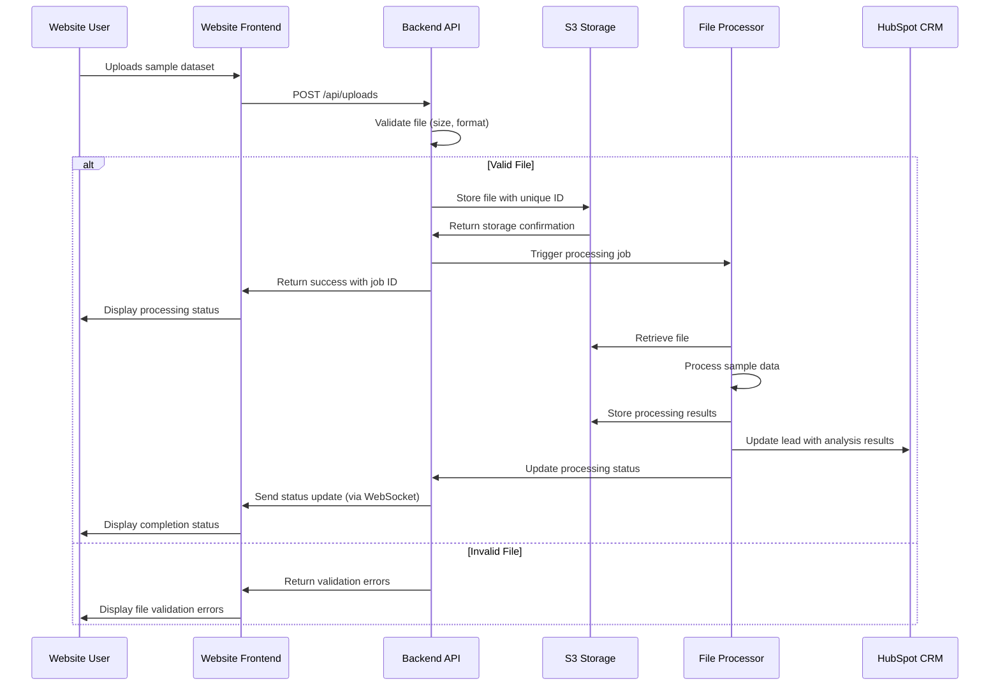
```mermaid
sequenceDiagram
    participant User as Website User
    participant Web as Website Frontend
    participant API as Backend API
    participant Storage as S3 Storage
    participant Processor as File Processor
    participant CRM as HubSpot CRM
    
    User->>Web: Uploads sample dataset
    Web->>API: POST /api/uploads
    API->>API: Validate file (size, format)
    
    alt Valid File
        API->>Storage: Store file with unique ID
        Storage->>API: Return storage confirmation
        API->>Processor: Trigger processing job
        API->>Web: Return success with job ID
        Web->>User: Display processing status
        
        Processor->>Storage: Retrieve file
        Processor->>Processor: Process sample data
        Processor->>Storage: Store processing results
        Processor->>CRM: Update lead with analysis results
        Processor->>API: Update processing status
        
        API->>Web: Send status update (via WebSocket)
        Web->>User: Display completion status
    else Invalid File
        API->>Web: Return validation errors
        Web->>User: Display file validation errors
    end
```

### 4.2 FLOWCHART REQUIREMENTS

#### 4.2.1 Demo Request Workflow

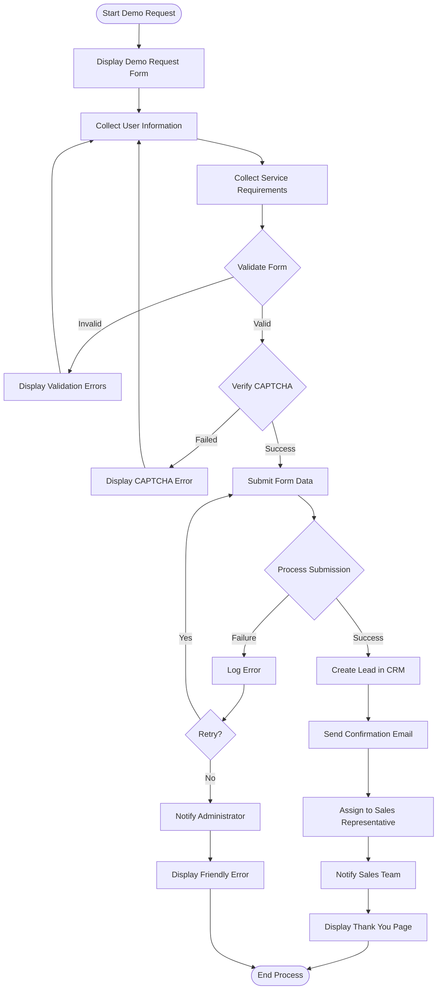
```mermaid
flowchart TD
    Start([Start Demo Request]) --> DisplayForm[Display Demo Request Form]
    DisplayForm --> CollectInfo[Collect User Information]
    CollectInfo --> CollectRequirements[Collect Service Requirements]
    CollectRequirements --> ValidateForm{Validate Form}
    
    ValidateForm -->|Invalid| ShowErrors[Display Validation Errors]
    ShowErrors --> CollectInfo
    
    ValidateForm -->|Valid| VerifyCaptcha{Verify CAPTCHA}
    VerifyCaptcha -->|Failed| ShowCaptchaError[Display CAPTCHA Error]
    ShowCaptchaError --> CollectInfo
    
    VerifyCaptcha -->|Success| SubmitForm[Submit Form Data]
    SubmitForm --> ProcessSubmission{Process Submission}
    
    ProcessSubmission -->|Success| CreateCRMLead[Create Lead in CRM]
    ProcessSubmission -->|Failure| LogError[Log Error]
    LogError --> RetrySubmission{Retry?}
    
    RetrySubmission -->|Yes| SubmitForm
    RetrySubmission -->|No| NotifyAdmin[Notify Administrator]
    NotifyAdmin --> DisplayErrorMessage[Display Friendly Error]
    
    CreateCRMLead --> SendConfirmation[Send Confirmation Email]
    SendConfirmation --> AssignSalesRep[Assign to Sales Representative]
    AssignSalesRep --> NotifySales[Notify Sales Team]
    NotifySales --> DisplayThankYou[Display Thank You Page]
    
    DisplayThankYou --> End([End Process])
    DisplayErrorMessage --> End
```

#### 4.2.2 Sample Data Upload Workflow

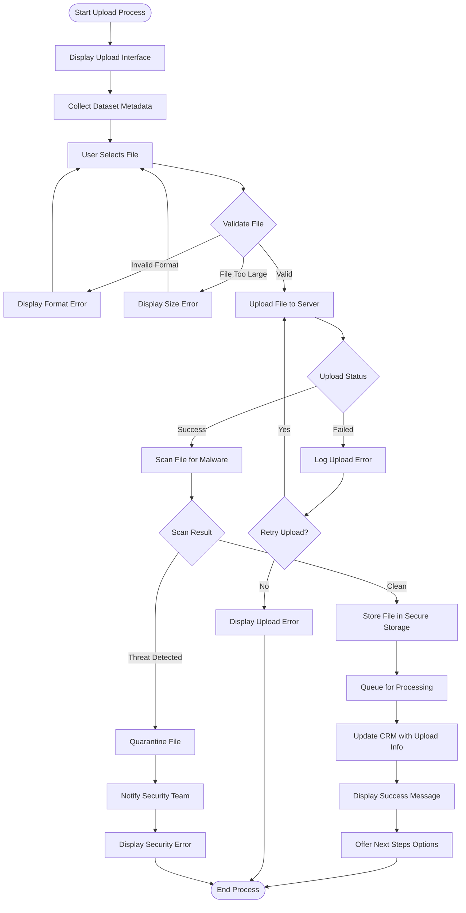
```mermaid
flowchart TD
    Start([Start Upload Process]) --> DisplayUploadForm[Display Upload Interface]
    DisplayUploadForm --> CollectMetadata[Collect Dataset Metadata]
    CollectMetadata --> SelectFile[User Selects File]
    SelectFile --> ValidateFile{Validate File}
    
    ValidateFile -->|Invalid Format| ShowFormatError[Display Format Error]
    ShowFormatError --> SelectFile
    
    ValidateFile -->|File Too Large| ShowSizeError[Display Size Error]
    ShowSizeError --> SelectFile
    
    ValidateFile -->|Valid| UploadFile[Upload File to Server]
    UploadFile --> UploadStatus{Upload Status}
    
    UploadStatus -->|Failed| LogUploadError[Log Upload Error]
    LogUploadError --> RetryUpload{Retry Upload?}
    RetryUpload -->|Yes| UploadFile
    RetryUpload -->|No| DisplayUploadError[Display Upload Error]
    
    UploadStatus -->|Success| ScanFile[Scan File for Malware]
    ScanFile --> ScanResult{Scan Result}
    
    ScanResult -->|Threat Detected| QuarantineFile[Quarantine File]
    QuarantineFile --> NotifySecurityTeam[Notify Security Team]
    NotifySecurityTeam --> DisplaySecurityError[Display Security Error]
    
    ScanResult -->|Clean| StoreFile[Store File in Secure Storage]
    StoreFile --> QueueProcessing[Queue for Processing]
    QueueProcessing --> UpdateCRM[Update CRM with Upload Info]
    UpdateCRM --> DisplaySuccess[Display Success Message]
    
    DisplaySuccess --> OfferNextSteps[Offer Next Steps Options]
    OfferNextSteps --> End([End Process])
    
    DisplayUploadError --> End
    DisplaySecurityError --> End
```

#### 4.2.3 Social Impact Story Navigation

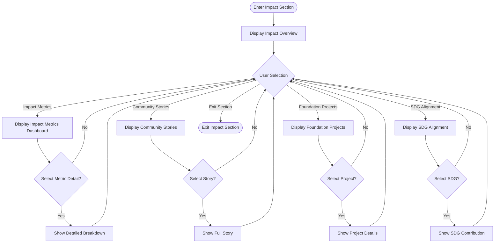
```mermaid
flowchart TD
    Start([Enter Impact Section]) --> DisplayOverview[Display Impact Overview]
    DisplayOverview --> UserChoice{User Selection}
    
    UserChoice -->|Impact Metrics| ShowMetrics[Display Impact Metrics Dashboard]
    UserChoice -->|Community Stories| ShowStories[Display Community Stories]
    UserChoice -->|Foundation Projects| ShowProjects[Display Foundation Projects]
    UserChoice -->|SDG Alignment| ShowSDGs[Display SDG Alignment]
    
    ShowMetrics --> MetricDetail{Select Metric Detail?}
    MetricDetail -->|Yes| DisplayMetricDetail[Show Detailed Breakdown]
    MetricDetail -->|No| UserChoice
    DisplayMetricDetail --> UserChoice
    
    ShowStories --> StoryDetail{Select Story?}
    StoryDetail -->|Yes| DisplayStoryDetail[Show Full Story]
    StoryDetail -->|No| UserChoice
    DisplayStoryDetail --> UserChoice
    
    ShowProjects --> ProjectDetail{Select Project?}
    ProjectDetail -->|Yes| DisplayProjectDetail[Show Project Details]
    ProjectDetail -->|No| UserChoice
    DisplayProjectDetail --> UserChoice
    
    ShowSDGs --> SDGDetail{Select SDG?}
    SDGDetail -->|Yes| DisplaySDGDetail[Show SDG Contribution]
    SDGDetail -->|No| UserChoice
    DisplaySDGDetail --> UserChoice
    
    UserChoice -->|Exit Section| End([Exit Impact Section])
```

### 4.3 TECHNICAL IMPLEMENTATION

#### 4.3.1 State Management for Demo Request

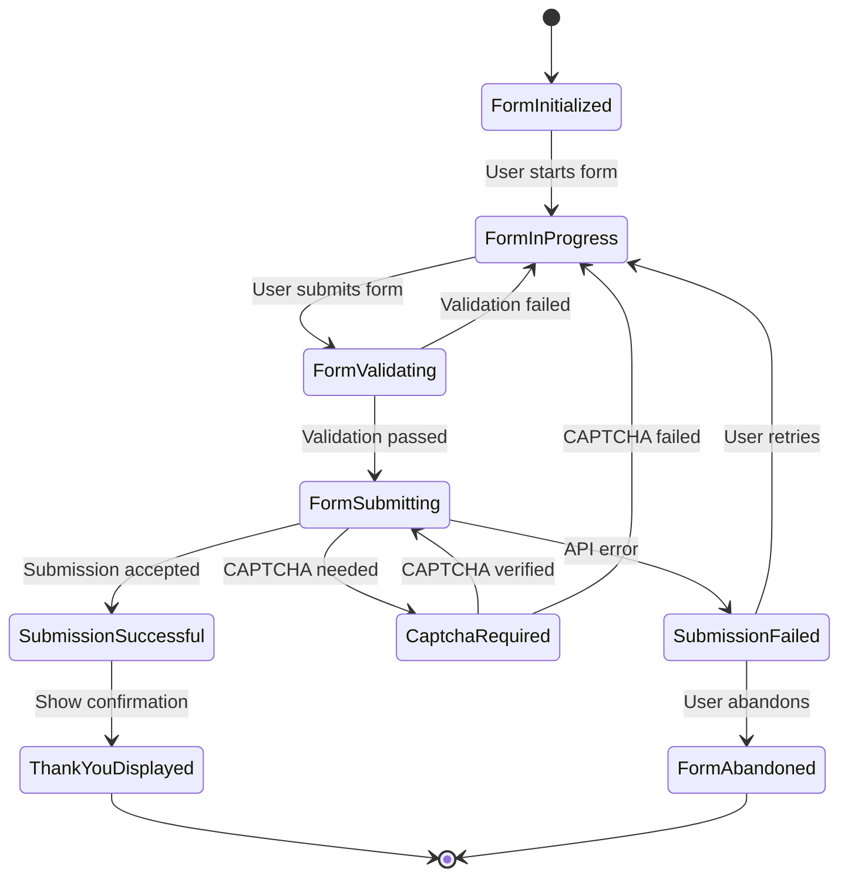
```mermaid
stateDiagram-v2
    [*] --> FormInitialized
    
    FormInitialized --> FormInProgress: User starts form
    FormInProgress --> FormValidating: User submits form
    
    FormValidating --> FormInProgress: Validation failed
    FormValidating --> FormSubmitting: Validation passed
    
    FormSubmitting --> SubmissionFailed: API error
    FormSubmitting --> CaptchaRequired: CAPTCHA needed
    FormSubmitting --> SubmissionSuccessful: Submission accepted
    
    CaptchaRequired --> FormSubmitting: CAPTCHA verified
    CaptchaRequired --> FormInProgress: CAPTCHA failed
    
    SubmissionFailed --> FormInProgress: User retries
    SubmissionFailed --> FormAbandoned: User abandons
    
    SubmissionSuccessful --> ThankYouDisplayed: Show confirmation
    
    ThankYouDisplayed --> [*]
    FormAbandoned --> [*]
```

#### 4.3.2 Error Handling for Data Upload

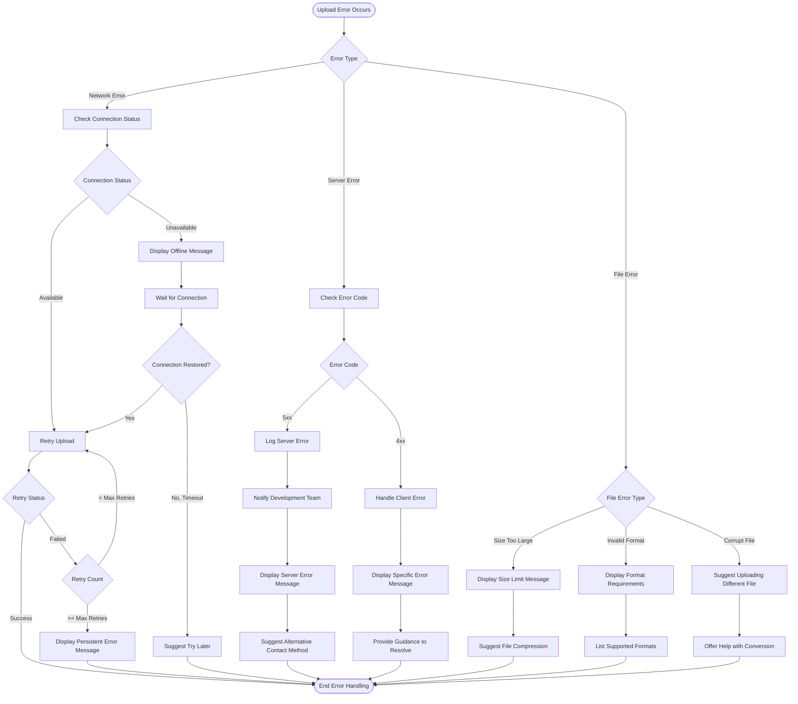
```mermaid
flowchart TD
    Start([Upload Error Occurs]) --> ErrorType{Error Type}
    
    ErrorType -->|Network Error| CheckConnection[Check Connection Status]
    CheckConnection --> ConnectionStatus{Connection Status}
    ConnectionStatus -->|Available| RetryUpload[Retry Upload]
    ConnectionStatus -->|Unavailable| DisplayOfflineMessage[Display Offline Message]
    DisplayOfflineMessage --> WaitForConnection[Wait for Connection]
    WaitForConnection --> ConnectionRestored{Connection Restored?}
    ConnectionRestored -->|Yes| RetryUpload
    ConnectionRestored -->|No, Timeout| SuggestLater[Suggest Try Later]
    
    ErrorType -->|Server Error| CheckErrorCode[Check Error Code]
    CheckErrorCode --> ServerErrorType{Error Code}
    ServerErrorType -->|5xx| LogServerError[Log Server Error]
    LogServerError --> NotifyDevTeam[Notify Development Team]
    NotifyDevTeam --> DisplayServerError[Display Server Error Message]
    ServerErrorType -->|4xx| HandleClientError[Handle Client Error]
    HandleClientError --> DisplayClientError[Display Specific Error Message]
    
    ErrorType -->|File Error| FileErrorType{File Error Type}
    FileErrorType -->|Size Too Large| DisplaySizeLimit[Display Size Limit Message]
    FileErrorType -->|Invalid Format| DisplayFormatRequirements[Display Format Requirements]
    FileErrorType -->|Corrupt File| SuggestNewFile[Suggest Uploading Different File]
    
    RetryUpload --> RetryStatus{Retry Status}
    RetryStatus -->|Success| End([End Error Handling])
    RetryStatus -->|Failed| RetryCount{Retry Count}
    RetryCount -->|< Max Retries| RetryUpload
    RetryCount -->|>= Max Retries| DisplayPersistentError[Display Persistent Error Message]
    
    DisplayServerError --> SuggestAlternative[Suggest Alternative Contact Method]
    DisplayClientError --> ProvideGuidance[Provide Guidance to Resolve]
    DisplaySizeLimit --> SuggestCompression[Suggest File Compression]
    DisplayFormatRequirements --> ListSupportedFormats[List Supported Formats]
    SuggestNewFile --> OfferHelp[Offer Help with Conversion]
    
    SuggestAlternative --> End
    ProvideGuidance --> End
    SuggestCompression --> End
    ListSupportedFormats --> End
    OfferHelp --> End
    SuggestLater --> End
    DisplayPersistentError --> End
```

### 4.4 REQUIRED DIAGRAMS

#### 4.4.1 High-Level System Workflow

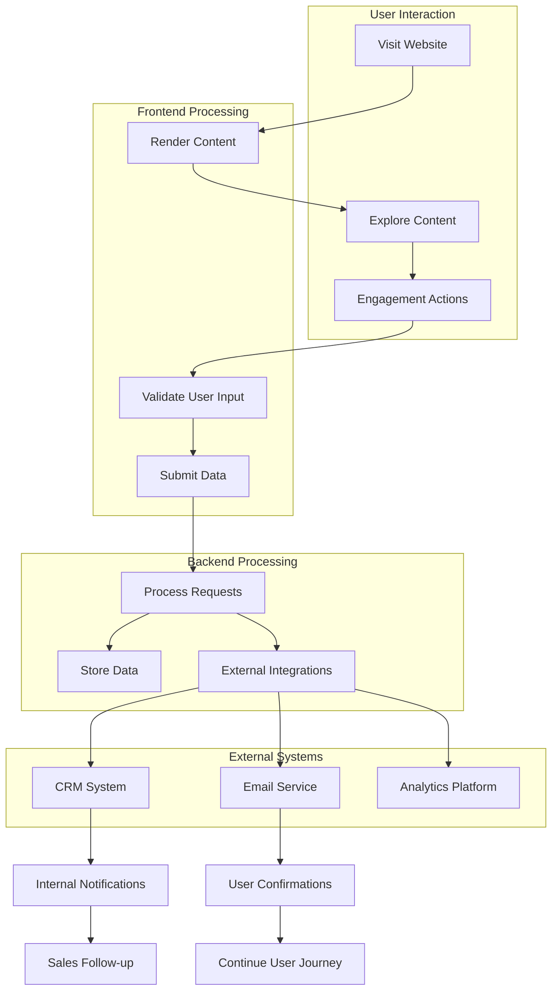
```mermaid
flowchart TD
    subgraph "User Interaction"
        Visit[Visit Website]
        Explore[Explore Content]
        Engage[Engagement Actions]
    end
    
    subgraph "Frontend Processing"
        Render[Render Content]
        Validate[Validate User Input]
        Submit[Submit Data]
    end
    
    subgraph "Backend Processing"
        Process[Process Requests]
        Store[Store Data]
        Integrate[External Integrations]
    end
    
    subgraph "External Systems"
        CRM[CRM System]
        Email[Email Service]
        Analytics[Analytics Platform]
    end
    
    Visit --> Render
    Render --> Explore
    Explore --> Engage
    
    Engage --> Validate
    Validate --> Submit
    
    Submit --> Process
    Process --> Store
    Process --> Integrate
    
    Integrate --> CRM
    Integrate --> Email
    Integrate --> Analytics
    
    CRM --> Notification[Internal Notifications]
    Email --> Confirmation[User Confirmations]
    
    Notification --> FollowUp[Sales Follow-up]
    Confirmation --> UserJourney[Continue User Journey]
```

#### 4.4.2 Detailed Process Flow for AI Service Showcase

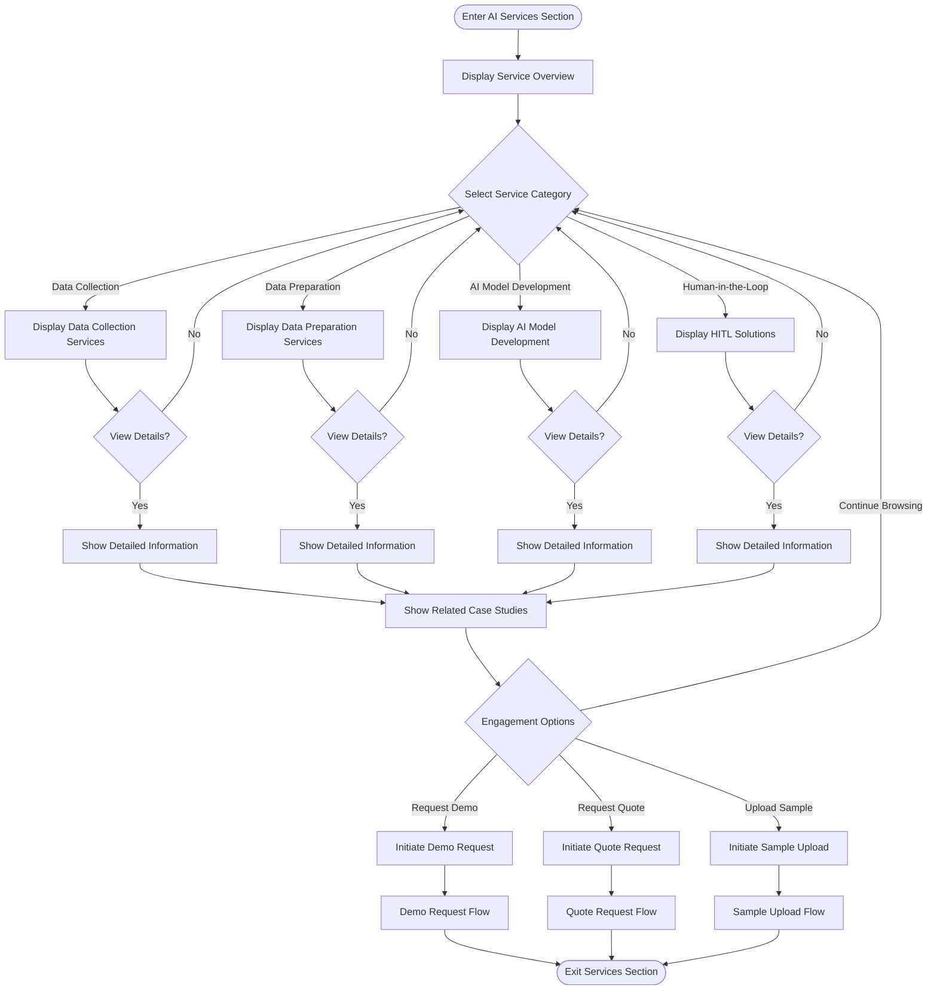
```mermaid
flowchart TD
    Start([Enter AI Services Section]) --> DisplayOverview[Display Service Overview]
    
    DisplayOverview --> ServiceCategory{Select Service Category}
    
    ServiceCategory -->|Data Collection| ShowDataCollection[Display Data Collection Services]
    ServiceCategory -->|Data Preparation| ShowDataPrep[Display Data Preparation Services]
    ServiceCategory -->|AI Model Development| ShowAIModels[Display AI Model Development]
    ServiceCategory -->|Human-in-the-Loop| ShowHITL[Display HITL Solutions]
    
    ShowDataCollection --> DataCollectionDetail{View Details?}
    DataCollectionDetail -->|Yes| DisplayDataCollectionDetail[Show Detailed Information]
    DataCollectionDetail -->|No| ServiceCategory
    
    ShowDataPrep --> DataPrepDetail{View Details?}
    DataPrepDetail -->|Yes| DisplayDataPrepDetail[Show Detailed Information]
    DataPrepDetail -->|No| ServiceCategory
    
    ShowAIModels --> AIModelDetail{View Details?}
    AIModelDetail -->|Yes| DisplayAIModelDetail[Show Detailed Information]
    AIModelDetail -->|No| ServiceCategory
    
    ShowHITL --> HITLDetail{View Details?}
    HITLDetail -->|Yes| DisplayHITLDetail[Show Detailed Information]
    HITLDetail -->|No| ServiceCategory
    
    DisplayDataCollectionDetail --> ShowCaseStudies[Show Related Case Studies]
    DisplayDataPrepDetail --> ShowCaseStudies
    DisplayAIModelDetail --> ShowCaseStudies
    DisplayHITLDetail --> ShowCaseStudies
    
    ShowCaseStudies --> EngagementOptions{Engagement Options}
    
    EngagementOptions -->|Request Demo| InitiateDemoRequest[Initiate Demo Request]
    EngagementOptions -->|Request Quote| InitiateQuoteRequest[Initiate Quote Request]
    EngagementOptions -->|Upload Sample| InitiateUpload[Initiate Sample Upload]
    EngagementOptions -->|Continue Browsing| ServiceCategory
    
    InitiateDemoRequest --> DemoRequestFlow[Demo Request Flow]
    InitiateQuoteRequest --> QuoteRequestFlow[Quote Request Flow]
    InitiateUpload --> UploadFlow[Sample Upload Flow]
    
    DemoRequestFlow --> End([Exit Services Section])
    QuoteRequestFlow --> End
    UploadFlow --> End
```

#### 4.4.3 Integration Sequence Diagram for CRM and Email

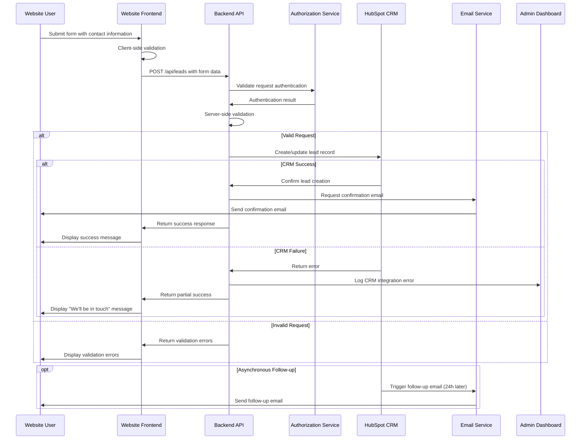
```mermaid
sequenceDiagram
    participant User as Website User
    participant Web as Website Frontend
    participant API as Backend API
    participant Auth as Authorization Service
    participant CRM as HubSpot CRM
    participant Email as Email Service
    participant Admin as Admin Dashboard
    
    User->>Web: Submit form with contact information
    Web->>Web: Client-side validation
    Web->>API: POST /api/leads with form data
    
    API->>Auth: Validate request authentication
    Auth->>API: Authentication result
    
    API->>API: Server-side validation
    
    alt Valid Request
        API->>CRM: Create/update lead record
        
        alt CRM Success
            CRM->>API: Confirm lead creation
            API->>Email: Request confirmation email
            Email->>User: Send confirmation email
            API->>Web: Return success response
            Web->>User: Display success message
        else CRM Failure
            CRM->>API: Return error
            API->>Admin: Log CRM integration error
            API->>Web: Return partial success
            Web->>User: Display "We'll be in touch" message
        end
        
    else Invalid Request
        API->>Web: Return validation errors
        Web->>User: Display validation errors
    end
    
    opt Asynchronous Follow-up
        CRM->>Email: Trigger follow-up email (24h later)
        Email->>User: Send follow-up email
    end
```

#### 4.4.4 State Transition Diagram for Sample Upload Process

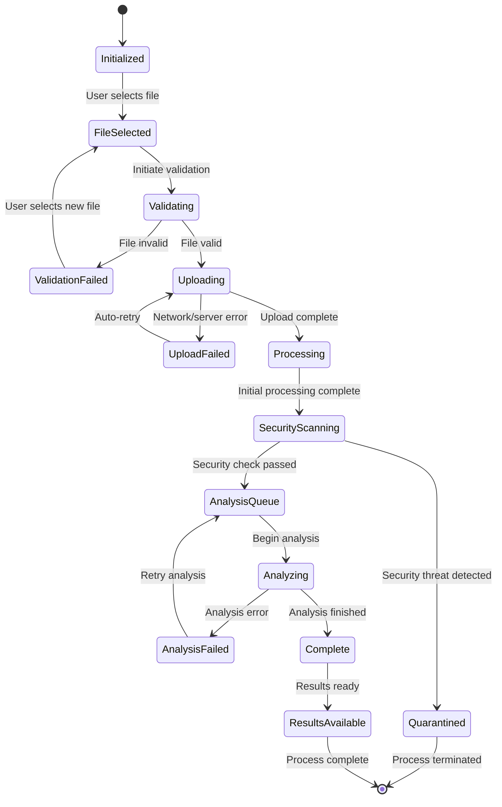
```mermaid
stateDiagram-v2
    [*] --> Initialized
    
    Initialized --> FileSelected: User selects file
    FileSelected --> Validating: Initiate validation
    
    Validating --> ValidationFailed: File invalid
    ValidationFailed --> FileSelected: User selects new file
    
    Validating --> Uploading: File valid
    Uploading --> UploadFailed: Network/server error
    UploadFailed --> Uploading: Auto-retry
    
    Uploading --> Processing: Upload complete
    Processing --> SecurityScanning: Initial processing complete
    
    SecurityScanning --> Quarantined: Security threat detected
    Quarantined --> [*]: Process terminated
    
    SecurityScanning --> AnalysisQueue: Security check passed
    AnalysisQueue --> Analyzing: Begin analysis
    
    Analyzing --> AnalysisFailed: Analysis error
    AnalysisFailed --> AnalysisQueue: Retry analysis
    
    Analyzing --> Complete: Analysis finished
    Complete --> ResultsAvailable: Results ready
    
    ResultsAvailable --> [*]: Process complete
```

#### 4.4.5 Error Handling Flowchart for Form Submissions

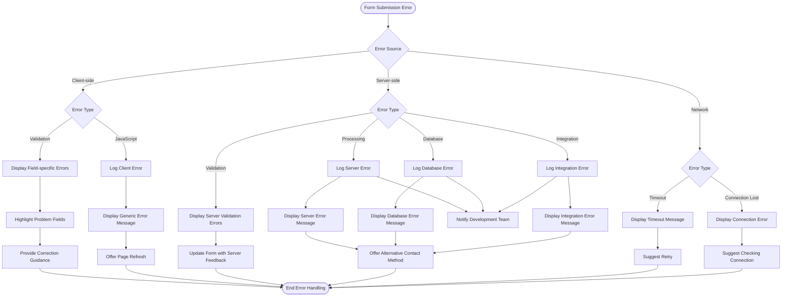
```mermaid
flowchart TD
    Start([Form Submission Error]) --> ErrorSource{Error Source}
    
    ErrorSource -->|Client-side| ClientErrorType{Error Type}
    ErrorSource -->|Server-side| ServerErrorType{Error Type}
    ErrorSource -->|Network| NetworkErrorType{Error Type}
    
    ClientErrorType -->|Validation| DisplayFieldErrors[Display Field-specific Errors]
    ClientErrorType -->|JavaScript| LogClientError[Log Client Error]
    
    ServerErrorType -->|Validation| DisplayServerValidation[Display Server Validation Errors]
    ServerErrorType -->|Processing| LogServerError[Log Server Error]
    ServerErrorType -->|Database| LogDatabaseError[Log Database Error]
    ServerErrorType -->|Integration| LogIntegrationError[Log Integration Error]
    
    NetworkErrorType -->|Timeout| DisplayTimeoutMessage[Display Timeout Message]
    NetworkErrorType -->|Connection Lost| DisplayConnectionError[Display Connection Error]
    
    DisplayFieldErrors --> HighlightFields[Highlight Problem Fields]
    HighlightFields --> ProvideGuidance[Provide Correction Guidance]
    
    LogClientError --> DisplayGenericError[Display Generic Error Message]
    DisplayGenericError --> OfferRefresh[Offer Page Refresh]
    
    DisplayServerValidation --> UpdateFormFields[Update Form with Server Feedback]
    
    LogServerError --> NotifyDevTeam[Notify Development Team]
    LogServerError --> DisplayServerErrorMessage[Display Server Error Message]
    DisplayServerErrorMessage --> OfferAlternative[Offer Alternative Contact Method]
    
    LogDatabaseError --> NotifyDevTeam
    LogDatabaseError --> DisplayDatabaseErrorMessage[Display Database Error Message]
    DisplayDatabaseErrorMessage --> OfferAlternative
    
    LogIntegrationError --> NotifyDevTeam
    LogIntegrationError --> DisplayIntegrationErrorMessage[Display Integration Error Message]
    DisplayIntegrationErrorMessage --> OfferAlternative
    
    DisplayTimeoutMessage --> SuggestRetry[Suggest Retry]
    DisplayConnectionError --> CheckConnection[Suggest Checking Connection]
    
    ProvideGuidance --> End([End Error Handling])
    OfferRefresh --> End
    UpdateFormFields --> End
    OfferAlternative --> End
    SuggestRetry --> End
    CheckConnection --> End
```

## 5. SYSTEM ARCHITECTURE

### 5.1 HIGH-LEVEL ARCHITECTURE

#### 5.1.1 System Overview

The IndiVillage.com website will implement a modern, decoupled architecture following the JAMstack (JavaScript, APIs, Markup) approach. This architecture was selected for its ability to deliver exceptional performance, security, and scalability while enabling a rich, interactive user experience.

Key architectural principles include:

- **Separation of Concerns**: Decoupling the presentation layer from business logic and data services
- **API-First Design**: All data interactions occur through well-defined APIs
- **Progressive Enhancement**: Core functionality works without JavaScript, with enhanced experiences for modern browsers
- **Security by Design**: Security considerations integrated throughout the architecture
- **Performance Optimization**: Leveraging CDN, caching, and optimized assets for fast global delivery

The system boundaries encompass the website frontend, content management system, backend services for data processing, and integration points with external systems like CRM and analytics platforms. Major interfaces include the content API, form submission endpoints, file upload services, and CRM integration interfaces.

#### 5.1.2 Core Components Table

| Component Name | Primary Responsibility | Key Dependencies | Critical Considerations |
|----------------|------------------------|------------------|-------------------------|
| Frontend Application | Deliver user interface and handle client-side interactions | Next.js, React, TailwindCSS | Performance optimization, accessibility, SEO |
| Content Management System | Store and deliver structured content | Contentful, Content API | Content modeling, editorial workflow, versioning |
| API Gateway | Route and secure API requests | AWS API Gateway, Auth Service | Rate limiting, request validation, authentication |
| Form Processing Service | Handle and validate form submissions | API Gateway, CRM Integration | Data validation, spam prevention, error handling |
| File Upload Service | Process and store user-uploaded datasets | S3, Security Scanner, File Processor | Security scanning, file size limits, format validation |
| CRM Integration Service | Synchronize lead data with CRM | HubSpot API, Queue Service | Data mapping, error recovery, rate limiting |
| Analytics Service | Track user behavior and site performance | Google Analytics, Tag Manager | Privacy compliance, data accuracy, performance impact |

#### 5.1.3 Data Flow Description

The primary data flow begins with content delivery, where the CMS provides structured content to the frontend application via its API. This content is pre-rendered where possible using Next.js's static site generation capabilities, with dynamic content fetched client-side as needed.

User interactions trigger client-side validations before submitting data to backend services. Form submissions flow through the API Gateway to the Form Processing Service, which validates the data and forwards it to the CRM Integration Service. This service transforms the data to match CRM requirements and submits it to HubSpot via its API.

File uploads follow a more complex path: files are first validated client-side, then uploaded directly to S3 using pre-signed URLs. The File Upload Service is notified of new uploads, triggering security scanning before processing. Processed files are stored in a secure S3 bucket, with metadata stored in a database and linked to the user's CRM record.

Analytics data flows from the frontend to Google Analytics, with custom events tracking key user interactions. This data is used for reporting and optimization.

Key data stores include the CMS content repository, the file storage S3 buckets, and the CRM system. Redis caching is employed at critical points to improve performance, particularly for frequently accessed content and API responses.

#### 5.1.4 External Integration Points

| System Name | Integration Type | Data Exchange Pattern | Protocol/Format | SLA Requirements |
|-------------|------------------|------------------------|-----------------|------------------|
| Contentful CMS | Content Delivery | Pull (API Requests) | REST/JSON | 99.9% availability, <500ms response time |
| HubSpot CRM | Lead Management | Push (Webhook) | REST/JSON | 99.5% availability, <2s processing time |
| AWS S3 | File Storage | Push/Pull | HTTPS | 99.99% availability, <1s upload initiation |
| Google Analytics | User Tracking | Push (Events) | HTTPS/JSON | 99% availability, non-critical |
| Email Service | Notifications | Push (API Requests) | SMTP/REST | 99.5% availability, <5min delivery time |
| reCAPTCHA | Security | Request/Response | REST/JSON | 99.5% availability, <1s verification time |

### 5.2 COMPONENT DETAILS

#### 5.2.1 Frontend Application

**Purpose and Responsibilities:**
- Deliver responsive, accessible user interface
- Handle client-side form validation
- Manage file upload process
- Implement interactive elements for service showcase
- Track user analytics and events

**Technologies and Frameworks:**
- Next.js for server-side rendering and static site generation
- React for component-based UI development
- TailwindCSS for styling
- Framer Motion for animations
- React Hook Form for form handling
- React Dropzone for file uploads

**Key Interfaces and APIs:**
- Content API (Contentful)
- Form Submission API
- File Upload API
- Analytics API

**Data Persistence Requirements:**
- Browser local storage for form progress
- Session storage for user preferences
- No sensitive data stored client-side

**Scaling Considerations:**
- Static generation for improved performance and reduced server load
- CDN distribution for global content delivery
- Optimized asset loading and code splitting

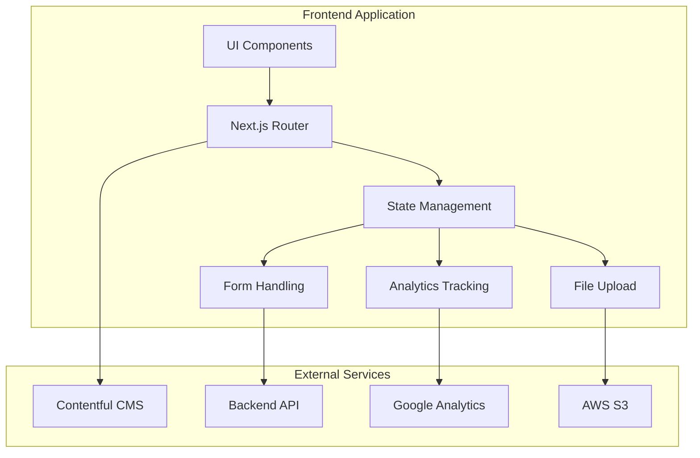
```mermaid
flowchart TD
    subgraph "Frontend Application"
        UI[UI Components]
        Router[Next.js Router]
        State[State Management]
        Forms[Form Handling]
        Upload[File Upload]
        Analytics[Analytics Tracking]
    end
    
    subgraph "External Services"
        CMS[Contentful CMS]
        API[Backend API]
        GA[Google Analytics]
        S3[AWS S3]
    end
    
    UI --> Router
    Router --> State
    State --> Forms
    State --> Upload
    State --> Analytics
    
    Forms --> API
    Upload --> S3
    Analytics --> GA
    Router --> CMS
```

#### 5.2.2 Content Management System

**Purpose and Responsibilities:**
- Store and manage structured content
- Provide content delivery API
- Support content workflows and versioning
- Enable non-technical content updates

**Technologies and Frameworks:**
- Contentful headless CMS
- Content delivery API
- Content management API
- Webhooks for content updates

**Key Interfaces and APIs:**
- Content Delivery API (public, read-only)
- Content Management API (private, authenticated)
- Webhook endpoints for content updates

**Data Persistence Requirements:**
- Content stored in Contentful's cloud infrastructure
- Content models for services, case studies, impact stories
- Asset management for images and documents

**Scaling Considerations:**
- CDN-backed content delivery
- Caching of frequently accessed content
- Rate limiting for API requests

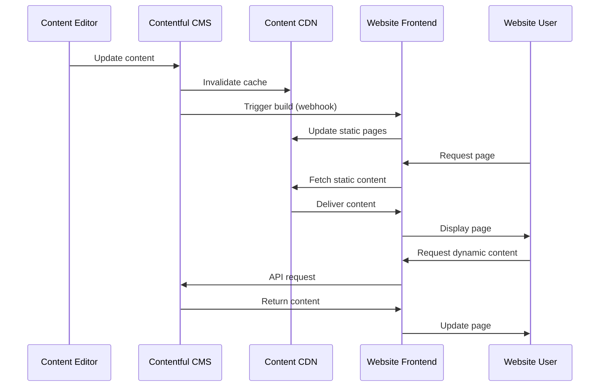
```mermaid
sequenceDiagram
    participant Editor as Content Editor
    participant CMS as Contentful CMS
    participant CDN as Content CDN
    participant Web as Website Frontend
    participant User as Website User
    
    Editor->>CMS: Update content
    CMS->>CDN: Invalidate cache
    CMS->>Web: Trigger build (webhook)
    Web->>CDN: Update static pages
    
    User->>Web: Request page
    Web->>CDN: Fetch static content
    CDN->>Web: Deliver content
    Web->>User: Display page
    
    User->>Web: Request dynamic content
    Web->>CMS: API request
    CMS->>Web: Return content
    Web->>User: Update page
```

#### 5.2.3 API Gateway

**Purpose and Responsibilities:**
- Route API requests to appropriate services
- Authenticate and authorize API requests
- Implement rate limiting and request validation
- Monitor API usage and performance

**Technologies and Frameworks:**
- AWS API Gateway
- JWT authentication
- Custom authorizers
- API documentation (OpenAPI/Swagger)

**Key Interfaces and APIs:**
- Form submission endpoints
- File upload endpoints
- Content proxy endpoints (if needed)

**Data Persistence Requirements:**
- API keys and usage metrics
- Rate limiting counters
- No business data stored in gateway

**Scaling Considerations:**
- Auto-scaling based on request volume
- Regional deployment for reduced latency
- Request throttling to protect backend services

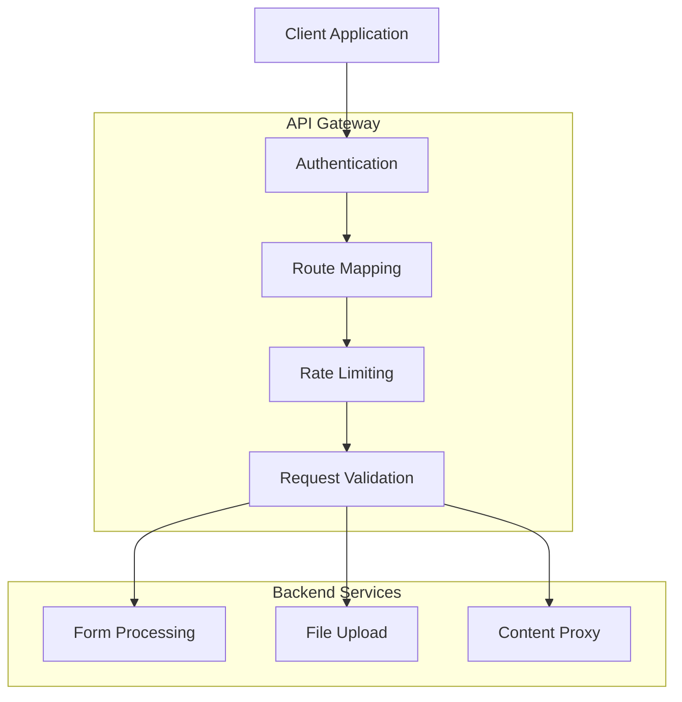
```mermaid
flowchart TD
    Client[Client Application]
    
    subgraph "API Gateway"
        Auth[Authentication]
        Routes[Route Mapping]
        Throttle[Rate Limiting]
        Validate[Request Validation]
    end
    
    subgraph "Backend Services"
        Forms[Form Processing]
        Files[File Upload]
        Content[Content Proxy]
    end
    
    Client --> Auth
    Auth --> Routes
    Routes --> Throttle
    Throttle --> Validate
    
    Validate --> Forms
    Validate --> Files
    Validate --> Content
```

#### 5.2.4 File Upload Service

**Purpose and Responsibilities:**
- Handle secure file uploads from users
- Validate file formats and scan for security threats
- Process uploaded datasets for preliminary analysis
- Store files securely and manage access

**Technologies and Frameworks:**
- AWS S3 for storage
- AWS Lambda for processing
- Virus scanning service
- File type detection and validation

**Key Interfaces and APIs:**
- Upload initiation endpoint
- Upload status endpoint
- File processing webhook
- CRM integration for file metadata

**Data Persistence Requirements:**
- Files stored in S3 with appropriate encryption
- File metadata stored in database
- Processing results stored for limited time
- Automatic file purging after defined period

**Scaling Considerations:**
- Parallel processing for multiple uploads
- File size limits and quota management
- Throttling for high-volume uploads

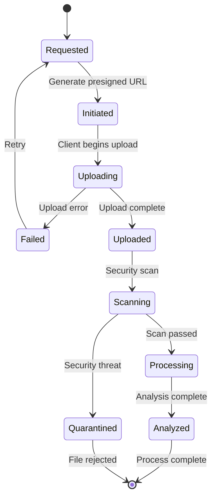
```mermaid
stateDiagram-v2
    [*] --> Requested
    Requested --> Initiated: Generate presigned URL
    Initiated --> Uploading: Client begins upload
    Uploading --> Failed: Upload error
    Uploading --> Uploaded: Upload complete
    Uploaded --> Scanning: Security scan
    Scanning --> Quarantined: Security threat
    Scanning --> Processing: Scan passed
    Processing --> Analyzed: Analysis complete
    Analyzed --> [*]: Process complete
    
    Failed --> Requested: Retry
    Quarantined --> [*]: File rejected
```

### 5.3 TECHNICAL DECISIONS

#### 5.3.1 Architecture Style Decisions

| Decision | Options Considered | Selected Approach | Rationale |
|----------|-------------------|-------------------|-----------|
| Overall Architecture | Monolithic, Microservices, JAMstack | JAMstack with decoupled services | Better performance, security, and developer experience for content-focused site |
| Frontend Approach | SPA, MPA, SSR, SSG | Next.js (SSG+SSR hybrid) | Combines SEO benefits of server rendering with interactive capabilities of SPAs |
| CMS Selection | Traditional CMS, Headless CMS, Custom CMS | Headless CMS (Contentful) | Content flexibility, API-first approach, separation of concerns |
| API Design | REST, GraphQL, RPC | REST with JSON | Wider adoption, simpler implementation, sufficient for requirements |

The JAMstack architecture was selected as it provides an optimal balance of performance, security, and developer experience for a content-focused website with interactive elements. By pre-rendering static content and delivering it via CDN, we achieve exceptional performance while maintaining the ability to incorporate dynamic features through APIs.

Next.js was chosen as the frontend framework due to its hybrid approach, combining static site generation (SSG) for content-heavy pages with server-side rendering (SSR) for dynamic content. This approach optimizes both performance and SEO while enabling rich interactive experiences.

A headless CMS (Contentful) was selected over traditional CMS options to provide content flexibility, an API-first approach, and clear separation of concerns. This allows content editors to work independently from developers and enables a more structured approach to content modeling.

```mermaid
graph TD
    A[Architecture Decision] --> B{Website Type}
    B -->|Content-focused with interactive elements| C[JAMstack]
    B -->|Highly dynamic application| D[SPA with API Backend]
    B -->|Simple content site| E[Static Site Generator]
    
    C --> F{Frontend Framework}
    F -->|SEO + Interactive needs| G[Next.js]
    F -->|Pure client-side| H[React SPA]
    
    G --> I{CMS Approach}
    I -->|Flexible content model| J[Headless CMS]
    I -->|Simple content needs| K[Markdown files]
    I -->|Complex workflows| L[Traditional CMS]
    
    J --> M[Contentful Selected]
```

#### 5.3.2 Communication Pattern Choices

| Pattern | Use Case | Implementation | Benefits |
|---------|----------|----------------|----------|
| Request-Response | Form submissions, Content retrieval | REST API calls | Simplicity, immediate feedback |
| Event-Driven | File processing, CRM updates | Message queue, Webhooks | Decoupling, resilience |
| Publish-Subscribe | Content updates, Analytics | Webhooks, Event bus | Scalability, loose coupling |
| Circuit Breaker | External API calls | Resilience libraries | Fault tolerance, graceful degradation |

For form submissions and content retrieval, we've selected the Request-Response pattern implemented via REST APIs due to its simplicity and immediate feedback. This pattern is well-suited for synchronous interactions where users expect immediate responses.

For longer-running processes like file processing and CRM updates, we've chosen an Event-Driven approach using message queues and webhooks. This pattern decouples the components, improving resilience and allowing for asynchronous processing.

Content updates and analytics tracking will use a Publish-Subscribe pattern, enabling multiple consumers to react to events without tight coupling. This improves scalability and flexibility as new consumers can be added without modifying publishers.

To handle potential failures in external API calls, we'll implement the Circuit Breaker pattern using resilience libraries. This prevents cascading failures and enables graceful degradation when external systems are unavailable.

#### 5.3.3 Data Storage Solution Rationale

| Data Type | Storage Solution | Key Considerations | Alternatives Considered |
|-----------|------------------|--------------------|-----------------------|
| Content | Contentful CMS | Structured content, API access, CDN delivery | WordPress, Custom DB, Strapi |
| User Files | AWS S3 | Durability, scalability, security | Azure Blob Storage, Google Cloud Storage |
| Form Data | Transient (API → CRM) | No need for persistent storage, CRM is system of record | Database storage, Document DB |
| Analytics | Google Analytics | Comprehensive tracking, no self-hosting needed | Self-hosted analytics, Log analysis |

Content data will be stored in Contentful CMS, chosen for its structured content model, robust API access, and CDN-backed delivery. This provides better performance and content management capabilities compared to alternatives like WordPress or custom database solutions.

User-uploaded files will be stored in AWS S3, selected for its exceptional durability (99.999999999%), scalability, and security features. S3's lifecycle policies also enable automatic management of temporary files.

Form submission data will be treated as transient, flowing directly from the API to the CRM system without persistent storage in our architecture. This simplifies the system and maintains the CRM as the single source of truth for customer data.

Analytics data will be stored in Google Analytics, eliminating the need for self-hosted analytics infrastructure while providing comprehensive tracking capabilities. This data will be used for reporting and optimization without adding storage requirements to our system.

#### 5.3.4 Caching Strategy Justification

| Cache Type | Implementation | Use Case | Invalidation Strategy |
|------------|----------------|----------|----------------------|
| Content Cache | CDN (CloudFront) | Static assets, pre-rendered pages | Time-based + CMS webhooks |
| API Response Cache | Redis | Frequently accessed API responses | Time-based + write-through |
| Browser Cache | HTTP headers | Static assets, page components | Cache-Control headers |
| Application Cache | Memory cache | UI components, form state | Component lifecycle |

Our caching strategy employs multiple layers to optimize performance. At the outermost layer, a CDN cache (AWS CloudFront) will store static assets and pre-rendered pages, dramatically improving global load times. This cache will be invalidated based on time and CMS update webhooks.

For API responses, we'll implement Redis caching for frequently accessed data, reducing load on backend services and improving response times. This cache will use a combination of time-based expiration and write-through invalidation when data changes.

Browser caching will be optimized through appropriate HTTP headers, allowing static assets and page components to be stored locally on user devices. Cache-Control headers will be carefully configured to balance freshness and performance.

At the application level, we'll implement memory caching for UI components and form state, improving the responsiveness of the user interface without unnecessary re-rendering or API calls.

### 5.4 CROSS-CUTTING CONCERNS

#### 5.4.1 Monitoring and Observability Approach

The monitoring and observability strategy for IndiVillage.com will provide comprehensive visibility into system health, performance, and user experience. We will implement a multi-layered approach:

- **Real User Monitoring (RUM)**: Tracking actual user experiences including page load times, interaction delays, and client-side errors
- **Application Performance Monitoring (APM)**: Tracking backend service performance, API response times, and resource utilization
- **Infrastructure Monitoring**: Tracking server health, resource utilization, and availability
- **Synthetic Monitoring**: Regular automated tests simulating user journeys to detect issues proactively

Key metrics to be monitored include:
- Page load performance (Time to First Byte, First Contentful Paint, Time to Interactive)
- API response times and error rates
- File upload success rates and processing times
- Form submission completion rates
- Infrastructure resource utilization
- CDN cache hit rates

Alerts will be configured for critical thresholds, with different severity levels triggering appropriate notification channels (email, SMS, Slack) based on impact and urgency.

#### 5.4.2 Logging and Tracing Strategy

| Log Type | Information Captured | Storage | Retention |
|----------|----------------------|---------|-----------|
| Access Logs | Request details, response codes, timing | CloudWatch Logs | 30 days |
| Application Logs | Service operations, warnings, errors | CloudWatch Logs | 90 days |
| Error Logs | Detailed error information, stack traces | CloudWatch Logs | 90 days |
| Audit Logs | Security-relevant actions, admin activities | CloudWatch Logs | 1 year |

Our logging strategy implements structured logging with consistent formats across all components. Each log entry will include:
- Timestamp in ISO 8601 format
- Log level (INFO, WARN, ERROR, DEBUG)
- Service/component identifier
- Correlation ID for request tracing
- Event description
- Contextual data (as JSON)

For distributed tracing, we'll implement correlation IDs that flow through all system components, allowing us to track requests across service boundaries. This will be particularly important for complex operations like file uploads that involve multiple services.

Log aggregation will centralize logs in CloudWatch Logs, with important events forwarded to a monitoring dashboard for visualization and alerting. Sensitive information will be redacted from logs according to data protection requirements.

#### 5.4.3 Error Handling Patterns

```mermaid
flowchart TD
    Error[Error Occurs] --> Classify{Classify Error}
    
    Classify -->|Validation Error| HandleValidation[Return Validation Details]
    Classify -->|Temporary System Error| HandleRetryable[Implement Retry with Backoff]
    Classify -->|Permanent System Error| HandlePermanent[Fail Gracefully]
    Classify -->|External Service Error| HandleExternal[Circuit Breaker Pattern]
    
    HandleValidation --> UserFeedback[Provide User Feedback]
    HandleRetryable --> RetrySuccess{Retry Successful?}
    RetrySuccess -->|Yes| Continue[Continue Operation]
    RetrySuccess -->|No| Fallback[Use Fallback Mechanism]
    
    HandlePermanent --> LogError[Log Detailed Error]
    LogError --> AlertOps[Alert Operations Team]
    LogError --> UserMessage[Display Friendly Error Message]
    
    HandleExternal --> CircuitState{Circuit State}
    CircuitState -->|Closed| AttemptCall[Attempt Service Call]
    CircuitState -->|Open| UseFallback[Use Fallback Response]
    CircuitState -->|Half-Open| LimitedAttempt[Limited Attempt]
    
    AttemptCall --> CallSuccess{Call Successful?}
    CallSuccess -->|Yes| ResetCircuit[Reset Circuit]
    CallSuccess -->|No| IncrementFailure[Increment Failure Count]
    
    LimitedAttempt --> ProbeSuccess{Probe Successful?}
    ProbeSuccess -->|Yes| CloseCircuit[Close Circuit]
    ProbeSuccess -->|No| OpenCircuit[Open Circuit]
```

Our error handling strategy follows these key principles:

1. **Fail Fast**: Validate inputs early and return clear validation errors
2. **Fail Gracefully**: When errors occur, maintain system stability and provide clear user feedback
3. **Retry with Backoff**: For transient errors, implement exponential backoff retry strategies
4. **Circuit Breaking**: Prevent cascading failures when external services are unavailable
5. **Detailed Logging**: Log comprehensive error details for troubleshooting
6. **User-Friendly Messages**: Present clear, actionable error messages to users

For frontend components, we'll implement error boundaries to contain failures within specific UI components rather than crashing the entire application. Each form will have dedicated error handling to provide field-specific validation feedback.

Backend services will use structured error responses with consistent formats, including error codes, messages, and when appropriate, remediation suggestions. Sensitive error details will never be exposed to end users.

#### 5.4.4 Authentication and Authorization Framework

The authentication and authorization framework will secure both user-facing and administrative functions while maintaining a seamless user experience. For the public website, most content will be publicly accessible without authentication, but certain actions will require varying levels of verification:

- **Form submissions**: CAPTCHA verification to prevent spam
- **File uploads**: Temporary session tokens to authorize upload operations
- **Admin functions**: Full authentication with role-based access control

For administrative access to the CMS and backend systems, we'll implement:

- **Identity Provider**: Auth0 for centralized identity management
- **Authentication Methods**: Username/password with MFA for administrators
- **Session Management**: Short-lived JWT tokens with refresh capability
- **Role-Based Access Control**: Granular permissions based on user roles
- **Audit Logging**: Comprehensive logging of authentication events and admin actions

API security will be implemented through:
- API keys for service-to-service communication
- Rate limiting to prevent abuse
- Input validation to prevent injection attacks
- CORS policies to control access from different origins

#### 5.4.5 Performance Requirements and SLAs

| Metric | Target | Critical Threshold | Measurement Method |
|--------|--------|-------------------|-------------------|
| Page Load Time | < 2 seconds | > 3 seconds | Real User Monitoring |
| Time to First Byte | < 200ms | > 500ms | Synthetic Testing |
| API Response Time | < 300ms (95th percentile) | > 1 second | APM |
| Availability | 99.9% | < 99.5% | Uptime Monitoring |
| Error Rate | < 0.1% | > 1% | Application Logs |
| File Upload Success | > 99% | < 95% | Application Metrics |

Performance optimization will focus on:
- Static generation of content pages where possible
- CDN distribution of static assets
- Image optimization and lazy loading
- Code splitting and bundle optimization
- Efficient API design with appropriate caching
- Database query optimization

Load testing will be conducted to verify the system can handle expected traffic volumes with a safety margin of 3x typical peak load. Performance testing will be integrated into the CI/CD pipeline to catch regressions before deployment.

#### 5.4.6 Disaster Recovery Procedures

The disaster recovery strategy will ensure business continuity in the event of system failures or data loss. Key components include:

**Backup Procedures:**
- Content data: Daily exports from Contentful CMS
- User-uploaded files: Replicated across multiple AWS regions
- Configuration: Infrastructure as Code stored in version control
- Databases: Automated backups with point-in-time recovery

**Recovery Time Objectives (RTO):**
- Website frontend: < 1 hour
- Content API: < 2 hours
- Form submission capability: < 4 hours
- File upload capability: < 8 hours

**Recovery Point Objectives (RPO):**
- Content data: < 24 hours
- User uploads: < 1 hour
- Form submissions: Zero loss (direct to CRM)

**Disaster Scenarios Addressed:**
- Primary region failure: Failover to secondary region
- Data corruption: Restore from backups
- External service outage: Implement graceful degradation
- Security breach: Isolation and clean restoration

Regular disaster recovery testing will be conducted to verify procedures and train team members. Documentation will be maintained with clear, step-by-step recovery instructions for different failure scenarios.

## 6. SYSTEM COMPONENTS DESIGN

### 6.1 FRONTEND COMPONENTS

#### 6.1.1 Component Hierarchy

```mermaid
graph TD
    App[App Container] --> Layout[Layout]
    Layout --> Header[Header]
    Layout --> MainContent[Main Content]
    Layout --> Footer[Footer]
    
    Header --> Navigation[Navigation]
    Header --> CTAButtons[CTA Buttons]
    
    MainContent --> HomePage[Home Page]
    MainContent --> ServicesPage[Services Page]
    MainContent --> ImpactPage[Social Impact Page]
    MainContent --> CaseStudiesPage[Case Studies Page]
    MainContent --> ContactPage[Contact Page]
    MainContent --> UploadPage[Data Upload Page]
    
    ServicesPage --> ServiceOverview[Service Overview]
    ServicesPage --> ServiceDetails[Service Details]
    
    ServiceDetails --> DataCollection[Data Collection]
    ServiceDetails --> DataPreparation[Data Preparation]
    ServiceDetails --> AIModelDev[AI Model Development]
    ServiceDetails --> HITL[Human-in-the-Loop]
    
    ImpactPage --> ImpactOverview[Impact Overview]
    ImpactPage --> ImpactStories[Impact Stories]
    ImpactPage --> ImpactMetrics[Impact Metrics]
    
    UploadPage --> UploadForm[Upload Form]
    UploadPage --> FileProcessor[File Processor]
    UploadPage --> UploadStatus[Upload Status]
    
    ContactPage --> ContactForm[Contact Form]
    ContactPage --> DemoRequestForm[Demo Request Form]
    ContactPage --> QuoteRequestForm[Quote Request Form]
```

#### 6.1.2 Key UI Components

| Component | Purpose | Features | Reusability |
|-----------|---------|----------|-------------|
| Navigation | Site-wide navigation | Responsive design, dropdown menus, mobile hamburger menu | Global component |
| Hero Banner | Showcase key messages | Background video/animation, CTA buttons, headline text | Template-based with customizable content |
| Service Card | Display service offerings | Image, title, description, "Learn More" link | Reusable across service listings |
| Case Study Card | Showcase client success stories | Client logo, challenge, solution, results, industry tag | Reusable across case study listings |
| Impact Story | Highlight social impact | Image, story narrative, impact metrics, testimonial | Reusable across impact section |
| File Upload | Handle data sample uploads | Drag-and-drop zone, file type validation, progress indicator | Standalone component |
| Form Component | Collect user information | Input validation, error handling, submission handling | Base component with configurable fields |
| Modal Dialog | Display additional information | Overlay, close button, responsive sizing | Reusable across site for various content |
| Notification Toast | Provide user feedback | Success/error/info styling, auto-dismiss, action buttons | Global component |

#### 6.1.3 Responsive Design Specifications

| Breakpoint | Screen Width | Layout Adjustments | Component Behavior |
|------------|-------------|-------------------|-------------------|
| Mobile Small | < 375px | Single column, stacked elements | Simplified navigation, reduced padding, smaller fonts |
| Mobile | 376px - 767px | Single column, optimized spacing | Hamburger menu, full-width components, touch-optimized buttons |
| Tablet | 768px - 1023px | Two-column layouts where appropriate | Expanded navigation, grid layouts (2-3 columns) |
| Desktop | 1024px - 1439px | Multi-column layouts, sidebar content | Full navigation bar, grid layouts (3-4 columns) |
| Large Desktop | ≥ 1440px | Expanded layouts with maximum width | Same as desktop with increased spacing and maximum content width |

**Responsive Design Principles:**
- Mobile-first approach to ensure optimal experience on all devices
- Fluid typography using relative units (rem) with viewport-based scaling
- Flexible images and media with appropriate loading strategies
- Touch-friendly interface elements with adequate spacing on mobile
- Critical content prioritization for smaller screens

#### 6.1.4 UI/UX Design Elements

| Element | Specification | Purpose | Implementation |
|---------|--------------|---------|----------------|
| Typography | Primary: Montserrat<br>Secondary: Open Sans<br>Headings: 2.5-4rem<br>Body: 1-1.25rem | Establish visual hierarchy and readability | TailwindCSS with custom font configuration |
| Color Palette | Primary: #0055A4 (Blue)<br>Secondary: #FF671F (Orange)<br>Accent: #046B99 (Teal)<br>Background: #F8F9FA<br>Text: #212529 | Brand consistency and visual appeal | CSS variables for theming and consistency |
| Spacing System | Base unit: 0.25rem<br>Scale: 0.25rem, 0.5rem, 1rem, 1.5rem, 2rem, 3rem, 4rem, 6rem | Consistent spacing throughout interface | TailwindCSS spacing utilities |
| Animations | Subtle transitions: 0.2-0.3s<br>Page transitions: 0.4-0.6s<br>Micro-interactions: 0.15-0.25s | Enhance user experience and provide feedback | Framer Motion for complex animations<br>CSS transitions for simple effects |
| Iconography | Custom icon set + Heroicons<br>24px base size<br>2px stroke width | Visual cues and enhanced usability | SVG icons with consistent styling |
| Shadows | Subtle: 0 1px 3px rgba(0,0,0,0.1)<br>Medium: 0 4px 6px rgba(0,0,0,0.1)<br>Prominent: 0 10px 15px rgba(0,0,0,0.1) | Create depth and hierarchy | CSS box-shadow with consistent variables |

### 6.2 BACKEND COMPONENTS

#### 6.2.1 API Endpoints

| Endpoint | Method | Purpose | Request Parameters | Response Format | Auth Required |
|----------|--------|---------|-------------------|-----------------|--------------|
| `/api/services` | GET | Retrieve service listings | `category` (optional)<br>`limit` (optional) | JSON array of service objects | No |
| `/api/services/:id` | GET | Retrieve specific service details | `id` (path) | JSON service object | No |
| `/api/case-studies` | GET | Retrieve case studies | `industry` (optional)<br>`service` (optional)<br>`limit` (optional) | JSON array of case study objects | No |
| `/api/impact-stories` | GET | Retrieve social impact stories | `category` (optional)<br>`limit` (optional) | JSON array of impact story objects | No |
| `/api/contact` | POST | Submit contact form | Contact details (body) | JSON status response | No (with CAPTCHA) |
| `/api/demo-request` | POST | Request service demonstration | Demo request details (body) | JSON status response | No (with CAPTCHA) |
| `/api/quote-request` | POST | Request service quote | Quote request details (body) | JSON status response | No (with CAPTCHA) |
| `/api/upload/request` | POST | Request file upload | File metadata (body) | JSON with presigned URL | No (with CAPTCHA) |
| `/api/upload/complete` | POST | Confirm upload completion | Upload ID (body) | JSON status response | Yes (upload token) |
| `/api/upload/status/:id` | GET | Check upload status | `id` (path) | JSON status object | Yes (upload token) |

#### 6.2.2 Service Modules

| Module | Responsibility | Key Functions | Dependencies |
|--------|----------------|--------------|--------------|
| Form Processing Service | Handle form submissions | Validate inputs<br>Filter spam<br>Format data for CRM<br>Send notifications | Email Service<br>CRM Integration<br>Validation Library |
| File Upload Service | Manage secure file uploads | Generate presigned URLs<br>Validate uploads<br>Scan for malware<br>Process file metadata | S3 Storage<br>Security Scanner<br>File Type Detector |
| File Processing Service | Process uploaded data samples | Parse file contents<br>Validate data structure<br>Generate sample analysis<br>Store processing results | Data Processing Library<br>S3 Storage<br>Database |
| CRM Integration Service | Sync data with HubSpot | Map form data to CRM fields<br>Create/update CRM records<br>Handle CRM API errors<br>Track integration status | HubSpot API<br>Queue Service<br>Logging Service |
| Email Notification Service | Send automated emails | Format email content<br>Send transactional emails<br>Track delivery status<br>Handle email templates | Email Provider API<br>Template Engine<br>Queue Service |
| Analytics Service | Track system usage | Record API usage<br>Monitor performance<br>Generate usage reports<br>Track conversion metrics | Logging Service<br>Metrics Database<br>Reporting Tools |

#### 6.2.3 Data Processing Pipeline

```mermaid
flowchart TD
    Upload[File Upload] --> Validate[Validate File]
    Validate --> Scan[Security Scan]
    
    Scan --> FileType{File Type}
    FileType -->|CSV| ParseCSV[Parse CSV]
    FileType -->|JSON| ParseJSON[Parse JSON]
    FileType -->|XML| ParseXML[Parse XML]
    FileType -->|Other| ConvertFormat[Convert Format]
    
    ParseCSV --> Analyze[Analyze Data Structure]
    ParseJSON --> Analyze
    ParseXML --> Analyze
    ConvertFormat --> Analyze
    
    Analyze --> GenerateStats[Generate Statistics]
    GenerateStats --> CreatePreview[Create Data Preview]
    CreatePreview --> StoreResults[Store Results]
    StoreResults --> NotifyUser[Notify User]
    
    subgraph "Error Handling"
        Validate -->|Invalid| ValidationError[Log Validation Error]
        Scan -->|Threat Detected| SecurityError[Log Security Threat]
        Analyze -->|Analysis Error| AnalysisError[Log Analysis Error]
        
        ValidationError --> NotifyUserError[Notify User of Error]
        SecurityError --> QuarantineFile[Quarantine File]
        QuarantineFile --> NotifyUserError
        AnalysisError --> NotifyUserError
    end
```

#### 6.2.4 Database Schema

**Content Collections (MongoDB)**

| Collection | Purpose | Key Fields | Relationships |
|------------|---------|-----------|--------------|
| `services` | Store service offerings | `id`, `title`, `description`, `category`, `features`, `benefits`, `icon`, `slug` | References `case_studies` |
| `case_studies` | Store client success stories | `id`, `title`, `client`, `industry`, `challenge`, `solution`, `results`, `services`, `slug` | References `services` |
| `impact_stories` | Store social impact narratives | `id`, `title`, `location`, `beneficiaries`, `challenge`, `solution`, `impact`, `media`, `slug` | None |
| `impact_metrics` | Store impact statistics | `id`, `category`, `metric`, `value`, `unit`, `period`, `description` | None |
| `team_members` | Store team information | `id`, `name`, `title`, `bio`, `photo`, `social_links` | None |
| `blog_posts` | Store blog content | `id`, `title`, `author`, `date`, `content`, `excerpt`, `categories`, `tags`, `slug` | References `team_members` |

**Operational Data (PostgreSQL)**

| Table | Purpose | Key Fields | Relationships |
|-------|---------|-----------|--------------|
| `uploads` | Track file uploads | `id`, `filename`, `size`, `mime_type`, `status`, `upload_date`, `user_email`, `storage_path`, `processing_status` | References `upload_results` |
| `upload_results` | Store processing results | `id`, `upload_id`, `result_type`, `summary`, `details_path`, `created_at` | Referenced by `uploads` |
| `form_submissions` | Track form submissions | `id`, `form_type`, `submission_date`, `status`, `email`, `name`, `company`, `data` | None |
| `crm_sync_log` | Track CRM integration | `id`, `entity_type`, `entity_id`, `crm_id`, `sync_date`, `status`, `error_message` | None |

### 6.3 INTEGRATION COMPONENTS

#### 6.3.1 CRM Integration Design

```mermaid
sequenceDiagram
    participant Form as Form Submission
    participant API as Backend API
    participant Queue as Message Queue
    participant Worker as Integration Worker
    participant CRM as HubSpot CRM
    participant DB as Database
    
    Form->>API: Submit form data
    API->>DB: Log submission
    API->>Queue: Publish integration event
    API->>Form: Return success response
    
    Queue->>Worker: Process integration event
    Worker->>CRM: Check for existing contact
    
    alt Contact exists
        CRM->>Worker: Return contact details
        Worker->>CRM: Update contact information
    else Contact doesn't exist
        Worker->>CRM: Create new contact
    end
    
    Worker->>CRM: Create activity/deal
    CRM->>Worker: Return success/failure
    
    alt Success
        Worker->>DB: Update sync status
        Worker->>Queue: Publish success event
    else Failure
        Worker->>DB: Log error details
        Worker->>Queue: Publish retry event
    end
```

**Data Mapping Table**

| Form Field | CRM Field | Transformation | Validation |
|------------|-----------|----------------|------------|
| `email` | `email` | Lowercase | Valid email format |
| `firstName` | `firstname` | Capitalize first letter | Required, string |
| `lastName` | `lastname` | Capitalize first letter | Required, string |
| `company` | `company` | None | Required, string |
| `jobTitle` | `jobtitle` | None | Optional, string |
| `phone` | `phone` | Format to E.164 | Optional, valid phone |
| `country` | `country` | ISO country code | Required, valid country |
| `serviceInterest` | `service_interest` | Map to CRM picklist | Required, valid option |
| `projectDescription` | `project_description` | None | Optional, string |
| `leadSource` | `lead_source` | Set to "Website" | Fixed value |
| `formType` | `form_type` | Map to CRM picklist | Fixed based on form |
| `uploadId` | `sample_data_reference` | None | Optional, valid ID |

#### 6.3.2 File Storage Integration

| Storage Bucket | Purpose | Access Pattern | Lifecycle Policy | Security Controls |
|----------------|---------|----------------|-----------------|-------------------|
| `indivillage-uploads` | Temporary storage for uploaded files | Write-once, read-few | Delete after 30 days | Server-side encryption, private access |
| `indivillage-processed` | Storage for processed results | Write-once, read-many | Archive after 90 days, delete after 1 year | Server-side encryption, private access |
| `indivillage-assets` | Public website assets | Write-rarely, read-many | None (permanent storage) | Public read access, write restricted |
| `indivillage-backups` | System backups | Write-daily, read-rarely | Archive after 30 days, delete after 7 years | Server-side encryption, private access |

**File Processing Integration**

```mermaid
flowchart TD
    Upload[File Upload] --> S3[S3 Upload Bucket]
    S3 --> EventNotification[S3 Event Notification]
    EventNotification --> Lambda[Processing Lambda]
    
    Lambda --> SecurityCheck{Security Check}
    SecurityCheck -->|Pass| ProcessFile[Process File]
    SecurityCheck -->|Fail| QuarantineFile[Quarantine File]
    
    ProcessFile --> GenerateResults[Generate Results]
    GenerateResults --> StoreResults[Store Results in S3]
    StoreResults --> UpdateDatabase[Update Database]
    UpdateDatabase --> NotifyUser[Notify User]
    
    QuarantineFile --> LogSecurity[Log Security Issue]
    LogSecurity --> NotifyAdmin[Notify Administrator]
    LogSecurity --> NotifyUserFailure[Notify User of Failure]
```

#### 6.3.3 Email Service Integration

| Email Type | Trigger | Template | Personalization | Tracking |
|------------|---------|----------|----------------|----------|
| Form Submission Confirmation | Form submission | `form-confirmation.html` | Name, form type, submission date | Open, click |
| Demo Request Acknowledgment | Demo request | `demo-request.html` | Name, requested services, expected response time | Open, click |
| Quote Request Acknowledgment | Quote request | `quote-request.html` | Name, requested services, expected response time | Open, click |
| Upload Confirmation | File upload | `upload-confirmation.html` | Name, file details, processing status | Open, click |
| Upload Processing Complete | Processing completion | `upload-complete.html` | Name, file details, results summary, next steps | Open, click |
| Upload Processing Failed | Processing failure | `upload-failed.html` | Name, file details, failure reason, next steps | Open, click |
| Internal Notification | Form submission | `internal-notification.html` | Submission details, customer information | None |

**Email Service Workflow**

```mermaid
sequenceDiagram
    participant Trigger as Trigger Event
    participant API as Email API
    participant Template as Template Service
    participant Queue as Email Queue
    participant Sender as Email Sender
    participant Tracking as Tracking Service
    
    Trigger->>API: Request email send
    API->>Template: Fetch template
    Template->>API: Return rendered template
    API->>Queue: Queue email for delivery
    API->>Trigger: Return acceptance
    
    Queue->>Sender: Process email request
    Sender->>Sender: Apply sending policies
    Sender->>External: Send email
    External->>Sender: Delivery status
    
    Sender->>Tracking: Log send attempt
    External->>Tracking: Open/click events
    Tracking->>API: Update email status
```

#### 6.3.4 Analytics Integration

| Event Category | Key Events | Data Points | Implementation |
|----------------|-----------|-------------|----------------|
| Page Views | Page load, scroll depth | Page URL, referrer, time on page, device info | Google Analytics + custom events |
| Service Engagement | Service view, feature exploration | Service ID, time spent, interaction points | Custom event tracking |
| Form Interaction | Form start, field completion, submission, errors | Form type, completion rate, error fields | Form analytics events |
| File Upload | Upload start, completion, processing | File type, size, processing time, success rate | Custom event tracking |
| Social Impact | Impact story views, engagement | Story ID, engagement time, sharing | Custom event tracking |
| Conversion | CTA clicks, demo requests, quote requests | Source path, service interest, completion time | Conversion tracking |

**Analytics Data Flow**

```mermaid
flowchart TD
    UserAction[User Action] --> EventCapture[Event Capture]
    EventCapture --> ClientAnalytics[Client-side Analytics]
    EventCapture --> ServerEvents[Server-side Events]
    
    ClientAnalytics --> GA[Google Analytics]
    ServerEvents --> EventProcessing[Event Processing]
    
    EventProcessing --> AnalyticsStorage[Analytics Storage]
    EventProcessing --> RealTimeMetrics[Real-time Metrics]
    
    GA --> ExternalDashboard[GA Dashboard]
    AnalyticsStorage --> CustomReports[Custom Reports]
    RealTimeMetrics --> OperationalAlerts[Operational Alerts]
    
    ExternalDashboard --> BusinessInsights[Business Insights]
    CustomReports --> BusinessInsights
    OperationalAlerts --> SystemMonitoring[System Monitoring]
```

### 6.4 SECURITY COMPONENTS

#### 6.4.1 Data Protection Mechanisms

| Data Category | Protection Method | Access Control | Encryption | Retention Policy |
|---------------|-------------------|----------------|-----------|------------------|
| User Contact Information | Field-level encryption | Role-based access | AES-256 at rest | Per privacy policy |
| Uploaded Files | Secure storage | Temporary signed URLs | AES-256 at rest, TLS in transit | 30 days after processing |
| Processing Results | Secure storage | Authenticated API access | AES-256 at rest | 90 days |
| Form Submissions | Secure database | Service account access only | AES-256 at rest | Transfer to CRM, then purge |
| Authentication Tokens | Secure token storage | None (user-specific) | JWT encryption | Short expiration (15-60 min) |
| Audit Logs | Immutable storage | Admin access only | AES-256 at rest | 1 year |

#### 6.4.2 Input Validation Framework

| Input Type | Validation Method | Sanitization Approach | Error Handling |
|------------|-------------------|----------------------|----------------|
| Text Fields | Length limits, pattern matching | HTML entity encoding, strip tags | Field-specific error messages |
| Email Addresses | Format validation, MX record check | Lowercase, trim | "Please enter a valid email address" |
| Phone Numbers | Format validation, country code check | Strip non-numeric, format to E.164 | "Please enter a valid phone number" |
| File Uploads | Size limits, MIME type validation | File type verification | "Only [allowed types] files up to [size] are accepted" |
| URLs | Format validation, allowed domains | URL encoding, protocol enforcement | "Please enter a valid URL" |
| Rich Text | Allowed tags, attribute filtering | HTML sanitization library | "Some formatting has been removed for security" |

**Validation Process Flow**

```mermaid
flowchart TD
    Input[User Input] --> ClientValidation[Client-side Validation]
    ClientValidation -->|Valid| ClientSanitize[Client-side Sanitization]
    ClientValidation -->|Invalid| ClientError[Display Error Message]
    
    ClientSanitize --> Submit[Submit to Server]
    Submit --> ServerValidation[Server-side Validation]
    
    ServerValidation -->|Valid| ServerSanitize[Server-side Sanitization]
    ServerValidation -->|Invalid| ServerError[Return Validation Error]
    
    ServerSanitize --> SecurityCheck[Security Checks]
    SecurityCheck -->|Pass| ProcessInput[Process Input]
    SecurityCheck -->|Fail| SecurityError[Log Security Event]
    
    SecurityError --> ReturnError[Return Security Error]
    ProcessInput --> ReturnSuccess[Return Success]
```

#### 6.4.3 CAPTCHA Implementation

| Implementation Point | CAPTCHA Type | Trigger Conditions | Fallback Mechanism |
|----------------------|--------------|-------------------|-------------------|
| Contact Form | reCAPTCHA v3 (invisible) | All submissions | reCAPTCHA v2 (checkbox) |
| Demo Request | reCAPTCHA v3 (invisible) | All submissions | reCAPTCHA v2 (checkbox) |
| Quote Request | reCAPTCHA v3 (invisible) | All submissions | reCAPTCHA v2 (checkbox) |
| File Upload | reCAPTCHA v3 (invisible) | All uploads | reCAPTCHA v2 (checkbox) |
| Login Attempts | reCAPTCHA v2 (checkbox) | After failed attempt | Phone verification |

**CAPTCHA Integration Flow**

```mermaid
sequenceDiagram
    participant User as User
    participant Form as Form
    participant reCAPTCHA as reCAPTCHA Service
    participant API as Backend API
    
    User->>Form: Complete form
    Form->>reCAPTCHA: Execute invisible CAPTCHA
    reCAPTCHA->>Form: Return CAPTCHA token
    
    Form->>API: Submit form with CAPTCHA token
    API->>reCAPTCHA: Verify CAPTCHA token
    
    alt Valid Token (High Score)
        reCAPTCHA->>API: Verification success
        API->>Form: Process submission
        Form->>User: Show success message
    else Valid Token (Low Score)
        reCAPTCHA->>API: Verification success with low score
        API->>Form: Request additional verification
        Form->>User: Display CAPTCHA challenge
        User->>Form: Complete CAPTCHA challenge
        Form->>API: Resubmit with new token
        API->>reCAPTCHA: Verify new token
        reCAPTCHA->>API: Verification success
        API->>Form: Process submission
        Form->>User: Show success message
    else Invalid Token
        reCAPTCHA->>API: Verification failed
        API->>Form: Reject submission
        Form->>User: Show error message
    end
```

#### 6.4.4 File Upload Security

| Security Measure | Implementation | Purpose | Failure Handling |
|------------------|----------------|---------|------------------|
| File Type Validation | MIME type checking, file extension validation, magic number verification | Prevent upload of malicious file types | Reject file with specific error |
| Size Limits | Server-enforced maximum file size | Prevent DoS attacks and resource exhaustion | Reject with size limit message |
| Malware Scanning | ClamAV integration, cloud-based scanning service | Detect malicious content | Quarantine file, notify administrators |
| Metadata Stripping | ExifTool integration | Remove potentially sensitive metadata | Process silently, log if errors occur |
| Secure Storage | S3 with server-side encryption | Protect file contents at rest | Fail upload if encryption unavailable |
| Access Control | Temporary signed URLs with short expiration | Prevent unauthorized access | Generate new URL on request |
| Rate Limiting | IP-based and account-based limits | Prevent abuse of upload system | Temporary ban after threshold exceeded |

**Secure Upload Process**

```mermaid
sequenceDiagram
    participant User as User
    participant Frontend as Frontend
    participant API as Upload API
    participant Scanner as Security Scanner
    participant Storage as Secure Storage
    
    User->>Frontend: Select file
    Frontend->>Frontend: Client-side validation
    Frontend->>API: Request upload permission
    
    API->>API: Validate request
    API->>Storage: Generate presigned URL
    Storage->>API: Return presigned URL
    API->>Frontend: Return upload URL and token
    
    Frontend->>Storage: Upload file directly
    Storage->>API: Notify upload complete
    API->>Scanner: Request security scan
    
    Scanner->>Storage: Retrieve file
    Scanner->>Scanner: Scan file
    
    alt Clean File
        Scanner->>API: Report clean status
        API->>Storage: Move to processing bucket
        API->>Frontend: Report upload success
        Frontend->>User: Show success message
    else Suspicious File
        Scanner->>API: Report suspicious status
        API->>Storage: Move to quarantine bucket
        API->>Frontend: Report security issue
        Frontend->>User: Show security message
    end
```

### 6.5 CONTENT MANAGEMENT COMPONENTS

#### 6.5.1 Content Model

| Content Type | Purpose | Key Fields | Relationships | Preview Support |
|--------------|---------|-----------|--------------|-----------------|
| Page | Define website pages | `title`, `slug`, `metaData`, `sections` | References multiple content blocks | Yes |
| Navigation | Define site navigation | `title`, `items`, `position` | References pages | Yes |
| Service | Define service offerings | `title`, `slug`, `description`, `features`, `benefits`, `icon` | References case studies | Yes |
| Case Study | Showcase client work | `title`, `slug`, `client`, `challenge`, `solution`, `results`, `industry` | Referenced by services | Yes |
| Impact Story | Share social impact | `title`, `slug`, `location`, `story`, `beneficiaries`, `media` | None | Yes |
| Team Member | Display team information | `name`, `title`, `bio`, `photo`, `socialLinks` | None | Yes |
| Form Configuration | Configure forms | `formId`, `fields`, `validations`, `submissions` | None | No |
| Asset | Manage media assets | `title`, `file`, `altText`, `caption`, `metadata` | Referenced by multiple types | Yes |

#### 6.5.2 Content Workflow

```mermaid
stateDiagram-v2
    [*] --> Draft
    
    Draft --> InReview: Submit for review
    InReview --> Draft: Request changes
    InReview --> Approved: Approve content
    
    Approved --> Scheduled: Schedule publication
    Approved --> Published: Publish immediately
    
    Scheduled --> Published: Automatic publication
    
    Published --> Draft: Create new version
    Published --> Archived: Archive content
    
    Archived --> Draft: Restore content
    Archived --> [*]: Delete content
```

#### 6.5.3 Content Delivery Architecture

```mermaid
flowchart TD
    CMS[Contentful CMS] --> Webhook[Webhook Trigger]
    Webhook --> BuildProcess[Build Process]
    
    BuildProcess --> FetchContent[Fetch Content]
    FetchContent --> GeneratePages[Generate Static Pages]
    GeneratePages --> OptimizeAssets[Optimize Assets]
    OptimizeAssets --> DeployStatic[Deploy to CDN]
    
    CMS --> ContentAPI[Content Delivery API]
    ContentAPI --> DynamicContent[Dynamic Content Fetching]
    
    DeployStatic --> CDN[CDN Distribution]
    DynamicContent --> CDN
    
    CDN --> UserBrowser[User Browser]
    
    subgraph "Content Updates"
        Editor[Content Editor] --> CMSInterface[CMS Interface]
        CMSInterface --> CMS
    end
```

#### 6.5.4 Content Localization Strategy

| Aspect | Implementation | Tools | Workflow |
|--------|----------------|-------|----------|
| Content Structure | Locale-specific fields with fallbacks | Contentful localization | Create default content, then translate |
| URL Structure | `/en/path`, `/fr/path` format | Next.js i18n routing | Automatic based on locale setting |
| Text Translation | JSON resource files for UI elements | i18next, react-i18next | Translation management system |
| Media Localization | Locale-specific assets with shared defaults | Contentful asset management | Upload locale-specific versions as needed |
| Date/Number Formatting | Locale-aware formatting | Intl API, date-fns | Automatic based on locale setting |
| RTL Support | CSS logical properties, RTL-aware components | CSS variables, RTL stylesheets | Design system with RTL awareness |

### 6.6 PERFORMANCE OPTIMIZATION

#### 6.6.1 Image Optimization Strategy

| Image Type | Format | Loading Strategy | Optimization Technique | Responsive Approach |
|------------|--------|-----------------|------------------------|---------------------|
| Hero Images | WebP (JPEG fallback) | Priority loading | Compression (quality 80-85%) | Multiple resolutions with `srcset` |
| Service Icons | SVG | Inline critical, lazy load others | Minification, SVGO | Scalable vectors |
| Team Photos | WebP (JPEG fallback) | Lazy loading | Compression (quality 75-80%) | Multiple resolutions with `srcset` |
| Case Study Images | WebP (JPEG fallback) | Lazy loading | Compression (quality 80-85%) | Multiple resolutions with `srcset` |
| Background Images | WebP (JPEG fallback) | Lazy loading | Compression (quality 70-75%) | CSS media queries for different sizes |
| Thumbnails | WebP (JPEG fallback) | Lazy loading | Compression (quality 70-75%) | Fixed sizes based on design |

**Image Processing Pipeline**

```mermaid
flowchart TD
    OriginalImage[Original Image] --> ImageAnalysis[Image Analysis]
    ImageAnalysis --> FormatDecision{Best Format?}
    
    FormatDecision -->|Photo| WebPConversion[Convert to WebP]
    FormatDecision -->|Illustration| SVGOptimization[Optimize SVG]
    FormatDecision -->|UI Element| SVGOptimization
    
    WebPConversion --> GenerateVariants[Generate Size Variants]
    SVGOptimization --> MinifySVG[Minify SVG]
    
    GenerateVariants --> CompressImages[Compress Images]
    MinifySVG --> FinalSVG[Final SVG]
    
    CompressImages --> GenerateFallbacks[Generate JPEG Fallbacks]
    GenerateFallbacks --> FinalRaster[Final Raster Images]
    
    FinalSVG --> CDNUpload[Upload to CDN]
    FinalRaster --> CDNUpload
```

#### 6.6.2 Caching Strategy

| Cache Type | Implementation | Cache Duration | Invalidation Strategy |
|------------|----------------|----------------|----------------------|
| Page Cache | CDN + Static Generation | 1 hour - 1 day (based on content type) | Content update webhooks |
| API Cache | Redis + CDN | 5-15 minutes | Time-based + explicit purge |
| Asset Cache | CDN with long expiry | 1 year | Versioned URLs |
| Data Cache | Memory cache + Redis | 1-5 minutes | Time-based + write-through |
| Browser Cache | HTTP headers | Varies by resource type | Cache-Control headers |

**Cache Control Headers**

| Resource Type | Cache-Control Header | Max-Age | Stale-While-Revalidate |
|---------------|----------------------|---------|------------------------|
| HTML Pages | `public, max-age=300, stale-while-revalidate=600` | 5 minutes | 10 minutes |
| CSS/JS | `public, max-age=31536000, immutable` | 1 year | N/A |
| Images | `public, max-age=86400, stale-while-revalidate=86400` | 1 day | 1 day |
| API Responses | `private, max-age=60, stale-while-revalidate=300` | 1 minute | 5 minutes |
| Fonts | `public, max-age=31536000, immutable` | 1 year | N/A |

#### 6.6.3 Code Optimization

| Optimization | Implementation | Impact | Measurement |
|--------------|----------------|--------|------------|
| Code Splitting | Next.js automatic + manual chunks | Reduced initial load time | Bundle analyzer |
| Tree Shaking | Webpack optimization | Smaller bundle size | Bundle analyzer |
| Lazy Loading | React.lazy + Intersection Observer | Reduced initial load time | Lighthouse performance |
| Critical CSS | Inline critical styles | Faster render time | First Contentful Paint |
| Script Optimization | defer/async attributes | Improved page interactivity | Time to Interactive |
| Font Loading | Font display swap + preload | Reduced layout shift | Cumulative Layout Shift |
| Dependency Optimization | Analyze and minimize dependencies | Smaller bundle size | Bundle analyzer |

**JavaScript Bundle Optimization**

```mermaid
flowchart TD
    Source[Source Code] --> StaticAnalysis[Static Analysis]
    StaticAnalysis --> UnusedCode[Identify Unused Code]
    UnusedCode --> TreeShaking[Tree Shaking]
    
    Source --> DependencyAnalysis[Dependency Analysis]
    DependencyAnalysis --> ChunkingStrategy[Chunking Strategy]
    
    ChunkingStrategy --> RouteBasedSplitting[Route-based Splitting]
    ChunkingStrategy --> ComponentSplitting[Component-level Splitting]
    ChunkingStrategy --> VendorSplitting[Vendor Bundle Splitting]
    
    TreeShaking --> Minification[Minification]
    RouteBasedSplitting --> Minification
    ComponentSplitting --> Minification
    VendorSplitting --> Minification
    
    Minification --> Compression[Compression]
    Compression --> FinalBundles[Optimized Bundles]
```

#### 6.6.4 Performance Monitoring

| Metric | Target | Monitoring Method | Alert Threshold | Optimization Approach |
|--------|--------|-------------------|----------------|----------------------|
| First Contentful Paint | < 1.2s | Real User Monitoring | > 2.0s | Critical CSS, preloading |
| Largest Contentful Paint | < 2.5s | Real User Monitoring | > 4.0s | Image optimization, preloading |
| Time to Interactive | < 3.5s | Synthetic Testing | > 5.0s | Code splitting, defer non-critical JS |
| Cumulative Layout Shift | < 0.1 | Real User Monitoring | > 0.25 | Image dimensions, font display |
| Total Blocking Time | < 200ms | Synthetic Testing | > 500ms | Optimize JavaScript execution |
| API Response Time | < 300ms | Backend Monitoring | > 1000ms | Caching, query optimization |
| Time to First Byte | < 200ms | Real User Monitoring | > 500ms | Edge caching, server optimization |

**Performance Monitoring Dashboard**

```mermaid
graph TD
    subgraph "Real User Monitoring"
        RUM[RUM Data Collection]
        WebVitals[Core Web Vitals]
        UserJourney[User Journey Metrics]
    end
    
    subgraph "Synthetic Testing"
        Lighthouse[Lighthouse CI]
        LoadTesting[Load Testing]
        E2ETesting[End-to-End Testing]
    end
    
    subgraph "Backend Monitoring"
        APIMetrics[API Performance]
        ServerMetrics[Server Resources]
        DatabaseMetrics[Database Performance]
    end
    
    RUM --> MetricsCollection[Metrics Collection]
    WebVitals --> MetricsCollection
    UserJourney --> MetricsCollection
    
    Lighthouse --> MetricsCollection
    LoadTesting --> MetricsCollection
    E2ETesting --> MetricsCollection
    
    APIMetrics --> MetricsCollection
    ServerMetrics --> MetricsCollection
    DatabaseMetrics --> MetricsCollection
    
    MetricsCollection --> DataStorage[Metrics Storage]
    DataStorage --> Visualization[Visualization Dashboard]
    DataStorage --> Alerting[Alerting System]
    
    Visualization --> PerformanceInsights[Performance Insights]
    Alerting --> IssueDetection[Issue Detection]
    
    PerformanceInsights --> OptimizationStrategy[Optimization Strategy]
    IssueDetection --> ImmediateAction[Immediate Action]
```

## 6.1 CORE SERVICES ARCHITECTURE

### 6.1.1 SERVICE COMPONENTS

The IndiVillage.com website will implement a modular service-oriented architecture to support its AI-as-a-service showcase, data upload capabilities, and social impact storytelling. While not a full microservices architecture, the system will be composed of distinct service components with clear boundaries and responsibilities.

#### Service Boundaries and Responsibilities

| Service | Primary Responsibility | Key Functions |
|---------|------------------------|--------------|
| Content Service | Manage and deliver website content | Content retrieval, caching, localization |
| Form Processing Service | Handle all form submissions | Validation, spam prevention, CRM integration |
| File Upload Service | Manage secure file uploads | File validation, storage, virus scanning |
| Data Analysis Service | Process uploaded datasets | Format detection, sample analysis, result generation |
| Notification Service | Manage all communications | Email notifications, status updates, alerts |

#### Inter-service Communication Patterns

| Pattern | Implementation | Use Cases |
|---------|----------------|-----------|
| Synchronous REST | HTTP/JSON API calls | Content retrieval, form submissions |
| Asynchronous Messaging | Message queue (AWS SQS) | File processing, email notifications |
| Event-driven | Event bus (AWS EventBridge) | Status updates, system events |
| Webhook | HTTP callbacks | CRM integration, build triggers |

```mermaid
flowchart TD
    Client[Client Browser] --> API[API Gateway]
    
    API --> ContentService[Content Service]
    API --> FormService[Form Processing Service]
    API --> UploadService[File Upload Service]
    
    UploadService --> Queue[(Message Queue)]
    Queue --> AnalysisService[Data Analysis Service]
    
    FormService --> CRM[CRM Integration]
    AnalysisService --> NotificationService[Notification Service]
    
    NotificationService --> EmailProvider[Email Provider]
    
    subgraph "Synchronous Communication"
        Client --> API
        API --> ContentService
        API --> FormService
        API --> UploadService
    end
    
    subgraph "Asynchronous Communication"
        UploadService --> Queue
        Queue --> AnalysisService
        AnalysisService --> NotificationService
        NotificationService --> EmailProvider
    end
```

#### Service Discovery and Load Balancing

| Component | Implementation | Purpose |
|-----------|----------------|---------|
| API Gateway | AWS API Gateway | Route requests to appropriate services |
| Load Balancer | AWS Application Load Balancer | Distribute traffic across service instances |
| Service Registry | AWS CloudMap | Service discovery for internal services |
| DNS Management | AWS Route 53 | External service discovery and routing |

The system will use AWS API Gateway as the primary entry point for all client requests, which will route traffic to the appropriate service based on the request path and method. For internal service-to-service communication, AWS CloudMap will provide service discovery capabilities.

Load balancing will be implemented using AWS Application Load Balancer for services that require horizontal scaling, particularly the File Upload Service and Data Analysis Service which may experience variable load.

#### Circuit Breaker and Resilience Patterns

| Pattern | Implementation | Applied To |
|---------|----------------|-----------|
| Circuit Breaker | Resilience4j | External API calls, CRM integration |
| Bulkhead | Service isolation | File processing, data analysis |
| Rate Limiting | API Gateway | All public endpoints |
| Timeout | Configuration-based | All service calls |

```mermaid
sequenceDiagram
    participant Client as Client
    participant API as API Gateway
    participant Service as Service
    participant CircuitBreaker as Circuit Breaker
    participant ExternalAPI as External API
    
    Client->>API: Request
    API->>Service: Forward request
    Service->>CircuitBreaker: Call external service
    
    alt Circuit Closed
        CircuitBreaker->>ExternalAPI: Forward call
        ExternalAPI->>CircuitBreaker: Response
        CircuitBreaker->>Service: Forward response
    else Circuit Open
        CircuitBreaker->>Service: Return fallback
        Note over CircuitBreaker,Service: Previous failures exceeded threshold
    else Circuit Half-Open
        CircuitBreaker->>ExternalAPI: Test call
        ExternalAPI->>CircuitBreaker: Response
        CircuitBreaker->>CircuitBreaker: Reset if successful
    end
    
    Service->>API: Response
    API->>Client: Forward response
```

#### Retry and Fallback Mechanisms

| Mechanism | Implementation | Configuration |
|-----------|----------------|--------------|
| Retry | Exponential backoff | Max 3 retries with jitter |
| Fallback | Static content | Pre-generated fallback responses |
| Graceful Degradation | Feature toggles | Disable non-critical features |
| Timeout Management | Request cancellation | Cancel after 10s for user requests |

### 6.1.2 SCALABILITY DESIGN

The IndiVillage.com website will implement a scalable architecture designed to handle variable traffic loads while maintaining performance and cost efficiency.

#### Horizontal/Vertical Scaling Approach

| Service | Scaling Approach | Justification |
|---------|------------------|---------------|
| Content Service | Horizontal + CDN | Read-heavy workload benefits from distribution |
| Form Processing | Horizontal | Needs to scale with traffic spikes |
| File Upload | Horizontal | Variable load based on user activity |
| Data Analysis | Horizontal + Vertical | CPU/memory intensive processing |
| Database | Vertical primary with read replicas | Write consistency with read scaling |

```mermaid
flowchart TD
    Client[Client Browser] --> CDN[Content Delivery Network]
    Client --> ALB[Application Load Balancer]
    
    CDN --> StaticContent[Static Content]
    
    ALB --> WebServerGroup[Web Server Auto Scaling Group]
    ALB --> APIServerGroup[API Server Auto Scaling Group]
    
    APIServerGroup --> UploadGroup[File Upload Service Group]
    APIServerGroup --> FormGroup[Form Processing Group]
    
    UploadGroup --> AnalysisQueue[(Analysis Queue)]
    AnalysisQueue --> AnalysisGroup[Data Analysis Auto Scaling Group]
    
    WebServerGroup --> Database[(Primary Database)]
    APIServerGroup --> Database
    
    Database --> ReadReplicas[(Read Replicas)]
    
    subgraph "Horizontal Scaling"
        WebServerGroup
        APIServerGroup
        UploadGroup
        AnalysisGroup
    end
    
    subgraph "Vertical Scaling"
        Database
    end
    
    subgraph "Content Distribution"
        CDN
        StaticContent
    end
```

#### Auto-scaling Triggers and Rules

| Service | Scaling Metric | Scale-Out Trigger | Scale-In Trigger | Cooldown Period |
|---------|----------------|-------------------|------------------|----------------|
| Web Servers | CPU Utilization | > 70% for 3 minutes | < 40% for 10 minutes | 5 minutes |
| API Servers | Request Count | > 1000 req/min for 2 minutes | < 500 req/min for 10 minutes | 5 minutes |
| Upload Service | Queue Depth | > 50 messages for 2 minutes | < 10 messages for 10 minutes | 5 minutes |
| Analysis Service | CPU Utilization | > 60% for 3 minutes | < 30% for 10 minutes | 10 minutes |

Auto-scaling will be implemented using AWS Auto Scaling Groups with the triggers defined above. For the Data Analysis Service, which processes uploaded files, we'll also implement predictive scaling based on historical patterns of upload activity to ensure capacity is available before peak periods.

#### Resource Allocation Strategy

| Resource Type | Allocation Strategy | Optimization Approach |
|---------------|---------------------|----------------------|
| Compute | Right-sized instances | Match instance types to workload characteristics |
| Memory | Workload-based allocation | Higher memory for analysis services |
| Storage | Tiered approach | Hot/warm/cold storage based on access patterns |
| Network | Bandwidth optimization | CDN for content, compression for APIs |

The resource allocation strategy focuses on matching resources to workload characteristics while maintaining cost efficiency. For example, the Data Analysis Service will use compute-optimized instances, while the Content Service will use general-purpose instances with CDN offloading.

#### Performance Optimization Techniques

| Technique | Implementation | Target Services |
|-----------|----------------|----------------|
| Caching | Multi-level caching | Content Service, API responses |
| Connection Pooling | Database connections | All database-connected services |
| Asynchronous Processing | Message queues | File Upload, Data Analysis |
| Compression | gzip/Brotli | All HTTP responses |
| Database Optimization | Indexing, query optimization | All database operations |

### 6.1.3 RESILIENCE PATTERNS

The IndiVillage.com website will implement multiple resilience patterns to ensure high availability and fault tolerance, particularly for critical user-facing features.

#### Fault Tolerance Mechanisms

| Mechanism | Implementation | Applied To |
|-----------|----------------|-----------|
| Redundancy | Multiple service instances | All services |
| Isolation | Service boundaries | Critical path isolation |
| Health Checks | Active monitoring | All service instances |
| Graceful Degradation | Feature toggles | Non-critical features |

```mermaid
flowchart TD
    Client[Client Browser] --> ALB[Load Balancer]
    
    ALB --> WebServer1[Web Server 1]
    ALB --> WebServer2[Web Server 2]
    ALB --> WebServer3[Web Server 3]
    
    WebServer1 --> APIGateway[API Gateway]
    WebServer2 --> APIGateway
    WebServer3 --> APIGateway
    
    APIGateway --> ServiceA1[Service A Instance 1]
    APIGateway --> ServiceA2[Service A Instance 2]
    
    APIGateway --> ServiceB1[Service B Instance 1]
    APIGateway --> ServiceB2[Service B Instance 2]
    
    ServiceA1 --> DatabaseA[(Primary Database)]
    ServiceA2 --> DatabaseA
    
    DatabaseA --> ReplicaA1[(Read Replica 1)]
    DatabaseA --> ReplicaA2[(Read Replica 2)]
    
    ServiceB1 --> DatabaseB[(Primary Database)]
    ServiceB2 --> DatabaseB
    
    DatabaseB --> ReplicaB[(Read Replica)]
    
    subgraph "Redundant Instances"
        WebServer1
        WebServer2
        WebServer3
        ServiceA1
        ServiceA2
        ServiceB1
        ServiceB2
    end
    
    subgraph "Data Redundancy"
        DatabaseA
        ReplicaA1
        ReplicaA2
        DatabaseB
        ReplicaB
    end
```

#### Disaster Recovery Procedures

| Recovery Type | Implementation | Recovery Time Objective | Recovery Point Objective |
|---------------|----------------|-------------------------|--------------------------|
| Service Recovery | Auto-healing | < 5 minutes | No data loss |
| Region Failure | Multi-region deployment | < 30 minutes | < 5 minutes data loss |
| Data Corruption | Point-in-time recovery | < 1 hour | < 5 minutes data loss |
| Complete Outage | Full system restore | < 4 hours | < 15 minutes data loss |

The disaster recovery strategy includes regular backups, automated recovery procedures, and documented manual processes for scenarios that require human intervention. For critical data like user uploads and form submissions, we'll implement near-real-time replication to a secondary region.

#### Data Redundancy Approach

| Data Type | Redundancy Method | Consistency Model |
|-----------|-------------------|------------------|
| Content | Multi-region replication | Eventually consistent |
| User Uploads | Cross-region replication | Eventually consistent |
| Form Submissions | Synchronous replication | Strongly consistent |
| System Configuration | Version-controlled IaC | Deployment consistency |

```mermaid
flowchart TD
    subgraph "Primary Region"
        PrimaryApp[Application Servers]
        PrimaryDB[(Primary Database)]
        PrimaryStorage[(Primary Storage)]
    end
    
    subgraph "Secondary Region"
        SecondaryApp[Application Servers]
        SecondaryDB[(Secondary Database)]
        SecondaryStorage[(Secondary Storage)]
    end
    
    PrimaryDB -->|Synchronous Replication| PrimaryReadReplica[(Read Replica)]
    PrimaryDB -->|Asynchronous Replication| SecondaryDB
    
    PrimaryStorage -->|Asynchronous Replication| SecondaryStorage
    
    CDN[Global CDN] --> PrimaryApp
    CDN --> SecondaryApp
    
    DNS[DNS Failover] --> CDN
    
    Monitoring[Health Monitoring] --> PrimaryApp
    Monitoring --> PrimaryDB
    Monitoring --> SecondaryApp
    Monitoring --> SecondaryDB
    
    Monitoring -->|Trigger Failover| DNS
```

#### Failover Configurations

| Component | Failover Type | Trigger | Recovery Action |
|-----------|---------------|---------|----------------|
| Web Servers | Automatic | Health check failure | Replace unhealthy instance |
| Database | Automatic | Primary failure | Promote read replica |
| Region | Semi-automatic | Region health metric | DNS failover to secondary |
| External Services | Automatic | Circuit breaker | Use fallback implementation |

#### Service Degradation Policies

| Scenario | Degradation Policy | User Impact | Recovery Priority |
|----------|-------------------|-------------|-------------------|
| High Load | Disable non-critical features | Reduced functionality | Medium |
| Partial Outage | Serve static content | Limited interactivity | High |
| Database Issues | Read-only mode | No new submissions | Critical |
| External API Failure | Use cached responses | Potentially stale data | Medium |

The system will implement feature toggles to allow selective disabling of non-critical features during high load or partial outage scenarios. Critical user flows like form submissions and file uploads will be prioritized over less essential features like social media integration or real-time analytics.

## 6.2 DATABASE DESIGN

### 6.2.1 SCHEMA DESIGN

#### Entity Relationships

```mermaid
erDiagram
    Service ||--o{ CaseStudy : "featured in"
    Service ||--o{ ServiceFeature : "has"
    CaseStudy ||--o{ CaseStudyResult : "demonstrates"
    CaseStudy }o--|| Industry : "belongs to"
    
    ImpactStory ||--o{ ImpactMetric : "highlights"
    ImpactStory }o--|| Location : "based in"
    
    User ||--o{ FileUpload : "submits"
    User ||--o{ FormSubmission : "creates"
    
    FileUpload ||--|| FileAnalysis : "generates"
    FormSubmission }o--|| FormType : "categorized as"
    
    FormSubmission }o--o{ Service : "relates to"
```

#### Data Models and Structures

**Content Data Models**

| Entity | Description | Key Fields | Relationships |
|--------|-------------|-----------|--------------|
| Service | AI service offerings | id, name, slug, description, icon, order | CaseStudy, ServiceFeature |
| ServiceFeature | Features of services | id, service_id, title, description | Service |
| CaseStudy | Client success stories | id, title, slug, client, challenge, solution, industry_id | Service, Industry, CaseStudyResult |
| Industry | Client industry sectors | id, name, slug | CaseStudy |
| ImpactStory | Social impact narratives | id, title, slug, story, beneficiaries, location_id | Location, ImpactMetric |
| Location | Geographic locations | id, name, region, country | ImpactStory |
| ImpactMetric | Impact measurement data | id, story_id, metric_name, value, unit | ImpactStory |

**Operational Data Models**

| Entity | Description | Key Fields | Relationships |
|--------|-------------|-----------|--------------|
| User | Website visitors | id, email, name, company, created_at | FileUpload, FormSubmission |
| FileUpload | Uploaded data samples | id, user_id, filename, size, mime_type, status, path | User, FileAnalysis |
| FileAnalysis | Analysis of uploads | id, upload_id, summary, details, created_at | FileUpload |
| FormSubmission | Form submissions | id, user_id, form_type_id, data, status, created_at | User, FormType, Service |
| FormType | Types of forms | id, name, description | FormSubmission |

#### Indexing Strategy

| Table | Index Type | Columns | Purpose |
|-------|-----------|---------|---------|
| Service | Primary | id | Unique identifier |
| Service | Unique | slug | URL-friendly lookup |
| Service | Index | name | Search optimization |
| CaseStudy | Primary | id | Unique identifier |
| CaseStudy | Unique | slug | URL-friendly lookup |
| CaseStudy | Index | industry_id | Filter by industry |
| ImpactStory | Primary | id | Unique identifier |
| ImpactStory | Unique | slug | URL-friendly lookup |
| ImpactStory | Index | location_id | Filter by location |
| FileUpload | Primary | id | Unique identifier |
| FileUpload | Index | user_id | User's uploads |
| FileUpload | Index | status | Filter by status |
| FormSubmission | Primary | id | Unique identifier |
| FormSubmission | Index | user_id | User's submissions |
| FormSubmission | Index | form_type_id, created_at | Reporting queries |

#### Partitioning Approach

| Table | Partition Type | Partition Key | Retention |
|-------|---------------|--------------|-----------|
| FileUpload | Time-based | created_at (monthly) | 12 months |
| FileAnalysis | Time-based | created_at (monthly) | 12 months |
| FormSubmission | Time-based | created_at (monthly) | 24 months |
| AuditLog | Time-based | timestamp (weekly) | 36 months |

The partitioning strategy focuses on operational tables with high growth rates. Content tables (Service, CaseStudy, ImpactStory) will not be partitioned due to their relatively small size and infrequent updates.

#### Replication Configuration

```mermaid
flowchart TD
    subgraph "Primary Region"
        PrimaryDB[(Primary Database)]
        PrimaryReadReplica1[(Read Replica 1)]
        PrimaryReadReplica2[(Read Replica 2)]
    end
    
    subgraph "Secondary Region"
        SecondaryDB[(Secondary Database)]
        SecondaryReadReplica[(Read Replica)]
    end
    
    PrimaryDB -->|Synchronous| PrimaryReadReplica1
    PrimaryDB -->|Synchronous| PrimaryReadReplica2
    PrimaryDB -->|Asynchronous| SecondaryDB
    SecondaryDB -->|Synchronous| SecondaryReadReplica
    
    Application1[Web Application] --> PrimaryReadReplica1
    Application1 -.->|Writes| PrimaryDB
    
    Application2[API Services] --> PrimaryReadReplica2
    Application2 -.->|Writes| PrimaryDB
    
    BackupService[Backup Service] --> SecondaryDB
```

| Replication Type | Configuration | Purpose |
|------------------|--------------|---------|
| Read Replicas | 2 in primary region | Handle read traffic, reporting queries |
| Cross-Region | 1 secondary database | Disaster recovery, geographic redundancy |
| Secondary Reads | 1 read replica in secondary | Regional performance, backup source |

#### Backup Architecture

| Backup Type | Frequency | Retention | Storage |
|-------------|-----------|-----------|---------|
| Full Backup | Daily | 30 days | S3 Standard |
| Incremental Backup | Hourly | 7 days | S3 Standard |
| Transaction Logs | Continuous | 24 hours | S3 Standard |
| Snapshot | Weekly | 90 days | S3 Standard-IA |
| Archive Backup | Monthly | 7 years | S3 Glacier |

Point-in-time recovery will be enabled with a recovery window of 35 days. Backups will be encrypted at rest using AWS KMS keys and replicated across regions for disaster recovery purposes.

### 6.2.2 DATA MANAGEMENT

#### Migration Procedures

| Migration Type | Tool | Approach | Validation |
|----------------|------|----------|------------|
| Schema Changes | Flyway | Version-controlled migrations | Automated tests |
| Data Imports | Custom ETL | Staged imports with validation | Data integrity checks |
| Content Migration | CMS Export/Import | Structured content mapping | Manual verification |
| Legacy Data | Custom Scripts | Transform and load | Sampling and validation |

The migration process will follow these steps:
1. Development of migration scripts in isolated environment
2. Validation against test dataset
3. Dry-run in staging environment
4. Execution in production with rollback plan
5. Post-migration validation

#### Versioning Strategy

| Component | Versioning Approach | Change Management |
|-----------|---------------------|-------------------|
| Schema | Sequential version numbers | Database migration scripts |
| Content Structure | Semantic versioning | CMS content models |
| API Data Models | Semantic versioning | API version in URL path |
| Query Interfaces | Interface versioning | Backward compatibility |

Database schema changes will be managed through version-controlled migration scripts using Flyway. Each migration will be atomic and idempotent to ensure reliable deployments and rollbacks if necessary.

#### Archival Policies

| Data Type | Active Retention | Archive Trigger | Archive Storage |
|-----------|------------------|----------------|----------------|
| Form Submissions | 24 months | Age > 24 months | S3 Glacier |
| File Uploads | 12 months | Age > 12 months | S3 Glacier |
| File Analysis | 12 months | Age > 12 months | S3 Glacier |
| Audit Logs | 36 months | Age > 36 months | S3 Glacier Deep Archive |
| Content Revisions | All versions | Never (historical record) | Primary database |

Archived data will be stored in a queryable format (JSON) with sufficient metadata to enable retrieval if needed for compliance or business purposes. A metadata index will be maintained in the primary database to facilitate searches across archived data.

#### Data Storage and Retrieval Mechanisms

| Data Type | Storage Mechanism | Retrieval Pattern | Optimization |
|-----------|-------------------|-------------------|-------------|
| Content | PostgreSQL | API-based, cached | Read replicas |
| User Uploads | S3 + Metadata in DB | Presigned URLs | CDN for frequent access |
| Form Data | PostgreSQL | API-based | Partitioning by date |
| Analysis Results | S3 + Summary in DB | API with pagination | Materialized views |
| Audit Data | PostgreSQL | Admin API with filters | Time-based partitioning |

```mermaid
flowchart TD
    Client[Client Application] --> API[API Gateway]
    
    subgraph "Data Access Layer"
        API --> ContentService[Content Service]
        API --> FormService[Form Service]
        API --> UploadService[Upload Service]
        API --> AnalyticsService[Analytics Service]
    end
    
    subgraph "Storage Layer"
        ContentService --> ContentCache[(Redis Cache)]
        ContentCache --> ContentDB[(PostgreSQL - Content)]
        
        FormService --> FormDB[(PostgreSQL - Forms)]
        
        UploadService --> MetadataDB[(PostgreSQL - Metadata)]
        UploadService --> FileStorage[(S3 Storage)]
        
        AnalyticsService --> AnalyticsDB[(PostgreSQL - Analytics)]
        AnalyticsService --> DataWarehouse[(Data Warehouse)]
    end
    
    subgraph "Archive Layer"
        FormDB -.-> ArchiveProcess[Archive Process]
        MetadataDB -.-> ArchiveProcess
        AnalyticsDB -.-> ArchiveProcess
        
        ArchiveProcess --> ArchiveStorage[(S3 Glacier)]
    end
```

#### Caching Policies

| Cache Type | Implementation | Invalidation Strategy | TTL |
|------------|----------------|----------------------|-----|
| Content Cache | Redis | Event-based + TTL | 1 hour |
| API Response | Redis | Key-based + TTL | 5 minutes |
| Database Query | PostgreSQL | Transaction-based | N/A |
| File Metadata | Redis | Event-based | 15 minutes |
| User Session | Redis | Expiration + Logout | 24 hours |

Content caching will use a two-level approach with Redis for application-level caching and CDN for edge caching. Cache invalidation will be triggered by content updates through a publish-subscribe mechanism.

### 6.2.3 COMPLIANCE CONSIDERATIONS

#### Data Retention Rules

| Data Category | Retention Period | Justification | Disposal Method |
|---------------|------------------|--------------|-----------------|
| Personal Data | 24 months | Business need + consent | Secure deletion |
| Uploaded Files | 12 months | Service provision | Secure deletion |
| Usage Analytics | 36 months | Business intelligence | Anonymization |
| Audit Logs | 7 years | Compliance requirements | Secure archival |
| Content History | Indefinite | Business continuity | N/A |

Data retention policies will be enforced through automated processes that identify and process data based on retention rules. Users will be informed of these policies through the privacy policy, and consent will be obtained for personal data storage.

#### Backup and Fault Tolerance Policies

| Aspect | Policy | Implementation |
|--------|--------|----------------|
| RPO (Recovery Point Objective) | < 15 minutes | Transaction log shipping |
| RTO (Recovery Time Objective) | < 1 hour | Automated recovery procedures |
| Backup Testing | Monthly | Restore to isolated environment |
| Fault Detection | Real-time | Automated monitoring and alerts |
| Failover | Automatic | Read replica promotion |

Backup verification will be performed monthly by restoring to an isolated environment and running integrity checks. Disaster recovery procedures will be tested quarterly through simulated failure scenarios.

#### Privacy Controls

| Control | Implementation | Purpose |
|---------|----------------|---------|
| Data Minimization | Schema design | Collect only necessary data |
| Purpose Limitation | Business logic | Use data only for stated purposes |
| Storage Limitation | Retention policies | Delete data when no longer needed |
| Data Encryption | TDE + Field-level | Protect sensitive data |
| Anonymization | Data transformation | Analytics without personal data |

Personal data will be stored with appropriate security controls, including encryption at rest and in transit. Where possible, personal identifiers will be stored separately from associated data using tokenization.

#### Audit Mechanisms

| Audit Type | Scope | Storage | Retention |
|------------|-------|---------|-----------|
| Data Access | All personal data access | Audit tables | 7 years |
| Schema Changes | All DDL operations | Migration logs | Indefinite |
| Admin Actions | All privileged operations | Audit tables | 7 years |
| Authentication | Login attempts | Security logs | 1 year |
| Data Export | All data exports | Audit tables | 7 years |

Audit logs will capture the who, what, when, and where of all sensitive operations. Each audit record will include the user identifier, timestamp, operation type, affected data, and source IP address.

#### Access Controls

| Access Level | Permissions | Authentication | Authorization |
|--------------|-------------|----------------|--------------|
| Public Read | Content data | None | Public endpoints |
| User | Own submissions | JWT token | Role-based access |
| Content Editor | Content management | MFA | Role-based access |
| Administrator | System configuration | MFA | Role-based access |
| Database Admin | Direct database access | MFA + VPN | Least privilege |

Database access will follow the principle of least privilege, with application access using dedicated service accounts with limited permissions. Direct database access will be restricted to authorized administrators through secure channels.

### 6.2.4 PERFORMANCE OPTIMIZATION

#### Query Optimization Patterns

| Pattern | Implementation | Use Cases |
|---------|----------------|----------|
| Covering Indexes | Composite indexes | Frequent filtering and sorting |
| Materialized Views | Scheduled refresh | Complex reporting queries |
| Denormalization | Calculated fields | Performance-critical lookups |
| Query Rewriting | ORM optimization | Complex joins and aggregations |
| Execution Plans | Regular analysis | Query performance monitoring |

Query optimization will be an ongoing process, with regular review of slow query logs and execution plans. Critical queries will have documented execution plans that are verified after schema changes.

#### Caching Strategy

| Cache Level | Implementation | Data Types | Invalidation |
|-------------|----------------|-----------|-------------|
| Application | Redis | API responses, objects | TTL + explicit |
| Database | PgBouncer | Query results | Transaction-based |
| CDN | CloudFront | Static content, assets | Expiration + purge |
| Browser | HTTP headers | UI components, assets | Cache-Control |

The multi-level caching strategy will reduce database load and improve response times. Cache hit rates will be monitored, and cache warming will be implemented for critical content.

#### Connection Pooling

| Pool Type | Implementation | Pool Size | Timeout |
|-----------|----------------|-----------|---------|
| Web Tier | PgBouncer | 20-50 connections | 30 seconds |
| API Tier | PgBouncer | 50-100 connections | 60 seconds |
| Admin Tier | PgBouncer | 5-10 connections | 300 seconds |
| Batch Processing | Direct | 5-10 connections | 600 seconds |

Connection pooling will be implemented using PgBouncer in transaction pooling mode. Pool sizes will be tuned based on workload characteristics and server capacity.

#### Read/Write Splitting

| Operation Type | Database Target | Implementation |
|----------------|-----------------|----------------|
| Content Reads | Read replicas | Service configuration |
| Form Submissions | Primary database | Direct routing |
| File Metadata Reads | Read replicas | Service configuration |
| Analytics Queries | Read replicas | Query routing |
| Admin Operations | Primary database | Role-based routing |

Read/write splitting will direct read-heavy operations to replicas while ensuring all writes go to the primary database. The application will be aware of replication lag and can route critical reads to the primary when necessary.

#### Batch Processing Approach

| Process | Frequency | Implementation | Optimization |
|---------|-----------|----------------|-------------|
| Data Archiving | Daily | Background jobs | Off-peak scheduling |
| Analytics ETL | Hourly | AWS Glue | Incremental processing |
| Report Generation | Daily | Scheduled jobs | Materialized views |
| Index Maintenance | Weekly | Maintenance window | Concurrent operations |
| Data Validation | Daily | Background jobs | Sampling for large tables |

Batch processes will be scheduled during off-peak hours and designed to be resumable in case of interruption. Resource-intensive operations will be throttled to minimize impact on user-facing services.

### 6.2.5 DATABASE SCHEMA DIAGRAMS

#### Content Database Schema

```mermaid
erDiagram
    Service {
        uuid id PK
        string name
        string slug UK
        text description
        string icon
        int order
        timestamp created_at
        timestamp updated_at
    }
    
    ServiceFeature {
        uuid id PK
        uuid service_id FK
        string title
        text description
        int order
    }
    
    CaseStudy {
        uuid id PK
        string title
        string slug UK
        string client
        text challenge
        text solution
        uuid industry_id FK
        timestamp created_at
        timestamp updated_at
    }
    
    CaseStudyResult {
        uuid id PK
        uuid case_study_id FK
        string metric
        string value
        string description
    }
    
    Industry {
        uuid id PK
        string name
        string slug UK
    }
    
    ServiceCaseStudy {
        uuid service_id FK
        uuid case_study_id FK
    }
    
    ImpactStory {
        uuid id PK
        string title
        string slug UK
        text story
        string beneficiaries
        uuid location_id FK
        timestamp created_at
        timestamp updated_at
    }
    
    ImpactMetric {
        uuid id PK
        uuid story_id FK
        string metric_name
        decimal value
        string unit
        timestamp period_start
        timestamp period_end
    }
    
    Location {
        uuid id PK
        string name
        string region
        string country
    }
    
    Service ||--o{ ServiceFeature : "has"
    Service ||--o{ ServiceCaseStudy : "features"
    CaseStudy ||--o{ CaseStudyResult : "demonstrates"
    CaseStudy }o--|| Industry : "belongs to"
    CaseStudy ||--o{ ServiceCaseStudy : "featured in"
    ImpactStory ||--o{ ImpactMetric : "highlights"
    ImpactStory }o--|| Location : "based in"
```

#### Operational Database Schema

```mermaid
erDiagram
    User {
        uuid id PK
        string email UK
        string name
        string company
        string phone
        string country
        timestamp created_at
        timestamp updated_at
    }
    
    FileUpload {
        uuid id PK
        uuid user_id FK
        string filename
        bigint size
        string mime_type
        string status
        string storage_path
        timestamp created_at
        timestamp processed_at
    }
    
    FileAnalysis {
        uuid id PK
        uuid upload_id FK
        text summary
        string details_path
        timestamp created_at
    }
    
    FormType {
        uuid id PK
        string name
        string description
    }
    
    FormSubmission {
        uuid id PK
        uuid user_id FK
        uuid form_type_id FK
        jsonb data
        string status
        timestamp created_at
        timestamp updated_at
    }
    
    FormServiceInterest {
        uuid form_id FK
        uuid service_id FK
    }
    
    AuditLog {
        uuid id PK
        string action
        string entity_type
        uuid entity_id
        uuid user_id
        jsonb changes
        string ip_address
        timestamp created_at
    }
    
    User ||--o{ FileUpload : "submits"
    User ||--o{ FormSubmission : "creates"
    FileUpload ||--|| FileAnalysis : "generates"
    FormSubmission }o--|| FormType : "categorized as"
    FormSubmission ||--o{ FormServiceInterest : "indicates interest in"
    Service ||--o{ FormServiceInterest : "referenced by"
```

### 6.2.6 DATA FLOW DIAGRAMS

#### Form Submission Data Flow

```mermaid
flowchart TD
    User[Website User] -->|Submits Form| FormValidation[Form Validation]
    
    FormValidation -->|Valid Data| APIEndpoint[API Endpoint]
    FormValidation -->|Invalid Data| ValidationErrors[Display Errors]
    
    APIEndpoint -->|Create User Record| UserTable[(User Table)]
    APIEndpoint -->|Create Submission| FormTable[(Form Submission Table)]
    APIEndpoint -->|Log Activity| AuditTable[(Audit Log Table)]
    
    APIEndpoint -->|Push to Queue| MessageQueue[Message Queue]
    MessageQueue -->|Process| CRMIntegration[CRM Integration]
    
    CRMIntegration -->|Create/Update Contact| CRM[HubSpot CRM]
    CRMIntegration -->|Update Status| FormTable
    
    FormTable -->|Query| ReportingService[Reporting Service]
    UserTable -->|Query| ReportingService
    ReportingService -->|Generate| Reports[Business Reports]
```

#### File Upload Data Flow

```mermaid
flowchart TD
    User[Website User] -->|Uploads File| FileValidation[File Validation]
    
    FileValidation -->|Valid File| GetUploadURL[Get Presigned URL]
    FileValidation -->|Invalid File| ValidationErrors[Display Errors]
    
    GetUploadURL -->|Generate URL| S3Service[S3 Service]
    S3Service -->|Return URL| UploadComponent[Upload Component]
    
    UploadComponent -->|Direct Upload| S3Bucket[(S3 Upload Bucket)]
    UploadComponent -->|Notify Complete| APIEndpoint[API Endpoint]
    
    APIEndpoint -->|Create/Update User| UserTable[(User Table)]
    APIEndpoint -->|Create Upload Record| UploadTable[(File Upload Table)]
    APIEndpoint -->|Log Activity| AuditTable[(Audit Log Table)]
    
    S3Bucket -->|Trigger Event| ProcessingLambda[Processing Lambda]
    ProcessingLambda -->|Security Scan| SecurityService[Security Service]
    
    SecurityService -->|Clean File| AnalysisService[Analysis Service]
    SecurityService -->|Threat Detected| QuarantineProcess[Quarantine Process]
    
    AnalysisService -->|Process File| AnalysisResults[(Analysis Results)]
    AnalysisService -->|Update Status| UploadTable
    AnalysisService -->|Store Results| ResultsBucket[(S3 Results Bucket)]
    
    AnalysisResults -->|Notify User| NotificationService[Notification Service]
    NotificationService -->|Send Email| User
```

#### Content Management Data Flow

```mermaid
flowchart TD
    Editor[Content Editor] -->|Create/Edit| CMSInterface[CMS Interface]
    
    CMSInterface -->|Save Content| ContentAPI[Content API]
    ContentAPI -->|Store| ContentDB[(Content Database)]
    ContentAPI -->|Log Change| AuditTable[(Audit Log Table)]
    
    ContentAPI -->|Publish Event| EventBus[Event Bus]
    EventBus -->|Trigger| CacheInvalidation[Cache Invalidation]
    EventBus -->|Trigger| BuildProcess[Build Process]
    
    CacheInvalidation -->|Clear Keys| RedisCache[(Redis Cache)]
    CacheInvalidation -->|Purge URLs| CDNCache[CDN Cache]
    
    BuildProcess -->|Generate Static| StaticAssets[Static Assets]
    BuildProcess -->|Deploy| CDN[Content Delivery Network]
    
    WebsiteUser[Website User] -->|Request Page| CDN
    CDN -->|Serve Static| WebsiteUser
    
    WebsiteUser -->|Dynamic Request| APIGateway[API Gateway]
    APIGateway -->|Fetch Data| ContentService[Content Service]
    ContentService -->|Check Cache| RedisCache
    
    RedisCache -->|Cache Miss| ContentDB
    RedisCache -->|Cache Hit| ContentService
    ContentService -->|Return Data| WebsiteUser
```

### 6.2.7 REPLICATION ARCHITECTURE

```mermaid
flowchart TD
    subgraph "Primary Region"
        PrimaryDB[(Primary Database)]
        PrimaryReadReplica1[(Read Replica 1)]
        PrimaryReadReplica2[(Read Replica 2)]
        
        PrimaryDB -->|Synchronous Replication| PrimaryReadReplica1
        PrimaryDB -->|Synchronous Replication| PrimaryReadReplica2
    end
    
    subgraph "Secondary Region"
        SecondaryDB[(Secondary Database)]
        SecondaryReadReplica[(Read Replica)]
        
        SecondaryDB -->|Synchronous Replication| SecondaryReadReplica
    end
    
    PrimaryDB -->|Asynchronous Replication| SecondaryDB
    
    subgraph "Application Tier - Primary"
        WebApp1[Web Server 1]
        WebApp2[Web Server 2]
        APIService1[API Service 1]
        APIService2[API Service 2]
        
        WebApp1 -->|Reads| PrimaryReadReplica1
        WebApp2 -->|Reads| PrimaryReadReplica1
        APIService1 -->|Reads| PrimaryReadReplica2
        APIService2 -->|Reads| PrimaryReadReplica2
        
        WebApp1 -.->|Writes| PrimaryDB
        WebApp2 -.->|Writes| PrimaryDB
        APIService1 -.->|Writes| PrimaryDB
        APIService2 -.->|Writes| PrimaryDB
    end
    
    subgraph "Application Tier - Secondary"
        SecondaryWebApp[Web Server]
        SecondaryAPIService[API Service]
        
        SecondaryWebApp -->|Reads| SecondaryReadReplica
        SecondaryAPIService -->|Reads| SecondaryReadReplica
    end
    
    subgraph "Backup Services"
        BackupService[Backup Service]
        MonitoringService[Monitoring Service]
        
        BackupService -->|Daily Backups| PrimaryDB
        BackupService -->|Weekly Backups| SecondaryDB
        
        MonitoringService -->|Monitor| PrimaryDB
        MonitoringService -->|Monitor| PrimaryReadReplica1
        MonitoringService -->|Monitor| PrimaryReadReplica2
        MonitoringService -->|Monitor| SecondaryDB
        MonitoringService -->|Monitor| SecondaryReadReplica
    end
    
    subgraph "Disaster Recovery"
        FailoverService[Failover Service]
        
        FailoverService -.->|Promote if Primary fails| SecondaryDB
        MonitoringService -.->|Trigger failover| FailoverService
    end
    
    S3Backup[(S3 Backup Storage)]
    BackupService -->|Store backups| S3Backup
```

### 6.3 INTEGRATION ARCHITECTURE

#### 6.3.1 API DESIGN

The IndiVillage.com website will implement a comprehensive API architecture to support its AI-as-a-service offerings, data upload capabilities, and integration with external systems.

**Protocol Specifications**

| Protocol | Usage | Endpoints | Security |
|----------|-------|-----------|----------|
| REST over HTTPS | Primary API protocol | Customer-facing services, CMS integration | TLS 1.2+, CORS policies |
| GraphQL | Content delivery | Content queries, filtering | TLS 1.2+, query complexity limits |
| WebSockets | Real-time updates | Upload status, processing notifications | TLS 1.2+, token authentication |

**Authentication Methods**

| Method | Use Case | Implementation | Token Lifetime |
|--------|----------|----------------|---------------|
| JWT | API authentication | Bearer token in Authorization header | 1 hour access, 24 hour refresh |
| API Keys | Third-party integrations | Custom header (X-API-Key) | Long-lived with rotation |
| OAuth 2.0 | CRM integration | Authorization code flow | Based on provider settings |
| Temporary Tokens | File uploads | Signed URL with embedded token | 15 minutes |

**Authorization Framework**

```mermaid
flowchart TD
    Request[API Request] --> Authentication[Authentication Layer]
    Authentication -->|Valid Credentials| TokenValidation[Token Validation]
    Authentication -->|Invalid Credentials| Reject[401 Unauthorized]
    
    TokenValidation -->|Valid Token| RoleCheck[Role/Permission Check]
    TokenValidation -->|Invalid Token| Reject2[401 Unauthorized]
    
    RoleCheck -->|Has Permission| RateLimit[Rate Limiting Check]
    RoleCheck -->|No Permission| Reject3[403 Forbidden]
    
    RateLimit -->|Within Limits| ResourceAccess[Resource Access]
    RateLimit -->|Exceeded Limits| Reject4[429 Too Many Requests]
    
    ResourceAccess --> Response[API Response]
```

**Rate Limiting Strategy**

| API Category | Rate Limit | Window | Burst Allowance |
|--------------|------------|--------|----------------|
| Public APIs | 60 requests | 1 minute | 10 additional requests |
| Authenticated APIs | 300 requests | 1 minute | 50 additional requests |
| Upload APIs | 10 uploads | 1 minute | 5 additional uploads |
| Admin APIs | 600 requests | 1 minute | 100 additional requests |

**Versioning Approach**

| Aspect | Strategy | Implementation | Example |
|--------|----------|----------------|---------|
| URL Path | Major version in path | /api/v1/resource | /api/v1/services |
| Headers | Minor version in header | X-API-Version: 1.2 | For backward compatibility |
| Content Type | Version in Accept header | Accept: application/vnd.indivillage.v1+json | For specialized clients |
| Deprecation | Grace period | Deprecation: true, Sunset: date | With migration documentation |

**Documentation Standards**

| Standard | Tool | Output | Audience |
|----------|------|--------|----------|
| OpenAPI 3.0 | Swagger | Interactive documentation | Developers, integrators |
| API Blueprint | Apiary | Developer portal | External partners |
| Markdown | GitHub | Integration guides | Implementation teams |
| Postman Collections | Postman | Ready-to-use examples | QA, developers |

#### 6.3.2 MESSAGE PROCESSING

**Event Processing Patterns**

```mermaid
flowchart TD
    subgraph "Event Sources"
        FileUpload[File Upload]
        FormSubmission[Form Submission]
        ContentUpdate[Content Update]
        UserAction[User Action]
    end
    
    subgraph "Event Bus"
        EventRouter[Event Router]
    end
    
    subgraph "Event Processors"
        FileProcessor[File Processing Service]
        NotificationService[Notification Service]
        CRMIntegration[CRM Integration Service]
        AnalyticsService[Analytics Service]
    end
    
    FileUpload --> EventRouter
    FormSubmission --> EventRouter
    ContentUpdate --> EventRouter
    UserAction --> EventRouter
    
    EventRouter --> FileProcessor
    EventRouter --> NotificationService
    EventRouter --> CRMIntegration
    EventRouter --> AnalyticsService
    
    FileProcessor -->|Processing Results| EventRouter
    CRMIntegration -->|Integration Status| EventRouter
```

**Message Queue Architecture**

| Queue | Purpose | Message Types | Processing Pattern |
|-------|---------|--------------|-------------------|
| Upload Processing | Handle file uploads | File metadata, processing instructions | Competing consumers |
| Notification | Manage communications | Email requests, status updates | Priority queue |
| CRM Sync | Synchronize with HubSpot | Lead data, activity updates | Guaranteed delivery |
| Analytics | Track user activities | Event data, conversion metrics | High throughput |

**Stream Processing Design**

```mermaid
flowchart TD
    DataSource[Data Sources] --> EventStream[Event Stream]
    
    EventStream --> Filter[Filter Processor]
    Filter --> Enrich[Enrichment Processor]
    Enrich --> Transform[Transformation Processor]
    Transform --> Aggregate[Aggregation Processor]
    
    Aggregate --> DataSink[Data Sinks]
    Aggregate --> AlertEngine[Alert Engine]
    
    subgraph "Stream Processing Pipeline"
        Filter
        Enrich
        Transform
        Aggregate
    end
    
    subgraph "Monitoring & Control"
        MetricsCollector[Metrics Collector]
        ConfigManager[Configuration Manager]
    end
    
    MetricsCollector -.-> Filter
    MetricsCollector -.-> Enrich
    MetricsCollector -.-> Transform
    MetricsCollector -.-> Aggregate
    
    ConfigManager -.-> Filter
    ConfigManager -.-> Enrich
    ConfigManager -.-> Transform
    ConfigManager -.-> Aggregate
```

**Batch Processing Flows**

| Batch Process | Frequency | Data Volume | Processing Window |
|---------------|-----------|-------------|-------------------|
| CRM Data Sync | Hourly | Medium | 15 minutes |
| Analytics Aggregation | Daily | Large | 2 hours (off-peak) |
| Content Indexing | On update | Small | 5 minutes |
| File Cleanup | Weekly | Large | 4 hours (weekend) |

**Error Handling Strategy**

```mermaid
flowchart TD
    Message[Message Processing] --> Validation{Validation}
    
    Validation -->|Valid| Processing[Process Message]
    Validation -->|Invalid| InvalidHandler[Invalid Message Handler]
    
    Processing --> Success{Success?}
    
    Success -->|Yes| Complete[Mark Complete]
    Success -->|No| ErrorClassifier{Error Type}
    
    ErrorClassifier -->|Transient| RetryCheck{Retry Count}
    ErrorClassifier -->|Permanent| DeadLetter[Dead Letter Queue]
    
    RetryCheck -->|< Max| RetryQueue[Retry Queue]
    RetryCheck -->|>= Max| DeadLetter
    
    RetryQueue -->|Backoff| Message
    
    DeadLetter --> AlertSystem[Alert System]
    DeadLetter --> ManualReview[Manual Review Queue]
    
    InvalidHandler --> LogError[Log Error]
    LogError --> AlertSystem
```

#### 6.3.3 EXTERNAL SYSTEMS

**Third-party Integration Patterns**

| System | Integration Pattern | Data Exchange | Resilience Strategy |
|--------|---------------------|--------------|---------------------|
| HubSpot CRM | API + Webhooks | Bidirectional | Circuit breaker, retry with backoff |
| Contentful CMS | API + Webhooks | Content delivery | Caching, fallback content |
| AWS S3 | SDK | File storage | Retry, multi-region |
| SendGrid | API | Email notifications | Queue-based, fallback provider |
| Google Analytics | Client-side + API | Analytics data | Graceful degradation |

**Legacy System Interfaces**

| Legacy System | Interface Type | Data Transformation | Migration Plan |
|---------------|---------------|---------------------|---------------|
| Foundation Website | API facade | Content mapping | Phased migration to unified CMS |
| Internal CRM | ETL process | Data normalization | Gradual transition to HubSpot |
| File Repository | Proxy service | Format conversion | Direct S3 integration |

**API Gateway Configuration**

```mermaid
flowchart TD
    Client[Client Applications] --> Gateway[API Gateway]
    
    subgraph "Gateway Services"
        Auth[Authentication]
        Routing[Request Routing]
        Transform[Response Transformation]
        Cache[Response Cache]
        RateLimit[Rate Limiting]
        Logging[Request Logging]
    end
    
    Gateway --> Auth
    Auth --> Routing
    Routing --> Transform
    Transform --> Cache
    Cache --> RateLimit
    RateLimit --> Logging
    
    Routing --> PublicAPI[Public API Services]
    Routing --> PrivateAPI[Private API Services]
    Routing --> PartnerAPI[Partner API Services]
    Routing --> AdminAPI[Admin API Services]
    
    PublicAPI --> Backend[Backend Services]
    PrivateAPI --> Backend
    PartnerAPI --> Backend
    AdminAPI --> Backend
```

**External Service Contracts**

| Service | Contract Type | SLA | Contingency Plan |
|---------|--------------|-----|------------------|
| HubSpot CRM | API Service | 99.9% uptime, <500ms response | Local queue, delayed processing |
| Contentful CMS | API Service | 99.99% uptime, <200ms response | Content caching, static fallback |
| SendGrid | Email Service | 99.95% uptime, <5min delivery | Secondary provider, in-app notifications |
| AWS S3 | Storage Service | 99.99% availability | Multi-region strategy |
| Payment Gateway | API Service | 99.95% uptime, <2s response | Alternative payment methods |

#### 6.3.4 INTEGRATION FLOW DIAGRAMS

**Customer Data Flow Integration**

```mermaid
sequenceDiagram
    participant User as Website User
    participant Web as Website Frontend
    participant API as API Gateway
    participant Form as Form Service
    participant Queue as Message Queue
    participant CRM as HubSpot CRM
    participant Email as Email Service
    
    User->>Web: Submit contact/demo request
    Web->>API: POST /api/v1/leads
    API->>Form: Process form submission
    Form->>Form: Validate submission
    
    Form->>Queue: Publish lead event
    Form->>API: Return success response
    API->>Web: Display confirmation
    
    Queue->>CRM: Create/update contact
    CRM-->>Queue: Return contact ID
    
    Queue->>Email: Send confirmation email
    Email-->>User: Deliver confirmation
    
    Queue->>CRM: Log activity
    CRM-->>Queue: Confirm activity logged
```

**File Upload and Processing Integration**

```mermaid
sequenceDiagram
    participant User as Website User
    participant Web as Website Frontend
    participant API as API Gateway
    participant Upload as Upload Service
    participant S3 as AWS S3
    participant Queue as Message Queue
    participant Processor as File Processor
    participant CRM as HubSpot CRM
    
    User->>Web: Select file for upload
    Web->>API: Request upload URL
    API->>Upload: Generate presigned URL
    Upload->>S3: Request presigned URL
    S3-->>Upload: Return presigned URL
    Upload-->>API: Return upload details
    API-->>Web: Provide upload URL
    
    Web->>S3: Upload file directly
    S3-->>Web: Confirm upload
    Web->>API: Notify upload complete
    
    API->>Upload: Record upload completion
    Upload->>Queue: Publish processing event
    
    Queue->>Processor: Process file
    Processor->>S3: Download file
    S3-->>Processor: Return file
    
    Processor->>Processor: Analyze file
    Processor->>S3: Store results
    Processor->>Queue: Publish completion event
    
    Queue->>CRM: Update contact record
    Queue->>Upload: Update processing status
    Upload-->>API: Return updated status
    API-->>Web: Update UI with results
    Web-->>User: Display processing results
```

**Content Integration Architecture**

```mermaid
flowchart TD
    subgraph "Content Sources"
        Contentful[Contentful CMS]
        Foundation[Foundation Website]
        InternalCMS[Internal Content]
    end
    
    subgraph "Content Integration Layer"
        ContentAPI[Content API]
        ContentSync[Content Sync Service]
        ContentTransform[Content Transformer]
    end
    
    subgraph "Content Delivery"
        CDN[Content Delivery Network]
        WebApp[Web Application]
        MobileApp[Mobile Experience]
    end
    
    Contentful -->|Webhook| ContentSync
    Foundation -->|API| ContentSync
    InternalCMS -->|Import| ContentSync
    
    ContentSync -->|Normalized Content| ContentTransform
    ContentTransform -->|Optimized Content| ContentAPI
    
    ContentAPI -->|Static Assets| CDN
    ContentAPI -->|Dynamic Content| WebApp
    ContentAPI -->|Mobile Content| MobileApp
    
    CDN --> WebApp
    CDN --> MobileApp
```

#### 6.3.5 API ARCHITECTURE DIAGRAMS

**API Layer Architecture**

```mermaid
flowchart TD
    Client[Client Applications] --> Gateway[API Gateway]
    
    subgraph "API Layers"
        Gateway --> PublicAPI[Public API]
        Gateway --> PrivateAPI[Private API]
        Gateway --> AdminAPI[Admin API]
        
        PublicAPI --> ServiceAPI[Service Catalog API]
        PublicAPI --> ContentAPI[Content API]
        PublicAPI --> UploadAPI[Upload API]
        PublicAPI --> FormAPI[Form Submission API]
        
        PrivateAPI --> AnalyticsAPI[Analytics API]
        PrivateAPI --> ProcessingAPI[Processing API]
        
        AdminAPI --> UserAPI[User Management API]
        AdminAPI --> ConfigAPI[Configuration API]
    end
    
    subgraph "Service Layer"
        ServiceAPI --> ServiceCatalog[Service Catalog]
        ContentAPI --> ContentService[Content Service]
        UploadAPI --> UploadService[Upload Service]
        FormAPI --> FormService[Form Service]
        
        AnalyticsAPI --> AnalyticsService[Analytics Service]
        ProcessingAPI --> ProcessingService[Processing Service]
        
        UserAPI --> UserService[User Service]
        ConfigAPI --> ConfigService[Configuration Service]
    end
    
    subgraph "Data Layer"
        ServiceCatalog --> ServiceDB[(Service Database)]
        ContentService --> ContentDB[(Content Database)]
        UploadService --> FileStorage[(File Storage)]
        FormService --> FormDB[(Form Database)]
        
        AnalyticsService --> AnalyticsDB[(Analytics Database)]
        ProcessingService --> ProcessingDB[(Processing Database)]
        
        UserService --> UserDB[(User Database)]
        ConfigService --> ConfigDB[(Configuration Database)]
    end
```

**API Authentication Flow**

```mermaid
sequenceDiagram
    participant Client as Client Application
    participant Gateway as API Gateway
    participant Auth as Auth Service
    participant API as API Service
    participant Token as Token Validator
    
    Client->>Gateway: Request with credentials
    Gateway->>Auth: Authenticate request
    
    alt Valid Credentials
        Auth->>Auth: Generate JWT
        Auth->>Gateway: Return token
        Gateway->>Client: Return token
        
        Client->>Gateway: API request with token
        Gateway->>Token: Validate token
        Token->>Gateway: Token valid
        Gateway->>API: Forward request
        API->>Gateway: Return response
        Gateway->>Client: Return response
    else Invalid Credentials
        Auth->>Gateway: Authentication failed
        Gateway->>Client: 401 Unauthorized
    end
    
    alt Token Expired
        Client->>Gateway: API request with expired token
        Gateway->>Token: Validate token
        Token->>Gateway: Token expired
        Gateway->>Client: 401 Unauthorized
        
        Client->>Gateway: Request token refresh
        Gateway->>Auth: Refresh token
        Auth->>Gateway: New token
        Gateway->>Client: Return new token
    end
```

**API Versioning Strategy**

```mermaid
flowchart TD
    Client[Client Application] --> Gateway[API Gateway]
    
    Gateway --> VersionRouter{Version Router}
    
    VersionRouter -->|/api/v1/*| V1API[API v1]
    VersionRouter -->|/api/v2/*| V2API[API v2]
    VersionRouter -->|Header: X-API-Version: 1.x| V1API
    VersionRouter -->|Header: X-API-Version: 2.x| V2API
    
    subgraph "Version 1 (Stable)"
        V1API --> V1Services[V1 Services]
        V1Services --> V1Models[V1 Data Models]
        V1Models --> SharedDB[(Shared Database)]
    end
    
    subgraph "Version 2 (Current)"
        V2API --> V2Services[V2 Services]
        V2Services --> V2Models[V2 Data Models]
        V2Models --> SharedDB
    end
    
    subgraph "Version 3 (Development)"
        DevAPI[API v3] --> DevServices[V3 Services]
        DevServices --> DevModels[V3 Data Models]
        DevModels --> DevDB[(Development Database)]
    end
    
    Gateway -.->|Internal only| DevAPI
```

#### 6.3.6 MESSAGE FLOW DIAGRAMS

**Form Submission Message Flow**

```mermaid
sequenceDiagram
    participant User as Website User
    participant Web as Website
    participant API as API Gateway
    participant Form as Form Service
    participant Queue as Message Queue
    participant Worker as Worker Service
    participant CRM as HubSpot CRM
    participant Email as Email Service
    
    User->>Web: Submit form
    Web->>API: POST /api/v1/forms
    API->>Form: Process submission
    
    Form->>Form: Validate data
    Form->>Queue: Publish form.submitted event
    Form->>API: Return acceptance
    API->>Web: Show confirmation
    
    Queue->>Worker: Process form.submitted
    Worker->>CRM: Check for existing contact
    
    alt Contact exists
        CRM->>Worker: Return contact
        Worker->>CRM: Update contact
    else New contact
        Worker->>CRM: Create contact
        CRM->>Worker: Return new contact
    end
    
    Worker->>CRM: Create activity
    Worker->>Queue: Publish contact.updated event
    
    Queue->>Email: Process contact.updated
    Email->>Email: Generate email content
    Email->>User: Send confirmation email
    
    Queue->>Worker: Process for analytics
    Worker->>Worker: Anonymize data
    Worker->>Queue: Publish analytics.event
```

**File Processing Message Flow**

```mermaid
flowchart TD
    Upload[File Upload] --> S3[S3 Storage]
    S3 -->|Event Notification| EventBridge[AWS EventBridge]
    
    EventBridge -->|Upload Completed| UploadQueue[Upload Processing Queue]
    UploadQueue --> SecurityScanner[Security Scanner]
    
    SecurityScanner -->|Clean File| ProcessingQueue[File Processing Queue]
    SecurityScanner -->|Suspicious File| QuarantineQueue[Quarantine Queue]
    
    ProcessingQueue --> FileProcessor[File Processor]
    FileProcessor -->|Processing Results| ResultsQueue[Results Queue]
    
    ResultsQueue --> NotificationService[Notification Service]
    ResultsQueue --> CRMUpdater[CRM Updater]
    ResultsQueue --> AnalyticsService[Analytics Service]
    
    QuarantineQueue --> SecurityAlert[Security Alert Service]
    SecurityAlert --> AdminNotification[Admin Notification]
    SecurityAlert --> UserNotification[User Notification]
    
    subgraph "Error Handling"
        ProcessingQueue -->|Retry Exceeded| DLQ[Dead Letter Queue]
        ResultsQueue -->|Retry Exceeded| DLQ
        DLQ --> ErrorHandler[Error Handler]
        ErrorHandler --> ManualIntervention[Manual Intervention]
    end
```

**Real-time Notification Flow**

```mermaid
sequenceDiagram
    participant Service as Backend Service
    participant EventBus as Event Bus
    participant Queue as Message Queue
    participant Notifier as Notification Service
    participant WebSocket as WebSocket Service
    participant Email as Email Service
    participant SMS as SMS Service
    participant Client as Client Application
    
    Service->>EventBus: Publish event
    EventBus->>Queue: Route to notification queue
    
    Queue->>Notifier: Process notification event
    Notifier->>Notifier: Determine notification channels
    
    par WebSocket Notification
        Notifier->>WebSocket: Send real-time update
        WebSocket->>Client: Push notification
    and Email Notification
        Notifier->>Email: Send email notification
        Email-->>Client: Deliver email
    and SMS Notification
        Notifier->>SMS: Send SMS alert
        SMS-->>Client: Deliver SMS
    end
    
    Client->>WebSocket: Acknowledge notification
    WebSocket->>Notifier: Update notification status
    Notifier->>EventBus: Publish notification.delivered
```

#### 6.3.7 EXTERNAL DEPENDENCIES

| System | Purpose | Integration Method | Criticality |
|--------|---------|-------------------|-------------|
| HubSpot CRM | Lead management | REST API, Webhooks | Critical |
| Contentful CMS | Content management | REST API, GraphQL | Critical |
| AWS S3 | File storage | SDK, REST API | Critical |
| SendGrid | Email delivery | REST API | High |
| Google Analytics | User analytics | JavaScript, REST API | Medium |
| reCAPTCHA | Form security | JavaScript, REST API | High |
| Stripe | Payment processing | REST API, Webhooks | Medium |
| Auth0 | Authentication | OAuth 2.0, OIDC | High |
| Cloudinary | Image optimization | REST API, SDK | Medium |
| Algolia | Search functionality | REST API, JavaScript | Medium |

```mermaid
flowchart TD
    subgraph "IndiVillage Website"
        WebApp[Web Application]
        APIServices[API Services]
        IntegrationLayer[Integration Layer]
    end
    
    subgraph "Critical Dependencies"
        HubSpot[HubSpot CRM]
        Contentful[Contentful CMS]
        S3[AWS S3]
    end
    
    subgraph "High Priority Dependencies"
        SendGrid[SendGrid]
        reCAPTCHA[reCAPTCHA]
        Auth0[Auth0]
    end
    
    subgraph "Medium Priority Dependencies"
        Analytics[Google Analytics]
        Stripe[Stripe]
        Cloudinary[Cloudinary]
        Algolia[Algolia]
    end
    
    WebApp --> IntegrationLayer
    APIServices --> IntegrationLayer
    
    IntegrationLayer --> HubSpot
    IntegrationLayer --> Contentful
    IntegrationLayer --> S3
    IntegrationLayer --> SendGrid
    IntegrationLayer --> reCAPTCHA
    IntegrationLayer --> Auth0
    IntegrationLayer --> Analytics
    IntegrationLayer --> Stripe
    IntegrationLayer --> Cloudinary
    IntegrationLayer --> Algolia
```

## 6.4 SECURITY ARCHITECTURE

### 6.4.1 AUTHENTICATION FRAMEWORK

The IndiVillage.com website will implement a robust authentication framework to protect sensitive operations while maintaining a seamless user experience for public content access.

#### Identity Management

| Component | Implementation | Purpose |
|-----------|----------------|---------|
| User Identity Store | Auth0 Universal Identity Platform | Centralized identity management for all user types |
| Identity Federation | SAML 2.0, OpenID Connect | Enterprise customer SSO integration |
| User Registration | Self-service with email verification | Public user account creation |
| Account Recovery | Time-limited tokens, security questions | Self-service account recovery |

#### Multi-factor Authentication

| User Type | MFA Requirement | MFA Methods | Enforcement |
|-----------|----------------|------------|-------------|
| Public Users | Optional | Email verification, SMS | Encouraged for account security |
| Content Editors | Required | Authenticator app, SMS | Enforced at login |
| Administrators | Required | Authenticator app, security key | Enforced at login and for sensitive operations |
| API Access | Required | Client certificates, API keys | Enforced for all API access |

#### Session Management

| Aspect | Implementation | Configuration |
|--------|----------------|--------------|
| Session Duration | Sliding expiration | 30-minute idle timeout, 8-hour maximum |
| Session Storage | Server-side with client token | Redis for session state |
| Session Termination | Explicit logout, timeout | Immediate invalidation |
| Concurrent Sessions | Limited by role | Administrators: 2, Editors: 3, Users: 5 |

#### Token Handling

```mermaid
sequenceDiagram
    participant User as User
    participant Client as Client Application
    participant Auth as Auth Service
    participant API as API Gateway
    participant Resource as Resource Server
    
    User->>Client: Login credentials
    Client->>Auth: Authentication request
    Auth->>Auth: Validate credentials
    
    alt Valid Credentials
        Auth->>Auth: Generate JWT tokens
        Auth->>Client: Return access & refresh tokens
        
        Client->>API: Request with access token
        API->>API: Validate token
        API->>Resource: Forward authenticated request
        Resource->>API: Response
        API->>Client: Return response
    else Invalid Credentials
        Auth->>Client: Authentication failed
    end
    
    Note over Client,Auth: When access token expires
    Client->>Auth: Request with refresh token
    Auth->>Auth: Validate refresh token
    Auth->>Client: New access token
```

#### Password Policies

| Policy | Requirement | Enforcement |
|--------|-------------|------------|
| Complexity | Minimum 12 characters with mix of character types | Registration and password change |
| History | No reuse of last 10 passwords | Password change validation |
| Expiration | 90 days for administrative accounts | Forced change prompt |
| Lockout | 5 failed attempts, 15-minute lockout | Automatic with manual override |
| Secure Storage | Argon2id with unique salt | Backend implementation |

### 6.4.2 AUTHORIZATION SYSTEM

#### Role-Based Access Control

| Role | Description | Access Level | Assignment |
|------|-------------|--------------|-----------|
| Anonymous | Unauthenticated website visitor | Public content only | Default for all visitors |
| Registered User | Authenticated website user | Personal data, uploads | Self-registration |
| Content Editor | CMS user with limited rights | Content management | Administrator assignment |
| Administrator | System administrator | Full system access | Manual provisioning |
| API Client | Machine-to-machine access | Specific API endpoints | Manual provisioning |

#### Permission Management

```mermaid
flowchart TD
    subgraph "Permission Hierarchy"
        Roles[Roles] --> Permissions[Permissions]
        Permissions --> Resources[Resources]
        Permissions --> Operations[Operations]
    end
    
    subgraph "Authorization Flow"
        Request[User Request] --> Authentication[Authentication]
        Authentication --> RoleCheck[Role Verification]
        RoleCheck --> PermissionCheck[Permission Check]
        PermissionCheck --> ResourceAccess[Resource Access]
        
        PermissionCheck -->|Denied| AccessDenied[Access Denied]
        ResourceAccess --> Response[Response]
    end
    
    subgraph "Administration"
        Admin[Administrator] --> RoleManagement[Role Management]
        Admin --> PermissionAssignment[Permission Assignment]
        Admin --> UserAssignment[User-Role Assignment]
    end
```

#### Resource Authorization

| Resource Type | Authorization Model | Access Control |
|---------------|---------------------|---------------|
| Public Content | Open access | No authorization required |
| User Uploads | Owner-based | Creator + administrators |
| Form Submissions | Owner-based | Creator + administrators |
| CMS Content | Role-based | Editors for assigned sections |
| System Configuration | Role-based | Administrators only |

#### Policy Enforcement Points

| Enforcement Point | Implementation | Protection Scope |
|-------------------|----------------|-----------------|
| API Gateway | Request validation, token verification | All API endpoints |
| Application Middleware | Role and permission checks | Web application routes |
| Database Layer | Row-level security | Data access control |
| File Storage | Signed URLs with expiration | Upload/download operations |

#### Audit Logging

| Event Category | Events Logged | Retention Period | Access Control |
|----------------|--------------|------------------|---------------|
| Authentication | Login attempts, password changes, MFA events | 1 year | Administrators only |
| Authorization | Access attempts, permission changes | 1 year | Administrators only |
| Data Access | Sensitive data views, exports | 2 years | Administrators only |
| Administrative | System configuration changes, user management | 3 years | Administrators only |
| Content Management | Content creation, updates, publishing | 1 year | Administrators, editors |

### 6.4.3 DATA PROTECTION

#### Encryption Standards

| Data Type | Encryption Standard | Implementation |
|-----------|---------------------|----------------|
| Data at Rest | AES-256 | Database TDE, S3 server-side encryption |
| Data in Transit | TLS 1.3 | HTTPS for all connections |
| Sensitive Fields | AES-256 | Field-level encryption |
| Backups | AES-256 | Encrypted backups |
| Authentication Tokens | JWT with RS256 | Asymmetric signing |

#### Key Management

| Key Type | Management Approach | Rotation Policy | Access Control |
|----------|---------------------|----------------|---------------|
| TLS Certificates | AWS Certificate Manager | 1 year | DevOps team |
| Database Encryption Keys | AWS KMS | 1 year | Automated, no direct access |
| API Signing Keys | AWS KMS | 6 months | Administrators only |
| JWT Signing Keys | AWS KMS | 3 months | Automated, no direct access |
| S3 Encryption Keys | AWS KMS | 1 year | Automated, no direct access |

#### Data Masking Rules

| Data Category | Masking Technique | Display Format | Application Points |
|---------------|-------------------|---------------|-------------------|
| Email Addresses | Partial masking | user***@domain.com | Logs, support interfaces |
| Phone Numbers | Partial masking | +1 (XXX) XXX-1234 | User interfaces, logs |
| IP Addresses | Partial masking | 192.168.XXX.XXX | Logs, analytics |
| File Contents | No display | [File Content] | Logs, debugging |
| Payment Information | Full masking | ************1234 | All interfaces |

#### Secure Communication

```mermaid
flowchart TD
    subgraph "Internet Zone"
        User[User Browser]
        Partner[Partner System]
    end
    
    subgraph "DMZ"
        WAF[Web Application Firewall]
        CDN[Content Delivery Network]
        LB[Load Balancer]
    end
    
    subgraph "Application Zone"
        WebServer[Web Servers]
        APIGateway[API Gateway]
        AppServer[Application Servers]
    end
    
    subgraph "Data Zone"
        Database[(Database)]
        FileStorage[(File Storage)]
        Cache[(Cache)]
    end
    
    subgraph "Integration Zone"
        IntegrationServices[Integration Services]
        MessageQueue[Message Queue]
    end
    
    subgraph "External Services"
        CRM[HubSpot CRM]
        EmailService[Email Service]
        AuthProvider[Auth0]
    end
    
    User --> WAF
    Partner --> APIGateway
    
    WAF --> CDN
    CDN --> LB
    LB --> WebServer
    LB --> APIGateway
    
    WebServer --> AppServer
    APIGateway --> AppServer
    
    AppServer --> Database
    AppServer --> FileStorage
    AppServer --> Cache
    AppServer --> IntegrationServices
    AppServer --> MessageQueue
    
    IntegrationServices --> CRM
    IntegrationServices --> EmailService
    APIGateway --> AuthProvider
    
    %% Security annotations
    classDef encrypted fill:#f9f,stroke:#333,stroke-width:2px;
    class User,Partner,WAF,CDN,LB,WebServer,APIGateway,AppServer,IntegrationServices,CRM,EmailService,AuthProvider encrypted;
```

#### Compliance Controls

| Compliance Requirement | Controls | Verification Method | Documentation |
|------------------------|----------|---------------------|--------------|
| GDPR | Data minimization, consent management, right to be forgotten | Regular audits | Privacy policy, DPIA |
| CCPA | Data inventory, opt-out mechanisms | Compliance reviews | Privacy policy, data map |
| PCI DSS | Cardholder data protection | Quarterly scans | Attestation of compliance |
| SOC 2 | Security, availability, confidentiality | Annual audit | SOC 2 report |
| ISO 27001 | Information security management | Certification audit | ISO certificate |

### 6.4.4 SECURITY ZONES AND BOUNDARIES

```mermaid
flowchart TD
    subgraph "Public Zone"
        Users[End Users]
        Partners[Partners]
        Bots[Bots/Crawlers]
    end
    
    subgraph "Edge Security Zone"
        DDoS[DDoS Protection]
        WAF[Web Application Firewall]
        CDN[Content Delivery Network]
        RateLimit[Rate Limiting]
    end
    
    subgraph "Application Security Zone"
        WebApp[Web Application]
        APIGateway[API Gateway]
        AuthService[Authentication Service]
    end
    
    subgraph "Service Security Zone"
        ContentService[Content Service]
        UploadService[Upload Service]
        FormService[Form Service]
        ProcessingService[Processing Service]
    end
    
    subgraph "Data Security Zone"
        Database[(Database)]
        FileStorage[(File Storage)]
        Cache[(Cache)]
        Backups[(Backups)]
    end
    
    subgraph "Integration Security Zone"
        IntegrationServices[Integration Services]
        MessageQueue[Message Queue]
    end
    
    subgraph "External Security Zone"
        CRM[CRM System]
        EmailService[Email Service]
        IdentityProvider[Identity Provider]
    end
    
    Users --> DDoS
    Partners --> DDoS
    Bots --> DDoS
    
    DDoS --> WAF
    WAF --> CDN
    CDN --> RateLimit
    
    RateLimit --> WebApp
    RateLimit --> APIGateway
    
    WebApp --> AuthService
    APIGateway --> AuthService
    
    AuthService --> ContentService
    AuthService --> UploadService
    AuthService --> FormService
    
    UploadService --> ProcessingService
    FormService --> ProcessingService
    
    ContentService --> Database
    UploadService --> FileStorage
    FormService --> Database
    ProcessingService --> Database
    ProcessingService --> FileStorage
    
    ContentService --> Cache
    Database --> Backups
    FileStorage --> Backups
    
    ProcessingService --> IntegrationServices
    ProcessingService --> MessageQueue
    
    IntegrationServices --> CRM
    IntegrationServices --> EmailService
    AuthService --> IdentityProvider
```

### 6.4.5 SECURITY CONTROL MATRIX

| Security Control | Public Content | User Uploads | Admin Functions | API Access |
|------------------|----------------|--------------|-----------------|------------|
| Authentication | Not required | Required | Required with MFA | API key + JWT |
| Authorization | Open access | Owner + admin | Role-based | Scoped access |
| Input Validation | Basic | Strict | Strict | Strict |
| Rate Limiting | Moderate | Strict | Moderate | Strict |
| Encryption | TLS | TLS + at rest | TLS + at rest | TLS + signing |
| Audit Logging | Minimal | Standard | Comprehensive | Comprehensive |
| Malware Scanning | N/A | Required | Required | Required for uploads |
| Session Management | None | Standard | Enhanced | Stateless |

### 6.4.6 THREAT MITIGATION STRATEGIES

| Threat | Mitigation Strategy | Implementation | Monitoring |
|--------|---------------------|----------------|-----------|
| SQL Injection | Parameterized queries, ORM | Database abstraction layer | WAF, log analysis |
| XSS | Output encoding, CSP | React escaping, strict CSP | WAF, security headers |
| CSRF | Anti-forgery tokens | Per-session tokens | Request validation |
| File Upload Attacks | Type validation, scanning | File type detection, ClamAV | Upload monitoring |
| DDoS | Rate limiting, CDN | AWS Shield, CloudFront | Traffic analysis |
| Credential Stuffing | Rate limiting, MFA | Login throttling, captcha | Failed login monitoring |
| Data Exfiltration | Encryption, access control | Field-level encryption, DLP | Data access monitoring |
| Insider Threats | Least privilege, audit | Role-based access, logging | Activity analysis |

### 6.4.7 AUTHORIZATION FLOW DIAGRAM

```mermaid
sequenceDiagram
    participant User as User
    participant Client as Client Application
    participant API as API Gateway
    participant Auth as Authorization Service
    participant Resource as Resource Server
    
    User->>Client: Request protected resource
    Client->>API: Request with access token
    API->>Auth: Validate token & permissions
    
    alt Valid Token & Has Permission
        Auth->>API: Authorization granted
        API->>Resource: Forward request
        Resource->>Resource: Apply data filters
        Resource->>API: Return filtered response
        API->>Client: Return response
        Client->>User: Display resource
    else Valid Token & Insufficient Permission
        Auth->>API: Authorization denied
        API->>Client: 403 Forbidden
        Client->>User: Display access denied
    else Invalid Token
        Auth->>API: Token invalid
        API->>Client: 401 Unauthorized
        Client->>User: Prompt re-authentication
    end
    
    Note over API,Auth: All authorization decisions logged
```

### 6.4.8 SECURITY COMPLIANCE REQUIREMENTS

| Requirement | Standard | Implementation | Verification |
|-------------|----------|----------------|-------------|
| Data Privacy | GDPR, CCPA | Consent management, data minimization | Privacy assessment |
| Access Control | ISO 27001, SOC 2 | RBAC, least privilege | Access review |
| Secure Communication | PCI DSS, NIST | TLS 1.3, perfect forward secrecy | Configuration audit |
| Vulnerability Management | ISO 27001, SOC 2 | Regular scanning, patching | Penetration testing |
| Incident Response | ISO 27001, SOC 2 | Response plan, notification process | Tabletop exercises |
| Business Continuity | ISO 27001, SOC 2 | Backup, disaster recovery | Recovery testing |

### 6.4.9 SECURE DEVELOPMENT LIFECYCLE

| Phase | Security Activities | Tools | Verification |
|-------|---------------------|-------|-------------|
| Requirements | Threat modeling, security requirements | STRIDE, DREAD | Requirements review |
| Design | Security architecture, design review | Secure design patterns | Architecture review |
| Development | Secure coding, peer review | ESLint, SonarQube | Code review |
| Testing | SAST, DAST, dependency scanning | OWASP ZAP, npm audit | Security testing |
| Deployment | Infrastructure as code, secure configuration | Terraform, AWS Config | Configuration audit |
| Operations | Monitoring, incident response | CloudWatch, GuardDuty | Security monitoring |

### 6.4.10 SECURITY MONITORING AND INCIDENT RESPONSE

| Component | Monitoring Approach | Alert Triggers | Response Plan |
|-----------|---------------------|---------------|--------------|
| Authentication | Failed attempts, unusual patterns | Threshold exceeded, anomaly detection | Account lockout, investigation |
| API Gateway | Request rate, error rates | Threshold exceeded, unusual patterns | Rate limiting, blocking |
| File Uploads | Malware detection, size anomalies | Malware detected, unusual activity | Quarantine, investigation |
| Database | Access patterns, query performance | Unusual queries, excessive access | Connection limiting, investigation |
| Infrastructure | Resource utilization, network traffic | Unusual patterns, known IOCs | Isolation, investigation |
| External Services | Integration status, error rates | Connection failures, data anomalies | Fallback mechanisms, vendor notification |

## 6.5 MONITORING AND OBSERVABILITY

### 6.5.1 MONITORING INFRASTRUCTURE

The IndiVillage.com website will implement a comprehensive monitoring and observability strategy to ensure optimal performance, reliability, and user experience. This strategy will provide real-time visibility into system health, performance bottlenecks, and business metrics.

#### Metrics Collection

| Component | Collection Method | Metrics Type | Retention |
|-----------|-------------------|-------------|-----------|
| Frontend | Real User Monitoring (RUM) | Performance, errors, user journeys | 90 days |
| API Services | Application instrumentation | Throughput, latency, error rates | 90 days |
| Infrastructure | Agent-based collection | Resource utilization, availability | 90 days |
| Business Events | Custom event tracking | Conversions, engagement, uploads | 13 months |

The metrics collection architecture will use AWS CloudWatch as the primary metrics repository, with custom metrics pushed from application components. Frontend performance will be tracked using both synthetic monitoring and real user monitoring to provide a complete picture of the user experience.

#### Log Aggregation

| Log Source | Log Types | Aggregation Method | Retention |
|------------|-----------|-------------------|-----------|
| Web Servers | Access logs, error logs | CloudWatch Logs | 30 days |
| API Services | Application logs, audit logs | CloudWatch Logs | 90 days |
| Database | Query logs, error logs | CloudWatch Logs | 14 days |
| Security | Authentication, authorization | CloudWatch Logs | 1 year |

Logs will be structured in JSON format with consistent fields including timestamp, service name, log level, correlation ID, and message. Sensitive information will be automatically redacted before storage. Log aggregation will enable centralized searching, filtering, and analysis across all system components.

#### Distributed Tracing

| Tracing Aspect | Implementation | Coverage | Sampling Rate |
|----------------|----------------|----------|--------------|
| Request Tracing | AWS X-Ray | All API requests | 5% baseline, 100% for errors |
| User Journeys | Custom trace IDs | Critical user flows | 10% of sessions |
| File Processing | Event correlation | All file uploads | 100% |
| External Services | Service annotations | CRM, email, storage | 5% baseline, 100% for errors |

Distributed tracing will be implemented using correlation IDs that flow through all system components, allowing end-to-end visibility of request processing. This will be particularly valuable for complex operations like file uploads that involve multiple services and asynchronous processing.

#### Alert Management

```mermaid
flowchart TD
    subgraph "Monitoring Sources"
        Metrics[Metrics Collection]
        Logs[Log Aggregation]
        Traces[Distributed Tracing]
        Synthetics[Synthetic Monitoring]
    end
    
    subgraph "Alert Processing"
        Rules[Alert Rules Engine]
        Deduplication[Alert Deduplication]
        Correlation[Alert Correlation]
        Enrichment[Context Enrichment]
    end
    
    subgraph "Notification Channels"
        PagerDuty[PagerDuty]
        Slack[Slack Channels]
        Email[Email Notifications]
        Dashboard[Alert Dashboard]
    end
    
    Metrics --> Rules
    Logs --> Rules
    Traces --> Rules
    Synthetics --> Rules
    
    Rules --> Deduplication
    Deduplication --> Correlation
    Correlation --> Enrichment
    
    Enrichment --> PagerDuty
    Enrichment --> Slack
    Enrichment --> Email
    Enrichment --> Dashboard
    
    subgraph "Severity Routing"
        PagerDuty -->|Critical/High| OnCall[On-Call Team]
        Slack -->|Medium| SupportTeam[Support Team]
        Email -->|Low| DevTeam[Development Team]
        Dashboard -->|All| OperationsTeam[Operations Team]
    end
```

#### Dashboard Design

The monitoring dashboard architecture will follow a hierarchical approach with different levels of detail for different stakeholders:

1. **Executive Dashboard**: High-level business metrics, SLA compliance, and system health
2. **Operations Dashboard**: System performance, resource utilization, and alert status
3. **Development Dashboard**: Detailed component metrics, error rates, and deployment status
4. **Security Dashboard**: Authentication events, suspicious activities, and compliance status

Each dashboard will be designed with specific user personas in mind, providing the right level of information for decision-making without overwhelming the user.

```mermaid
flowchart TD
    subgraph "Dashboard Hierarchy"
        Executive[Executive Dashboard]
        Operations[Operations Dashboard]
        Development[Development Dashboard]
        Security[Security Dashboard]
    end
    
    subgraph "Executive View"
        BusinessKPIs[Business KPIs]
        SLACompliance[SLA Compliance]
        SystemHealth[System Health]
    end
    
    subgraph "Operations View"
        PerformanceMetrics[Performance Metrics]
        ResourceUtilization[Resource Utilization]
        AlertStatus[Alert Status]
        UserExperience[User Experience]
    end
    
    subgraph "Development View"
        ComponentMetrics[Component Metrics]
        ErrorRates[Error Rates]
        DeploymentStatus[Deployment Status]
        APIUsage[API Usage]
    end
    
    subgraph "Security View"
        AuthEvents[Authentication Events]
        SuspiciousActivity[Suspicious Activity]
        ComplianceStatus[Compliance Status]
        DataAccess[Data Access Logs]
    end
    
    Executive --> BusinessKPIs
    Executive --> SLACompliance
    Executive --> SystemHealth
    
    Operations --> PerformanceMetrics
    Operations --> ResourceUtilization
    Operations --> AlertStatus
    Operations --> UserExperience
    
    Development --> ComponentMetrics
    Development --> ErrorRates
    Development --> DeploymentStatus
    Development --> APIUsage
    
    Security --> AuthEvents
    Security --> SuspiciousActivity
    Security --> ComplianceStatus
    Security --> DataAccess
```

### 6.5.2 OBSERVABILITY PATTERNS

#### Health Checks

| Component | Health Check Type | Frequency | Failure Threshold |
|-----------|-------------------|-----------|-------------------|
| Web Servers | HTTP endpoint check | 30 seconds | 3 consecutive failures |
| API Services | Synthetic transaction | 1 minute | 2 consecutive failures |
| Database | Connection test | 1 minute | 2 consecutive failures |
| External Services | API ping | 5 minutes | 3 consecutive failures |

Health checks will be implemented at multiple levels:

1. **Basic Availability**: Simple endpoint checks to verify service responsiveness
2. **Functional Verification**: Synthetic transactions that exercise key functionality
3. **Dependency Checks**: Verification of critical dependencies like databases and external services
4. **End-to-End Tests**: Complete user journey simulations for critical paths

#### Performance Metrics

| Metric Category | Key Metrics | Baseline | Alert Threshold |
|-----------------|------------|----------|----------------|
| Frontend | First Contentful Paint, Time to Interactive, Cumulative Layout Shift | FCP < 1.5s, TTI < 3.5s, CLS < 0.1 | FCP > 2.5s, TTI > 5s, CLS > 0.25 |
| API Services | Response time, throughput, error rate | 95th percentile < 300ms, Error rate < 0.1% | 95th percentile > 1s, Error rate > 1% |
| Database | Query time, connection utilization, cache hit ratio | 95th percentile < 100ms, Connections < 70%, Cache hits > 80% | 95th percentile > 500ms, Connections > 90%, Cache hits < 60% |
| File Processing | Processing time, queue depth, success rate | 95th percentile < 30s, Queue depth < 50, Success rate > 99% | 95th percentile > 2min, Queue depth > 200, Success rate < 95% |

Performance metrics will be collected at regular intervals and analyzed for trends. Baselines will be established during initial operation and refined over time to account for growth and seasonal patterns.

#### Business Metrics

| Metric | Definition | Visualization | Business Impact |
|--------|------------|---------------|----------------|
| Demo Request Rate | Number of demo requests per day | Time series with trend line | Lead generation effectiveness |
| Quote Request Rate | Number of quote requests per day | Time series with trend line | Sales pipeline health |
| File Upload Volume | Number and size of uploaded files | Time series with file type breakdown | Service interest indicator |
| Conversion Rate | Percentage of visitors who submit forms | Funnel visualization | Marketing effectiveness |
| Service Interest | Distribution of interest across services | Pie chart with trend comparison | Product strategy insights |
| Social Impact Engagement | Time spent on impact stories | Heat map by story | Mission alignment measurement |

Business metrics will be integrated with performance and technical metrics to provide context for system behavior. For example, a spike in demo requests might explain increased API load, or a drop in conversions might correlate with performance degradation.

#### SLA Monitoring

| Service Level | Target | Measurement Method | Reporting Frequency |
|---------------|--------|-------------------|---------------------|
| Website Availability | 99.9% | Synthetic monitoring from multiple regions | Daily, Monthly |
| API Availability | 99.95% | Endpoint health checks | Daily, Monthly |
| Page Load Performance | 90% of pages load in < 3 seconds | Real User Monitoring | Weekly, Monthly |
| Form Submission Success | 99.5% success rate | Application logs | Daily, Monthly |
| File Upload Success | 98% success rate | Application logs | Daily, Monthly |
| Email Delivery | 99% delivery within 5 minutes | Delivery tracking | Weekly, Monthly |

SLA compliance will be tracked through dedicated dashboards with historical trends and incident annotations. Monthly SLA reports will be generated automatically for stakeholder review.

#### Capacity Tracking

| Resource | Metrics | Growth Indicators | Scaling Trigger |
|----------|---------|-------------------|----------------|
| Web Servers | CPU, memory, request rate | Sustained CPU > 60% | CPU > 70% for 5 minutes |
| API Servers | Request rate, response time | Sustained request rate increase | Response time > 500ms for 5 minutes |
| Database | Query volume, storage utilization | Storage growth rate | Storage > 80% utilized |
| File Storage | Storage utilization, upload rate | Storage growth rate | Storage > 70% utilized |
| Queue Services | Queue depth, processing time | Sustained queue depth | Queue depth > 100 for 10 minutes |

Capacity metrics will be used for both reactive scaling and proactive capacity planning. Historical trends will inform infrastructure sizing decisions and budget forecasting.

### 6.5.3 INCIDENT RESPONSE

#### Alert Routing

```mermaid
flowchart TD
    Alert[Alert Triggered] --> Severity{Severity Level}
    
    Severity -->|Critical| PagerDuty[PagerDuty]
    Severity -->|High| PagerDuty
    Severity -->|Medium| Slack[Slack #incidents]
    Severity -->|Low| Slack[Slack #monitoring]
    
    PagerDuty --> OnCall[On-Call Engineer]
    OnCall --> Acknowledge[Acknowledge Alert]
    
    Acknowledge --> Investigation[Begin Investigation]
    Slack --> Investigation
    
    Investigation --> Resolution[Implement Resolution]
    Resolution --> Verification[Verify Resolution]
    Verification --> Documentation[Document Incident]
    
    Documentation --> PostMortem{Major Incident?}
    PostMortem -->|Yes| ScheduleReview[Schedule Post-Mortem]
    PostMortem -->|No| CloseIncident[Close Incident]
    
    ScheduleReview --> Review[Conduct Post-Mortem]
    Review --> ActionItems[Define Action Items]
    ActionItems --> CloseIncident
```

#### Escalation Procedures

| Severity | Initial Response | Escalation Trigger | Secondary Escalation |
|----------|------------------|-------------------|---------------------|
| Critical | On-call engineer (15 min) | No acknowledgment in 15 min or no resolution in 1 hour | Engineering manager, then CTO |
| High | On-call engineer (30 min) | No acknowledgment in 30 min or no resolution in 2 hours | Engineering manager |
| Medium | Support team (4 hours) | No resolution in 8 hours | On-call engineer |
| Low | Development team (next business day) | No resolution in 3 business days | Support team |

The escalation process includes automated escalation paths for unacknowledged alerts and manual escalation options for complex incidents requiring additional expertise.

#### Runbooks

| Incident Type | Runbook Content | Automation Level | Maintenance Frequency |
|--------------|-----------------|------------------|----------------------|
| Website Unavailability | Diagnostic steps, recovery procedures, communication templates | Semi-automated diagnostics | Quarterly review |
| API Performance Degradation | Performance analysis, scaling procedures, caching optimization | Automated scaling, manual optimization | Quarterly review |
| Database Issues | Connection troubleshooting, query analysis, recovery procedures | Automated diagnostics, manual recovery | Quarterly review |
| File Upload Failures | Storage verification, processing service checks, security scan status | Automated diagnostics | Quarterly review |
| External Service Outages | Dependency verification, fallback procedures, vendor communication | Manual with guided steps | Quarterly review |

Runbooks will be maintained in a centralized knowledge base with version control. Each runbook will include:
- Initial assessment steps
- Diagnostic procedures
- Resolution actions
- Verification methods
- Communication templates
- Escalation paths

#### Post-Mortem Processes

The post-mortem process follows a blameless approach focused on system improvement rather than individual fault. Each major incident will trigger a post-mortem meeting with the following structure:

1. **Incident Timeline**: Chronological review of events
2. **Root Cause Analysis**: Investigation of underlying causes
3. **Impact Assessment**: Evaluation of user and business impact
4. **Response Effectiveness**: Review of detection, response, and resolution
5. **Action Items**: Specific improvements to prevent recurrence
6. **Lessons Learned**: Broader insights for system improvement

Post-mortem documents will be stored in a searchable repository to build organizational knowledge and identify patterns across incidents.

#### Improvement Tracking

| Improvement Category | Tracking Method | Review Frequency | Success Metrics |
|----------------------|-----------------|-----------------|-----------------|
| System Reliability | Action items from post-mortems | Monthly | Reduced incident frequency |
| Alert Effectiveness | Alert signal-to-noise ratio | Bi-weekly | Reduced false positives |
| Response Time | Time to acknowledge and resolve | Monthly | Decreased MTTR |
| Runbook Effectiveness | Resolution success rate | Quarterly | Higher first-time resolution |
| Monitoring Coverage | Gap analysis | Quarterly | Reduced undetected issues |

Improvement initiatives will be tracked in the team's project management system with clear ownership and deadlines. Regular reviews will assess progress and adjust priorities based on emerging patterns.

### 6.5.4 MONITORING ARCHITECTURE

```mermaid
flowchart TD
    subgraph "Data Sources"
        Frontend[Frontend Applications]
        APIServices[API Services]
        Database[Database]
        FileStorage[File Storage]
        ExternalServices[External Services]
    end
    
    subgraph "Collection Layer"
        RUM[Real User Monitoring]
        APM[Application Performance Monitoring]
        Logs[Log Collection]
        Metrics[Metrics Collection]
        Traces[Distributed Tracing]
        Synthetics[Synthetic Monitoring]
    end
    
    subgraph "Processing Layer"
        LogAggregation[Log Aggregation]
        MetricsAggregation[Metrics Aggregation]
        TraceAnalysis[Trace Analysis]
        AlertRules[Alert Rules Engine]
    end
    
    subgraph "Storage Layer"
        CloudWatch[CloudWatch]
        S3Logs[S3 Log Archive]
        TimeSeriesDB[Time Series Database]
    end
    
    subgraph "Visualization Layer"
        Dashboards[Grafana Dashboards]
        AlertConsole[Alert Console]
        ReportGenerator[Report Generator]
    end
    
    subgraph "Notification Layer"
        PagerDuty[PagerDuty]
        Slack[Slack]
        Email[Email]
    end
    
    Frontend --> RUM
    Frontend --> Synthetics
    APIServices --> APM
    APIServices --> Logs
    APIServices --> Metrics
    APIServices --> Traces
    Database --> Logs
    Database --> Metrics
    FileStorage --> Logs
    FileStorage --> Metrics
    ExternalServices --> Synthetics
    ExternalServices --> Logs
    
    RUM --> MetricsAggregation
    APM --> MetricsAggregation
    APM --> TraceAnalysis
    Logs --> LogAggregation
    Metrics --> MetricsAggregation
    Traces --> TraceAnalysis
    Synthetics --> MetricsAggregation
    
    LogAggregation --> CloudWatch
    LogAggregation --> S3Logs
    MetricsAggregation --> CloudWatch
    MetricsAggregation --> TimeSeriesDB
    TraceAnalysis --> CloudWatch
    
    CloudWatch --> AlertRules
    TimeSeriesDB --> AlertRules
    
    CloudWatch --> Dashboards
    TimeSeriesDB --> Dashboards
    S3Logs --> ReportGenerator
    
    AlertRules --> AlertConsole
    AlertRules --> PagerDuty
    AlertRules --> Slack
    AlertRules --> Email
    
    Dashboards --> ReportGenerator
```

### 6.5.5 ALERT FLOW DIAGRAM

```mermaid
sequenceDiagram
    participant Monitoring as Monitoring System
    participant Rules as Alert Rules Engine
    participant Dedup as Deduplication Service
    participant Notification as Notification Service
    participant OnCall as On-Call Engineer
    participant Team as Engineering Team
    participant Manager as Engineering Manager
    
    Monitoring->>Rules: Metric exceeds threshold
    Rules->>Rules: Evaluate alert conditions
    Rules->>Dedup: Generate alert
    
    Dedup->>Dedup: Check for similar active alerts
    
    alt New Alert
        Dedup->>Notification: Forward alert
        
        par Critical/High Severity
            Notification->>OnCall: Page via PagerDuty
            
            alt No Acknowledgment (15 min)
                Notification->>OnCall: Escalation reminder
            end
            
            alt No Acknowledgment (30 min)
                Notification->>Manager: Escalate to manager
            end
            
            OnCall->>Notification: Acknowledge alert
            OnCall->>Team: Communicate in incident channel
        and Medium Severity
            Notification->>Team: Post in Slack #incidents
        and Low Severity
            Notification->>Team: Post in Slack #monitoring
        end
    else Duplicate Alert
        Dedup->>Dedup: Update existing alert count
        Dedup->>Notification: Update alert status
    end
    
    OnCall->>Monitoring: Resolve issue
    Monitoring->>Rules: Metrics return to normal
    Rules->>Notification: Generate resolution notification
    
    par Resolution Notifications
        Notification->>OnCall: Resolution confirmation
        Notification->>Team: Post resolution in channels
    end
    
    OnCall->>Notification: Close alert
    Notification->>Notification: Record resolution time
```

### 6.5.6 DASHBOARD LAYOUT

```mermaid
graph TD
    subgraph "Operations Dashboard Layout"
        subgraph "System Health Overview"
            HealthStatus[Service Health Status]
            AlertSummary[Active Alerts Summary]
            SLACompliance[SLA Compliance]
        end
        
        subgraph "Performance Metrics"
            WebPerf[Website Performance]
            APIPerf[API Performance]
            DBPerf[Database Performance]
            StoragePerf[Storage Performance]
        end
        
        subgraph "User Experience"
            PageLoadTime[Page Load Times]
            ErrorRates[Error Rates]
            UserJourneys[User Journey Success]
        end
        
        subgraph "Business Impact"
            ConversionRate[Conversion Rates]
            FormSubmissions[Form Submissions]
            FileUploads[File Uploads]
        end
        
        subgraph "Resource Utilization"
            CPUUsage[CPU Usage]
            MemoryUsage[Memory Usage]
            DiskUsage[Disk Usage]
            NetworkUsage[Network Usage]
        end
        
        subgraph "Recent Activity"
            Deployments[Recent Deployments]
            Incidents[Recent Incidents]
            Changes[Configuration Changes]
        end
    end
    
    HealthStatus --> AlertSummary
    AlertSummary --> SLACompliance
    
    WebPerf --> APIPerf
    APIPerf --> DBPerf
    DBPerf --> StoragePerf
    
    PageLoadTime --> ErrorRates
    ErrorRates --> UserJourneys
    
    ConversionRate --> FormSubmissions
    FormSubmissions --> FileUploads
    
    CPUUsage --> MemoryUsage
    MemoryUsage --> DiskUsage
    DiskUsage --> NetworkUsage
    
    Deployments --> Incidents
    Incidents --> Changes
```

### 6.5.7 METRICS DEFINITIONS

#### Core System Metrics

| Metric | Definition | Collection Method | Alert Threshold |
|--------|------------|-------------------|----------------|
| Service Availability | Percentage of successful health checks | Synthetic monitoring | < 99.9% over 5 minutes |
| Error Rate | Percentage of requests resulting in errors | Application logs | > 1% over 5 minutes |
| Response Time | Time to complete API requests (95th percentile) | Application instrumentation | > 1000ms over 5 minutes |
| CPU Utilization | Percentage of CPU resources used | CloudWatch metrics | > 80% for 10 minutes |

#### User Experience Metrics

| Metric | Definition | Collection Method | Alert Threshold |
|--------|------------|-------------------|----------------|
| Page Load Time | Time until page is fully interactive | Real User Monitoring | > 5s for 10% of users |
| First Contentful Paint | Time until first content appears | Real User Monitoring | > 2.5s for 20% of users |
| Bounce Rate | Percentage of single-page sessions | Analytics | > 60% daily average |
| Form Completion Rate | Percentage of started forms completed | Custom events | < 40% daily average |

#### Business Metrics

| Metric | Definition | Collection Method | Alert Threshold |
|--------|------------|-------------------|----------------|
| Demo Request Rate | Number of demo requests per day | Event tracking | < 50% of 7-day average |
| Quote Request Rate | Number of quote requests per day | Event tracking | < 50% of 7-day average |
| File Upload Success | Percentage of successful file uploads | Application logs | < 95% over 1 hour |
| Conversion Rate | Visitors who complete a form | Analytics | < 50% of 7-day average |

#### Infrastructure Metrics

| Metric | Definition | Collection Method | Alert Threshold |
|--------|------------|-------------------|----------------|
| Database Connections | Number of active database connections | Database metrics | > 80% of maximum |
| Queue Depth | Number of messages in processing queues | Queue metrics | > 200 for 15 minutes |
| Storage Utilization | Percentage of storage capacity used | CloudWatch metrics | > 80% capacity |
| Cache Hit Ratio | Percentage of requests served from cache | Application metrics | < 60% over 1 hour |

### 6.5.8 ALERT THRESHOLD MATRIX

| Component | Metric | Warning Threshold | Critical Threshold | Evaluation Period |
|-----------|--------|-------------------|-------------------|-------------------|
| Website | Availability | < 99.9% | < 99.5% | 5 minutes |
| Website | Response Time | > 3s | > 5s | 5 minutes |
| API | Availability | < 99.95% | < 99.5% | 5 minutes |
| API | Error Rate | > 0.5% | > 2% | 5 minutes |
| API | Response Time | > 500ms | > 1s | 5 minutes |
| Database | Connection Count | > 70% | > 90% | 5 minutes |
| Database | Query Time | > 200ms | > 500ms | 5 minutes |
| File Upload | Success Rate | < 98% | < 95% | 15 minutes |
| File Upload | Processing Time | > 60s | > 180s | 15 minutes |
| Queue | Depth | > 100 | > 300 | 10 minutes |
| Queue | Processing Delay | > 5 minutes | > 15 minutes | 10 minutes |
| Storage | Utilization | > 70% | > 85% | 30 minutes |
| Cache | Hit Ratio | < 70% | < 50% | 30 minutes |

### 6.5.9 SLA REQUIREMENTS

| Service | Availability Target | Performance Target | Measurement Method |
|---------|---------------------|-------------------|-------------------|
| Website | 99.9% uptime | 90% of pages load in < 3s | Synthetic monitoring from multiple regions |
| API Services | 99.95% uptime | 95% of requests complete in < 500ms | API health checks and timing metrics |
| File Upload | 99.5% availability | 95% of uploads process in < 2 minutes | Application logs and processing metrics |
| Form Submission | 99.9% availability | 99% of submissions process in < 10 seconds | Application logs and processing metrics |
| Email Notifications | 99.5% delivery | 95% of emails deliver in < 5 minutes | Delivery tracking and webhook metrics |

SLA compliance will be calculated on a monthly basis with the following formula:
- Availability: (Total Time - Downtime) / Total Time × 100%
- Performance: (Requests Meeting Target / Total Requests) × 100%

Monthly SLA reports will include:
- Overall compliance percentage
- Detailed breakdown by service
- Incident summary for any SLA violations
- Trend analysis comparing to previous periods
- Improvement actions for any missed targets

## 6.6 TESTING STRATEGY

### 6.6.1 TESTING APPROACH

#### Unit Testing

| Aspect | Details | Implementation |
|--------|---------|----------------|
| Frameworks & Tools | Frontend: Jest, React Testing Library<br>Backend: pytest, unittest | Jest configured with React-specific matchers<br>pytest with coverage plugins |
| Test Organization | Frontend: Tests co-located with components<br>Backend: Tests in parallel directory structure | `Component.tsx` paired with `Component.test.tsx`<br>Python modules in `tests/unit/module_name/` |
| Mocking Strategy | Frontend: Mock service layer, not implementation<br>Backend: Mock external dependencies and services | React: jest.mock for services<br>Python: unittest.mock, pytest-mock |
| Code Coverage | 80% overall coverage<br>90% for critical paths<br>100% for utility functions | Jest coverage reports<br>pytest-cov for backend coverage |

The unit testing approach will focus on testing individual components in isolation. For React components, we'll test rendering, user interactions, and state changes. For backend services, we'll test business logic, data transformations, and error handling.

**Test Naming Conventions:**

```
Frontend: describe('ComponentName', () => {
  it('should render correctly with props', () => {...})
  it('should handle user interaction', () => {...})
})

Backend: def test_function_name_expected_behavior_when_condition():
```

**Test Data Management:**

Test data will be managed through:
- Static fixtures for common test cases
- Factory functions for generating test data with variations
- In-memory databases for data-dependent tests
- Environment-specific test data for integration tests

#### Integration Testing

| Aspect | Details | Implementation |
|--------|---------|----------------|
| Service Integration | Test service boundaries and interactions | API Gateway + Lambda integration tests |
| API Testing | Verify API contracts and responses | Supertest for REST APIs, Apollo Client for GraphQL |
| Database Integration | Test data persistence and retrieval | Test against in-memory or containerized databases |
| External Service Mocking | Simulate third-party service behavior | Wiremock for HTTP services, localstack for AWS services |
| Environment Management | Isolated environments for integration tests | Docker Compose for local testing, dedicated AWS accounts for CI |

Integration tests will focus on verifying that components work together correctly. This includes testing:
- API endpoints with actual database interactions
- Form submission flows from frontend to backend
- File upload and processing pipelines
- CRM integration with proper data mapping

**API Testing Strategy:**

API tests will verify:
1. Correct response status codes
2. Response payload structure and content
3. Error handling and validation
4. Authentication and authorization
5. Rate limiting and throttling behavior

#### End-to-End Testing

| Aspect | Details | Implementation |
|--------|---------|----------------|
| E2E Test Scenarios | Critical user journeys and business flows | Cypress for browser testing, Playwright for cross-browser |
| UI Automation | Page object model for UI interaction | Cypress custom commands, Playwright fixtures |
| Test Data Setup | Seeded test data before test execution | Database seeding scripts, API-based setup |
| Performance Testing | Load, stress, and endurance testing | k6 for API load testing, Lighthouse for frontend performance |
| Cross-browser Testing | Support for Chrome, Firefox, Safari, Edge | Playwright for cross-browser automation, BrowserStack for extended coverage |

**Key E2E Test Scenarios:**

1. Complete demo request journey
2. File upload and processing flow
3. Service exploration and information gathering
4. Social impact story navigation
5. Mobile responsive behavior verification

**Performance Testing Requirements:**

- Load testing: Simulate 100 concurrent users with normal usage patterns
- Stress testing: Ramp up to 500 concurrent users to identify breaking points
- Endurance testing: Maintain moderate load (50 users) for 24 hours
- Frontend performance: Core Web Vitals within "Good" thresholds

### 6.6.2 TEST AUTOMATION

| Aspect | Details | Implementation |
|--------|---------|----------------|
| CI/CD Integration | Automated testing in deployment pipeline | GitHub Actions for CI/CD pipeline |
| Test Triggers | On pull request, scheduled, and manual triggers | PR checks, nightly runs, deployment gates |
| Parallel Execution | Run tests in parallel to reduce execution time | Jest workers, pytest-xdist, Cypress parallelization |
| Test Reporting | Consolidated test results and trends | JUnit XML output, GitHub Actions reports, custom dashboards |

**Automated Test Flow:**

```mermaid
flowchart TD
    PR[Pull Request] --> Lint[Linting & Static Analysis]
    Lint --> UnitTests[Unit Tests]
    UnitTests --> IntegrationTests[Integration Tests]
    
    IntegrationTests --> BuildDeploy[Build & Deploy to Test]
    BuildDeploy --> E2ETests[E2E Tests]
    E2ETests --> SecurityTests[Security Tests]
    SecurityTests --> PerformanceTests[Performance Tests]
    
    PerformanceTests --> QualityGate{Quality Gate}
    QualityGate -->|Pass| Approve[Ready for Review]
    QualityGate -->|Fail| Reject[Fix Required]
```

**Failed Test Handling:**

1. Immediate notification to PR author and team
2. Detailed failure logs with context and screenshots
3. Automatic retry for potentially flaky tests (max 2 retries)
4. Test failure categorization (functional, environmental, flaky)
5. Blocking PR merges for critical test failures

**Flaky Test Management:**

| Strategy | Implementation | Monitoring |
|----------|----------------|-----------|
| Identification | Track test success rate over time | Dashboard showing flakiest tests |
| Quarantine | Move flaky tests to separate suite | Non-blocking execution |
| Remediation | Prioritize fixing most impactful flaky tests | Weekly review of quarantined tests |
| Prevention | Code reviews for test stability | Test stability guidelines |

### 6.6.3 QUALITY METRICS

| Metric | Target | Measurement | Action if Below Target |
|--------|--------|-------------|------------------------|
| Code Coverage | 80% overall, 90% critical paths | Jest/pytest coverage reports | Add tests for uncovered code |
| Test Success Rate | 99.5% success rate | Test run history | Investigate and fix failing tests |
| UI Performance | FCP < 1.5s, TTI < 3.5s, CLS < 0.1 | Lighthouse CI | Optimize performance bottlenecks |
| API Performance | 95% of requests < 300ms | k6 performance tests | Optimize slow endpoints |
| Accessibility | WCAG 2.1 AA compliance | axe-core automated tests | Fix accessibility violations |

**Quality Gates:**

```mermaid
flowchart TD
    Build[Build Process] --> UnitCoverage{Unit Test Coverage}
    UnitCoverage -->|< 80%| FailBuild[Fail Build]
    UnitCoverage -->|>= 80%| IntegrationSuccess{Integration Tests}
    
    IntegrationSuccess -->|< 100% Critical Tests| FailBuild
    IntegrationSuccess -->|100% Critical Tests| E2ESuccess{E2E Tests}
    
    E2ESuccess -->|< 100% Critical Flows| FailBuild
    E2ESuccess -->|100% Critical Flows| SecurityScan{Security Scan}
    
    SecurityScan -->|High/Critical Issues| FailBuild
    SecurityScan -->|No High/Critical Issues| PerformanceCheck{Performance Check}
    
    PerformanceCheck -->|Below Thresholds| FailBuild
    PerformanceCheck -->|Meets Thresholds| AccessibilityCheck{Accessibility}
    
    AccessibilityCheck -->|WCAG Violations| FailBuild
    AccessibilityCheck -->|WCAG Compliant| PassQuality[Pass Quality Gate]
```

**Documentation Requirements:**

- Test plans for major features
- Test case documentation for critical flows
- Automated test coverage reports
- Performance test results with trend analysis
- Accessibility compliance reports
- Security scan results and remediation plans

### 6.6.4 TEST ENVIRONMENT ARCHITECTURE

```mermaid
flowchart TD
    subgraph "Development Environment"
        DevEnv[Local Development]
        MockServices[Mocked External Services]
        LocalDB[(Local Database)]
    end
    
    subgraph "CI Environment"
        BuildServer[CI Build Server]
        TestRunners[Test Runners]
        ContainerizedServices[Containerized Services]
        TestDB[(Test Database)]
    end
    
    subgraph "Test Environment"
        TestWeb[Test Web Server]
        TestAPI[Test API Server]
        TestStorage[Test Storage]
        IntegrationDB[(Integration Database)]
        MockedExternal[Mocked External APIs]
    end
    
    subgraph "Staging Environment"
        StagingWeb[Staging Web Server]
        StagingAPI[Staging API Server]
        StagingStorage[Staging Storage]
        StagingDB[(Staging Database)]
        SandboxExternal[Sandbox External APIs]
    end
    
    DevEnv --> BuildServer
    BuildServer --> TestRunners
    TestRunners --> ContainerizedServices
    TestRunners --> TestDB
    
    BuildServer --> TestWeb
    TestWeb --> TestAPI
    TestAPI --> TestStorage
    TestAPI --> IntegrationDB
    TestAPI --> MockedExternal
    
    TestWeb --> StagingWeb
    TestAPI --> StagingAPI
    TestStorage --> StagingStorage
    IntegrationDB --> StagingDB
    MockedExternal --> SandboxExternal
```

### 6.6.5 SPECIALIZED TESTING STRATEGIES

#### Security Testing

| Test Type | Tools | Frequency | Coverage |
|-----------|-------|-----------|----------|
| SAST (Static Analysis) | SonarQube, ESLint security rules | Every PR | All code changes |
| DAST (Dynamic Analysis) | OWASP ZAP | Weekly | All public endpoints |
| Dependency Scanning | npm audit, safety | Daily | All dependencies |
| Penetration Testing | Manual testing by security team | Quarterly | Critical functions |

**Security Test Focus Areas:**

1. Authentication and authorization
2. Input validation and sanitization
3. File upload security
4. API security (rate limiting, input validation)
5. Data protection and privacy
6. Third-party integration security

#### Accessibility Testing

| Test Type | Tools | Standards | Verification |
|-----------|-------|-----------|-------------|
| Automated Scans | axe-core, Lighthouse | WCAG 2.1 AA | Integrated in CI pipeline |
| Screen Reader Testing | NVDA, VoiceOver | Keyboard navigation | Manual testing checklist |
| Contrast Checking | Contrast Analyzer | 4.5:1 ratio | Design review and automated tests |
| Keyboard Navigation | Manual testing | Full functionality | Test script execution |

#### Mobile Responsiveness Testing

| Device Category | Testing Approach | Viewport Sizes | Browsers |
|-----------------|-----------------|---------------|----------|
| Mobile Phones | Emulators and real devices | 320px-428px width | Chrome, Safari |
| Tablets | Emulators and real devices | 768px-1024px width | Chrome, Safari, Firefox |
| Desktops | Cross-browser testing | 1024px-1920px width | Chrome, Firefox, Safari, Edge |

**Responsive Testing Checklist:**

1. Layout integrity across breakpoints
2. Touch target size and spacing
3. Font readability at all sizes
4. Image scaling and optimization
5. Navigation usability on small screens
6. Form usability on touch devices

### 6.6.6 TEST DATA FLOW

```mermaid
flowchart TD
    subgraph "Test Data Sources"
        StaticFixtures[Static Fixtures]
        Factories[Data Factories]
        Generators[Random Generators]
        ProductionClone[Sanitized Production Clone]
    end
    
    subgraph "Test Data Management"
        DataSeeding[Data Seeding Scripts]
        DataReset[Environment Reset]
        DataSanitization[Data Sanitization]
    end
    
    subgraph "Test Execution"
        UnitTests[Unit Tests]
        IntegrationTests[Integration Tests]
        E2ETests[E2E Tests]
        PerformanceTests[Performance Tests]
    end
    
    subgraph "Test Environments"
        DevDB[(Development DB)]
        TestDB[(Test DB)]
        StagingDB[(Staging DB)]
    end
    
    StaticFixtures --> UnitTests
    Factories --> UnitTests
    Factories --> IntegrationTests
    Generators --> IntegrationTests
    Generators --> PerformanceTests
    
    ProductionClone --> DataSanitization
    DataSanitization --> StagingDB
    
    Factories --> DataSeeding
    Generators --> DataSeeding
    DataSeeding --> DevDB
    DataSeeding --> TestDB
    
    DataReset --> DevDB
    DataReset --> TestDB
    
    DevDB --> UnitTests
    TestDB --> IntegrationTests
    TestDB --> E2ETests
    StagingDB --> E2ETests
    StagingDB --> PerformanceTests
```

### 6.6.7 TEST EXECUTION FLOW

```mermaid
sequenceDiagram
    participant Dev as Developer
    participant CI as CI System
    participant Runner as Test Runner
    participant Report as Test Reporter
    participant Notify as Notification System
    
    Dev->>CI: Push code changes
    CI->>CI: Trigger build
    CI->>Runner: Execute unit tests
    
    alt Unit Tests Pass
        Runner->>CI: Report success
        CI->>Runner: Execute integration tests
        
        alt Integration Tests Pass
            Runner->>CI: Report success
            CI->>Runner: Deploy to test environment
            Runner->>Runner: Execute E2E tests
            
            alt E2E Tests Pass
                Runner->>CI: Report success
                CI->>Runner: Execute performance tests
                
                alt Performance Tests Pass
                    Runner->>CI: Report success
                    CI->>Report: Generate test reports
                    Report->>Notify: Send success notification
                    Notify->>Dev: Notify test success
                else Performance Tests Fail
                    Runner->>CI: Report failure
                    CI->>Report: Generate failure report
                    Report->>Notify: Send failure notification
                    Notify->>Dev: Notify with performance issues
                end
            else E2E Tests Fail
                Runner->>CI: Report failure
                CI->>Report: Generate failure report
                Report->>Notify: Send failure notification
                Notify->>Dev: Notify with E2E issues
            end
        else Integration Tests Fail
            Runner->>CI: Report failure
            CI->>Report: Generate failure report
            Report->>Notify: Send failure notification
            Notify->>Dev: Notify with integration issues
        end
    else Unit Tests Fail
        Runner->>CI: Report failure
        CI->>Report: Generate failure report
        Report->>Notify: Send failure notification
        Notify->>Dev: Notify with unit test issues
    end
```

### 6.6.8 TESTING TOOLS AND FRAMEWORKS

| Category | Tools | Purpose | Implementation |
|----------|-------|---------|----------------|
| Unit Testing | Jest, React Testing Library, pytest | Component and function testing | Configured in package.json and pytest.ini |
| Integration Testing | Supertest, pytest-flask | API and service integration testing | Custom test fixtures and helpers |
| E2E Testing | Cypress, Playwright | Browser automation and user flow testing | Page object models and custom commands |
| Performance Testing | k6, Lighthouse | Load testing and frontend performance | Custom test scripts and CI integration |
| Security Testing | OWASP ZAP, SonarQube | Vulnerability scanning | Automated scans in CI pipeline |
| Accessibility Testing | axe-core, Lighthouse | WCAG compliance testing | Integrated with E2E tests |
| Visual Testing | Percy | UI regression testing | Screenshot comparison in CI |
| Mocking | MSW, pytest-mock | API mocking and service simulation | Mock service workers and fixtures |
| Test Data | Faker.js, factory_boy | Test data generation | Custom factories for domain objects |
| Reporting | Allure, GitHub Actions | Test result visualization | Integrated reporting dashboards |

### 6.6.9 TESTING RESPONSIBILITIES MATRIX

| Role | Unit Tests | Integration Tests | E2E Tests | Performance Tests | Security Tests |
|------|------------|-------------------|-----------|-------------------|---------------|
| Developers | Create and maintain | Create and maintain | Support creation | Execute existing | Address findings |
| QA Engineers | Review | Create and maintain | Create and maintain | Create and maintain | Execute |
| DevOps | Infrastructure | Test environment | CI/CD integration | Infrastructure | Automation |
| Security Team | Review | Security requirements | Security scenarios | Security aspects | Create and review |

### 6.6.10 RISK-BASED TESTING APPROACH

| Feature Risk | Test Coverage | Test Types | Test Frequency |
|--------------|---------------|------------|---------------|
| Critical (File Upload) | 95%+ | Unit, Integration, E2E, Security, Performance | Every PR + Daily |
| High (Form Submission) | 90%+ | Unit, Integration, E2E, Security | Every PR + Daily |
| Medium (Content Display) | 80%+ | Unit, Integration, E2E | Every PR |
| Low (Static Content) | 70%+ | Unit, Visual | Weekly |

The risk-based approach prioritizes testing efforts based on:
1. Business impact of failure
2. Technical complexity
3. Frequency of changes
4. User visibility

Critical features like file upload and processing will receive comprehensive testing across all test types, while lower-risk features may have more focused testing strategies.

## 7. USER INTERFACE DESIGN

### 7.1 DESIGN PRINCIPLES

The IndiVillage.com website UI design will adhere to the following principles:

1. **Modern and Professional**: Clean, contemporary design that reflects IndiVillage's technological sophistication
2. **User-Centric**: Intuitive navigation and clear information hierarchy
3. **Responsive**: Seamless experience across all devices (mobile, tablet, desktop)
4. **Accessible**: WCAG 2.1 AA compliant for inclusive user experience
5. **Performance-Focused**: Optimized for fast loading and smooth interactions
6. **Brand Consistent**: Unified visual language that reinforces IndiVillage's identity
7. **Conversion-Oriented**: Strategic placement of CTAs to drive user engagement

### 7.2 WIREFRAME KEY

```
SYMBOLS:
[?] - Help/Information tooltip
[$] - Pricing/Payment information
[i] - Information
[+] - Add/Create action
[x] - Close/Delete action
[<] [>] - Navigation (previous/next)
[^] - Upload function
[#] - Menu/Dashboard
[@] - User/Profile
[!] - Alert/Warning
[=] - Settings/Menu
[*] - Favorite/Important

UI COMPONENTS:
[ ] - Checkbox
( ) - Radio button
[Button] - Button
[...] - Text input field
[====] - Progress bar
[v] - Dropdown menu

LAYOUT ELEMENTS:
+------+ - Container/Section border
|      | - Vertical border
+------ - Tree view/Hierarchy
```

### 7.3 HOMEPAGE WIREFRAME

```
+--------------------------------------------------------------+
|                                                              |
| [=] INDIVILLAGE LOGO                         [Contact] [@]   |
|                                                              |
+--------------------------------------------------------------+
|                                                              |
|  +--------------------------------------------------------+  |
|  |                                                        |  |
|  |  AI-POWERED SOLUTIONS WITH SOCIAL IMPACT               |  |
|  |                                                        |  |
|  |  Transform your business with AI solutions             |  |
|  |  that create positive social change                    |  |
|  |                                                        |  |
|  |  [Learn More]    [Request Demo]                        |  |
|  |                                                        |  |
|  +--------------------------------------------------------+  |
|                                                              |
+--------------------------------------------------------------+
|                                                              |
|  OUR SERVICES                                                |
|                                                              |
|  +------------------+  +------------------+                  |
|  | DATA COLLECTION  |  | DATA PREPARATION |                  |
|  |                  |  |                  |                  |
|  | [Icon]           |  | [Icon]           |                  |
|  |                  |  |                  |                  |
|  | Comprehensive    |  | Annotation,      |                  |
|  | data gathering   |  | labeling, and    |                  |
|  | solutions        |  | processing       |                  |
|  |                  |  |                  |                  |
|  | [Learn More >]   |  | [Learn More >]   |                  |
|  +------------------+  +------------------+                  |
|                                                              |
|  +------------------+  +------------------+                  |
|  | AI MODEL         |  | HUMAN-IN-THE-    |                  |
|  | DEVELOPMENT      |  | LOOP             |                  |
|  |                  |  |                  |                  |
|  | [Icon]           |  | [Icon]           |                  |
|  |                  |  |                  |                  |
|  | Custom AI model  |  | Human oversight  |                  |
|  | creation and     |  | for AI accuracy  |                  |
|  | optimization     |  | and quality      |                  |
|  |                  |  |                  |                  |
|  | [Learn More >]   |  | [Learn More >]   |                  |
|  +------------------+  +------------------+                  |
|                                                              |
+--------------------------------------------------------------+
|                                                              |
|  AI FOR GOOD: OUR IMPACT                                     |
|                                                              |
|  +--------------------------------------------------------+  |
|  |                                                        |  |
|  |  [Impact Metric]     [Impact Metric]     [Impact Metric]  |
|  |  1,000+ Jobs         10+ Communities     50,000+ Lives    |
|  |  Created             Impacted            Transformed      |
|  |                                                        |  |
|  +--------------------------------------------------------+  |
|                                                              |
|  +------------------+  +------------------+                  |
|  | [Image]          |  | OUR MISSION                      |  |
|  | Community Impact |  |                                  |  |
|  |                  |  | Creating sustainable livelihoods |  |
|  |                  |  | through technology while         |  |
|  |                  |  | delivering exceptional AI        |  |
|  |                  |  | services to global clients.      |  |
|  |                  |  |                                  |  |
|  |                  |  | [Learn About Our Foundation >]   |  |
|  +------------------+  +------------------+                  |
|                                                              |
+--------------------------------------------------------------+
|                                                              |
|  TRUSTED BY LEADING COMPANIES                                |
|                                                              |
|  [Logo]    [Logo]    [Logo]    [Logo]    [Logo]              |
|                                                              |
+--------------------------------------------------------------+
|                                                              |
|  READY TO TRANSFORM YOUR BUSINESS?                           |
|                                                              |
|  [Request Demo]    [Upload Sample Data]    [Contact Us]      |
|                                                              |
+--------------------------------------------------------------+
|                                                              |
| INDIVILLAGE LOGO                                             |
|                                                              |
| Services | About Us | Impact | Careers | Blog | Contact      |
|                                                              |
| © 2023 IndiVillage. All rights reserved.                     |
|                                                              |
| [Social Icons]                                               |
|                                                              |
+--------------------------------------------------------------+
```

### 7.4 SERVICE DETAIL PAGE WIREFRAME

```
+--------------------------------------------------------------+
|                                                              |
| [=] INDIVILLAGE LOGO                         [Contact] [@]   |
|                                                              |
+--------------------------------------------------------------+
|                                                              |
| Home > Services > Data Preparation                           |
|                                                              |
+--------------------------------------------------------------+
|                                                              |
|  DATA PREPARATION                                            |
|                                                              |
|  +--------------------------------------------------------+  |
|  |                                                        |  |
|  | [Image: Data Preparation Illustration]                 |  |
|  |                                                        |  |
|  +--------------------------------------------------------+  |
|                                                              |
|  Transform raw data into AI-ready datasets with our          |
|  comprehensive data preparation services.                    |
|                                                              |
|  +------------------+  +------------------+                  |
|  | DATA ANNOTATION  |  | DATA LABELING    |                  |
|  |                  |  |                  |                  |
|  | [Icon]           |  | [Icon]           |                  |
|  |                  |  |                  |                  |
|  | Precise tagging  |  | Accurate         |                  |
|  | of data elements |  | categorization   |                  |
|  | for AI training  |  | for ML models    |                  |
|  +------------------+  +------------------+                  |
|                                                              |
|  +------------------+  +------------------+                  |
|  | DATA CLEANSING   |  | DATA VALIDATION  |                  |
|  |                  |  |                  |                  |
|  | [Icon]           |  | [Icon]           |                  |
|  |                  |  |                  |                  |
|  | Removing errors  |  | Ensuring data    |                  |
|  | and duplicates   |  | quality and      |                  |
|  | from datasets    |  | consistency      |                  |
|  +------------------+  +------------------+                  |
|                                                              |
+--------------------------------------------------------------+
|                                                              |
|  HOW IT WORKS                                                |
|                                                              |
|  +--------+     +--------+     +--------+     +--------+     |
|  | Step 1 | --> | Step 2 | --> | Step 3 | --> | Step 4 |     |
|  +--------+     +--------+     +--------+     +--------+     |
|  | Data    |     | Expert |     | Quality |     | Delivery   |
|  | Receipt |     | Process|     | Check   |     | & Report   |
|  +--------+     +--------+     +--------+     +--------+     |
|                                                              |
+--------------------------------------------------------------+
|                                                              |
|  CASE STUDIES                                                |
|                                                              |
|  +--------------------------------------------------------+  |
|  |                                                        |  |
|  | [Image]                                                |  |
|  |                                                        |  |
|  | E-COMMERCE PRODUCT CATEGORIZATION                      |  |
|  |                                                        |  |
|  | How we helped a leading retailer improve their         |  |
|  | product search accuracy by 40% through data            |  |
|  | preparation and labeling.                              |  |
|  |                                                        |  |
|  | [Read Case Study >]                                    |  |
|  +--------------------------------------------------------+  |
|                                                              |
|  +--------------------------------------------------------+  |
|  |                                                        |  |
|  | [Image]                                                |  |
|  |                                                        |  |
|  | HEALTHCARE IMAGE ANNOTATION                            |  |
|  |                                                        |  |
|  | Providing precise medical image annotation for         |  |
|  | an AI diagnostic tool with 99.7% accuracy.             |  |
|  |                                                        |  |
|  | [Read Case Study >]                                    |  |
|  +--------------------------------------------------------+  |
|                                                              |
+--------------------------------------------------------------+
|                                                              |
|  READY TO PREPARE YOUR DATA?                                 |
|                                                              |
|  +--------------------------------------------------------+  |
|  |                                                        |  |
|  | [^] UPLOAD YOUR SAMPLE DATASET                         |  |
|  |                                                        |  |
|  | Upload a sample of your data for a free consultation   |  |
|  | and customized solution proposal.                      |  |
|  |                                                        |  |
|  | Supported formats: CSV, JSON, XML, Images              |  |
|  |                                                        |  |
|  | [Upload Sample] [?]                                    |  |
|  |                                                        |  |
|  +--------------------------------------------------------+  |
|                                                              |
|  - OR -                                                      |
|                                                              |
|  [Request Demo]    [Get Quote]    [Contact Specialist]       |
|                                                              |
+--------------------------------------------------------------+
|                                                              |
| INDIVILLAGE LOGO                                             |
|                                                              |
| Services | About Us | Impact | Careers | Blog | Contact      |
|                                                              |
| © 2023 IndiVillage. All rights reserved.                     |
|                                                              |
| [Social Icons]                                               |
|                                                              |
+--------------------------------------------------------------+
```

### 7.5 FILE UPLOAD INTERFACE WIREFRAME

```
+--------------------------------------------------------------+
|                                                              |
| [=] INDIVILLAGE LOGO                         [Contact] [@]   |
|                                                              |
+--------------------------------------------------------------+
|                                                              |
| Home > Upload Sample Data                                    |
|                                                              |
+--------------------------------------------------------------+
|                                                              |
|  UPLOAD SAMPLE DATASET                                       |
|                                                              |
|  Let us analyze your data and provide a customized solution  |
|  proposal for your specific needs.                           |
|                                                              |
|  +--------------------------------------------------------+  |
|  |                                                        |  |
|  | STEP 1: PROVIDE YOUR INFORMATION                       |  |
|  |                                                        |  |
|  | Name:        [..............................]          |  |
|  | Email:       [..............................]          |  |
|  | Company:     [..............................]          |  |
|  | Phone:       [..............................]          |  |
|  |                                                        |  |
|  | Service Interest:                                      |  |
|  | ( ) Data Collection                                    |  |
|  | ( ) Data Preparation                                   |  |
|  | ( ) AI Model Development                               |  |
|  | ( ) Human-in-the-Loop                                  |  |
|  | ( ) Not sure (need consultation)                       |  |
|  |                                                        |  |
|  +--------------------------------------------------------+  |
|                                                              |
|  +--------------------------------------------------------+  |
|  |                                                        |  |
|  | STEP 2: UPLOAD YOUR DATASET                            |  |
|  |                                                        |  |
|  | +--------------------------------------------------+   |  |
|  | |                                                  |   |  |
|  | |  [^] Drag and drop your file here               |   |  |
|  | |      or click to browse                         |   |  |
|  | |                                                  |   |  |
|  | +--------------------------------------------------+   |  |
|  |                                                        |  |
|  | Supported formats: CSV, JSON, XML, Images, Audio       |  |
|  | Maximum file size: 50MB                                |  |
|  |                                                        |  |
|  | [?] Need to upload larger files? Contact us directly   |  |
|  |                                                        |  |
|  +--------------------------------------------------------+  |
|                                                              |
|  +--------------------------------------------------------+  |
|  |                                                        |  |
|  | STEP 3: DESCRIBE YOUR NEEDS (OPTIONAL)                 |  |
|  |                                                        |  |
|  | [...................................................] |  |
|  | [...................................................] |  |
|  | [...................................................] |  |
|  |                                                        |  |
|  | [!] Your data will be securely handled according to    |  |
|  |     our privacy policy and deleted after 30 days       |  |
|  |     unless you request otherwise.                      |  |
|  |                                                        |  |
|  +--------------------------------------------------------+  |
|                                                              |
|  [Submit Sample]    [Cancel]                                 |  
|                                                              |
+--------------------------------------------------------------+
|                                                              |
| INDIVILLAGE LOGO                                             |
|                                                              |
| Services | About Us | Impact | Careers | Blog | Contact      |
|                                                              |
| © 2023 IndiVillage. All rights reserved.                     |
|                                                              |
| [Social Icons]                                               |
|                                                              |
+--------------------------------------------------------------+
```

### 7.6 FILE UPLOAD PROGRESS/CONFIRMATION WIREFRAME

```
+--------------------------------------------------------------+
|                                                              |
| [=] INDIVILLAGE LOGO                         [Contact] [@]   |
|                                                              |
+--------------------------------------------------------------+
|                                                              |
| Home > Upload Sample Data > Processing                       |
|                                                              |
+--------------------------------------------------------------+
|                                                              |
|  PROCESSING YOUR DATASET                                     |
|                                                              |
|  +--------------------------------------------------------+  |
|  |                                                        |  |
|  | [Icon: Processing]                                     |  |
|  |                                                        |  |
|  | Your file "customer_data.csv" is being processed       |  |
|  |                                                        |  |
|  | [===========================================] 75%       |  |
|  |                                                        |  |
|  | Step 3 of 4: Analyzing data structure                  |  |
|  |                                                        |  |
|  | Estimated time remaining: 2 minutes                    |  |
|  |                                                        |  |
|  +--------------------------------------------------------+  |
|                                                              |
|  +--------------------------------------------------------+  |
|  |                                                        |  |
|  | WHAT HAPPENS NEXT?                                     |  |
|  |                                                        |  |
|  | 1. We'll analyze your sample dataset                   |  |
|  | 2. Our AI specialists will review the results          |  |
|  | 3. You'll receive a detailed report within 24 hours    |  |
|  | 4. We'll schedule a consultation to discuss solutions  |  |
|  |                                                        |  |
|  +--------------------------------------------------------+  |
|                                                              |
|  [i] You'll receive an email confirmation when processing    |
|      is complete with a link to view your results.           |
|                                                              |
+--------------------------------------------------------------+
|                                                              |
|  WHILE YOU WAIT, EXPLORE OUR SERVICES                        |
|                                                              |
|  +------------------+  +------------------+                  |
|  | DATA COLLECTION  |  | DATA PREPARATION |                  |
|  | [Learn More >]   |  | [Learn More >]   |                  |
|  +------------------+  +------------------+                  |
|                                                              |
|  +------------------+  +------------------+                  |
|  | AI MODEL         |  | HUMAN-IN-THE-    |                  |
|  | DEVELOPMENT      |  | LOOP             |                  |
|  | [Learn More >]   |  | [Learn More >]   |                  |
|  +------------------+  +------------------+                  |
|                                                              |
+--------------------------------------------------------------+
|                                                              |
| INDIVILLAGE LOGO                                             |
|                                                              |
| Services | About Us | Impact | Careers | Blog | Contact      |
|                                                              |
| © 2023 IndiVillage. All rights reserved.                     |
|                                                              |
| [Social Icons]                                               |
|                                                              |
+--------------------------------------------------------------+
```

### 7.7 DEMO REQUEST FORM WIREFRAME

```
+--------------------------------------------------------------+
|                                                              |
| [=] INDIVILLAGE LOGO                         [Contact] [@]   |
|                                                              |
+--------------------------------------------------------------+
|                                                              |
| Home > Request Demo                                          |
|                                                              |
+--------------------------------------------------------------+
|                                                              |
|  REQUEST A DEMO                                              |
|                                                              |
|  See how IndiVillage's AI solutions can transform your       |
|  business while creating positive social impact.             |
|                                                              |
|  +--------------------------------------------------------+  |
|  |                                                        |  |
|  | CONTACT INFORMATION                                    |  |
|  |                                                        |  |
|  | First Name:   [..............................]         |  |
|  | Last Name:    [..............................]         |  |
|  | Email:        [..............................]         |  |
|  | Phone:        [..............................]         |  |
|  | Company:      [..............................]         |  |
|  | Job Title:    [..............................]         |  |
|  |                                                        |  |
|  +--------------------------------------------------------+  |
|                                                              |
|  +--------------------------------------------------------+  |
|  |                                                        |  |
|  | DEMO PREFERENCES                                       |  |
|  |                                                        |  |
|  | I'm interested in: (select all that apply)             |  |
|  | [ ] Data Collection                                    |  |
|  | [ ] Data Preparation                                   |  |
|  | [ ] AI Model Development                               |  |
|  | [ ] Human-in-the-Loop                                  |  |
|  | [ ] Social Impact Programs                             |  |
|  |                                                        |  |
|  | Preferred demo date:                                   |  |
|  | [.........] [v]                                        |  |
|  |                                                        |  |
|  | Preferred time:                                        |  |
|  | [.........] [v]                                        |  |
|  |                                                        |  |
|  | Time zone:                                             |  |
|  | [.........] [v]                                        |  |
|  |                                                        |  |
|  +--------------------------------------------------------+  |
|                                                              |
|  +--------------------------------------------------------+  |
|  |                                                        |  |
|  | PROJECT DETAILS                                        |  |
|  |                                                        |  |
|  | Tell us about your project or requirements:            |  |
|  | [...................................................] |  |
|  | [...................................................] |  |
|  | [...................................................] |  |
|  |                                                        |  |
|  | How did you hear about us?                             |  |
|  | [.........] [v]                                        |  |
|  |                                                        |  |
|  +--------------------------------------------------------+  |
|                                                              |
|  [ ] I agree to receive communications from IndiVillage      |
|                                                              |
|  [Request Demo]    [Cancel]                                  |
|                                                              |
+--------------------------------------------------------------+
|                                                              |
| INDIVILLAGE LOGO                                             |
|                                                              |
| Services | About Us | Impact | Careers | Blog | Contact      |
|                                                              |
| © 2023 IndiVillage. All rights reserved.                     |
|                                                              |
| [Social Icons]                                               |
|                                                              |
+--------------------------------------------------------------+
```

### 7.8 SOCIAL IMPACT PAGE WIREFRAME

```
+--------------------------------------------------------------+
|                                                              |
| [=] INDIVILLAGE LOGO                         [Contact] [@]   |
|                                                              |
+--------------------------------------------------------------+
|                                                              |
| Home > Social Impact                                         |
|                                                              |
+--------------------------------------------------------------+
|                                                              |
|  AI FOR GOOD: OUR SOCIAL IMPACT                              |
|                                                              |
|  +--------------------------------------------------------+  |
|  |                                                        |  |
|  | [Video: IndiVillage Impact Story]                      |  |
|  |                                                        |  |
|  +--------------------------------------------------------+  |
|                                                              |
|  Creating sustainable livelihoods through technology while   |
|  delivering exceptional AI services to global clients.       |
|                                                              |
+--------------------------------------------------------------+
|                                                              |
|  OUR IMPACT BY THE NUMBERS                                   |
|                                                              |
|  +------------------+  +------------------+                  |
|  | [Icon]           |  | [Icon]           |                  |
|  | 1,000+           |  | 10+              |                  |
|  | JOBS CREATED     |  | COMMUNITIES      |                  |
|  |                  |  | IMPACTED         |                  |
|  +------------------+  +------------------+                  |
|                                                              |
|  +------------------+  +------------------+                  |
|  | [Icon]           |  | [Icon]           |                  |
|  | 50,000+          |  | 70%              |                  |
|  | LIVES            |  | WOMEN            |                  |
|  | TRANSFORMED      |  | EMPLOYED         |                  |
|  +------------------+  +------------------+                  |
|                                                              |
+--------------------------------------------------------------+
|                                                              |
|  IMPACT STORIES                                              |
|                                                              |
|  +--------------------------------------------------------+  |
|  |                                                        |  |
|  | [Image]                                                |  |
|  |                                                        |  |
|  | EMPOWERING RURAL COMMUNITIES                           |  |
|  |                                                        |  |
|  | How our center in Ramanagara created 200+ tech jobs    |  |
|  | in a previously agricultural community.                |  |
|  |                                                        |  |
|  | [Read Story >]                                         |  |
|  +--------------------------------------------------------+  |
|                                                              |
|  +--------------------------------------------------------+  |
|  |                                                        |  |
|  | [Image]                                                |  |
|  |                                                        |  |
|  | WOMEN IN TECHNOLOGY                                    |  |
|  |                                                        |  |
|  | Breaking barriers and creating opportunities for       |  |
|  | women in rural India through tech training.            |  |
|  |                                                        |  |
|  | [Read Story >]                                         |  |
|  +--------------------------------------------------------+  |
|                                                              |
|  +--------------------------------------------------------+  |
|  |                                                        |  |
|  | [Image]                                                |  |
|  |                                                        |  |
|  | EDUCATION INITIATIVES                                  |  |
|  |                                                        |  |
|  | Our scholarship programs and digital literacy          |  |
|  | training for rural youth.                              |  |
|  |                                                        |  |
|  | [Read Story >]                                         |  |
|  +--------------------------------------------------------+  |
|                                                              |
+--------------------------------------------------------------+
|                                                              |
|  SUSTAINABLE DEVELOPMENT GOALS                               |
|                                                              |
|  +--------+  +--------+  +--------+  +--------+             |
|  | [SDG1] |  | [SDG4] |  | [SDG5] |  | [SDG8] |             |
|  +--------+  +--------+  +--------+  +--------+             |
|  No Poverty  Quality     Gender      Decent Work            |
|              Education   Equality    & Economic             |
|                                      Growth                 |
|                                                              |
+--------------------------------------------------------------+
|                                                              |
|  PARTNER WITH US FOR IMPACT                                  |
|                                                              |
|  +--------------------------------------------------------+  |
|  |                                                        |  |
|  | When you work with IndiVillage, you're not just        |  |
|  | getting exceptional AI services - you're creating      |  |
|  | sustainable social impact.                             |  |
|  |                                                        |  |
|  | [Learn About Our Foundation]  [Become a Partner]       |  |
|  |                                                        |  |
|  +--------------------------------------------------------+  |
|                                                              |
+--------------------------------------------------------------+
|                                                              |
| INDIVILLAGE LOGO                                             |
|                                                              |
| Services | About Us | Impact | Careers | Blog | Contact      |
|                                                              |
| © 2023 IndiVillage. All rights reserved.                     |
|                                                              |
| [Social Icons]                                               |
|                                                              |
+--------------------------------------------------------------+
```

### 7.9 MOBILE RESPONSIVE DESIGN

#### 7.9.1 Mobile Homepage Wireframe

```
+---------------------------+
| [=] INDIVILLAGE    [@]   |
+---------------------------+
|                           |
| +-------------------------+
| |                       | |
| | AI-POWERED SOLUTIONS  | |
| | WITH SOCIAL IMPACT    | |
| |                       | |
| | Transform your business| |
| | with AI solutions that | |
| | create positive social | |
| | change                 | |
| |                       | |
| | [Learn More]          | |
| | [Request Demo]        | |
| |                       | |
| +-------------------------+
|                           |
+---------------------------+
|                           |
| OUR SERVICES              |
|                           |
| +-------------------------+
| | DATA COLLECTION       | |
| |                       | |
| | [Icon]                | |
| |                       | |
| | Comprehensive data    | |
| | gathering solutions   | |
| |                       | |
| | [Learn More >]        | |
| +-------------------------+
|                           |
| +-------------------------+
| | DATA PREPARATION      | |
| |                       | |
| | [Icon]                | |
| |                       | |
| | Annotation, labeling, | |
| | and processing        | |
| |                       | |
| | [Learn More >]        | |
| +-------------------------+
|                           |
| +-------------------------+
| | AI MODEL DEVELOPMENT  | |
| |                       | |
| | [Icon]                | |
| |                       | |
| | Custom AI model       | |
| | creation and          | |
| | optimization          | |
| |                       | |
| | [Learn More >]        | |
| +-------------------------+
|                           |
| +-------------------------+
| | HUMAN-IN-THE-LOOP     | |
| |                       | |
| | [Icon]                | |
| |                       | |
| | Human oversight for   | |
| | AI accuracy and       | |
| | quality               | |
| |                       | |
| | [Learn More >]        | |
| +-------------------------+
|                           |
+---------------------------+
|                           |
| AI FOR GOOD: OUR IMPACT   |
|                           |
| +-------------------------+
| | [Impact Metric]       | |
| | 1,000+ Jobs Created   | |
| +-------------------------+
|                           |
| +-------------------------+
| | [Impact Metric]       | |
| | 10+ Communities       | |
| | Impacted              | |
| +-------------------------+
|                           |
| +-------------------------+
| | [Impact Metric]       | |
| | 50,000+ Lives         | |
| | Transformed           | |
| +-------------------------+
|                           |
| +-------------------------+
| | [Image]               | |
| | Community Impact      | |
| +-------------------------+
|                           |
| +-------------------------+
| | OUR MISSION           | |
| |                       | |
| | Creating sustainable  | |
| | livelihoods through   | |
| | technology while      | |
| | delivering exceptional| |
| | AI services.          | |
| |                       | |
| | [Learn About Our      | |
| | Foundation >]         | |
| +-------------------------+
|                           |
+---------------------------+
|                           |
| READY TO TRANSFORM YOUR   |
| BUSINESS?                 |
|                           |
| [Request Demo]            |
| [Upload Sample Data]      |
| [Contact Us]              |
|                           |
+---------------------------+
|                           |
| INDIVILLAGE LOGO          |
|                           |
| [=] Menu                  |
|                           |
| © 2023 IndiVillage.       |
|                           |
| [Social Icons]            |
|                           |
+---------------------------+
```

#### 7.9.2 Mobile File Upload Wireframe

```
+---------------------------+
| [=] INDIVILLAGE    [@]   |
+---------------------------+
|                           |
| Home > Upload Sample Data |
|                           |
+---------------------------+
|                           |
| UPLOAD SAMPLE DATASET     |
|                           |
| Let us analyze your data  |
| and provide a customized  |
| solution proposal.        |
|                           |
| +-------------------------+
| | STEP 1: PROVIDE YOUR  | |
| | INFORMATION           | |
| |                       | |
| | Name:                 | |
| | [....................] |
| |                       | |
| | Email:                | |
| | [....................] |
| |                       | |
| | Company:              | |
| | [....................] |
| |                       | |
| | Phone:                | |
| | [....................] |
| |                       | |
| | Service Interest:     | |
| | ( ) Data Collection   | |
| | ( ) Data Preparation  | |
| | ( ) AI Model Dev      | |
| | ( ) Human-in-the-Loop | |
| | ( ) Not sure          | |
| |                       | |
| +-------------------------+
|                           |
| +-------------------------+
| | STEP 2: UPLOAD YOUR   | |
| | DATASET               | |
| |                       | |
| | +---------------------+ |
| | |                     | |
| | | [^] Drag and drop   | |
| | | your file here or   | |
| | | click to browse     | |
| | |                     | |
| | +---------------------+ |
| |                       | |
| | Supported formats:    | |
| | CSV, JSON, XML,       | |
| | Images, Audio         | |
| |                       | |
| | Maximum file size:    | |
| | 50MB                  | |
| |                       | |
| | [?] Need to upload    | |
| | larger files?         | |
| |                       | |
| +-------------------------+
|                           |
| +-------------------------+
| | STEP 3: DESCRIBE YOUR | |
| | NEEDS (OPTIONAL)      | |
| |                       | |
| | [..................] | |
| | [..................] | |
| | [..................] | |
| |                       | |
| | [!] Your data will be | |
| | securely handled and  | |
| | deleted after 30 days | |
| |                       | |
| +-------------------------+
|                           |
| [Submit Sample]           |
| [Cancel]                  |
|                           |
+---------------------------+
|                           |
| INDIVILLAGE LOGO          |
|                           |
| [=] Menu                  |
|                           |
| © 2023 IndiVillage.       |
|                           |
| [Social Icons]            |
|                           |
+---------------------------+
```

### 7.10 NAVIGATION STRUCTURE

```
+--------------------------------------------------------------+
|                                                              |
|                      NAVIGATION STRUCTURE                     |
|                                                              |
+--------------------------------------------------------------+
|                                                              |
| PRIMARY NAVIGATION                                           |
|                                                              |
| +----------------------------------------------------------+ |
| |                                                          | |
| | SERVICES                                                 | |
| | +------------------------------------------------------+ | |
| | | - Data Collection                                    | | |
| | | - Data Preparation                                   | | |
| | | - AI Model Development                               | | |
| | | - Human-in-the-Loop                                  | | |
| | +------------------------------------------------------+ | |
| |                                                          | |
| | ABOUT US                                                 | |
| | +------------------------------------------------------+ | |
| | | - Our Story                                          | | |
| | | - Leadership Team                                    | | |
| | | - Careers                                            | | |
| | | - Press & Media                                      | | |
| | +------------------------------------------------------+ | |
| |                                                          | |
| | SOCIAL IMPACT                                            | |
| | +------------------------------------------------------+ | |
| | | - Our Mission                                        | | |
| | | - Impact Stories                                     | | |
| | | - Foundation                                         | | |
| | | - Sustainability                                     | | |
| | +------------------------------------------------------+ | |
| |                                                          | |
| | CASE STUDIES                                             | |
| |                                                          | |
| | BLOG                                                     | |
| |                                                          | |
| | CONTACT                                                  | |
| |                                                          | |
| +----------------------------------------------------------+ |
|                                                              |
| UTILITY NAVIGATION                                           |
|                                                              |
| +----------------------------------------------------------+ |
| |                                                          | |
| | - Request Demo                                           | |
| | - Upload Sample Data                                     | |
| | - Contact Sales                                          | |
| |                                                          | |
| +----------------------------------------------------------+ |
|                                                              |
| FOOTER NAVIGATION                                            |
|                                                              |
| +----------------------------------------------------------+ |
| |                                                          | |
| | COMPANY                 LEGAL                 CONNECT    | |
| | - About Us              - Privacy Policy      - Contact  | |
| | - Careers               - Terms of Service    - Support  | |
| | - Partners              - Cookie Policy       - LinkedIn | |
| | - Press                 - Accessibility       - Twitter  | |
| |                                                          | |
| +----------------------------------------------------------+ |
|                                                              |
| MOBILE NAVIGATION                                            |
|                                                              |
| +----------------------------------------------------------+ |
| |                                                          | |
| | [=] Menu Icon                                            | |
| |   +------------------------------------------------------+ |
| |   | - Services                                          | | |
| |   |   +------------------------------------------+      | | |
| |   |   | - Data Collection                        |      | | |
| |   |   | - Data Preparation                       |      | | |
| |   |   | - AI Model Development                   |      | | |
| |   |   | - Human-in-the-Loop                      |      | | |
| |   |   +------------------------------------------+      | | |
| |   | - About Us                                          | | |
| |   | - Social Impact                                     | | |
| |   | - Case Studies                                      | | |
| |   | - Blog                                              | | |
| |   | - Contact                                           | | |
| |   | - Request Demo                                      | | |
| |   | - Upload Sample Data                                | | |
| |   +------------------------------------------------------+ |
| |                                                          | |
| +----------------------------------------------------------+ |
|                                                              |
+--------------------------------------------------------------+
```

### 7.11 INTERACTION PATTERNS

```
+--------------------------------------------------------------+
|                                                              |
|                     INTERACTION PATTERNS                      |
|                                                              |
+--------------------------------------------------------------+
|                                                              |
| FILE UPLOAD INTERACTION                                      |
|                                                              |
| +----------------------------------------------------------+ |
| |                                                          | |
| | 1. User clicks "Upload Sample Data" button               | |
| |    |                                                     | |
| |    v                                                     | |
| | 2. Upload form displays                                  | |
| |    |                                                     | |
| |    v                                                     | |
| | 3. User fills contact information                        | |
| |    |                                                     | |
| |    v                                                     | |
| | 4. User selects service interest                         | |
| |    |                                                     | |
| |    v                                                     | |
| | 5. User drags file or clicks to browse                   | |
| |    |                                                     | |
| |    v                                                     | |
| | 6. File validation occurs                                | |
| |    |                                                     | |
| |    +----------------+----------------+                   | |
| |    |                |                |                   | |
| |    v                v                v                   | |
| | Valid File      File Too Large    Invalid Format        | |
| |    |                |                |                   | |
| |    |                +----------------+                   | |
| |    |                        |                            | |
| |    |                        v                            | |
| |    |                    Error Message                    | |
| |    |                        |                            | |
| |    |                        v                            | |
| |    |                    Try Again                        | |
| |    |                                                     | |
| |    v                                                     | |
| | 7. User adds optional description                        | |
| |    |                                                     | |
| |    v                                                     | |
| | 8. User clicks "Submit Sample"                           | |
| |    |                                                     | |
| |    v                                                     | |
| | 9. Processing screen appears with progress bar           | |
| |    |                                                     | |
| |    v                                                     | |
| | 10. Processing completes                                 | |
| |    |                                                     | |
| |    v                                                     | |
| | 11. Success confirmation displays                        | |
| |    |                                                     | |
| |    v                                                     | |
| | 12. Email sent with results link                         | |
| |                                                          | |
| +----------------------------------------------------------+ |
|                                                              |
| DEMO REQUEST INTERACTION                                     |
|                                                              |
| +----------------------------------------------------------+ |
| |                                                          | |
| | 1. User clicks "Request Demo" button                     | |
| |    |                                                     | |
| |    v                                                     | |
| | 2. Demo request form displays                            | |
| |    |                                                     | |
| |    v                                                     | |
| | 3. User fills contact information                        | |
| |    |                                                     | |
| |    v                                                     | |
| | 4. User selects services of interest                     | |
| |    |                                                     | |
| |    v                                                     | |
| | 5. User selects preferred date/time                      | |
| |    |                                                     | |
| |    v                                                     | |
| | 6. User adds project details                             | |
| |    |                                                     | |
| |    v                                                     | |
| | 7. User clicks "Request Demo"                            | |
| |    |                                                     | |
| |    v                                                     | |
| | 8. Form validation occurs                                | |
| |    |                                                     | |
| |    +----------------+                                    | |
| |    |                |                                    | |
| |    v                v                                    | |
| | Valid Form      Invalid Form                             | |
| |    |                |                                    | |
| |    |                v                                    | |
| |    |            Error Messages                           | |
| |    |                |                                    | |
| |    |                v                                    | |
| |    |            Fix Errors                               | |
| |    |                                                     | |
| |    v                                                     | |
| | 9. Confirmation screen displays                          | |
| |    |                                                     | |
| |    v                                                     | |
| | 10. Email confirmation sent                              | |
| |    |                                                     | |
| |    v                                                     | |
| | 11. Sales team notified                                  | |
| |                                                          | |
| +----------------------------------------------------------+ |
|                                                              |
+--------------------------------------------------------------+
```

### 7.12 RESPONSIVE BREAKPOINTS

```
+--------------------------------------------------------------+
|                                                              |
|                     RESPONSIVE BREAKPOINTS                    |
|                                                              |
+--------------------------------------------------------------+
|                                                              |
| DEVICE BREAKPOINTS                                           |
|                                                              |
| +----------------------------------------------------------+ |
| |                                                          | |
| | Mobile Small:    < 375px                                 | |
| | Mobile:          376px - 767px                           | |
| | Tablet:          768px - 1023px                          | |
| | Desktop:         1024px - 1439px                         | |
| | Large Desktop:   ≥ 1440px                                | |
| |                                                          | |
| +----------------------------------------------------------+ |
|                                                              |
| RESPONSIVE BEHAVIOR                                          |
|                                                              |
| +----------------------------------------------------------+ |
| |                                                          | |
| | MOBILE SMALL (< 375px)                                   | |
| | - Single column layout                                   | |
| | - Reduced padding (16px)                                 | |
| | - Smaller font sizes                                     | |
| | - Hamburger menu for navigation                          | |
| | - Stacked service cards                                  | |
| | - Simplified forms with full-width inputs                | |
| |                                                          | |
| | MOBILE (376px - 767px)                                   | |
| | - Single column layout                                   | |
| | - Standard padding (20px)                                | |
| | - Optimized font sizes for mobile                        | |
| | - Hamburger menu for navigation                          | |
| | - Stacked service cards                                  | |
| | - Full-width forms and inputs                            | |
| |                                                          | |
| | TABLET (768px - 1023px)                                  | |
| | - Two-column layout for some sections                    | |
| | - Increased padding (32px)                               | |
| | - Expanded navigation (optional hamburger)               | |
| | - 2-column grid for service cards                        | |
| | - Optimized form layouts                                 | |
| |                                                          | |
| | DESKTOP (1024px - 1439px)                                | |
| | - Multi-column layouts                                   | |
| | - Standard padding (40px)                                | |
| | - Full navigation bar                                    | |
| | - 4-column grid for service cards                        | |
| | - Side-by-side form sections                             | |
| |                                                          | |
| | LARGE DESKTOP (≥ 1440px)                                 | |
| | - Multi-column layouts with max-width container          | |
| | - Increased padding (48px)                               | |
| | - Full navigation bar                                    | |
| | - 4-column grid for service cards                        | |
| | - Enhanced spacing for improved readability              | |
| |                                                          | |
| +----------------------------------------------------------+ |
|                                                              |
+--------------------------------------------------------------+
```

### 7.13 ACCESSIBILITY CONSIDERATIONS

```
+--------------------------------------------------------------+
|                                                              |
|                  ACCESSIBILITY CONSIDERATIONS                 |
|                                                              |
+--------------------------------------------------------------+
|                                                              |
| WCAG 2.1 AA COMPLIANCE REQUIREMENTS                          |
|                                                              |
| +----------------------------------------------------------+ |
| |                                                          | |
| | PERCEIVABLE                                              | |
| | - Text alternatives for non-text content                 | |
| | - Captions and transcripts for video content             | |
| | - Content adaptable and distinguishable                  | |
| | - Minimum contrast ratio of 4.5:1 for normal text        | |
| | - Text resizable up to 200% without loss of content      | |
| | - Images of text avoided except for logos                | |
| |                                                          | |
| | OPERABLE                                                 | |
| | - All functionality available from keyboard              | |
| | - Users can control time limits                          | |
| | - No content that flashes more than 3 times per second   | |
| | - Skip navigation links provided                         | |
| | - Descriptive page titles and headings                   | |
| | - Focus order preserves meaning and operability          | |
| | - Purpose of links clear from link text                  | |
| |                                                          | |
| | UNDERSTANDABLE                                           | |
| | - Language of page programmatically determined           | |
| | - Consistent navigation and identification               | |
| | - Error identification and suggestions                   | |
| | - Labels and instructions for user input                 | |
| | - Error prevention for legal and financial transactions  | |
| |                                                          | |
| | ROBUST                                                   | |
| | - Compatible with current and future user tools          | |
| | - Valid HTML with properly nested elements               | |
| | - ARIA used appropriately when needed                    | |
| |                                                          | |
| +----------------------------------------------------------+ |
|                                                              |
| SPECIFIC IMPLEMENTATION DETAILS                              |
|                                                              |
| +----------------------------------------------------------+ |
| |                                                          | |
| | FORMS                                                    | |
| | - All form fields have associated labels                 | |
| | - Required fields clearly indicated                      | |
| | - Error messages linked to specific fields               | |
| | - Form validation provides clear guidance                | |
| |                                                          | |
| | NAVIGATION                                               | |
| | - Skip to main content link                              | |
| | - ARIA landmarks for major sections                      | |
| | - Keyboard focus indicators visible                      | |
| | - Dropdown menus accessible via keyboard                 | |
| |                                                          | |
| | MEDIA                                                    | |
| | - Alt text for all images                                | |
| | - Captions for videos                                    | |
| | - Transcripts for audio content                          | |
| | - Non-text content has text alternatives                 | |
| |                                                          | |
| | INTERACTIVE ELEMENTS                                     | |
| | - Custom controls have appropriate ARIA roles            | |
| | - State changes announced to screen readers              | |
| | - Sufficient touch target size (44px minimum)            | |
| | - Hover/focus states clearly visible                     | |
| |                                                          | |
| +----------------------------------------------------------+ |
|                                                              |
+--------------------------------------------------------------+
```

### 7.14 DESIGN SYSTEM ELEMENTS

```
+--------------------------------------------------------------+
|                                                              |
|                     DESIGN SYSTEM ELEMENTS                    |
|                                                              |
+--------------------------------------------------------------+
|                                                              |
| TYPOGRAPHY                                                   |
|                                                              |
| +----------------------------------------------------------+ |
| |                                                          | |
| | FONT FAMILIES                                            | |
| | - Primary: Montserrat (Headings, Navigation)             | |
| | - Secondary: Open Sans (Body text, Forms)                | |
| |                                                          | |
| | FONT SIZES                                               | |
| | - H1: 2.5rem (40px)                                      | |
| | - H2: 2rem (32px)                                        | |
| | - H3: 1.5rem (24px)                                      | |
| | - H4: 1.25rem (20px)                                     | |
| | - Body: 1rem (16px)                                      | |
| | - Small: 0.875rem (14px)                                 | |
| |                                                          | |
| | LINE HEIGHTS                                             | |
| | - Headings: 1.2                                          | |
| | - Body: 1.5                                              | |
| |                                                          | |
| +----------------------------------------------------------+ |
|                                                              |
| COLOR PALETTE                                                |
|                                                              |
| +----------------------------------------------------------+ |
| |                                                          | |
| | PRIMARY COLORS                                           | |
| | - Primary Blue: #0055A4                                  | |
| | - Secondary Orange: #FF671F                              | |
| |                                                          | |
| | SECONDARY COLORS                                         | |
| | - Teal: #046B99                                          | |
| | - Green: #2E8540                                         | |
| |                                                          | |
| | NEUTRAL COLORS                                           | |
| | - Dark Gray: #212529                                     | |
| | - Medium Gray: #6C757D                                   | |
| | - Light Gray: #E9ECEF                                    | |
| | - Off-White: #F8F9FA                                     | |
| |                                                          | |
| | FUNCTIONAL COLORS                                        | |
| | - Success: #28A745                                       | |
| | - Warning: #FFC107                                       | |
| | - Error: #DC3545                                         | |
| | - Info: #17A2B8                                          | |
| |                                                          | |
| +----------------------------------------------------------+ |
|                                                              |
| UI COMPONENTS                                                |
|                                                              |
| +----------------------------------------------------------+ |
| |                                                          | |
| | BUTTONS                                                  | |
| | - Primary: Filled blue background, white text            | |
| | - Secondary: White with blue border                      | |
| | - Tertiary: Text only with underline on hover            | |
| | - Sizes: Small, Medium (default), Large                  | |
| |                                                          | |
| | FORM ELEMENTS                                            | |
| | - Text inputs: Border, padding, focus state              | |
| | - Dropdowns: Custom styling with arrow indicator         | |
| | - Checkboxes: Custom styling with check mark             | |
| | - Radio buttons: Custom styling with dot                 | |
| | - Form validation: Error states with messages            | |
| |                                                          | |
| | CARDS                                                    | |
| | - Service cards: Icon, title, description, CTA           | |
| | - Case study cards: Image, title, excerpt, CTA           | |
| | - Impact story cards: Image, title, excerpt, CTA         | |
| |                                                          | |
| | NAVIGATION                                               | |
| | - Main nav: Horizontal bar with dropdowns                | |
| | - Mobile nav: Hamburger menu with nested items           | |
| | - Breadcrumbs: Text links with separators                | |
| |                                                          | |
| +----------------------------------------------------------+ |
|                                                              |
| SPACING SYSTEM                                               |
|                                                              |
| +----------------------------------------------------------+ |
| |                                                          | |
| | BASE UNIT: 0.25rem (4px)                                 | |
| |                                                          | |
| | SPACING SCALE                                            | |
| | - xs: 0.25rem (4px)                                      | |
| | - sm: 0.5rem (8px)                                       | |
| | - md: 1rem (16px)                                        | |
| | - lg: 1.5rem (24px)                                      | |
| | - xl: 2rem (32px)                                        | |
| | - 2xl: 3rem (48px)                                       | |
| | - 3xl: 4rem (64px)                                       | |
| |                                                          | |
| | CONTAINER WIDTHS                                         | |
| | - Max width: 1200px                                      | |
| | - Content width: 800px                                   | |
| |                                                          | |
| +----------------------------------------------------------+ |
|                                                              |
+--------------------------------------------------------------+
```

## 8. INFRASTRUCTURE

### 8.1 DEPLOYMENT ENVIRONMENT

#### 8.1.1 Target Environment Assessment

| Aspect | Details | Justification |
|--------|---------|---------------|
| Environment Type | Cloud-based (AWS) | Scalability, reliability, and global reach required for AI services and content delivery |
| Geographic Distribution | Multi-region deployment | Ensure low latency for global users and meet data residency requirements |
| Primary Regions | US East, EU West, Asia Pacific | Cover major markets with redundancy while optimizing for performance |

**Resource Requirements**

| Resource Type | Development | Staging | Production |
|--------------|------------|---------|------------|
| Compute | t3.medium instances | t3.large instances | m5.large instances with Auto Scaling (3-10 instances) |
| Memory | 4GB per instance | 8GB per instance | 8-16GB per instance based on load |
| Storage | 100GB SSD | 200GB SSD | 500GB SSD + S3 for file storage |
| Network | 1Gbps | 1Gbps | 10Gbps with CloudFront CDN |

**Compliance and Regulatory Requirements**

| Requirement | Implementation | Verification |
|-------------|----------------|-------------|
| GDPR Compliance | EU region deployment, data processing agreements | Regular compliance audits |
| Data Residency | Region-specific data storage | Data flow mapping and audits |
| Security Standards | SOC 2, ISO 27001 compliance | Annual certification process |
| Accessibility | WCAG 2.1 AA compliance | Automated and manual testing |

#### 8.1.2 Environment Management

**Infrastructure as Code Approach**

The IndiVillage.com website will use a comprehensive Infrastructure as Code (IaC) approach to ensure consistency, repeatability, and version control of all infrastructure components.

| Tool | Purpose | Implementation |
|------|---------|----------------|
| Terraform | Primary IaC tool | Define all AWS resources and configurations |
| AWS CloudFormation | Supplementary for AWS-specific resources | Used for specialized AWS services |
| Ansible | Configuration management | Server configuration and application deployment |

**Configuration Management Strategy**

| Aspect | Approach | Tools |
|--------|----------|-------|
| Application Config | Environment variables with AWS Parameter Store | AWS Systems Manager Parameter Store |
| Secrets Management | Encrypted secrets with access control | AWS Secrets Manager |
| Infrastructure Config | Terraform variables with environment-specific values | Terraform workspaces |
| Change Management | Pull request workflow with approval process | GitHub, Terraform Cloud |

**Environment Promotion Strategy**

```mermaid
flowchart TD
    Dev[Development Environment] --> DevTests[Development Tests]
    DevTests --> Staging[Staging Environment]
    Staging --> StagingTests[Integration & Performance Tests]
    StagingTests --> PreProd[Pre-Production Validation]
    PreProd --> Production[Production Environment]
    
    subgraph "Rollback Path"
        Production --> Rollback[Rollback Mechanism]
        Rollback --> PreviousVersion[Previous Stable Version]
    end
```

**Backup and Disaster Recovery Plans**

| Component | Backup Strategy | Recovery Time Objective | Recovery Point Objective |
|-----------|-----------------|-------------------------|--------------------------|
| Database | Daily automated backups, point-in-time recovery | < 1 hour | < 15 minutes |
| File Storage | Cross-region replication | < 1 hour | < 5 minutes |
| Application Code | Version-controlled repository | < 30 minutes | No data loss |
| Infrastructure | IaC templates in version control | < 2 hours | No data loss |

### 8.2 CLOUD SERVICES

#### 8.2.1 Cloud Provider Selection

AWS has been selected as the primary cloud provider for IndiVillage.com based on the following criteria:

1. Comprehensive service offerings for web applications and AI workloads
2. Global infrastructure with multiple regions for low-latency content delivery
3. Strong security and compliance capabilities
4. Extensive experience and existing team expertise
5. Cost-effective pricing model with reserved instance options

#### 8.2.2 Core Services Required

| Service | Purpose | Configuration |
|---------|---------|---------------|
| Amazon EC2 | Web and application servers | m5.large instances in Auto Scaling groups |
| Amazon RDS | Database hosting | PostgreSQL 13, Multi-AZ deployment |
| Amazon S3 | File storage, static assets | Standard storage with lifecycle policies |
| AWS Lambda | Serverless processing for file analysis | Node.js 14.x runtime |
| Amazon CloudFront | Global content delivery | Edge locations in all major markets |
| Amazon Route 53 | DNS management | Latency-based routing |
| AWS WAF | Web application firewall | OWASP Top 10 protection rules |

#### 8.2.3 High Availability Design

```mermaid
flowchart TD
    subgraph "Region 1 (Primary)"
        ALB1[Application Load Balancer]
        ASG1[Auto Scaling Group]
        RDS1[(RDS Primary)]
        S31[(S3 Bucket)]
        
        ALB1 --> ASG1
        ASG1 --> RDS1
        ASG1 --> S31
    end
    
    subgraph "Region 2 (Secondary)"
        ALB2[Application Load Balancer]
        ASG2[Auto Scaling Group]
        RDS2[(RDS Replica)]
        S32[(S3 Bucket)]
        
        ALB2 --> ASG2
        ASG2 --> RDS2
        ASG2 --> S32
    end
    
    Route53[Route 53] --> ALB1
    Route53 --> ALB2
    
    RDS1 -.-> RDS2
    S31 -.-> S32
    
    CloudFront[CloudFront] --> S31
    CloudFront --> S32
    
    Users[Users] --> CloudFront
    Users --> Route53
```

The high availability design includes:

1. Multi-AZ deployments within each region
2. Cross-region replication for database and storage
3. Auto Scaling groups to handle variable load
4. Load balancers for traffic distribution
5. Health checks and automated failover
6. CDN for static content delivery and caching

#### 8.2.4 Cost Optimization Strategy

| Strategy | Implementation | Estimated Savings |
|----------|----------------|-------------------|
| Reserved Instances | 1-year commitment for baseline capacity | 30-40% |
| Auto Scaling | Scale based on demand patterns | 20-25% |
| S3 Lifecycle Policies | Transition infrequently accessed data to lower-cost tiers | 15-20% |
| CloudFront Caching | Reduce origin requests through optimized caching | 10-15% |
| Resource Right-sizing | Regular review and adjustment of instance types | 10-20% |

**Estimated Monthly Infrastructure Costs**

| Component | Development | Staging | Production |
|-----------|------------|---------|------------|
| Compute (EC2) | $150 | $300 | $800-1,200 |
| Database (RDS) | $100 | $200 | $500-700 |
| Storage (S3) | $50 | $75 | $200-300 |
| CDN (CloudFront) | $20 | $50 | $200-400 |
| Other Services | $80 | $150 | $300-500 |
| **Total Estimate** | **$400** | **$775** | **$2,000-3,100** |

#### 8.2.5 Security and Compliance Considerations

| Security Aspect | Implementation | Monitoring |
|-----------------|----------------|-----------|
| Network Security | VPC with private subnets, security groups, NACLs | VPC Flow Logs, GuardDuty |
| Data Protection | Encryption at rest and in transit | CloudTrail, Config |
| Identity Management | IAM with least privilege, MFA | CloudTrail, IAM Access Analyzer |
| Compliance Monitoring | AWS Config rules aligned with compliance requirements | AWS Security Hub |
| Vulnerability Management | Regular scanning and patching | Amazon Inspector |

### 8.3 CONTAINERIZATION

#### 8.3.1 Container Platform Selection

Docker has been selected as the containerization platform for IndiVillage.com to provide consistent environments across development, testing, and production. This approach offers:

1. Environment consistency and reproducibility
2. Simplified dependency management
3. Efficient resource utilization
4. Improved developer experience
5. Streamlined CI/CD pipeline integration

#### 8.3.2 Base Image Strategy

| Component | Base Image | Justification |
|-----------|------------|---------------|
| Frontend | node:18-alpine | Lightweight, security-focused, includes Node.js runtime |
| API Services | python:3.10-slim | Minimal Python environment with required libraries |
| File Processing | python:3.10 | Full Python environment for data processing capabilities |
| Utility Services | alpine:3.16 | Minimal footprint for utility containers |

**Image Layering Strategy**

1. Base OS layer (Alpine/Debian Slim)
2. Runtime layer (Node.js/Python)
3. Dependencies layer (npm packages, pip requirements)
4. Application code layer
5. Configuration layer

#### 8.3.3 Image Versioning Approach

| Aspect | Strategy | Implementation |
|--------|----------|----------------|
| Version Scheme | Semantic versioning + build identifier | v1.2.3-b456 |
| Image Tags | Specific version and latest for stable releases | indivillage/frontend:v1.2.3, indivillage/frontend:latest |
| Immutability | Images are immutable once built | Enforced through CI/CD pipeline |
| Registry | Amazon ECR with vulnerability scanning | Automated scanning on push |

#### 8.3.4 Build Optimization Techniques

| Technique | Implementation | Benefit |
|-----------|----------------|---------|
| Multi-stage Builds | Separate build and runtime stages | Smaller final images |
| Layer Caching | Optimize Dockerfile for cache utilization | Faster builds |
| Dependency Caching | Cache package installations | Reduced build time |
| Image Compression | Use compression and optimization tools | Smaller image size |
| Parallel Builds | Build multiple images concurrently | Faster overall build process |

#### 8.3.5 Security Scanning Requirements

| Scan Type | Tool | Frequency | Action on Failure |
|-----------|------|-----------|-------------------|
| Vulnerability Scanning | Trivy, Amazon ECR scanning | Every build | Block deployment for critical issues |
| Secret Detection | git-secrets, trufflehog | Pre-commit, CI pipeline | Block commit/build |
| Compliance Checking | OPA, Conftest | CI pipeline | Warning or block based on severity |
| Runtime Security | Falco | Continuous in production | Alert and potentially isolate |

### 8.4 ORCHESTRATION

#### 8.4.1 Orchestration Platform Selection

Amazon ECS (Elastic Container Service) has been selected as the orchestration platform for IndiVillage.com based on:

1. Seamless integration with AWS services
2. Simplified management compared to Kubernetes
3. Cost-effectiveness for the expected workload
4. Team familiarity and expertise
5. Sufficient feature set for the application requirements

#### 8.4.2 Cluster Architecture

```mermaid
flowchart TD
    subgraph "ECS Cluster"
        subgraph "Frontend Service"
            FrontendTask1[Frontend Task 1]
            FrontendTask2[Frontend Task 2]
            FrontendTask3[Frontend Task 3]
        end
        
        subgraph "API Service"
            APITask1[API Task 1]
            APITask2[API Task 2]
        end
        
        subgraph "Processing Service"
            ProcessingTask1[Processing Task 1]
            ProcessingTask2[Processing Task 2]
        end
    end
    
    ALB[Application Load Balancer] --> FrontendTask1
    ALB --> FrontendTask2
    ALB --> FrontendTask3
    
    ALB --> APITask1
    ALB --> APITask2
    
    SQS[SQS Queue] --> ProcessingTask1
    SQS --> ProcessingTask2
    
    FrontendTask1 --> APITask1
    FrontendTask2 --> APITask1
    FrontendTask3 --> APITask2
    
    APITask1 --> SQS
    APITask2 --> SQS
    
    ProcessingTask1 --> S3[S3 Storage]
    ProcessingTask2 --> S3
```

#### 8.4.3 Service Deployment Strategy

| Service | Deployment Type | Instances | CPU/Memory Allocation |
|---------|----------------|-----------|----------------------|
| Frontend | Rolling update | 3-6 | 0.5 vCPU / 1GB |
| API | Rolling update | 2-4 | 1.0 vCPU / 2GB |
| File Processing | Rolling update | 2-5 | 2.0 vCPU / 4GB |
| Background Workers | Rolling update | 1-3 | 1.0 vCPU / 2GB |

#### 8.4.4 Auto-scaling Configuration

| Service | Scaling Metric | Scale Out Threshold | Scale In Threshold | Cooldown Period |
|---------|----------------|---------------------|-------------------|----------------|
| Frontend | CPU Utilization | > 70% for 3 minutes | < 40% for 10 minutes | 5 minutes |
| API | Request Count | > 1000 req/min for 2 minutes | < 500 req/min for 10 minutes | 5 minutes |
| File Processing | Queue Depth | > 50 messages for 2 minutes | < 10 messages for 10 minutes | 5 minutes |

#### 8.4.5 Resource Allocation Policies

| Resource | Allocation Strategy | Limits |
|----------|---------------------|--------|
| CPU | Soft limits with burstable performance | Maximum 4 vCPU per task |
| Memory | Hard limits to prevent OOM issues | Maximum 8GB per task |
| Network | Shared ENI with awsvpc network mode | Default AWS limits |
| Storage | EFS for persistent storage needs | Auto-scaling storage |

### 8.5 CI/CD PIPELINE

#### 8.5.1 Build Pipeline

```mermaid
flowchart TD
    Code[Code Repository] --> PR[Pull Request]
    PR --> CodeReview[Code Review]
    CodeReview --> UnitTests[Unit Tests]
    UnitTests --> SecurityScan[Security Scan]
    SecurityScan --> BuildArtifact[Build Artifact]
    BuildArtifact --> ContainerBuild[Container Build]
    ContainerBuild --> ImageScan[Image Scan]
    ImageScan --> PushRegistry[Push to Registry]
    PushRegistry --> DeployDev[Deploy to Dev]
```

**Source Control Triggers**

| Trigger | Action | Environment |
|---------|--------|-------------|
| Pull Request | Build, test, security scan | Temporary |
| Merge to develop | Build, test, deploy | Development |
| Merge to staging | Build, test, deploy | Staging |
| Merge to main | Build, test, deploy | Production |

**Build Environment Requirements**

| Requirement | Specification | Purpose |
|-------------|--------------|---------|
| Runner | GitHub Actions runner | Execute build pipeline |
| Node.js | v18.x | Frontend build |
| Python | v3.10 | Backend build |
| Docker | Latest stable | Container builds |
| AWS CLI | Latest stable | AWS resource interaction |

**Dependency Management**

| Component | Tool | Caching Strategy |
|-----------|------|------------------|
| Frontend | npm with package-lock.json | Cache node_modules between builds |
| Backend | pip with requirements.txt | Cache pip packages between builds |
| Infrastructure | Terraform with version constraints | Cache Terraform plugins |

#### 8.5.2 Deployment Pipeline

```mermaid
flowchart TD
    Registry[Container Registry] --> DeployDev[Deploy to Dev]
    DeployDev --> DevTests[Dev Tests]
    DevTests --> ApproveStaging{Approve Staging}
    
    ApproveStaging -->|Yes| DeployStaging[Deploy to Staging]
    ApproveStaging -->|No| FailPipeline[Fail Pipeline]
    
    DeployStaging --> StagingTests[Staging Tests]
    StagingTests --> ApproveProduction{Approve Production}
    
    ApproveProduction -->|Yes| DeployProduction[Deploy to Production]
    ApproveProduction -->|No| FailPipeline
    
    DeployProduction --> SmokeTests[Smoke Tests]
    SmokeTests -->|Pass| Success[Deployment Success]
    SmokeTests -->|Fail| Rollback[Rollback Deployment]
    
    Rollback --> PreviousVersion[Previous Version]
```

**Deployment Strategy**

| Environment | Strategy | Validation | Rollback Procedure |
|-------------|----------|-----------|-------------------|
| Development | Direct deployment | Automated tests | Manual redeployment |
| Staging | Blue-green deployment | Automated + manual tests | Automated switch to previous version |
| Production | Blue-green deployment | Automated smoke tests + monitoring | Automated switch to previous version |

**Environment Promotion Workflow**

1. Development deployment triggered by commits to develop branch
2. Staging deployment requires successful development tests and manual approval
3. Production deployment requires successful staging tests and manual approval
4. Post-deployment validation includes smoke tests and monitoring alerts
5. Automatic rollback if smoke tests fail or critical alerts trigger

**Release Management Process**

| Stage | Responsible | Approval Requirements | Documentation |
|-------|------------|----------------------|---------------|
| Development | Development team | Automated tests passing | Commit messages |
| Staging | QA team | Test results, QA sign-off | Release notes draft |
| Production | Operations team | Business approval, complete testing | Final release notes |

### 8.6 INFRASTRUCTURE MONITORING

#### 8.6.1 Resource Monitoring Approach

| Resource | Monitoring Tool | Metrics | Alert Threshold |
|----------|----------------|---------|-----------------|
| EC2 Instances | CloudWatch | CPU, memory, disk, network | CPU > 80%, Memory > 85% |
| RDS Database | CloudWatch, Enhanced Monitoring | CPU, memory, connections, IOPS | CPU > 75%, Connections > 80% |
| ECS Services | CloudWatch | Task count, service health | Task count < minimum, failed deployments |
| S3 Storage | CloudWatch | Bucket size, request count | Error rate > 1% |
| Lambda Functions | CloudWatch | Invocations, errors, duration | Error rate > 5%, Duration > 5s |

#### 8.6.2 Performance Metrics Collection

```mermaid
flowchart TD
    subgraph "Data Sources"
        CloudWatch[CloudWatch Metrics]
        ApplicationLogs[Application Logs]
        CustomMetrics[Custom Metrics]
    end
    
    subgraph "Collection & Processing"
        LogAgent[CloudWatch Agent]
        MetricsStream[Metrics Stream]
        LogInsights[CloudWatch Logs Insights]
    end
    
    subgraph "Storage & Analysis"
        MetricsDB[CloudWatch Metrics]
        LogsDB[CloudWatch Logs]
        S3Archive[S3 Log Archive]
    end
    
    subgraph "Visualization & Alerting"
        Dashboard[CloudWatch Dashboards]
        Alarms[CloudWatch Alarms]
        SNS[SNS Notifications]
    end
    
    CloudWatch --> MetricsStream
    ApplicationLogs --> LogAgent
    CustomMetrics --> LogAgent
    
    LogAgent --> LogsDB
    MetricsStream --> MetricsDB
    
    LogsDB --> LogInsights
    LogsDB --> S3Archive
    
    MetricsDB --> Dashboard
    LogInsights --> Dashboard
    
    MetricsDB --> Alarms
    LogInsights --> Alarms
    
    Alarms --> SNS
```

#### 8.6.3 Cost Monitoring and Optimization

| Monitoring Aspect | Tool | Frequency | Action Items |
|-------------------|------|-----------|--------------|
| Budget Tracking | AWS Budgets | Daily | Alert on 80% of monthly budget |
| Resource Utilization | AWS Cost Explorer | Weekly | Identify underutilized resources |
| Reserved Instance Coverage | AWS Cost Explorer | Monthly | Optimize RI purchases |
| Anomaly Detection | AWS Cost Anomaly Detection | Real-time | Alert on unusual spending patterns |

#### 8.6.4 Security Monitoring

| Security Aspect | Monitoring Tool | Detection Capability |
|-----------------|----------------|---------------------|
| Infrastructure Security | AWS Security Hub | Compliance with security best practices |
| Threat Detection | Amazon GuardDuty | Malicious activity and unauthorized behavior |
| Network Monitoring | VPC Flow Logs | Suspicious network traffic patterns |
| Access Monitoring | CloudTrail | Unauthorized access attempts |
| Vulnerability Management | Amazon Inspector | System vulnerabilities and exposures |

#### 8.6.5 Compliance Auditing

| Compliance Requirement | Auditing Tool | Frequency | Reporting |
|------------------------|--------------|-----------|-----------|
| GDPR | AWS Config Rules, Custom Audits | Monthly | Compliance dashboard |
| Security Best Practices | AWS Security Hub | Continuous | Security score |
| Internal Policies | Custom CloudWatch Logs Insights | Weekly | Policy compliance report |
| Infrastructure Standards | AWS Config | Continuous | Configuration drift report |

### 8.7 NETWORK ARCHITECTURE

```mermaid
flowchart TD
    subgraph "Public Internet"
        Users[End Users]
        Partners[Partner Systems]
    end
    
    subgraph "AWS Global Edge Network"
        CloudFront[CloudFront CDN]
        WAF[AWS WAF]
        Route53[Route 53 DNS]
    end
    
    subgraph "VPC - Region 1"
        subgraph "Public Subnet"
            ALB[Application Load Balancer]
            Bastion[Bastion Host]
        end
        
        subgraph "Private Subnet - Web Tier"
            WebASG[Web Auto Scaling Group]
        end
        
        subgraph "Private Subnet - App Tier"
            AppASG[App Auto Scaling Group]
        end
        
        subgraph "Private Subnet - Data Tier"
            RDS[(RDS Database)]
            ElastiCache[(ElastiCache)]
        end
    end
    
    subgraph "VPC - Region 2"
        subgraph "DR Resources"
            DRALB[DR Load Balancer]
            DRWebASG[DR Web ASG]
            DRAppASG[DR App ASG]
            DRDatabase[(DR Database)]
        end
    end
    
    subgraph "Global AWS Services"
        S3[S3 Storage]
        Lambda[Lambda Functions]
        SQS[SQS Queues]
    end
    
    Users --> CloudFront
    Partners --> WAF
    
    CloudFront --> WAF
    WAF --> ALB
    WAF --> DRALB
    
    Route53 --> CloudFront
    Route53 --> ALB
    Route53 --> DRALB
    
    ALB --> WebASG
    WebASG --> AppASG
    AppASG --> RDS
    AppASG --> ElastiCache
    AppASG --> S3
    AppASG --> Lambda
    AppASG --> SQS
    
    Lambda --> S3
    SQS --> Lambda
    
    RDS -.-> DRDatabase
    WebASG -.-> DRWebASG
    AppASG -.-> DRAppASG
    
    Bastion --> WebASG
    Bastion --> AppASG
    Bastion --> RDS
```

### 8.8 RESOURCE SIZING GUIDELINES

| Component | Small Deployment | Medium Deployment | Large Deployment |
|-----------|------------------|-------------------|------------------|
| Web Tier | 2× t3.medium | 3× t3.large | 5× m5.large |
| App Tier | 2× t3.large | 3× m5.large | 5× m5.xlarge |
| Database | db.t3.large | db.m5.large | db.m5.2xlarge |
| Cache | cache.t3.medium | cache.m5.large | cache.m5.xlarge |
| Load Balancer | 1× Application LB | 1× Application LB | 1× Application LB |

**Scaling Thresholds**

| Metric | Small to Medium | Medium to Large |
|--------|----------------|----------------|
| Daily Active Users | > 5,000 | > 20,000 |
| Concurrent Users | > 200 | > 1,000 |
| File Uploads | > 500/day | > 2,000/day |
| API Requests | > 50,000/day | > 200,000/day |

### 8.9 MAINTENANCE PROCEDURES

| Procedure | Frequency | Impact | Notification |
|-----------|-----------|--------|-------------|
| OS Patching | Monthly | Minimal (rolling updates) | 48 hours notice |
| Database Maintenance | Quarterly | 5-10 minutes downtime | 1 week notice |
| Infrastructure Updates | As needed | Varies by component | Based on impact |
| Backup Verification | Monthly | No impact | No notice required |
| DR Testing | Quarterly | No impact to production | Internal only |

**Maintenance Windows**

| Environment | Primary Window | Secondary Window |
|-------------|---------------|------------------|
| Development | Anytime | N/A |
| Staging | Weekdays 8pm-6am | Weekends |
| Production | Sundays 2am-6am | Saturdays 2am-6am |

### 8.10 DISASTER RECOVERY PROCEDURES

| Scenario | Recovery Procedure | RTO | RPO |
|----------|-------------------|-----|-----|
| Single Instance Failure | Auto Scaling replacement | < 5 minutes | No data loss |
| Availability Zone Failure | Multi-AZ failover | < 15 minutes | < 5 minutes |
| Region Failure | Cross-region failover | < 1 hour | < 15 minutes |
| Data Corruption | Point-in-time recovery | < 2 hours | < 24 hours |
| Accidental Deletion | Backup restoration | < 4 hours | < 24 hours |

**Recovery Testing Schedule**

| Test Type | Frequency | Scope |
|-----------|-----------|-------|
| Instance Recovery | Monthly | Automated testing |
| AZ Failover | Quarterly | Simulated AZ outage |
| Region Failover | Bi-annually | Full DR exercise |
| Backup Restoration | Quarterly | Random sample restoration |

## APPENDICES

### ADDITIONAL TECHNICAL INFORMATION

#### Browser Compatibility Requirements

| Browser | Minimum Version | Notes |
|---------|----------------|-------|
| Chrome | 90+ | Primary development target |
| Firefox | 88+ | Full feature support |
| Safari | 14+ | Full feature support |
| Edge | 90+ | Full feature support |
| iOS Safari | 14+ | Mobile-optimized experience |
| Android Chrome | 90+ | Mobile-optimized experience |

#### File Upload Specifications

| Aspect | Requirement | Notes |
|--------|------------|-------|
| Maximum File Size | 50MB | Larger files require special handling |
| Supported Formats | CSV, JSON, XML, Images (JPG, PNG, TIFF), Audio (MP3, WAV) | Additional formats can be supported upon request |
| Processing Time | < 5 minutes for standard files | Larger or complex files may take longer |
| Retention Period | 30 days | Files automatically purged after this period |

#### Third-Party Integration Details

| Integration | Purpose | Authentication Method | Data Exchange Format |
|-------------|---------|----------------------|----------------------|
| HubSpot CRM | Lead management | OAuth 2.0 | JSON via REST API |
| Contentful CMS | Content management | API Key | JSON via REST/GraphQL |
| SendGrid | Email notifications | API Key | JSON via REST API |
| Google Analytics | User analytics | OAuth 2.0 | JSON via REST API |

#### Performance Benchmarks

| Metric | Target | Measurement Method |
|--------|--------|-------------------|
| Page Load Time | < 2 seconds | Lighthouse, WebPageTest |
| Time to Interactive | < 3.5 seconds | Lighthouse |
| Server Response Time | < 200ms | Application monitoring |
| API Response Time | < 300ms (95th percentile) | Application monitoring |
| File Upload Processing | < 5 minutes for 50MB | Application metrics |

### GLOSSARY

| Term | Definition |
|------|------------|
| AI-as-a-Service | Artificial Intelligence capabilities offered as a service, allowing businesses to implement AI solutions without developing them in-house |
| Data Collection | The process of gathering raw data from various sources for use in AI model training and analysis |
| Data Preparation | The process of cleaning, transforming, and organizing raw data into a format suitable for analysis or AI model training |
| Data Annotation | The process of labeling data with meaningful tags or categories to make it usable for supervised machine learning |
| Data Labeling | Similar to annotation, the process of adding informative labels to data points for AI training purposes |
| AI Model Development | The process of creating, training, and optimizing machine learning algorithms to perform specific tasks |
| Human-in-the-Loop (HITL) | An approach that combines human intelligence with AI automation, where humans validate, correct, or guide AI systems |
| Social Impact | The effect of an organization's activities on the social well-being of a community or society |
| Headless CMS | A content management system that provides content through APIs rather than rendering web pages directly |
| JAMstack | A modern web development architecture based on JavaScript, APIs, and Markup |
| Static Site Generation (SSG) | A technique where web pages are generated at build time rather than on each request |
| Server-Side Rendering (SSR) | A technique where web pages are rendered on the server before being sent to the client |
| Content Delivery Network (CDN) | A distributed network of servers that delivers web content to users based on their geographic location |
| Infrastructure as Code (IaC) | The practice of managing and provisioning infrastructure through code rather than manual processes |
| Continuous Integration/Continuous Deployment (CI/CD) | A method to frequently deliver apps by introducing automation into the development stages |

### ACRONYMS

| Acronym | Expansion |
|---------|-----------|
| AI | Artificial Intelligence |
| API | Application Programming Interface |
| AWS | Amazon Web Services |
| CDN | Content Delivery Network |
| CI/CD | Continuous Integration/Continuous Deployment |
| CMS | Content Management System |
| CRM | Customer Relationship Management |
| CSS | Cascading Style Sheets |
| CSV | Comma-Separated Values |
| DAST | Dynamic Application Security Testing |
| DDoS | Distributed Denial of Service |
| DNS | Domain Name System |
| DR | Disaster Recovery |
| EC2 | Elastic Compute Cloud |
| ECS | Elastic Container Service |
| FCP | First Contentful Paint |
| GDPR | General Data Protection Regulation |
| HITL | Human-in-the-Loop |
| HTML | HyperText Markup Language |
| HTTP | HyperText Transfer Protocol |
| HTTPS | HyperText Transfer Protocol Secure |
| IaC | Infrastructure as Code |
| IAM | Identity and Access Management |
| JSON | JavaScript Object Notation |
| JWT | JSON Web Token |
| KMS | Key Management Service |
| LCP | Largest Contentful Paint |
| MFA | Multi-Factor Authentication |
| ML | Machine Learning |
| MTTR | Mean Time To Recovery |
| OWASP | Open Web Application Security Project |
| RDS | Relational Database Service |
| REST | Representational State Transfer |
| RPO | Recovery Point Objective |
| RTO | Recovery Time Objective |
| S3 | Simple Storage Service |
| SAST | Static Application Security Testing |
| SDG | Sustainable Development Goals |
| SEO | Search Engine Optimization |
| SLA | Service Level Agreement |
| SPA | Single Page Application |
| SQL | Structured Query Language |
| SQS | Simple Queue Service |
| SSG | Static Site Generation |
| SSL | Secure Sockets Layer |
| SSR | Server-Side Rendering |
| TDE | Transparent Data Encryption |
| TLS | Transport Layer Security |
| TTI | Time To Interactive |
| UI | User Interface |
| URL | Uniform Resource Locator |
| UX | User Experience |
| VPC | Virtual Private Cloud |
| WAF | Web Application Firewall |
| WCAG | Web Content Accessibility Guidelines |
| XML | eXtensible Markup Language |