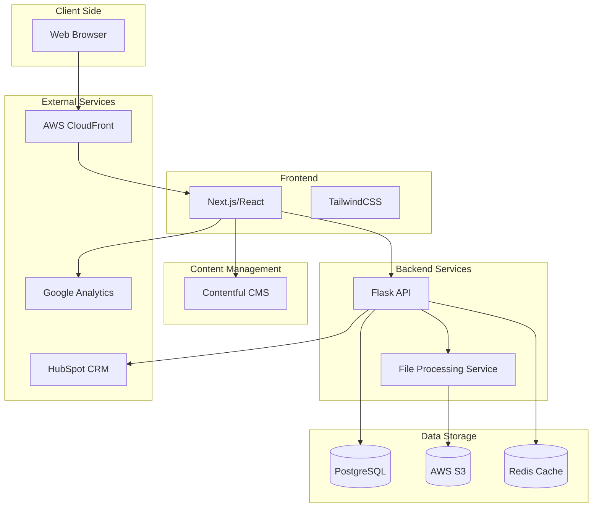

# IndiVillage.com Website Documentation

Welcome to the documentation for the IndiVillage.com website project. This documentation provides comprehensive information about the architecture, components, development workflows, and operational procedures for the IndiVillage.com website.

## Project Overview

The IndiVillage.com website is a modern, visually stunning digital platform that showcases the company's AI-as-a-service and scalable back-office capabilities while highlighting its social impact mission. The website is built using a JAMstack architecture with Next.js for the frontend and Flask for the backend API services, deployed on AWS infrastructure.

### Key Features

- **Modern Website Design**: Responsive, visually appealing design with intuitive navigation
- **AI-as-a-Service Portfolio**: Comprehensive presentation of IndiVillage's AI service offerings
- **Sample Data Upload**: Interactive functionality for uploading sample datasets
- **Demo/Quote Request**: Automated system for service demonstrations and price quotes
- **Social Impact Storytelling**: Compelling presentation of IndiVillage's "AI for Good" mission
- **Case Studies**: Detailed case studies showcasing successful client implementations
- **CRM Integration**: Seamless integration with HubSpot CRM for lead management

### Technology Stack

- **Frontend**: Next.js, React, TypeScript, TailwindCSS
- **Backend**: Python, Flask, SQLAlchemy
- **Database**: PostgreSQL, Redis
- **Storage**: AWS S3
- **Infrastructure**: AWS (ECS, RDS, CloudFront, etc.)
- **CI/CD**: GitHub Actions
- **Monitoring**: CloudWatch, Prometheus, Grafana

### System Architecture



## Documentation Structure

This documentation is organized into several sections, each focusing on a specific aspect of the system:

### High-Level System Design

The IndiVillage.com website implements a modern decoupled architecture following the JAMstack approach, with these key components:

- **Frontend Layer**: Next.js-based React application with server-side rendering and static generation capabilities
- **API Layer**: Flask-based RESTful API services for form handling, file processing, and CRM integration
- **Content Layer**: Contentful headless CMS for structured content management
- **Data Layer**: PostgreSQL for structured data, Redis for caching, and S3 for file storage
- **Infrastructure Layer**: AWS cloud services with containerized deployment on ECS

The architecture emphasizes security, scalability, and performance while enabling a rich, interactive user experience.

For more details, see the architecture documentation at `./architecture.md`.

### Backend

[Backend Documentation](./backend/README.md) - Documentation for the backend API services, including setup instructions, API endpoints, and development guidelines.

- [API Documentation](./backend/api.md) - Detailed API endpoint specifications
- [Database Documentation](./backend/database.md) - Database schema and data models
- [Services Documentation](./backend/services.md) - Backend service implementations
- [File Processing Documentation](./backend/file-processing.md) - File upload and processing system
- [Security Documentation](./backend/security.md) - Backend security features and best practices

### Frontend

[Frontend Documentation](./web/README.md) - Documentation for the Next.js frontend application, including component library, state management, and styling approach.

- [Components Documentation](./web/components.md) - UI component library
- [Pages Documentation](./web/pages.md) - Page structure and routing
- [State Management Documentation](./web/state-management.md) - State management approach
- [Accessibility Documentation](./web/accessibility.md) - Accessibility features and compliance

### Infrastructure and DevOps

[Infrastructure Documentation](./infrastructure/README.md) - Details about the AWS infrastructure, containerization, and orchestration.

- [AWS Documentation](./infrastructure/aws.md) - AWS services and configurations
- [Network Documentation](./infrastructure/network.md) - Network architecture and security
- [Security Documentation](./infrastructure/security.md) - Infrastructure security measures

The deployment process is documented in the deployment guide at `./deployment/README.md`. This includes separate pipelines for the frontend and backend components, with appropriate staging and approval gates for production deployments.

### Operations

Documentation related to operations, monitoring, and maintenance.

- [Monitoring Documentation](./operations/monitoring.md) - Monitoring and alerting
- [Backup and Restore Documentation](./operations/backup-restore.md) - Backup procedures and restoration
- [Disaster Recovery Documentation](./operations/disaster-recovery.md) - Disaster recovery plans and procedures

### Development

Guidelines for development workflows, coding standards, and testing.

The Getting Started Guide at `./development/getting-started.md` provides detailed setup instructions for developers. Additional documentation includes:

- [Workflow Documentation](./development/workflows.md) - Development workflows and processes
- [Standards Documentation](./development/standards.md) - Coding standards and best practices
- [Testing Documentation](./development/testing.md) - Testing strategies and procedures
- [Security Guidelines](./development/security.md) - Security best practices for development

### Integrations

Information about external service integrations.

- [Contentful Documentation](./integrations/contentful.md) - CMS integration
- [HubSpot Documentation](./integrations/hubspot.md) - CRM integration
- [AWS Documentation](./integrations/aws.md) - AWS service integrations

## Getting Started

To get started with the IndiVillage.com website project, follow these steps:

### Prerequisites

- Git
- Node.js 18.x or later
- Python 3.10 or later
- Docker and Docker Compose
- AWS CLI (for infrastructure management)
- Access to the GitHub repository

### Repository Setup

1. Clone the repository:
   ```bash
   git clone https://github.com/indivillage/indivillage-website.git
   cd indivillage-website
   ```

2. Set up environment variables:
   ```bash
   cp .env.example .env
   # Edit .env with appropriate values
   ```

3. Install dependencies:
   ```bash
   # Frontend dependencies
   cd src/web
   npm install
   
   # Backend dependencies
   cd ../backend
   pip install -r requirements.txt
   ```

### Local Development

1. Start the development environment:
   ```bash
   docker-compose up -d
   ```

2. Access the applications:
   - Frontend: http://localhost:3000
   - Backend API: http://localhost:8000
   - API Documentation: http://localhost:8000/docs

3. For more detailed instructions, see the Getting Started Guide in the development section.

## Contributing

We welcome contributions to the IndiVillage.com website project. Please follow these guidelines when contributing:

### Development Workflow

1. Create a feature branch from `develop`
2. Implement changes with appropriate tests
3. Ensure all tests pass
4. Submit a pull request to `develop`
5. Address review comments
6. Once approved, changes will be merged

### Coding Standards

- Follow the established coding standards for each component
- Write meaningful commit messages following conventional commits format
- Include tests for new features and bug fixes
- Update documentation as needed
- Ensure accessibility compliance for UI changes

### Documentation Updates

When making changes to the system, please update the relevant documentation:

1. Update component-specific documentation
2. Update system overview documentation if the changes affect system design
3. Update API documentation for API changes
4. Add new documentation files as needed

## Support and Contact

For questions or issues related to the IndiVillage.com website project, please contact the appropriate team:

### Development Team

- **Email**: dev@indivillage.com
- **Slack**: #website-development channel

### Operations Team

- **Email**: ops@indivillage.com
- **Slack**: #website-operations channel

### Issue Tracking

Please report issues using the GitHub issue tracker:

- [Report a Bug](https://github.com/indivillage/indivillage-website/issues/new?template=bug_report.md)
- [Request a Feature](https://github.com/indivillage/indivillage-website/issues/new?template=feature_request.md)

## License

The IndiVillage.com website project is proprietary software owned by IndiVillage. All rights reserved.