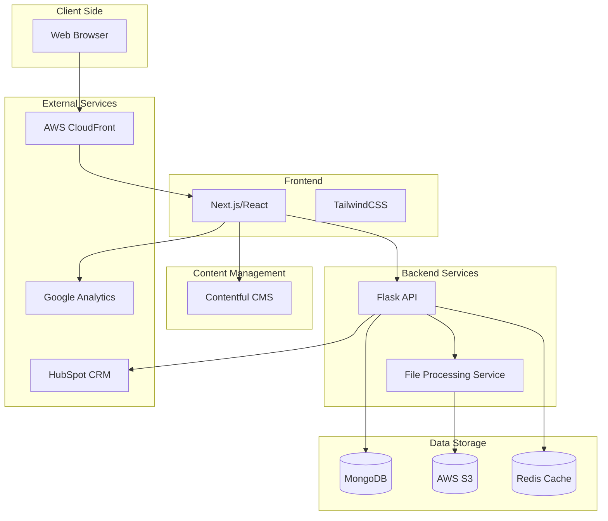
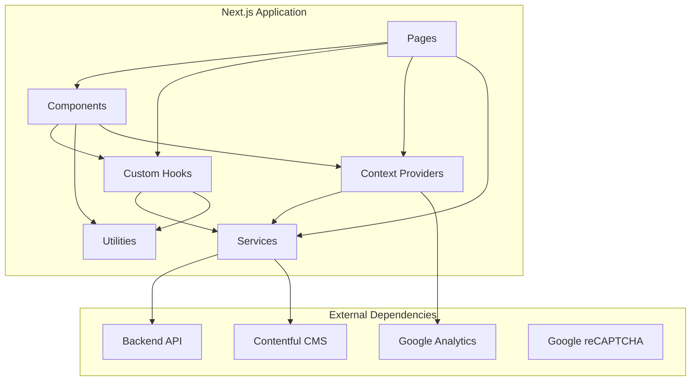
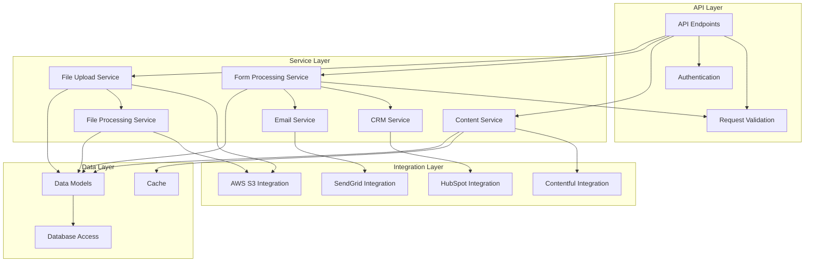
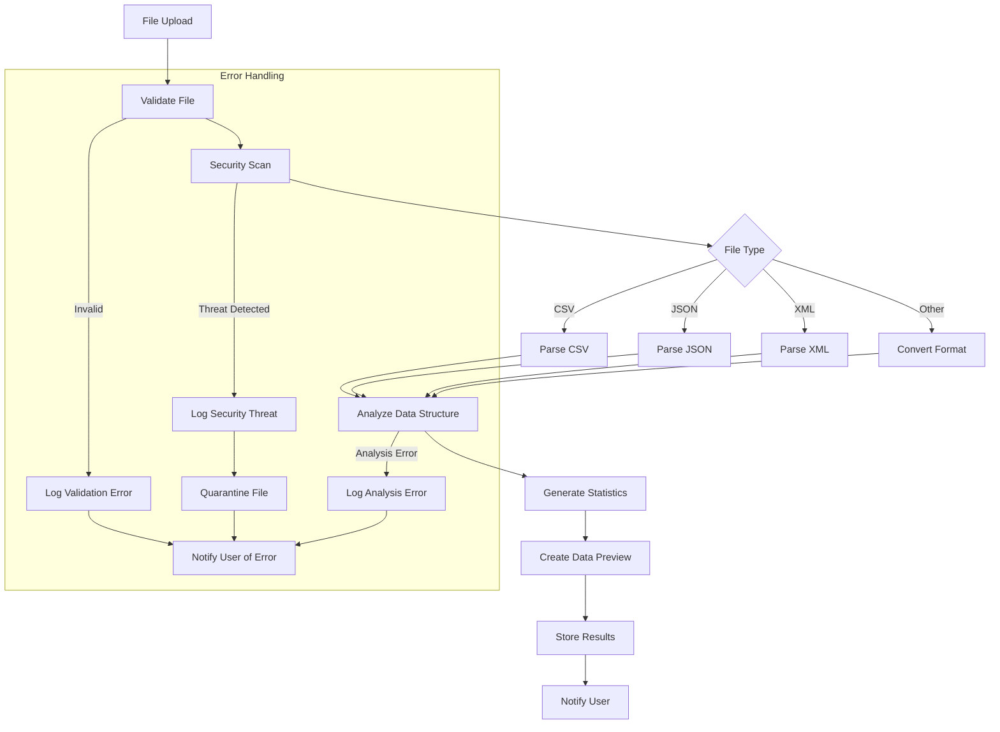
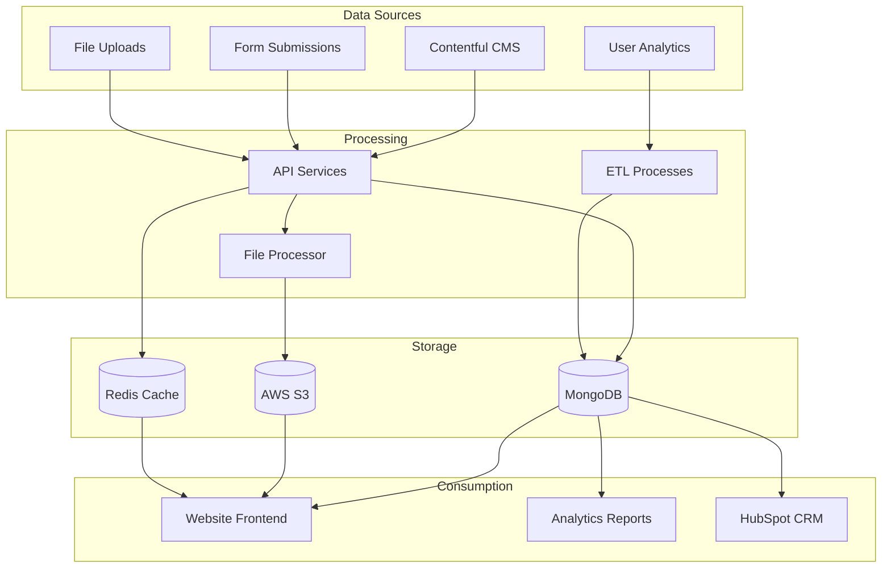
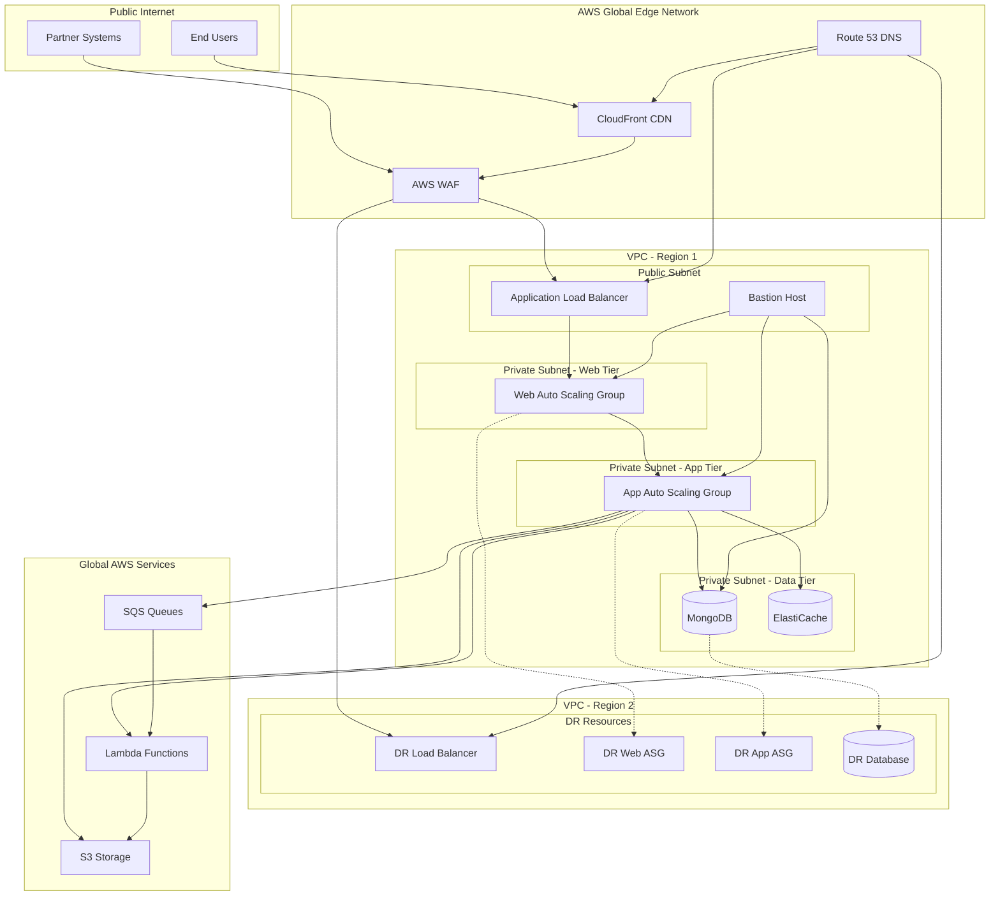
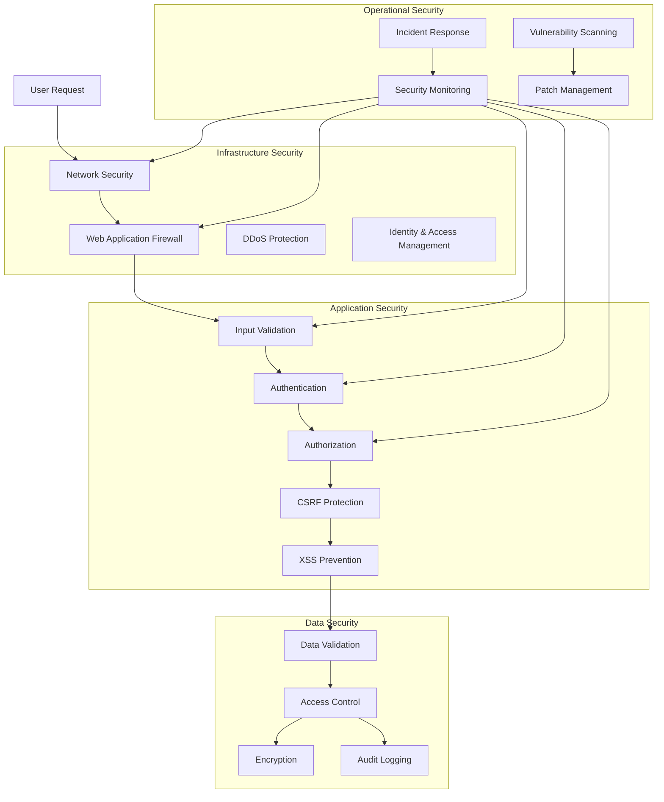
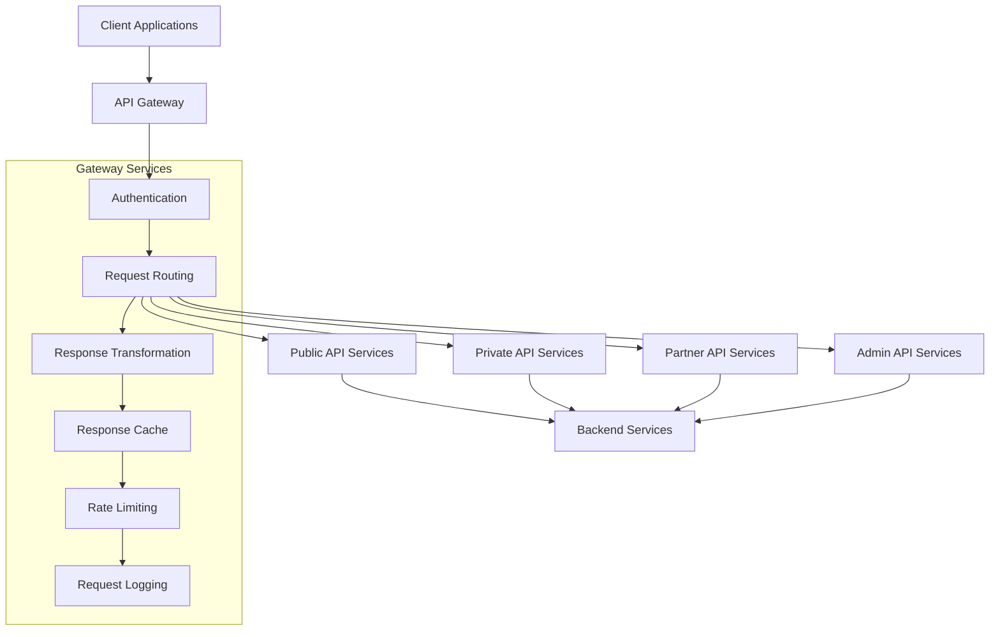
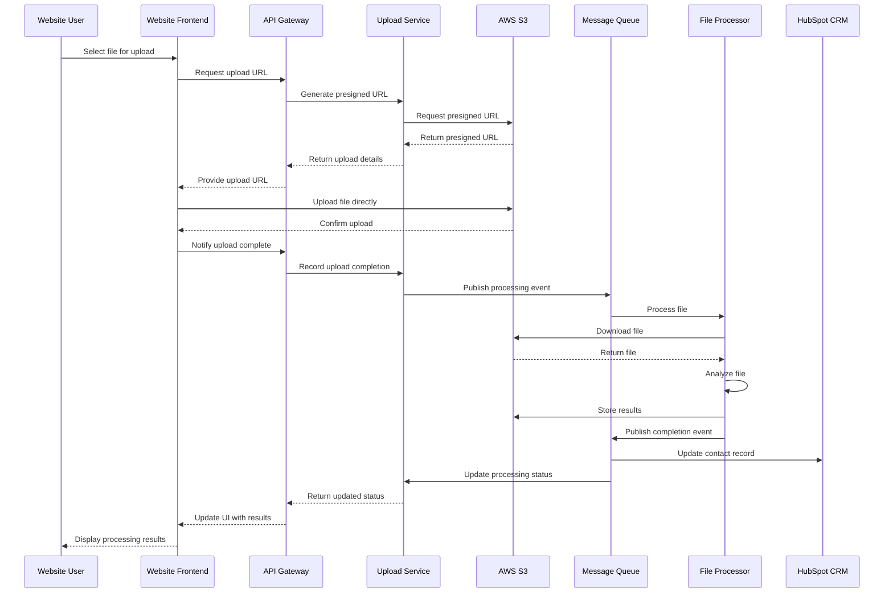
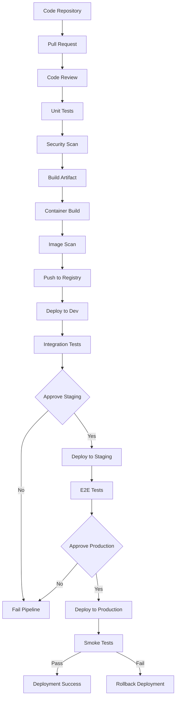

# IndiVillage.com Architecture Overview

This document provides a comprehensive overview of the architecture for the IndiVillage.com website. The architecture is designed to support the company's dual mission of providing cutting-edge AI-as-a-service solutions while creating positive social impact. The system is built with a focus on scalability, security, performance, and maintainability.

# 1. Architectural Principles
The IndiVillage.com website architecture is guided by the following key principles:

## 1.1 Separation of Concerns
The architecture implements clear separation between different layers and components of the system. This includes separation between:

- **Presentation Layer**: User interface components and client-side logic
- **API Layer**: RESTful API endpoints for data access and manipulation
- **Service Layer**: Business logic and core functionality
- **Data Layer**: Data storage, retrieval, and management
- **Infrastructure Layer**: Cloud resources, networking, and security

## 1.2 API-First Design
All data interactions occur through well-defined APIs, enabling:

- Decoupling of frontend and backend components
- Consistent data access patterns
- Easier integration with external systems
- Future extensibility for mobile or other clients
- Versioned APIs for backward compatibility

## 1.3 Progressive Enhancement
The frontend implements progressive enhancement to ensure:

- Core functionality works without JavaScript
- Enhanced experiences for modern browsers
- Graceful degradation for older browsers
- Accessibility for all users regardless of device or ability

## 1.4 Security by Design
Security is integrated throughout the architecture, including:

- Input validation at all entry points
- Authentication and authorization for protected resources
- Data encryption at rest and in transit
- Protection against common web vulnerabilities
- Regular security scanning and monitoring

## 1.5 Performance Optimization
Performance is optimized through:

- Static site generation for content-heavy pages
- CDN distribution for global content delivery
- Efficient caching strategies at multiple levels
- Optimized assets (images, JavaScript, CSS)
- Lazy loading of non-critical resources

## 1.6 Scalability and Resilience
The system is designed for scalability and resilience through:

- Containerized microservices that can scale independently
- Auto-scaling based on demand
- Multi-region deployment for disaster recovery
- Circuit breakers and bulkheads to prevent cascading failures
- Comprehensive monitoring and alerting

# 2. High-Level Architecture
The IndiVillage.com website implements a modern JAMstack architecture with decoupled frontend and backend components, connected through APIs and supported by cloud infrastructure.

## 2.1 Architecture Diagram


## 2.2 Component Overview
The architecture consists of the following major components:

- **Frontend Application**: Next.js-based React application with server-side rendering and static generation capabilities
- **Backend API**: Flask-based RESTful API services for form handling, file processing, and CRM integration
- **Content Management**: Contentful headless CMS for structured content management
- **Data Storage**: MongoDB for structured data, Redis for caching, and S3 for file storage
- **External Integrations**: HubSpot CRM, Google Analytics, and other third-party services
- **Infrastructure**: AWS cloud services with containerized deployment on ECS

## 2.3 Key Technology Decisions
| Component | Technology Choice | Justification |
|-----------|-------------------|---------------|
| Frontend Framework | Next.js | Server-side rendering for SEO, static generation for performance, React for component-based UI |
| CSS Framework | TailwindCSS | Utility-first approach for rapid development, consistent design system |
| Backend Framework | Flask | Lightweight, flexible Python framework with excellent extension ecosystem |
| API Design | REST | Widely adopted, simpler implementation, sufficient for requirements |
| Database | MongoDB | Flexible schema for varied content types, good performance for read-heavy workloads |
| CMS | Contentful | Headless approach with robust API, content modeling capabilities |
| Cloud Provider | AWS | Comprehensive service offerings, global infrastructure, team expertise |
| Containerization | Docker | Consistent environments, simplified dependency management |
| Orchestration | Amazon ECS | Seamless AWS integration, simpler than Kubernetes for our needs |
| CI/CD | GitHub Actions | Tight GitHub integration, flexible workflow configuration |

# 3. Frontend Architecture
The frontend of IndiVillage.com is built with Next.js, React, and TypeScript, following modern web development practices to create a responsive, accessible, and performant user experience.

## 3.1 Frontend Architecture Diagram


## 3.2 Component Architecture
The frontend follows a component-based architecture with a clear hierarchy:

- **Pages**: Next.js page components that define routes and layout
- **Layout Components**: Provide consistent structure across pages
- **UI Components**: Reusable interface elements like buttons, forms, cards
- **Feature Components**: Specific functionality like file upload, service showcase
- **Context Providers**: Global state management for features like analytics
- **Custom Hooks**: Encapsulate complex logic and state management

Components are organized by type and feature, promoting reusability and maintainability.

## 3.3 Rendering Strategies
The application uses a hybrid rendering approach:

- **Static Site Generation (SSG)**: For content-heavy pages that don't change frequently
- **Server-Side Rendering (SSR)**: For pages that need fresh data on each request
- **Incremental Static Regeneration (ISR)**: For pages that change occasionally
- **Client-Side Rendering (CSR)**: For highly interactive components

This approach optimizes both performance and SEO while enabling rich interactive experiences.

## 3.4 State Management
State management is implemented using a combination of:

- **Local Component State**: For component-specific state
- **React Context**: For global state shared across components
- **Custom Hooks**: For encapsulating related state and logic

Key context providers include:
- **AnalyticsContext**: Provides analytics tracking throughout the application
- **ToastContext**: Manages toast notifications
- **UploadContext**: Manages global upload state for cross-component communication

## 3.5 Key Frontend Features
The frontend implements several key features:

- **Responsive Design**: Adapts to different screen sizes and devices
- **Service Showcase**: Interactive presentation of AI service offerings
- **File Upload System**: Secure upload and processing of sample datasets
- **Form Submission System**: Contact, demo request, and quote request forms
- **Social Impact Storytelling**: Engaging presentation of social impact mission

Each feature is implemented with a focus on user experience, accessibility, and performance.

# 4. Backend Architecture
The backend of IndiVillage.com is built with Flask, providing RESTful API services for form handling, file processing, and integration with external systems.

## 4.1 Backend Architecture Diagram


## 4.2 Service Architecture
The backend follows a service-oriented architecture with clear separation of concerns:

- **API Layer**: Handles HTTP requests, routing, and response formatting
- **Service Layer**: Implements business logic and orchestrates operations
- **Data Layer**: Manages data persistence and retrieval
- **Integration Layer**: Connects with external services and systems

Each service has a specific responsibility and well-defined interfaces.

## 4.3 Core Services
The backend implements several core services:

- **Content Service**: Manages content retrieval and caching
- **Form Processing Service**: Handles form submissions and validation
- **File Upload Service**: Manages secure file uploads and tracking
- **File Processing Service**: Processes uploaded files for analysis
- **Email Service**: Handles email notifications
- **CRM Service**: Integrates with HubSpot for lead management

Each service is designed to be modular and independently testable.

## 4.4 API Design
The API follows RESTful design principles:

- **Resource-Based URLs**: Clear, hierarchical resource paths
- **HTTP Methods**: Appropriate use of GET, POST, PUT, DELETE
- **Status Codes**: Standard HTTP status codes for responses
- **Versioning**: API versioning through URL path (/api/v1/)
- **Documentation**: OpenAPI/Swagger documentation

Key API endpoints include:
- `/api/v1/services`: Service catalog information
- `/api/v1/case-studies`: Case study content
- `/api/v1/impact-stories`: Social impact narratives
- `/api/v1/contact`: Contact form submissions
- `/api/v1/demo-request`: Service demonstration requests
- `/api/v1/quote-request`: Service quote requests
- `/api/v1/uploads`: File upload and processing

## 4.5 Data Processing Pipeline
The file processing pipeline handles uploaded sample datasets:



This pipeline ensures secure and reliable processing of user-uploaded files with appropriate error handling and user notifications.

# 5. Data Architecture
The IndiVillage.com website uses a multi-database approach to handle different types of data with appropriate storage solutions.

## 5.1 Data Storage Solutions
| Data Type | Storage Solution | Justification |
|-----------|------------------|---------------|
| Content | MongoDB | Flexible schema for varied content types, good for content-heavy applications |
| User Files | AWS S3 | Scalable object storage, designed for file storage and retrieval |
| Form Data | MongoDB | Structured storage for form submissions with flexible schema |
| Session Data | Redis | In-memory storage for fast access to session information |
| Cache | Redis | High-performance caching for API responses and frequent queries |

Each storage solution is chosen based on the specific requirements of the data being stored.

## 5.2 Database Schema
The MongoDB database uses the following collections:

- **services**: Service catalog information
- **case_studies**: Case study content
- **impact_stories**: Social impact narratives
- **users**: User information
- **file_uploads**: Uploaded file metadata and status
- **file_analysis**: Analysis results for uploaded files
- **form_submissions**: Form submission data

Each collection has a well-defined schema with appropriate indexes for query optimization.

## 5.3 File Storage Organization
AWS S3 is used for file storage with the following bucket organization:

| Bucket | Purpose | Lifecycle Policy | Security |
|--------|---------|-----------------|----------|
| `indivillage-uploads` | User-uploaded files | 30-day retention | Private, encrypted |
| `indivillage-processed` | Processed results | 90-day retention | Private, encrypted |
| `indivillage-assets` | Static assets | No expiration | Public-read, cached |
| `indivillage-logs` | Access logs | 90-day retention | Private, encrypted |

File access is controlled through presigned URLs for uploads and downloads, ensuring secure file handling.

## 5.4 Caching Strategy
The system implements a multi-level caching strategy:

- **CDN Caching**: CloudFront caches static assets and content at edge locations
- **Application Caching**: Redis caches API responses and frequent database queries
- **Browser Caching**: HTTP headers control client-side caching of assets

Cache invalidation is triggered by content updates through webhooks and API events.

## 5.5 Data Flow Patterns


This diagram illustrates how data flows through the system from various sources to storage and consumption points.

# 6. Infrastructure Architecture
The IndiVillage.com website is hosted on AWS infrastructure, leveraging various services for compute, storage, networking, and security.

## 6.1 Cloud Infrastructure Diagram


## 6.2 Containerization and Orchestration
The application is containerized using Docker and orchestrated with Amazon ECS:

- **Container Images**: Separate images for frontend, backend, and workers
- **ECS Cluster**: Managed container orchestration
- **Task Definitions**: Container configurations and resource allocations
- **Services**: Long-running container deployments with auto-scaling
- **Auto Scaling**: Dynamic adjustment of container count based on load

This approach provides consistent environments, simplified deployment, and efficient resource utilization.

## 6.3 Networking and Security
The network architecture implements defense in depth:

- **VPC**: Isolated network environment
- **Subnets**: Public and private subnets across multiple AZs
- **Security Groups**: Instance-level firewall rules
- **NACLs**: Subnet-level access controls
- **WAF**: Protection against common web vulnerabilities

All sensitive data is encrypted both at rest and in transit, and access is controlled through IAM policies and roles.

## 6.4 High Availability and Disaster Recovery
The infrastructure is designed for high availability and disaster recovery:

- **Multi-AZ Deployment**: Resources distributed across availability zones
- **Auto-Scaling**: Dynamic adjustment of capacity
- **Load Balancing**: Distribution of traffic across instances
- **Multi-Region**: Secondary region for disaster recovery
- **Data Replication**: Cross-region replication of data
- **Backup Strategy**: Regular backups with point-in-time recovery

This approach ensures resilience against various failure scenarios, from individual instance failures to entire region outages.

## 6.5 Infrastructure as Code
All infrastructure is defined and managed using Terraform:

- **Modules**: Reusable Terraform modules for common components
- **Environment Configs**: Environment-specific configurations
- **State Management**: Terraform state stored in S3 with DynamoDB locking
- **CI/CD Integration**: Automated infrastructure deployment

This approach ensures consistent, version-controlled, and repeatable infrastructure deployments.

# 7. Security Architecture
Security is implemented at multiple layers throughout the IndiVillage.com website architecture.

## 7.1 Security Layers


## 7.2 Authentication and Authorization
The system implements a comprehensive authentication and authorization framework:

- **Public Content**: No authentication required
- **Form Submissions**: CAPTCHA verification to prevent spam
- **File Uploads**: Temporary tokens for upload authorization
- **Admin Access**: JWT-based authentication with role-based access control

Authentication is handled through Auth0 for administrative access, providing secure identity management with MFA support.

## 7.3 Data Protection
Data protection measures include:

- **Encryption at Rest**: All databases and storage encrypted
- **Encryption in Transit**: TLS for all communications
- **Field-Level Encryption**: Additional encryption for sensitive fields
- **Data Minimization**: Collection of only necessary data
- **Retention Policies**: Appropriate data retention periods

These measures ensure that sensitive data is protected throughout its lifecycle.

## 7.4 Secure Development Practices
Security is integrated into the development process:

- **Secure Coding Guidelines**: Established standards for developers
- **Code Reviews**: Security-focused code reviews
- **Dependency Scanning**: Regular scanning for vulnerabilities
- **SAST/DAST**: Static and dynamic application security testing
- **Security Training**: Regular developer security training

These practices help identify and address security issues early in the development lifecycle.

## 7.5 Security Monitoring and Response
Comprehensive security monitoring and incident response:

- **Log Aggregation**: Centralized logging for security events
- **Threat Detection**: Automated detection of suspicious activities
- **Alerting**: Real-time alerts for security incidents
- **Incident Response**: Documented procedures for security incidents
- **Regular Testing**: Security testing and vulnerability assessments

This approach enables rapid detection and response to security threats.

# 8. Integration Architecture
The IndiVillage.com website integrates with various external systems and services to provide a complete solution.

## 8.1 Integration Patterns
The system uses several integration patterns:

- **REST APIs**: Synchronous request-response for immediate interactions
- **Webhooks**: Event-based notifications for asynchronous updates
- **Message Queues**: Asynchronous processing for long-running tasks
- **ETL Processes**: Batch processing for data synchronization

Each pattern is chosen based on the specific requirements of the integration.

## 8.2 External Integrations
Key external integrations include:

- **Contentful CMS**: Content management and delivery
- **HubSpot CRM**: Lead management and tracking
- **SendGrid**: Email delivery and tracking
- **Google Analytics**: User analytics and tracking
- **Google reCAPTCHA**: Form security and spam prevention

Each integration is implemented with appropriate error handling, retry logic, and monitoring.

## 8.3 API Gateway


The API Gateway provides a unified entry point for all API requests, handling cross-cutting concerns like authentication, rate limiting, and request logging.

## 8.4 Event-Driven Architecture
Event-driven architecture is used for asynchronous processing:

- **Event Sources**: User actions, system events, external webhooks
- **Event Bus**: Central event routing and distribution
- **Event Handlers**: Specialized processors for different event types
- **Event Store**: Persistent storage of events for replay and audit

This approach enables loose coupling between components and scalable processing of asynchronous events.

## 8.5 File Processing Integration


This sequence diagram illustrates the file upload and processing flow, showing how different components interact to provide this functionality.

# 9. Deployment Architecture
The IndiVillage.com website uses a robust deployment architecture to ensure reliable and consistent deployments across environments.

## 9.1 Deployment Environments
The system is deployed across three distinct environments:

**Development Environment**:
- Purpose: For ongoing development and feature testing
- Configuration: Minimal but sufficient for testing
- Resource sizing: t3.medium instances, single-AZ database
- Access: Development team and CI/CD pipeline
- Update frequency: Multiple times per day (on each merge to develop)

**Staging Environment**:
- Purpose: Pre-production validation and testing
- Configuration: Similar to production but at lower scale
- Resource sizing: t3.large instances, multi-AZ database
- Access: Limited to development team, QA, and project managers
- Update frequency: Several times per week

**Production Environment**:
- Purpose: Live environment for end users
- Configuration: Optimized for performance and user load
- Resource sizing: m5.large instances, multi-AZ with read replicas
- Access: Strictly limited to operations team and automated processes
- Update frequency: Weekly or bi-weekly (scheduled releases)

## 9.2 CI/CD Pipeline


The CI/CD pipeline automates the build, test, and deployment process, with appropriate gates and approvals for production deployments.

## 9.3 Deployment Strategies
Different deployment strategies are used for different environments:

- **Development**: Rolling updates for simplicity and speed
- **Staging**: Blue-green deployment for testing production-like deployments
- **Production**: Blue-green deployment with traffic shifting for zero-downtime updates

These strategies ensure reliable deployments with minimal user impact.

## 9.4 Configuration Management
Configuration is managed through a combination of:

- **Environment Variables**: Runtime configuration for applications
- **AWS Parameter Store**: Secure storage of configuration values
- **AWS Secrets Manager**: Secure storage of sensitive credentials
- **Terraform Variables**: Infrastructure configuration

This approach ensures secure and consistent configuration across environments.

## 9.5 Rollback Procedures
Automated rollback procedures are in place for deployment failures:

- **Development**: Manual rollback if issues are detected
- **Staging**: Automatic rollback if tests fail
- **Production**: Immediate automatic rollback by shifting traffic back to the previous version

These procedures ensure that service disruptions are minimized in case of deployment issues.

# 10. Monitoring and Observability
Comprehensive monitoring and observability are implemented to ensure system health, performance, and security.

## 10.1 Monitoring Architecture
```mermaid
flowchart TD
    subgraph "Data Sources"
        Frontend[Frontend Applications]
        APIServices[API Services]
        Database[Database]
        FileStorage[File Storage]
        ExternalServices[External Services]
    end
    
    subgraph "Collection Layer"
        RUM[Real User Monitoring]
        APM[Application Performance Monitoring]
        Logs[Log Collection]
        Metrics[Metrics Collection]
        Traces[Distributed Tracing]
        Synthetics[Synthetic Monitoring]
    end
    
    subgraph "Processing Layer"
        LogAggregation[Log Aggregation]
        MetricsAggregation[Metrics Aggregation]
        TraceAnalysis[Trace Analysis]
        AlertRules[Alert Rules Engine]
    end
    
    subgraph "Storage Layer"
        CloudWatch[CloudWatch]
        S3Logs[S3 Log Archive]
        TimeSeriesDB[Time Series Database]
    end
    
    subgraph "Visualization Layer"
        Dashboards[Grafana Dashboards]
        AlertConsole[Alert Console]
        ReportGenerator[Report Generator]
    end
    
    subgraph "Notification Layer"
        PagerDuty[PagerDuty]
        Slack[Slack]
        Email[Email]
    end
    
    Frontend --> RUM
    Frontend --> Synthetics
    APIServices --> APM
    APIServices --> Logs
    APIServices --> Metrics
    APIServices --> Traces
    Database --> Logs
    Database --> Metrics
    FileStorage --> Logs
    FileStorage --> Metrics
    ExternalServices --> Synthetics
    ExternalServices --> Logs
    
    RUM --> MetricsAggregation
    APM --> MetricsAggregation
    APM --> TraceAnalysis
    Logs --> LogAggregation
    Metrics --> MetricsAggregation
    Traces --> TraceAnalysis
    Synthetics --> MetricsAggregation
    
    LogAggregation --> CloudWatch
    LogAggregation --> S3Logs
    MetricsAggregation --> CloudWatch
    MetricsAggregation --> TimeSeriesDB
    TraceAnalysis --> CloudWatch
    
    CloudWatch --> AlertRules
    TimeSeriesDB --> AlertRules
    
    AlertRules --> AlertConsole
    AlertRules --> PagerDuty
    AlertRules --> Slack
    AlertRules --> Email
    
    Dashboards --> ReportGenerator