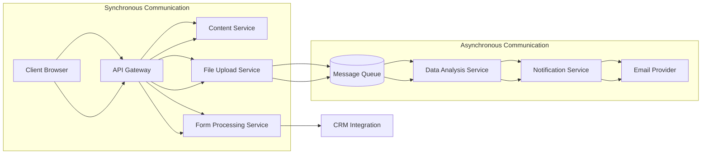

# Backend Services Documentation

## Introduction

This document provides comprehensive information about the backend services architecture for the IndiVillage website. It details the service layer, including service responsibilities, interactions, and implementation details.

The backend services are designed to be modular, scalable, and maintainable, supporting the website's AI-as-a-service offerings, data upload capabilities, and social impact storytelling.

## Service Architecture

The backend services architecture is designed with clear separation of concerns, following a service-oriented approach.

### Key Principles

- **Modularity**: Each service has a specific responsibility and well-defined interfaces.
- **Scalability**: Services can be scaled independently based on demand.
- **Maintainability**: Clear separation of concerns makes it easier to maintain and update services.
- **Testability**: Services are designed to be easily testable with unit and integration tests.

### Service Architecture Diagram

## Service Details

### ContentService

#### Description
Service for accessing and managing content from Contentful CMS

#### Responsibilities
- Retrieve content for services, case studies, and impact stories
- Cache content for performance optimization
- Handle content relationships and navigation structure
- Provide content refresh capabilities

#### Key Methods
- `get_services()`
- `get_service_by_slug(slug)`
- `get_case_studies(industry_slug, service_slug)`
- `get_case_study_by_slug(slug)`
- `get_impact_stories()`
- `get_impact_story_by_slug(slug)`
- `get_navigation()`
- `get_page_by_slug(slug)`
- `refresh_content_cache(content_type, slug)`

#### Dependencies
- Contentful CMS integration
- Redis cache

### FormProcessingService

#### Description
Service for handling form submissions including contact forms, demo requests, and quote requests

#### Responsibilities
- Validate form data
- Store submissions in database
- Send confirmation emails
- Synchronize with CRM
- Track analytics events

#### Key Methods
- `process_contact_form(form_data, client_ip, trace_id)`
- `process_demo_request(form_data, client_ip, trace_id)`
- `process_quote_request(form_data, client_ip, trace_id)`
- `get_submission(submission_id)`
- `get_submissions(form_type, status, limit, offset)`
- `update_submission_status(submission_id, status)`

#### Dependencies
- SecurityService
- CRMService
- EmailService
- AnalyticsService
- Database models

### FileUploadService

#### Description
Service for handling secure file uploads from users

#### Responsibilities
- Generate presigned URLs
- Validate file uploads
- Track upload status
- Initiate security scanning
- Coordinate file processing

#### Key Methods
- `create_upload(upload_data, filename, content_type, size)`
- `complete_upload(upload_id, object_key)`
- `get_upload_status(upload_id)`
- `delete_upload(upload_id)`
- `scan_uploaded_file(upload_id)`
- `initiate_file_processing(upload_id)`
- `send_upload_notifications(upload_id, notification_type, additional_data)`

#### Dependencies
- S3 storage integration
- SecurityService
- FileProcessingService
- EmailService
- Database models

### FileProcessingService

#### Description
Service for processing and analyzing uploaded files

#### Responsibilities
- Process different file formats (CSV, JSON, XML, images)
- Extract data insights
- Generate analysis results
- Store processing results
- Update CRM with results

#### Key Methods
- `process_file(upload_id)`
- `get_processing_results(upload_id)`
- `generate_results_url(upload_id, expiration)`
- `process_csv_file(file_path, original_filename)`
- `process_json_file(file_path, original_filename)`
- `process_xml_file(file_path, original_filename)`
- `process_image_file(file_path, original_filename)`

#### Dependencies
- S3 storage integration
- CRMService
- EmailService
- Database models
- Data processing libraries (pandas, numpy, Pillow)

### CRMService

#### Description
Service for integrating with HubSpot CRM

#### Responsibilities
- Synchronize form submissions with CRM
- Update contacts with file upload information
- Create and manage deals
- Log activities in CRM
- Retrieve contact and deal information

#### Key Methods
- `sync_form_submission(submission_id)`
- `update_contact_with_file_upload(upload_id, processing_results)`
- `get_contact(contact_id)`
- `get_deal(deal_id)`
- `log_activity(contact_id, activity_type, activity_data)`
- `find_contact_by_email(email)`
- `create_contact(contact_data)`
- `update_contact(contact_id, contact_data)`
- `create_deal(contact_id, deal_data, form_type)`

#### Dependencies
- HubSpot API integration
- Database models

### EmailService

#### Description
Service for sending email notifications

#### Responsibilities
- Format email content
- Send transactional emails
- Track delivery status
- Handle email templates
- Send confirmation emails for form submissions
- Send notifications for file uploads and processing
- Send internal notifications

#### Key Methods
- `send_email(to_email, subject, html_content, ...)`
- `send_template_email(to_email, template, context, ...)`
- `send_contact_confirmation(to_email, name, form_data, trace_id)`
- `send_demo_request_confirmation(to_email, name, form_data, trace_id)`
- `send_quote_request_confirmation(to_email, name, form_data, trace_id)`
- `send_upload_confirmation(to_email, name, upload_data, trace_id)`
- `send_upload_complete(to_email, name, upload_data, processing_results, trace_id)`
- `send_upload_failed(to_email, name, upload_data, error_message, trace_id)`
- `send_internal_notification(subject, notification_type, data, recipients, trace_id)`

#### Dependencies
- SendGrid API integration
- Email templates

### AnalyticsService

#### Description
Service for tracking analytics events

#### Responsibilities
- Record API usage
- Monitor performance
- Generate usage reports
- Track conversion metrics
- Track form submissions
- Track file uploads and processing
- Track service interest
- Track impact story and case study views

#### Key Methods
- `track_custom_event(category, action, label, value, additional_data, client_id, trace_id)`
- `track_form_submission(form_type, success, form_data, client_id, trace_id)`
- `track_file_upload(file_type, file_size, success, metadata, client_id, trace_id)`
- `track_file_processing(file_type, file_size, processing_duration_ms, success, results, client_id, trace_id)`
- `track_demo_request(service_interest, success, request_data, client_id, trace_id)`
- `track_quote_request(service_interest, success, request_data, client_id, trace_id)`
- `track_service_interest(service_slug, interaction_type, additional_data, client_id, trace_id)`
- `track_impact_story_view(story_slug, story_title, additional_data, client_id, trace_id)`
- `track_case_study_view(case_study_slug, case_study_title, additional_data, client_id, trace_id)`
- `generate_client_id(existing_client_id)`

#### Dependencies
- Google Analytics integration
- Internal metrics system

### SecurityService

#### Description
Service for security-related functionality

#### Responsibilities
- Input validation and sanitization
- CAPTCHA verification
- Rate limiting
- File scanning
- Authentication and authorization
- Password management

#### Key Methods
- `sanitize_input(text, allow_html)`
- `validate_form(form_data, form_type)`
- `verify_captcha(token, remote_ip, threshold)`
- `check_rate_limit(identifier, endpoint, limit, window_seconds)`
- `scan_file(file_path)`
- `scan_s3_file(object_key, bucket_name)`
- `validate_file(filename, file_size, mime_type)`
- `hash_password(password)`
- `verify_password(plain_password, hashed_password)`
- `validate_password_strength(password)`
- `create_auth_tokens(user_data)`
- `validate_auth_token(token)`
- `get_security_headers()`
- `get_captcha_site_key()`

#### Dependencies
- reCAPTCHA integration
- Redis for rate limiting
- File scanning libraries
- JWT library

## Service Interaction Patterns

### Form Submission Flow

#### Description
Pattern for handling form submissions

#### Steps
1. Validate form data using SecurityService
2. Create form submission record in database
3. Send confirmation email using EmailService
4. Synchronize with CRM using CRMService
5. Track analytics event using AnalyticsService

### File Upload Flow

#### Description
Pattern for handling file uploads

#### Steps
1. Validate file metadata using SecurityService
2. Generate presigned upload URL for S3
3. Create upload record in database
4. Send confirmation email using EmailService
5. Track upload event using AnalyticsService
6. Scan uploaded file for security threats
7. Process file using FileProcessingService
8. Update CRM with results using CRMService
9. Send completion notification using EmailService

### Content Retrieval Flow

#### Description
Pattern for retrieving content

#### Steps
1. Check cache for requested content
2. If cached, return cached content
3. If not cached, fetch from Contentful CMS
4. Transform and prepare content
5. Cache content for future requests
6. Return content to caller

## Best Practices

### Error Handling

#### Description
Guidelines for consistent error handling in services

#### Details
Use try-except blocks, log errors with appropriate level, return standardized error responses, use custom exception types

### Logging

#### Description
Guidelines for effective logging in services

#### Details
Use appropriate log levels, include context information, mask sensitive data, use structured logging format

### Performance Optimization

#### Description
Guidelines for optimizing service performance

#### Details
Use caching for frequently accessed data, implement pagination for large datasets, use async processing for long-running tasks

### Security Considerations

#### Description
Guidelines for maintaining security in services

#### Details
Validate all input, sanitize output, implement rate limiting, use principle of least privilege

### Testing

#### Description
Guidelines for testing services

#### Details
Write unit tests for each service method, mock external dependencies, test error handling, use integration tests for service interactions