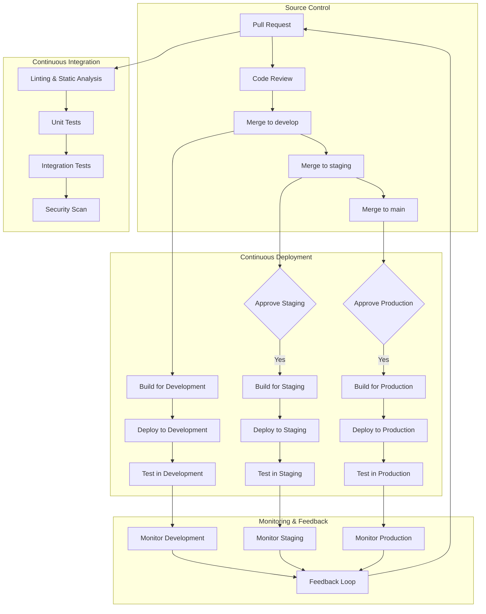
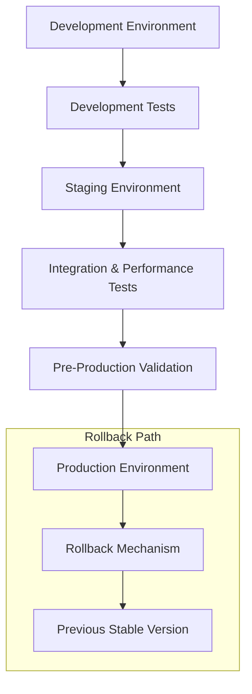

# IndiVillage.com Deployment Documentation

This document provides an overview of the deployment infrastructure, processes, and procedures for the IndiVillage.com website. It serves as the main entry point for deployment-related documentation and links to more detailed documentation on specific aspects of the deployment process.

# Deployment Overview

The IndiVillage.com website is deployed using a robust CI/CD pipeline that automates building, testing, and deploying changes across multiple environments. The deployment process is designed to ensure reliability, consistency, and security while enabling rapid delivery of new features and improvements.

## Deployment Architecture



The deployment architecture follows a GitFlow-based workflow with automated CI/CD pipelines for each environment. Code changes flow from development to staging to production, with appropriate testing and approval gates at each stage.

## Key Components

| Component | Implementation | Purpose |
|-----------|----------------|---------|
| Source Control | GitHub | Version control and collaboration |
| CI Workflows | GitHub Actions | Automated building and testing |
| CD Workflows | GitHub Actions | Automated deployment to environments |
| Container Registry | Amazon ECR | Storage for Docker images |
| Infrastructure as Code | Terraform | Automated infrastructure management |
| Orchestration | AWS ECS | Container orchestration and management |
| Monitoring | CloudWatch, Grafana | Deployment monitoring and alerting |

## Deployment Principles

The IndiVillage.com deployment process follows these core principles:

1. **Automation First**: All build, test, and deployment processes are fully automated to minimize manual intervention and human error.

2. **Quality Gates**: Code must pass automated tests, security scans, and code reviews before proceeding to the next stage.

3. **Environment Parity**: Development, staging, and production environments are configured as similarly as possible to ensure consistent behavior.

4. **Progressive Deployment**: Changes flow from development to staging to production with appropriate testing at each stage.

5. **Observability**: Comprehensive monitoring and logging provide visibility into the deployment process and application performance.

6. **Rollback Capability**: All deployments can be quickly rolled back if issues are detected.

7. **Security Integration**: Security scanning and testing are integrated throughout the pipeline.

# Deployment Environments

The IndiVillage.com website is deployed across three distinct environments, each serving a specific purpose in the development and release lifecycle.

## Environment Overview

| Environment | Purpose | Update Frequency | Access Control |
|-------------|---------|-----------------|---------------|
| Development | Ongoing development and testing | Multiple times per day | Development team |
| Staging | Pre-production validation | Several times per week | Development team, QA, Product Owners |
| Production | Live environment for end users | Weekly or bi-weekly | Restricted to DevOps team |

## Development Environment

**Purpose**: Used for ongoing development and feature testing

**Configuration**:
- Resource sizing: Minimal but sufficient for testing
- Auto-scaling: Limited to control costs
- Database: Single instance with daily backups
- Caching: Basic Redis configuration
- Domain: dev.indivillage.com

**Access Controls**:
- Access: Development team and CI/CD pipeline
- Authentication: Basic authentication for protected endpoints
- Data sensitivity: No production data, synthetic test data only

For more details, see [Deployment Environments](./environments.md#development-environment).

## Staging Environment

**Purpose**: Pre-production validation and testing

**Configuration**:
- Resource sizing: Similar to production but at lower scale
- Auto-scaling: Configured to mirror production
- Database: Multi-AZ deployment with regular backups
- Caching: Production-like Redis configuration
- Domain: staging.indivillage.com

**Access Controls**:
- Access: Limited to development team, QA, and project managers
- Authentication: Full authentication system as in production
- Data sensitivity: Anonymized production-like data

For more details, see [Deployment Environments](./environments.md#staging-environment).

## Production Environment

**Purpose**: Live environment for end users

**Configuration**:
- Resource sizing: Optimized for performance and user load
- Auto-scaling: Fully configured for variable traffic
- Database: Multi-AZ deployment with continuous backups
- Caching: Optimized Redis cluster
- Domain: www.indivillage.com

**Access Controls**:
- Access: Strictly limited to operations team and automated processes
- Authentication: Full authentication with MFA for admin access
- Data sensitivity: Real user data with full security controls

For more details, see [Deployment Environments](./environments.md#production-environment).

## Environment Promotion

Code changes flow through environments in a controlled manner:



For more details on environment promotion, see [Environment Promotion Strategy](./environments.md#environment-promotion-strategy).

# CI/CD Pipeline

The IndiVillage.com website uses a comprehensive CI/CD pipeline to automate building, testing, and deploying changes across environments.

## Continuous Integration

The CI process automatically builds and tests code changes to ensure quality and prevent integration issues:

- **Linting and Static Analysis**: Ensures code quality and consistency
- **Unit and Integration Tests**: Verifies functionality and prevents regressions
- **Security Scanning**: Identifies vulnerabilities in code and dependencies
- **Build Verification**: Ensures that the application builds successfully

For more details, see [Continuous Integration](./ci-cd.md#continuous-integration).

## Continuous Deployment

The CD process automatically deploys code changes to the appropriate environment after passing the CI process:

- **Development Deployment**: Automatic deployment on merge to develop branch
- **Staging Deployment**: Deployment after manual approval
- **Production Deployment**: Deployment after manual approval with blue-green strategy

For more details, see [Continuous Deployment](./ci-cd.md#continuous-deployment).

## Deployment Strategies

Different deployment strategies are used for different environments:

- **Development**: Rolling updates for simplicity and speed
- **Staging**: Blue-green deployment for testing production-like deployments
- **Production**: Blue-green deployment with traffic shifting for zero-downtime updates

For more details, see [Deployment Strategies](./ci-cd.md#deployment-strategies).

## Workflow Management

The CI/CD pipeline is managed through defined workflows and processes:

- **Branching Strategy**: GitFlow-based with feature branches
- **Release Management**: Scheduled releases with version tracking
- **Approval Workflows**: Manual approvals for staging and production
- **Hotfix Process**: Expedited process for critical fixes

For more details, see [Workflow Management](./ci-cd.md#workflow-management).

# Infrastructure as Code

All infrastructure for the IndiVillage.com website is defined and managed using Terraform, enabling consistent, version-controlled, and repeatable infrastructure deployments.

## Terraform Implementation

Terraform is used to define and provision the AWS infrastructure for all environments. The Terraform code is organized as follows:

```
infrastructure/terraform/
├── main.tf                  # Main Terraform configuration
├── variables.tf             # Common variable definitions
├── outputs.tf              # Output definitions
├── providers.tf            # Provider configurations
├── versions.tf             # Terraform version constraints
├── modules/                # Reusable Terraform modules
│   ├── networking/         # VPC, subnets, security groups
│   ├── compute/            # ECS, EC2, Auto Scaling
│   ├── database/           # RDS, ElastiCache
│   ├── storage/            # S3, EFS
│   ├── cdn/                # CloudFront
│   ├── monitoring/         # CloudWatch, Grafana
│   └── security/           # IAM, WAF, GuardDuty
└── environments/           # Environment-specific configurations
    ├── development/        # Development environment
    ├── staging/            # Staging environment
    └── production/         # Production environment
```

For more details, see [Infrastructure as Code](./ci-cd.md#infrastructure-as-code).

## Infrastructure Deployment Process

The infrastructure deployment process is integrated into the CI/CD pipeline:

1. **Terraform Init**: Initialize Terraform with the appropriate backend configuration
2. **Terraform Validate**: Validate the Terraform configuration
3. **Terraform Plan**: Create an execution plan with environment-specific variables
4. **Terraform Apply**: Apply the changes to create or update infrastructure

For more details, see [Infrastructure Deployment Process](./ci-cd.md#infrastructure-deployment-process).

## Infrastructure Versioning

Infrastructure changes are versioned alongside application code:

1. **Git Version Control**: All Terraform code is stored in the same repository as the application code
2. **State Management**: Terraform state is stored in an S3 bucket with versioning enabled
3. **Change Tracking**: Infrastructure changes are tracked through pull requests and commit history
4. **Tagging**: All AWS resources are tagged with environment, version, and deployment information

For more details, see [Infrastructure Versioning](./ci-cd.md#infrastructure-versioning).

# Container Management

The IndiVillage.com website uses Docker containers for consistent deployment across environments.

## Container Build Process

Docker images are built as part of the CI/CD pipeline:

1. **Frontend Image**: Built from `src/web/Dockerfile`
2. **Backend Image**: Built from `src/backend/Dockerfile`

The build process uses Docker Buildx for efficient multi-platform builds and layer caching.

For more details, see [Container Build Process](./ci-cd.md#container-build-process).

## Container Registry

Amazon Elastic Container Registry (ECR) is used to store and manage Docker images:

1. **Repository Structure**:
   - `indivillage/frontend`: Frontend application images
   - `indivillage/backend`: Backend application images

2. **Tagging Strategy**:
   - `<environment>-<commit-sha>`: Specific version for an environment
   - `<environment>-latest`: Latest version for an environment
   - `stable`: Known good version for rollbacks

For more details, see [Container Registry](./ci-cd.md#container-registry).

## Container Orchestration

AWS Elastic Container Service (ECS) is used for container orchestration:

1. **Cluster Configuration**:
   - One cluster per environment
   - Fargate launch type for serverless operation
   - Task definitions for frontend and backend services

2. **Service Configuration**:
   - Frontend service: Public-facing with Application Load Balancer
   - Backend service: Internal with Application Load Balancer
   - Auto-scaling based on CPU and memory utilization

For more details, see [Container Orchestration](./ci-cd.md#container-orchestration).

# Monitoring and Observability

Comprehensive monitoring and observability are integrated into the deployment process to provide visibility into deployments and application performance.

## Deployment Monitoring

Each deployment is monitored to track progress and detect issues:

1. **Deployment Status**: Real-time tracking of deployment progress
2. **Health Checks**: Automated verification of service health after deployment
3. **Rollback Monitoring**: Tracking of rollback operations if needed
4. **Deployment Metrics**: Duration, success rate, and error tracking

For more details, see [Deployment Monitoring](./ci-cd.md#monitoring-and-observability).

## Application Performance Monitoring

Application performance is monitored continuously:

1. **Frontend Monitoring**:
   - Page load times
   - Client-side errors
   - User experience metrics

2. **Backend Monitoring**:
   - API response times
   - Error rates
   - Resource utilization

3. **Infrastructure Monitoring**:
   - CPU and memory usage
   - Network traffic
   - Disk usage

For more details, see [Application Performance Monitoring](./ci-cd.md#application-performance-monitoring).

## Alerting and Notification

Alerts and notifications are sent based on monitoring data:

1. **Deployment Notifications**:
   - Slack notifications for deployment status
   - Email notifications for production deployments
   - SMS alerts for critical issues

2. **Performance Alerts**:
   - Threshold-based alerts for performance degradation
   - Anomaly detection for unusual patterns
   - Escalation for critical issues

For more details, see [Alerting and Notification](./ci-cd.md#alerting-and-notification).

# Disaster Recovery

The IndiVillage.com website implements comprehensive disaster recovery procedures to ensure business continuity in the event of failures or disasters.

## Backup and Recovery

Regular backups are performed to enable recovery from data loss:

| Component | Backup Frequency | Retention | Recovery Method |
|-----------|-----------------|-----------|----------------|
| Database | Daily full, hourly incremental | 30 days | Point-in-time recovery |
| User Uploads | Cross-region replication | 30 days | S3 Cross-Region Replication |
| Form Submissions | Synchronous replication | 30 days | S3 Cross-Region Replication |
| System Configuration | Version-controlled IaC | 30 days | S3 Cross-Region Replication |
| Container Images | Immutable, retained | 180 days | Image registry |

For more details, see [Backup and Recovery](./environments.md#backup-and-recovery).

## Failure Scenarios

Recovery procedures are defined for various failure scenarios:

| Scenario | Recovery Procedure | RTO | RPO |
|----------|-------------------|-----|-----|
| Single Instance Failure | Auto-healing | < 5 minutes | No data loss |
| Availability Zone Failure | Multi-AZ failover | < 30 minutes | < 5 minutes data loss |
| Region Failure | Multi-region deployment | < 1 hour | < 5 minutes data loss |
| Data Corruption | Point-in-time recovery | < 1 hour | < 5 minutes data loss |
| Complete Outage | Full system restore | < 4 hours | < 15 minutes data loss |

For more details, see [Failure Scenarios](./environments.md#troubleshooting-guides).

## Rollback Procedures

Automated rollback procedures are in place for deployment failures:

- **Development**: Manual rollback if issues are detected
- **Staging**: Automatic rollback if tests fail
- **Production**: Immediate automatic rollback by shifting traffic back to the previous version

For more details, see [Rollback Procedures](./ci-cd.md#rollback-procedures).

# Getting Started

Instructions for developers to get started with the deployment process.

## Prerequisites

Before you can deploy the IndiVillage.com website, you need:

1. **GitHub Access**: Access to the IndiVillage.com GitHub repository
2. **AWS Access**: Appropriate AWS credentials for your role
3. **Docker**: Local Docker installation for development
4. **Development Environment**: Local development environment setup

For detailed setup instructions, see the [Development Getting Started Guide](../development/README.md).

## Local Development

To set up a local development environment:

1. Clone the repository: `git clone https://github.com/indivillage/indivillage.com.git`
2. Install dependencies: `cd indivillage.com && npm install`
3. Set up environment variables: Copy `.env.example` to `.env.local` and configure
4. Start the development server: `npm run dev`

For more details, see the [Development Workflows](../development/workflows.md).

## Making Changes

To make and deploy changes:

1. Create a feature branch: `git checkout -b feature/your-feature-name`
2. Make your changes and commit: `git commit -m "Description of changes"`
3. Push your branch: `git push origin feature/your-feature-name`
4. Create a pull request to the `develop` branch
5. After review and approval, your changes will be merged and deployed

For more details, see the [Development Workflows](../development/workflows.md).

## Deployment Access

Access to deployment environments is controlled based on role:

| Role | Development | Staging | Production |
|------|------------|---------|------------|
| Developer | Full access | Read + Deploy | Read only |
| QA | Read + Test | Read + Test | Read only |
| DevOps | Full access | Full access | Full access |
| Product Owner | Read + Test | Read + Test | Read + Approve |

To request access, contact the DevOps team with your role and requirements.

# References

- [Deployment Environments](./environments.md)
- [CI/CD Pipeline](./ci-cd.md)
- [Architecture Documentation](../architecture.md)
- [Development Documentation](../development/README.md)
- [Infrastructure Documentation](../infrastructure/README.md)
- [AWS Documentation](https://docs.aws.amazon.com/)
- [GitHub Actions Documentation](https://docs.github.com/en/actions)
- [Terraform Documentation](https://www.terraform.io/docs/)
- [Docker Documentation](https://docs.docker.com/)