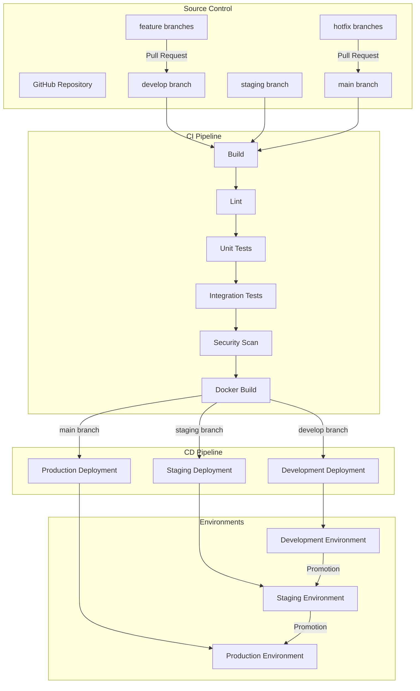
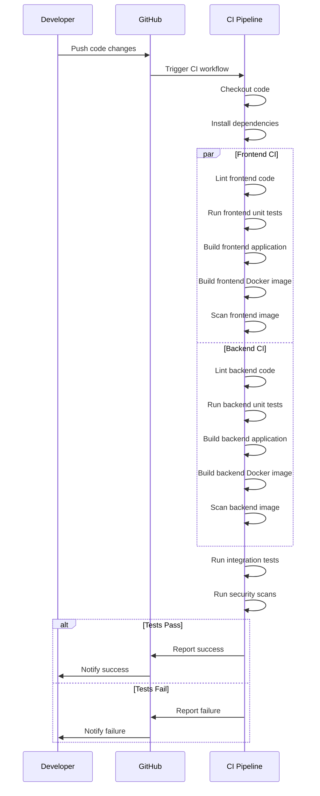
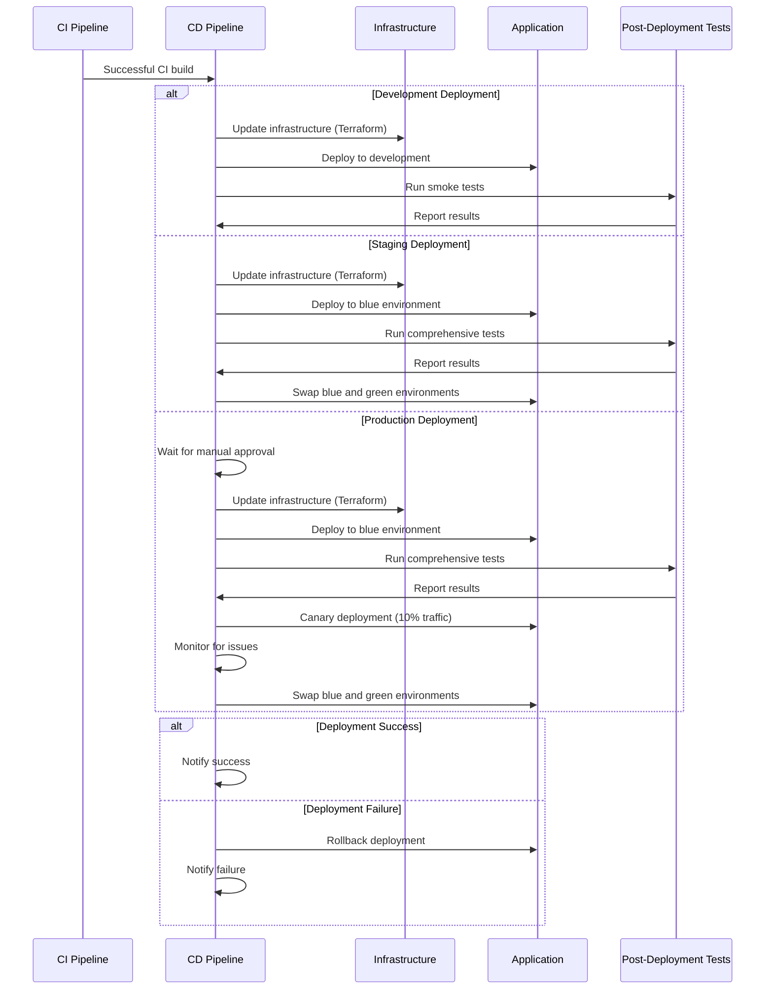
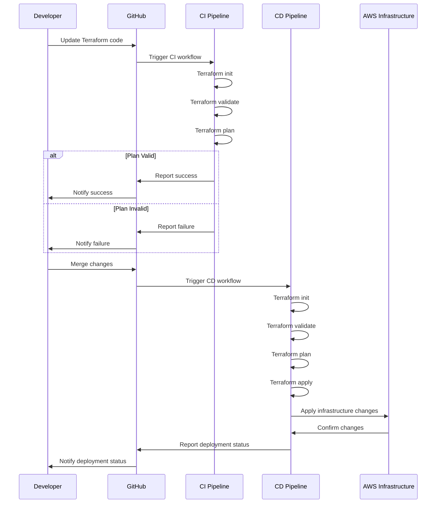

# CI/CD Overview

The IndiVillage.com website uses a comprehensive Continuous Integration and Continuous Deployment (CI/CD) pipeline to automate the building, testing, and deployment of the application. This document provides detailed information about the CI/CD pipeline, including the build process, testing strategy, deployment workflows, and environment promotion.

The CI/CD pipeline is implemented using GitHub Actions and follows industry best practices for automation, testing, and deployment. It supports the full software development lifecycle from code commit to production deployment, with appropriate controls and validations at each stage.

## CI/CD Architecture


The CI/CD pipeline is triggered by code changes in the repository and automates the process of building, testing, and deploying the application to the appropriate environment. The pipeline is designed to catch issues early in the development process and ensure that only high-quality code reaches production.

## Branching Strategy
The IndiVillage.com repository uses a modified GitFlow branching strategy:

**Main Branches**:
- `main`: Production-ready code, deployed to the production environment
- `staging`: Pre-production code, deployed to the staging environment
- `develop`: Development code, deployed to the development environment

**Supporting Branches**:
- `feature/*`: Feature branches for new development
- `bugfix/*`: Bug fix branches for non-critical fixes
- `hotfix/*`: Hotfix branches for critical production issues

**Branch Protection Rules**:
- All branches require pull requests for changes
- `main` and `staging` branches require approvals
- CI checks must pass before merging
- Linear history enforced (no merge commits)

**Workflow**:
1. Developers create feature branches from `develop`
2. Pull requests are created to merge back to `develop`
3. Changes are promoted from `develop` to `staging` for testing
4. Changes are promoted from `staging` to `main` for production
5. Hotfixes are created from `main` and merged back to `main`, then backported to `staging` and `develop`

This branching strategy supports the environment promotion workflow and ensures that changes flow through the appropriate testing and validation steps before reaching production.

## Pipeline Triggers
The CI/CD pipeline is triggered by various events in the GitHub repository:

**Continuous Integration Triggers**:
- Pull requests to `develop`, `staging`, or `main` branches
- Direct pushes to `develop`, `staging`, or `main` branches

**Continuous Deployment Triggers**:
- Successful CI builds on the `develop` branch (automatic)
- Successful CI builds on the `staging` branch (automatic)
- Successful CI builds on the `main` branch (manual approval required)
- Manual workflow dispatch for specific deployments

**Exclusions**:
- Documentation changes (files in `docs/` directory or `.md` files)
- Changes to `.github/` directory that don't affect workflows

These triggers ensure that the CI/CD pipeline runs automatically when code changes are made, while providing appropriate controls for production deployments.

# Continuous Integration

The Continuous Integration (CI) pipeline automatically builds and tests code changes to ensure quality and prevent issues from reaching deployment environments.

## CI Workflow


The CI workflow runs automatically when code changes are pushed to the repository or pull requests are created. It performs a series of checks and tests to ensure code quality and prevent issues from reaching deployment environments.

## Build Process
The build process compiles the application code and creates Docker images for deployment:

**Frontend Build**:
1. Install Node.js dependencies
2. Run ESLint for code quality
3. Run TypeScript type checking
4. Run unit tests with Jest
5. Build the Next.js application
6. Build Docker image with the compiled application

**Backend Build**:
1. Install Python dependencies
2. Run flake8, black, isort, and mypy for code quality
3. Run unit tests with pytest
4. Verify application startup
5. Build Docker image with the application

**Docker Images**:
- Frontend image: Based on Node.js for build, Nginx for serving
- Backend image: Based on Python with required dependencies

The build process creates Docker images that are tagged with the environment name and commit SHA for traceability. These images are pushed to Amazon ECR for deployment.

## Testing Strategy
The CI pipeline includes comprehensive testing to ensure code quality and prevent issues:

**Linting and Static Analysis**:
- Frontend: ESLint, TypeScript type checking
- Backend: flake8, black, isort, mypy

**Unit Testing**:
- Frontend: Jest with React Testing Library
- Backend: pytest with coverage reporting

**Integration Testing**:
- API endpoint testing
- Component integration testing
- Database interaction testing

**Security Testing**:
- SAST (Static Application Security Testing) with CodeQL
- Dependency scanning for vulnerabilities
- Docker image scanning with Trivy
- Secret detection

**Coverage Requirements**:
- Unit test coverage: 80% minimum
- Critical paths: 90% minimum

Tests are run in parallel where possible to minimize pipeline execution time. Test results and coverage reports are stored as artifacts for review.

## Quality Gates
The CI pipeline includes several quality gates that must be passed before code can proceed to deployment:

**Code Quality Gates**:
- Linting must pass with no errors
- Type checking must pass with no errors
- Unit tests must pass with required coverage
- Integration tests must pass

**Security Gates**:
- No critical or high vulnerabilities in dependencies
- No critical or high vulnerabilities in Docker images
- No secrets detected in code
- CodeQL analysis must pass

**Performance Gates**:
- Frontend build size within limits
- API response time within thresholds

If any quality gate fails, the CI pipeline will fail and prevent deployment. This ensures that only high-quality code proceeds to deployment environments.

## Artifact Management
The CI pipeline produces several artifacts that are used in the deployment process:

**Docker Images**:
- Frontend image: `indivillage/frontend:<environment>-<commit-sha>`
- Backend image: `indivillage/backend:<environment>-<commit-sha>`

**Build Artifacts**:
- Frontend build output
- Backend build output
- Test reports
- Coverage reports
- Security scan reports

**Storage Locations**:
- Docker images: Amazon ECR
- Build artifacts: GitHub Actions artifacts
- Reports: GitHub Actions artifacts

Artifacts are retained for a limited time (30 days) for debugging and auditing purposes. Docker images are retained according to ECR lifecycle policies.

# Continuous Deployment

The Continuous Deployment (CD) pipeline automatically deploys code changes to the appropriate environment after successful CI builds, with appropriate controls and validations.

## Deployment Environments
The IndiVillage.com website is deployed to three main environments:

**Development Environment**:
- Purpose: Active development and testing
- Deployment: Automatic after successful CI
- URL: https://dev.indivillage.com
- Deployment Frequency: Multiple times per day
- Resource Configuration: t3.medium instances, development-sized databases
- Security Controls: Basic security measures, internal access only

**Staging Environment**:
- Purpose: Pre-production validation
- Deployment: Automatic after successful CI
- URL: https://staging.indivillage.com
- Deployment Frequency: Several times per week
- Resource Configuration: t3.large instances, production-like databases
- Security Controls: Enhanced security, restricted access

**Production Environment**:
- Purpose: Live user-facing environment
- Deployment: Manual approval required
- URL: https://indivillage.com
- Deployment Frequency: Weekly or bi-weekly
- Resource Configuration: m5.large instances, fully redundant databases
- Security Controls: Comprehensive security measures, strict access controls

Each environment is configured with appropriate resources, security controls, and monitoring measures to match its purpose and usage patterns.

## Deployment Workflow


The deployment workflow varies by environment, with increasing levels of validation and control as changes move toward production. This ensures that only high-quality, validated changes reach production.

## Development Deployment
Deployment to the development environment is fully automated and occurs after successful CI builds on the `develop` branch.

**Deployment Process**:
1. Build and tag Docker images
2. Push images to Amazon ECR
3. Update infrastructure using Terraform
4. Deploy new version to ECS
5. Run smoke tests
6. Notify team of deployment status

**Deployment Strategy**: Rolling update

**Rollback Strategy**: Manual rollback if issues are detected

**Post-Deployment Validation**:
- Automated smoke tests
- Basic health checks

The development deployment process is optimized for speed and developer feedback, with minimal manual intervention required.

## Staging Deployment
Deployment to the staging environment is automated but includes more comprehensive testing and validation. It uses a blue-green deployment strategy to minimize downtime and enable easy rollback.

**Deployment Process**:
1. Determine deployment version (latest successful development build or specified version)
2. Tag Docker images for staging
3. Update infrastructure using Terraform
4. Deploy new version to blue environment
5. Run comprehensive tests against blue environment
6. If tests pass, swap blue and green environments
7. Update green environment to match blue
8. Notify team of deployment status

**Deployment Strategy**: Blue-green deployment

**Rollback Strategy**: Automatic rollback if tests fail, manual rollback option available

**Post-Deployment Validation**:
- Automated smoke tests
- Integration tests
- Performance tests
- Security scans

The staging deployment process includes more comprehensive testing and validation to catch issues before production deployment.

## Production Deployment
Deployment to the production environment requires manual approval and includes the most comprehensive testing and validation. It uses a blue-green deployment strategy with canary testing to minimize risk and enable easy rollback.

**Deployment Process**:
1. Verify staging version exists and has passed all tests
2. Request approval for production deployment
3. Wait for manual approval
4. Tag Docker images for production (including secondary region)
5. Update infrastructure using Terraform
6. Deploy new version to blue environment
7. Run comprehensive tests against blue environment
8. If tests pass, implement canary deployment (10% traffic to blue)
9. Monitor for issues during canary period
10. If no issues, swap blue and green environments
11. Update green environment to match blue
12. Update secondary region
13. Notify team of deployment status

**Deployment Strategy**: Blue-green deployment with canary testing

**Rollback Strategy**: Immediate automatic rollback by shifting traffic back to green environment

**Post-Deployment Validation**:
- Automated smoke tests
- Performance tests
- Canary monitoring
- Error rate monitoring

The production deployment process includes the most comprehensive testing and validation to minimize the risk of issues affecting end users.

## Rollback Procedures
The CI/CD pipeline includes automated and manual rollback procedures to quickly recover from deployment issues:

**Automated Rollback Triggers**:
- Failed smoke tests
- Failed integration tests
- Failed performance tests
- Error rate exceeding threshold during canary period

**Rollback Process by Environment**:

**Development**:
- Manual rollback by redeploying previous version

**Staging**:
- Automatic rollback if tests fail
- Return traffic to green environment
- Stop blue environment services

**Production**:
- Automatic rollback if tests or canary monitoring fail
- Return traffic to green environment
- Stop blue environment services

**Rollback Verification**:
- Health checks after rollback
- Notification of rollback status

Rollback procedures are tested regularly to ensure they work when needed.

## Deployment Notifications
The CI/CD pipeline sends notifications at various stages of the deployment process:

**Notification Channels**:
- Slack channels for team communication
- Email for critical notifications
- GitHub status checks for visibility in pull requests

**Notification Events**:
- Deployment started
- Deployment completed successfully
- Deployment failed
- Rollback initiated
- Rollback completed

**Notification Content**:
- Environment name
- Version being deployed
- Deployment status
- Link to deployment logs
- Link to deployed application

Notifications ensure that the team is aware of deployment activities and can respond quickly to any issues.

# Infrastructure as Code

The IndiVillage.com infrastructure is managed using Infrastructure as Code (IaC) principles, with Terraform as the primary tool.

## Terraform Implementation
Terraform is used to define and manage the AWS infrastructure for all environments:

**Repository Structure**:
```
infrastructure/terraform/
├── main.tf                  # Main Terraform configuration
├── variables.tf             # Common variable definitions
├── outputs.tf              # Output definitions
├── providers.tf            # Provider configurations
├── versions.tf             # Terraform version constraints
├── modules/                # Reusable Terraform modules
│   ├── networking/         # VPC, subnets, security groups
│   ├── compute/            # ECS, EC2, Auto Scaling
│   ├── database/           # RDS, ElastiCache
│   ├── storage/            # S3, EFS
│   ├── cdn/                # CloudFront
│   ├── monitoring/         # CloudWatch, Grafana
│   └── security/           # IAM, WAF, GuardDuty
└── environments/           # Environment-specific configurations
    ├── development/        # Development environment
    ├── staging/            # Staging environment
    └── production/         # Production environment
```

**Key Components**:
- VPC and networking
- ECS clusters and services
- RDS databases
- ElastiCache clusters
- S3 buckets
- CloudFront distributions
- IAM roles and policies
- Security groups and NACLs
- CloudWatch alarms and dashboards

Terraform code is version-controlled and follows the same branching strategy as application code.

## Terraform Workflow


The Terraform workflow includes validation and planning in the CI pipeline, with actual infrastructure changes applied in the CD pipeline. This ensures that infrastructure changes are validated before being applied.

## Environment-Specific Configuration
Each environment has its own Terraform configuration with environment-specific values:

**Common Configuration**:
- Module references
- Resource naming conventions
- Tags and labels

**Environment-Specific Values**:
- Instance types and sizes
- Scaling parameters
- Backup retention periods
- Monitoring thresholds
- Security configurations

**Variable Management**:
- Common variables defined in `variables.tf`
- Environment-specific values in `terraform.tfvars`
- Sensitive values from AWS Secrets Manager or Parameter Store

This approach ensures consistent infrastructure across environments while allowing for environment-specific customization.

## Infrastructure Deployment
Infrastructure deployment is integrated into the CD pipeline:

**Deployment Process**:
1. Initialize Terraform
2. Validate Terraform configuration
3. Generate Terraform plan
4. Apply Terraform changes
5. Verify infrastructure changes

**Deployment Triggers**:
- Application deployment
- Infrastructure code changes
- Manual trigger for specific changes

**Deployment Controls**:
- Plan review for significant changes
- Approval required for production changes
- Automatic rollback for failed deployments

Infrastructure deployment follows the same promotion workflow as application deployment, ensuring consistency across environments.

# Monitoring and Observability

The CI/CD pipeline includes monitoring and observability to track deployment status, detect issues, and provide visibility into the deployment process.

## Deployment Monitoring
Deployments are monitored to ensure successful completion and detect issues:

**Deployment Metrics**:
- Deployment duration
- Deployment success rate
- Rollback frequency
- Error rate during deployment

**Monitoring Tools**:
- CloudWatch for AWS resource monitoring
- Custom metrics for application monitoring
- GitHub Actions for pipeline monitoring

**Alerting**:
- Slack notifications for deployment events
- Email alerts for critical issues
- PagerDuty for production deployment issues

Deployment monitoring ensures that issues are detected and addressed quickly.

## Pipeline Metrics
The CI/CD pipeline collects metrics to track performance and identify improvement opportunities:

**CI Metrics**:
- Build duration
- Test execution time
- Code coverage
- Linting issues
- Security findings

**CD Metrics**:
- Deployment frequency
- Lead time for changes
- Change failure rate
- Mean time to recovery

**Reporting**:
- Dashboard for pipeline metrics
- Trend analysis
- Team performance indicators

Pipeline metrics help identify bottlenecks and improvement opportunities in the development and deployment process.

## Logging and Tracing
The CI/CD pipeline includes comprehensive logging and tracing:

**Log Types**:
- Pipeline execution logs
- Build logs
- Test logs
- Deployment logs
- Infrastructure change logs

**Log Storage**:
- GitHub Actions logs
- CloudWatch Logs
- S3 for long-term storage

**Log Retention**:
- Pipeline logs: 90 days
- Build logs: 30 days
- Deployment logs: 90 days

**Tracing**:
- Correlation IDs for tracking changes through the pipeline
- Distributed tracing for application monitoring

Logging and tracing provide visibility into the CI/CD pipeline and help troubleshoot issues.

## Deployment History
Deployment history is maintained for auditing and troubleshooting:

**Deployment Records**:
- Version deployed
- Deployment timestamp
- Deploying user
- Deployment status
- Environment

**Storage**:
- DynamoDB table for deployment records
- S3 for deployment artifacts

**Retention**:
- Deployment records: Indefinite
- Deployment artifacts: 90 days

**Reporting**:
- Deployment history dashboard
- Deployment frequency reports
- Change volume reports

Deployment history provides a record of changes for auditing and troubleshooting purposes.

# Security and Compliance

The CI/CD pipeline includes security and compliance measures to ensure that deployments meet security requirements and comply with organizational policies.

## Pipeline Security
The CI/CD pipeline includes security measures to protect the deployment process:

**Access Controls**:
- GitHub repository access controls
- Branch protection rules
- Required approvals for sensitive changes
- Separation of duties

**Secrets Management**:
- GitHub Secrets for sensitive values
- AWS Secrets Manager for infrastructure secrets
- No secrets in code or logs

**Infrastructure Security**:
- Least privilege IAM roles
- Temporary credentials for deployments
- Network security controls

Pipeline security ensures that the deployment process itself is secure and protected from unauthorized access or tampering.

## Security Testing
The CI/CD pipeline includes security testing to identify and address security issues:

**Static Application Security Testing (SAST)**:
- CodeQL for code analysis
- Custom security rules
- Dependency scanning

**Dynamic Application Security Testing (DAST)**:
- OWASP ZAP for web application scanning
- API security testing

**Container Security**:
- Trivy for container image scanning
- Base image security
- Runtime security controls

**Infrastructure Security**:
- Terraform security scanning
- AWS Config rules
- Compliance checking

Security testing is integrated into the CI/CD pipeline to catch security issues early in the development process.

## Compliance Controls
The CI/CD pipeline includes compliance controls to ensure that deployments meet organizational policies and regulatory requirements:

**Policy Enforcement**:
- Required approvals for production deployments
- Separation of duties
- Audit logging

**Compliance Checking**:
- Automated compliance checks
- Policy as code
- Compliance reporting

**Audit Trail**:
- Comprehensive logging
- Deployment history
- Change tracking

Compliance controls ensure that deployments meet organizational policies and regulatory requirements.

## Vulnerability Management
The CI/CD pipeline includes vulnerability management to identify and address security vulnerabilities:

**Vulnerability Scanning**:
- Dependency scanning
- Container image scanning
- Infrastructure scanning

**Vulnerability Handling**:
- Automated blocking of critical vulnerabilities
- Notification of security team
- Remediation tracking

**Patch Management**:
- Regular dependency updates
- Security patch deployment
- Automated testing of patches

Vulnerability management ensures that security vulnerabilities are identified and addressed in a timely manner.

# CI/CD Pipeline Maintenance

The CI/CD pipeline requires regular maintenance to ensure it continues to function effectively and efficiently.

## Pipeline Updates
The CI/CD pipeline is updated regularly to incorporate new features, fix issues, and improve performance:

**Update Types**:
- Tool and dependency updates
- Workflow improvements
- Security enhancements
- Performance optimizations

**Update Process**:
1. Create branch for pipeline changes
2. Test changes in isolation
3. Create pull request for review
4. Merge changes after approval
5. Monitor for issues after deployment

**Testing**:
- Test pipeline changes in a separate workflow
- Verify that all stages work correctly
- Ensure backward compatibility

Pipeline updates follow the same development process as application changes to ensure quality and prevent issues.

## Performance Optimization
The CI/CD pipeline is optimized for performance to minimize build and deployment times:

**Optimization Techniques**:
- Parallelization of tasks
- Caching of dependencies
- Efficient Docker builds
- Optimized test execution

**Monitoring**:
- Pipeline execution time
- Stage duration
- Resource utilization

**Improvement Process**:
1. Identify bottlenecks through monitoring
2. Implement optimizations
3. Measure impact
4. Iterate as needed

Performance optimization ensures that the CI/CD pipeline provides fast feedback and efficient deployments.

## Troubleshooting
The CI/CD pipeline includes troubleshooting procedures to address issues:

**Common Issues**:
- Build failures
- Test failures
- Deployment failures
- Infrastructure issues

**Troubleshooting Steps**:
1. Check pipeline logs for errors
2. Verify environment configuration
3. Check for infrastructure issues
4. Review recent changes
5. Consult documentation

**Escalation Process**:
1. Developer attempts to resolve
2. Team lead or DevOps engineer assists
3. Incident created for critical issues
4. Post-incident review for recurring issues

Troubleshooting procedures ensure that issues are addressed quickly and effectively.

## Documentation
The CI/CD pipeline is documented to ensure that the team understands how it works and how to use it effectively:

**Documentation Types**:
- Pipeline architecture
- Workflow descriptions
- Configuration reference
- Troubleshooting guide

**Documentation Location**:
- GitHub repository in `/docs` directory
- Internal wiki for detailed procedures
- README files for quick reference

**Documentation Updates**:
- Updated with pipeline changes
- Reviewed regularly for accuracy
- Feedback incorporated from team

Comprehensive documentation ensures that the team can use the CI/CD pipeline effectively and troubleshoot issues when they arise.

# Best Practices and Guidelines

The IndiVillage.com CI/CD pipeline follows industry best practices and guidelines to ensure quality, security, and efficiency.

## Development Guidelines
Guidelines for developers to ensure smooth CI/CD pipeline operation:

**Code Quality**:
- Follow coding standards and style guides
- Write comprehensive tests
- Address linting issues before committing
- Keep dependencies up to date

**Commit Practices**:
- Make small, focused commits
- Write clear commit messages
- Reference issue numbers in commits
- Rebase before merging

**Pull Request Practices**:
- Create focused pull requests
- Provide clear descriptions
- Address review comments promptly
- Ensure CI passes before requesting review

**Testing Practices**:
- Write tests for new features and bug fixes
- Run tests locally before pushing
- Address test failures promptly
- Maintain test coverage

Following these guidelines ensures that code changes flow smoothly through the CI/CD pipeline and minimizes issues during deployment.

## Deployment Guidelines
Guidelines for planning and executing deployments:

**Deployment Planning**:
- Schedule deployments during low-traffic periods
- Communicate deployment plans to stakeholders
- Prepare rollback plan
- Verify prerequisites

**Deployment Execution**:
- Monitor deployment progress
- Verify deployment success
- Test critical functionality after deployment
- Be prepared to rollback if issues occur

**Post-Deployment**:
- Monitor for issues after deployment
- Verify metrics and logs
- Update documentation if needed
- Conduct post-deployment review for significant changes

**Emergency Deployments**:
- Follow expedited approval process
- Increase monitoring during and after deployment
- Document emergency deployment details
- Conduct post-incident review

Following these guidelines ensures that deployments are executed safely and successfully.

## Pipeline Best Practices
Best practices for CI/CD pipeline design and operation:

**Pipeline Design**:
- Keep pipelines fast and efficient
- Fail fast to provide quick feedback
- Make pipelines idempotent and reproducible
- Design for observability

**Security Practices**:
- Scan code and dependencies for vulnerabilities
- Use least privilege for pipeline execution
- Protect secrets and credentials
- Implement separation of duties

**Reliability Practices**:
- Design for resilience to transient failures
- Implement appropriate retry mechanisms
- Provide clear error messages
- Maintain comprehensive logs

**Maintenance Practices**:
- Regularly update tools and dependencies
- Monitor pipeline performance
- Address technical debt
- Document pipeline changes

Following these best practices ensures that the CI/CD pipeline remains effective, secure, and reliable.

## Continuous Improvement
The CI/CD pipeline is continuously improved to enhance efficiency, reliability, and security:

**Improvement Process**:
1. Collect metrics and feedback
2. Identify improvement opportunities
3. Prioritize improvements
4. Implement and test changes
5. Measure impact

**Focus Areas**:
- Pipeline speed and efficiency
- Test reliability and coverage
- Deployment reliability
- Security and compliance

**Feedback Channels**:
- Team retrospectives
- Pipeline metrics
- Developer feedback
- Incident reviews

Continuous improvement ensures that the CI/CD pipeline evolves to meet changing needs and incorporate new best practices.

# References
- [Architecture Documentation](../architecture.md)
- [GitHub Actions Documentation](https://docs.github.com/en/actions)
- [Terraform Documentation](https://www.terraform.io/docs/)
- [Docker Documentation](https://docs.docker.com/)
- [AWS Documentation](https://docs.aws.amazon.com/)