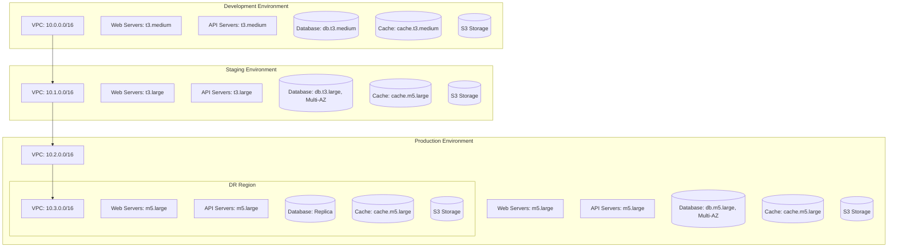
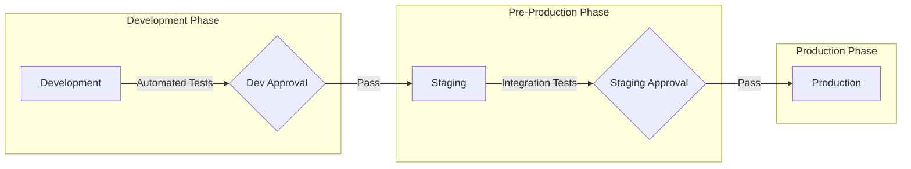
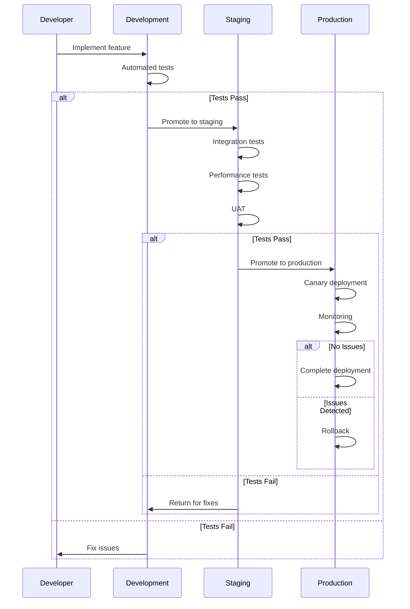
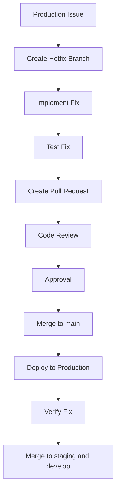
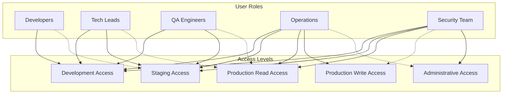

The IndiVillage.com website uses a multi-environment deployment strategy to support the full software development lifecycle. This document provides detailed information about each environment, their configurations, and the processes for managing and promoting changes between environments.

The deployment strategy follows a progressive approach, with changes flowing from development to staging to production, with appropriate testing and validation at each stage.

## Deployment Environments Overview

The IndiVillage.com website uses a multi-environment deployment strategy to support the full software development lifecycle. This document provides detailed information about each environment, their configurations, and the processes for managing and promoting changes between environments.

The deployment strategy follows a progressive approach, with changes flowing from development to staging to production, with appropriate testing and validation at each stage.

### Environment Architecture


Each environment is deployed in AWS with its own isolated infrastructure, including VPC, compute resources, database, caching, and storage. The environments are designed to provide increasing levels of reliability, performance, and security as changes move toward production.

### Environment Promotion Flow


Changes flow through the environments in a controlled manner, with appropriate testing and approval gates at each stage. This ensures that only validated changes reach production, minimizing the risk of issues affecting end users.

### Environment Comparison
| Aspect | Development | Staging | Production |
|--------|------------|---------|------------|
| Purpose | Active development and testing | Pre-production validation | Live user-facing environment |
| Update Frequency | Multiple times per day | Several times per week | Weekly or bi-weekly |
| Deployment Strategy | Rolling updates | Blue-green deployment | Blue-green with canary |
| Approval Required | No | Yes | Yes (with additional verification) |
| Infrastructure Scale | Minimal | Medium | Full |
| High Availability | Limited | Partial | Full |
| Data Protection | Basic | Enhanced | Comprehensive |
| Monitoring | Basic | Enhanced | Comprehensive |
| Access Control | Development team | Limited team members | Operations team only |

Each environment is configured according to its purpose in the development lifecycle, with appropriate resources, controls, and processes.

## Development Environment

The development environment is designed for active development and testing of new features and changes. It provides a flexible and cost-effective environment for developers to work in.

### Purpose and Goals
**Primary Purpose**: Support active development and testing of new features

**Key Goals**:
- Provide a stable environment for development work
- Enable rapid iteration and testing
- Support automated testing of changes
- Minimize costs while maintaining functionality
- Provide isolation from production data and systems

The development environment is optimized for developer productivity rather than performance or scalability.

### Infrastructure Configuration
The development environment is deployed in the AWS US East (N. Virginia) region with the following configuration:

**Networking**:
- VPC: 10.0.0.0/16
- Public subnets: 10.0.0.0/24, 10.0.1.0/24
- Private subnets: 10.0.2.0/24, 10.0.3.0/24
- Single NAT Gateway for cost optimization

**Compute Resources**:
- Web Servers: t3.medium instances in Auto Scaling Group (min: 1, max: 3)
- API Servers: t3.medium instances in Auto Scaling Group (min: 1, max: 3)
- Container Orchestration: AWS ECS with Fargate

**Database**:
- Engine: PostgreSQL 13.7
- Instance Type: db.t3.medium
- Multi-AZ: No (for cost optimization)
- Backup Retention: 7 days

**Caching**:
- Redis: cache.t3.medium
- Single node (non-clustered)

**Storage**:
- S3 Buckets for file storage and static assets
- Lifecycle policies: 30-day retention for uploaded files

**CDN**:
- CloudFront distribution for static assets
- Basic caching configuration

The development environment uses smaller instance types and simplified configurations to minimize costs while still providing the necessary functionality for development and testing.

### Deployment Process
Deployments to the development environment are fully automated and triggered by merges to the `develop` branch.

**Deployment Workflow**:
1. Code is merged to the `develop` branch
2. CI/CD pipeline is automatically triggered
3. Application is built and tested
4. Docker images are built and pushed to ECR
5. Infrastructure is updated using Terraform
6. New version is deployed to ECS
7. Basic smoke tests verify functionality
8. Team is notified of deployment status

**Deployment Strategy**: Rolling update deployment

**Deployment Frequency**: Multiple times per day

**Rollback Process**: Manual rollback if issues are detected

For more details on the deployment process, see the [CI/CD documentation](ci-cd.md).

### Access and Security
The development environment has appropriate security controls while allowing necessary access for development work.

**Access Controls**:
- Environment accessible to development team members
- AWS access restricted by IAM roles and policies
- SSH access limited to bastion host with key authentication
- Application access may use simplified authentication

**Security Configuration**:
- Basic WAF rules to protect against common attacks
- Security groups restrict traffic between components
- Encryption in transit via TLS
- Encryption at rest for sensitive data
- No production data used in development

**Monitoring and Logging**:
- Basic CloudWatch monitoring
- Application logs stored in CloudWatch Logs
- Error alerting via Slack
- Performance metrics collected but with limited alerting

### Environment Variables and Configuration
The development environment uses environment-specific configuration values:

**Key Environment Variables**:
- `NODE_ENV=development`
- `FLASK_ENV=development`
- `LOG_LEVEL=debug`
- `API_URL=https://api.dev.indivillage.com`
- `WEBSITE_URL=https://dev.indivillage.com`

**Feature Flags**:
- Development-only features may be enabled
- Experimental features enabled for testing

**External Services**:
- Sandbox/test environments used for external services
- Mock services used where appropriate

Configuration is managed through AWS Systems Manager Parameter Store and environment variables injected into containers.

### Limitations and Constraints
The development environment has certain limitations to be aware of:

- Limited scalability due to smaller instance sizes
- No guaranteed uptime or SLA
- May be restarted or rebuilt as needed
- Performance not representative of production
- Limited resilience to failures
- Data may be reset periodically

These limitations are acceptable for a development environment and help control costs while providing the necessary functionality for development work.

## Staging Environment

The staging environment serves as a pre-production validation environment, closely mirroring the production configuration to ensure thorough testing before production deployment.

### Purpose and Goals
**Primary Purpose**: Validate changes in a production-like environment before production deployment

**Key Goals**:
- Provide an environment that closely resembles production
- Enable thorough testing of changes before production deployment
- Validate deployment processes and configurations
- Support user acceptance testing (UAT)
- Identify performance issues before production deployment

The staging environment is designed to be as similar to production as possible while still allowing for testing and validation.

### Infrastructure Configuration
The staging environment is deployed in the AWS US East (N. Virginia) region with the following configuration:

**Networking**:
- VPC: 10.1.0.0/16
- Public subnets: 10.1.0.0/24, 10.1.1.0/24
- Private subnets: 10.1.2.0/24, 10.1.3.0/24
- NAT Gateway in each availability zone

**Compute Resources**:
- Web Servers: t3.large instances in Auto Scaling Group (min: 2, max: 6)
- API Servers: t3.large instances in Auto Scaling Group (min: 2, max: 6)
- Container Orchestration: AWS ECS with Fargate

**Database**:
- Engine: PostgreSQL 13.7
- Instance Type: db.t3.large
- Multi-AZ: Yes
- Backup Retention: 7 days

**Caching**:
- Redis: cache.m5.large
- Cluster mode enabled

**Storage**:
- S3 Buckets for file storage and static assets
- Lifecycle policies: 30-day retention for uploaded files

**CDN**:
- CloudFront distribution for static assets
- Production-like caching configuration

The staging environment uses larger instance types than development and includes high availability features like Multi-AZ database and multiple NAT Gateways to more closely resemble the production environment.

### Deployment Process
Deployments to the staging environment require manual approval and follow a blue-green deployment strategy.

**Deployment Workflow**:
1. Code is merged to the `staging` branch or manually promoted from development
2. CI/CD pipeline is triggered
3. Application is built and tested
4. Docker images are built and pushed to ECR
5. Infrastructure is updated using Terraform
6. New version is deployed to the blue environment
7. Comprehensive tests verify functionality
8. Traffic is gradually shifted from green to blue
9. Team is notified of deployment status

**Deployment Strategy**: Blue-green deployment

**Deployment Frequency**: Several times per week

**Rollback Process**: Automatic rollback if tests fail, manual rollback option available

For more details on the deployment process, see the [CI/CD documentation](ci-cd.md).

### Access and Security
The staging environment has stricter security controls than development while still allowing necessary access for testing.

**Access Controls**:
- Environment accessible to limited team members
- AWS access restricted by IAM roles and policies
- SSH access limited to bastion host with key authentication
- Application access uses production-like authentication

**Security Configuration**:
- WAF rules to protect against attacks
- Security groups restrict traffic between components
- Encryption in transit via TLS
- Encryption at rest for all data
- Anonymized production-like data used for testing

**Monitoring and Logging**:
- Enhanced CloudWatch monitoring
- Application logs stored in CloudWatch Logs
- Error alerting via Slack
- Performance metrics collected with alerting
- Regular security scanning

### Environment Variables and Configuration
The staging environment uses environment-specific configuration values:

**Key Environment Variables**:
- `NODE_ENV=staging`
- `FLASK_ENV=staging`
- `LOG_LEVEL=info`
- `API_URL=https://api.staging.indivillage.com`
- `WEBSITE_URL=https://staging.indivillage.com`

**Feature Flags**:
- Production features enabled
- Some experimental features may be enabled for testing

**External Services**:
- Sandbox/test environments used for external services
- Production-like configuration

Configuration is managed through AWS Systems Manager Parameter Store and environment variables injected into containers.

### Testing and Validation
The staging environment supports comprehensive testing before production deployment:

**Automated Tests**:
- Smoke tests verify basic functionality
- Integration tests verify system interactions
- End-to-end tests verify user journeys
- Performance tests verify system performance

**Manual Testing**:
- User acceptance testing (UAT)
- Exploratory testing
- Regression testing

**Performance Validation**:
- Load testing with k6
- Stress testing for peak loads
- Endurance testing for stability

Test results are recorded and reviewed before approving production deployment.

## Production Environment

The production environment is the live, user-facing environment that serves the IndiVillage.com website to end users. It is designed for maximum reliability, performance, and security.

### Purpose and Goals
**Primary Purpose**: Serve the live IndiVillage.com website to end users

**Key Goals**:
- Provide a highly reliable and available service
- Deliver optimal performance for all users
- Ensure maximum security for user data
- Support the expected user load with room for growth
- Enable monitoring and quick response to issues

The production environment is optimized for reliability, performance, and security rather than development flexibility.

### Infrastructure Configuration
The production environment is deployed across multiple AWS regions for high availability and disaster recovery:

**Primary Region: US East (N. Virginia)**

**Networking**:
- VPC: 10.2.0.0/16
- Public subnets: 10.2.0.0/24, 10.2.1.0/24, 10.2.2.0/24
- Private subnets: 10.2.3.0/24, 10.2.4.0/24, 10.2.5.0/24
- NAT Gateway in each availability zone

**Compute Resources**:
- Web Servers: m5.large instances in Auto Scaling Group (min: 3, max: 10)
- API Servers: m5.large instances in Auto Scaling Group (min: 3, max: 10)
- Container Orchestration: AWS ECS with Fargate

**Database**:
- Engine: PostgreSQL 13.7
- Instance Type: db.m5.large
- Multi-AZ: Yes
- Backup Retention: 30 days
- Point-in-time recovery enabled

**Caching**:
- Redis: cache.m5.large
- Cluster mode enabled with multiple nodes

**Storage**:
- S3 Buckets for file storage and static assets
- Cross-region replication enabled
- Lifecycle policies: 90-day retention for uploaded files

**CDN**:
- CloudFront distribution with global edge locations
- Optimized caching configuration
- Custom error responses

**Secondary Region: US West (Oregon)**

- Replica VPC: 10.3.0.0/16
- Read replica database
- Standby compute resources
- Replicated S3 buckets
- Failover configuration

The production environment uses larger, more powerful instance types and includes comprehensive high availability features like Multi-AZ deployments, cross-region replication, and redundant components.

### Deployment Process
Deployments to the production environment require explicit manual approval and follow a strict blue-green deployment strategy with canary testing.

**Deployment Workflow**:
1. Code is merged to the `main` branch or manually promoted from staging
2. CI/CD pipeline is triggered
3. Explicit approval is required from authorized team members
4. Infrastructure is updated using Terraform
5. New version is deployed to the blue environment
6. Comprehensive tests verify functionality
7. Canary testing routes a small percentage of traffic to blue
8. Monitoring verifies performance and error rates
9. Traffic is gradually shifted from green to blue
10. Team is notified of deployment status

**Deployment Strategy**: Blue-green deployment with canary testing

**Deployment Frequency**: Weekly or bi-weekly (scheduled releases)

**Rollback Process**: Immediate automatic rollback by shifting traffic back to green environment

For more details on the deployment process, see the [CI/CD documentation](ci-cd.md).

### High Availability and Disaster Recovery
The production environment is designed for high availability and includes comprehensive disaster recovery capabilities:

**High Availability Features**:
- Multi-AZ deployment across three availability zones
- Auto Scaling to handle variable load
- Load balancing across multiple instances
- Multi-AZ database with automatic failover
- Redis cluster with automatic failover

**Disaster Recovery Capabilities**:
- Cross-region replication to secondary region
- Database read replica in secondary region
- S3 cross-region replication
- CloudFront multi-region distribution
- Route 53 health checks and failover routing

**Recovery Time Objectives (RTO)**:
- Availability Zone failure: < 5 minutes
- Region failure: < 30 minutes
- Database failure: < 5 minutes
- Application failure: < 5 minutes

**Recovery Point Objectives (RPO)**:
- Database: < 5 minutes
- User uploads: < 1 hour
- Form submissions: Zero loss (direct to CRM)

Regular disaster recovery testing will be conducted to verify procedures and train team members. Documentation will be maintained with clear, step-by-step recovery instructions for different failure scenarios.

### Security Configuration
The production environment has the strictest security controls to protect user data and system integrity:

**Access Controls**:
- Environment accessible only to operations team
- AWS access restricted by IAM roles and policies with MFA
- SSH access limited to bastion host with key authentication and MFA
- Application access requires strong authentication

**Security Features**:
- WAF with comprehensive rule set
- DDoS protection with AWS Shield
- Security groups with minimal required access
- Network ACLs for additional protection
- Encryption in transit via TLS 1.2+
- Encryption at rest for all data
- Secrets management with AWS Secrets Manager

**Compliance Measures**:
- Regular security scanning and penetration testing
- Automated compliance checking
- Security patch management
- Vulnerability management process

**Security Monitoring**:
- AWS GuardDuty for threat detection
- AWS Config for configuration compliance
- AWS CloudTrail for API activity monitoring
- AWS Security Hub for security posture management

### Monitoring and Alerting
The production environment includes comprehensive monitoring and alerting to ensure issues are detected and addressed quickly:

**Monitoring Systems**:
- CloudWatch for AWS resource monitoring
- Custom metrics for application monitoring
- Synthetic monitoring for user experience
- Log analysis for error detection

**Key Metrics**:
- Application response times
- Error rates
- Resource utilization
- User experience metrics
- Business metrics

**Alerting Channels**:
- PagerDuty for critical alerts
- Slack for operational alerts
- Email for non-urgent notifications

**Alerting Thresholds**:
- Critical: Immediate response required (< 15 minutes)
- High: Prompt response required (< 1 hour)
- Medium: Response during business hours
- Low: Informational, no immediate action required

**Dashboards**:
- Operational dashboard for system health
- Performance dashboard for system performance
- Business dashboard for business metrics
- Security dashboard for security posture

### Maintenance Procedures
Regular maintenance procedures ensure the production environment remains secure, up-to-date, and performing optimally:

**Scheduled Maintenance**:
- OS patching: Monthly during maintenance window
- Database maintenance: Quarterly during maintenance window
- Dependency updates: Monthly or as needed

**Maintenance Windows**:
- Primary: Sundays 2am-6am ET
- Secondary: Saturdays 2am-6am ET

**Maintenance Notification**:
- Planned maintenance announced 1 week in advance
- Emergency maintenance announced as soon as possible
- Status page updated during maintenance

**Maintenance Procedures**:
- Changes tested in staging before production
- Rollback plan prepared for all changes
- Changes applied using automation where possible
- Verification testing after maintenance

Maintenance activities are carefully planned and executed to minimize impact on users.

## Environment Promotion

Changes flow through the environments in a controlled manner, with appropriate testing and validation at each stage. This ensures that only high-quality, validated changes reach production.

### Promotion Workflow


The promotion workflow ensures that changes are thoroughly tested and validated before reaching production. Each environment adds additional testing and validation to catch issues early in the process.

### Promotion Criteria
Changes must meet specific criteria to be promoted to the next environment:

**Development to Staging**:
- All automated tests pass
- Code review completed and approved
- No critical or high security vulnerabilities
- Documentation updated
- Feature complete according to requirements

**Staging to Production**:
- All integration tests pass
- Performance tests meet thresholds
- User acceptance testing completed
- Security review completed
- Operations team approval
- Release notes prepared

These criteria ensure that only high-quality, validated changes are promoted to the next environment.

### Promotion Process
The promotion process follows these steps:

**Development to Staging**:
1. Create pull request from `develop` to `staging`
2. Automated tests run on the pull request
3. Code review by team members
4. Approval by tech lead or product owner
5. Merge pull request to `staging`
6. CI/CD pipeline deploys to staging environment
7. Integration tests run automatically
8. Manual testing and validation

**Staging to Production**:
1. Create pull request from `staging` to `main`
2. Final review by tech lead and product owner
3. Approval by authorized approvers
4. Merge pull request to `main`
5. CI/CD pipeline prepares production deployment
6. Explicit approval required for production deployment
7. Blue-green deployment with canary testing
8. Monitoring for issues
9. Complete deployment or rollback

The promotion process is designed to be thorough while still allowing for efficient delivery of changes.

### Hotfix Process
Critical issues in production may require an expedited hotfix process:



**Hotfix Process Steps**:
1. Create hotfix branch from `main`
2. Implement and test the fix
3. Create pull request for review
4. Expedited review and approval
5. Merge to `main` and deploy to production
6. Verify the fix in production
7. Backport the fix to `staging` and `develop`

The hotfix process allows critical issues to be fixed quickly while still maintaining code quality and proper tracking.

### Rollback Procedures
If issues are detected after promotion, rollback procedures ensure quick recovery:

**Development Rollback**:
- Revert the problematic commit
- Create new commit with fix
- Deploy updated version

**Staging Rollback**:
- Automated rollback if tests fail
- Manual rollback option available
- Revert to previous stable version

**Production Rollback**:
- Blue-green deployment enables immediate rollback
- Switch traffic back to previous version
- Investigate issue before attempting fix

Rollback procedures are tested regularly to ensure they work when needed.

## Environment Management

The IndiVillage.com environments are managed using Infrastructure as Code (IaC) and automated processes to ensure consistency, reliability, and efficiency.

### Infrastructure as Code
All infrastructure is defined and managed using Terraform:

**Repository Structure**:
```
infrastructure/terraform/
├── main.tf                  # Main Terraform configuration
├── variables.tf             # Common variable definitions
├── outputs.tf              # Output definitions
├── providers.tf            # Provider configurations
├── versions.tf             # Terraform version constraints
├── modules/                # Reusable Terraform modules
│   ├── networking/         # VPC, subnets, security groups
│   ├── compute/            # ECS, EC2, Auto Scaling
│   ├── database/           # RDS, ElastiCache
│   ├── storage/            # S3, EFS
│   ├── cdn/                # CloudFront
│   ├── monitoring/         # CloudWatch, Grafana
│   └── security/           # IAM, WAF, GuardDuty
└── environments/           # Environment-specific configurations
    ├── development/        # Development environment
    ├── staging/            # Staging environment
    └── production/         # Production environment
```

**Key Benefits**:
- Consistent infrastructure across environments
- Version-controlled infrastructure changes
- Automated provisioning and updates
- Documentation of infrastructure in code
- Repeatable and reliable deployments

**Terraform Workflow**:
1. Changes proposed in pull requests
2. Terraform plan reviewed
3. Changes approved and merged
4. Terraform apply executed by CI/CD pipeline
5. Changes verified

Infrastructure changes follow the same promotion workflow as application changes, ensuring consistency and reliability.

### Configuration Management
Environment-specific configuration is managed using several approaches:

**Parameter Store**:
- AWS Systems Manager Parameter Store stores configuration values
- Hierarchical structure by environment
- Encrypted parameters for sensitive values
- Version history maintained

**Secrets Management**:
- AWS Secrets Manager stores sensitive credentials
- Automatic rotation for supported secrets
- Access controlled by IAM policies
- Encryption using KMS

**Environment Variables**:
- Container environment variables for application configuration
- Set during deployment from Parameter Store and Secrets Manager
- Environment-specific values

**Feature Flags**:
- Configuration service for feature flags
- Environment-specific flag values
- Runtime toggling of features

This approach ensures that configuration is managed securely and consistently across environments.

### Environment Provisioning
New environments can be provisioned using the following process:

1. Create new environment directory in Terraform code
2. Configure environment-specific variables
3. Initialize Terraform backend
4. Apply Terraform configuration
5. Configure CI/CD pipeline for the new environment
6. Deploy application to the new environment
7. Verify functionality

This process can be used to create additional environments for specific purposes, such as:
- Feature environments for complex features
- Demo environments for client demonstrations
- Testing environments for specific testing needs

The modular Terraform structure makes it easy to provision new environments with consistent configuration.

### Monitoring and Maintenance
Ongoing monitoring and maintenance ensure environments remain healthy and up-to-date:

**Monitoring**:
- CloudWatch dashboards for each environment
- Alerting appropriate to environment importance
- Regular review of metrics and logs
- Performance trending and analysis

**Maintenance**:
- Regular patching according to schedule
- Dependency updates
- Resource optimization
- Capacity planning

**Compliance**:
- Regular security scanning
- Compliance checking
- Access review
- Audit logging

Maintenance activities are scheduled and tracked to ensure all environments remain healthy and secure.

### Documentation and Knowledge Sharing
Environment documentation is maintained to ensure team knowledge:

**Documentation Types**:
- Environment architecture diagrams
- Configuration reference
- Operational procedures
- Troubleshooting guides

**Documentation Location**:
- GitHub repository in `/docs` directory
- Internal wiki for operational procedures
- Runbooks for common tasks

**Knowledge Sharing**:
- Regular team reviews of environment changes
- Cross-training on environment management
- Documentation updates as part of change process

Comprehensive documentation ensures that the team has the knowledge needed to manage and troubleshoot the environments effectively.

## Environment Access and Security

Access to environments is controlled according to the principle of least privilege, with appropriate security controls for each environment.

### Access Control Model


Access to environments is granted based on role and need, following the principle of least privilege. Higher environments have stricter access controls.

### Authentication Methods
Different authentication methods are used depending on the access type and environment:

**AWS Console and API Access**:
- IAM users with MFA for human access
- IAM roles for service access
- Temporary credentials via AWS SSO

**SSH Access**:
- SSH keys for authentication
- Bastion host for access to private instances
- MFA required for production access

**Application Access**:
- Development: Basic authentication or simplified login
- Staging: Full authentication system
- Production: Full authentication system with MFA for admin access

**Database Access**:
- Development: Direct access with credentials
- Staging: Access via bastion host
- Production: Access via bastion host with approval

Authentication methods are appropriate to the sensitivity of the environment and access type.

### Network Security
Network security controls protect the environments from unauthorized access:

**VPC Configuration**:
- Public subnets for load balancers and bastion hosts
- Private subnets for application and database
- Network ACLs for subnet-level security

**Security Groups**:
- Load balancer security groups
- Application security groups
- Database security groups
- Bastion host security groups

**External Access**:
- HTTPS only for web access
- API Gateway for API access
- VPN for administrative access

**WAF Configuration**:
- OWASP Top 10 protection
- Rate limiting
- Custom rules for application-specific protection

Network security is configured to provide defense in depth while allowing necessary access.

### Data Protection
Data protection measures safeguard sensitive information:

**Data Classification**:
- Public: No restrictions
- Internal: Limited to authorized users
- Confidential: Strict access controls
- Restricted: Highest level of protection

**Encryption**:
- Encryption in transit via TLS
- Encryption at rest for databases
- Encryption at rest for file storage
- Field-level encryption for sensitive data

**Data Handling**:
- Development: Synthetic or anonymized data
- Staging: Anonymized production-like data
- Production: Full production data with strict controls

**Data Retention**:
- Automated data lifecycle management
- Retention periods based on data type
- Secure deletion when no longer needed

Data protection measures are aligned with the sensitivity of the data and compliance requirements.

### Security Monitoring
Security monitoring ensures that security events are detected and addressed:

**Monitoring Tools**:
- AWS GuardDuty for threat detection
- AWS Config for configuration compliance
- AWS CloudTrail for API activity monitoring
- AWS Security Hub for security posture management

**Log Analysis**:
- Centralized logging
- Log retention according to policy
- Automated log analysis
- Alert generation for security events

**Vulnerability Management**:
- Regular vulnerability scanning
- Automated patching where possible
- Vulnerability tracking and remediation

**Incident Response**:
- Defined incident response process
- Escalation procedures
- Communication plan
- Post-incident analysis

Security monitoring is comprehensive and appropriate to the environment's sensitivity.

## References
- [Architecture Documentation](../architecture.md)
- [CI/CD Documentation](ci-cd.md)
- [AWS Documentation](https://docs.aws.amazon.com/)
- [Terraform Documentation](https://www.terraform.io/docs/)
- [Docker Documentation](https://docs.docker.com/)