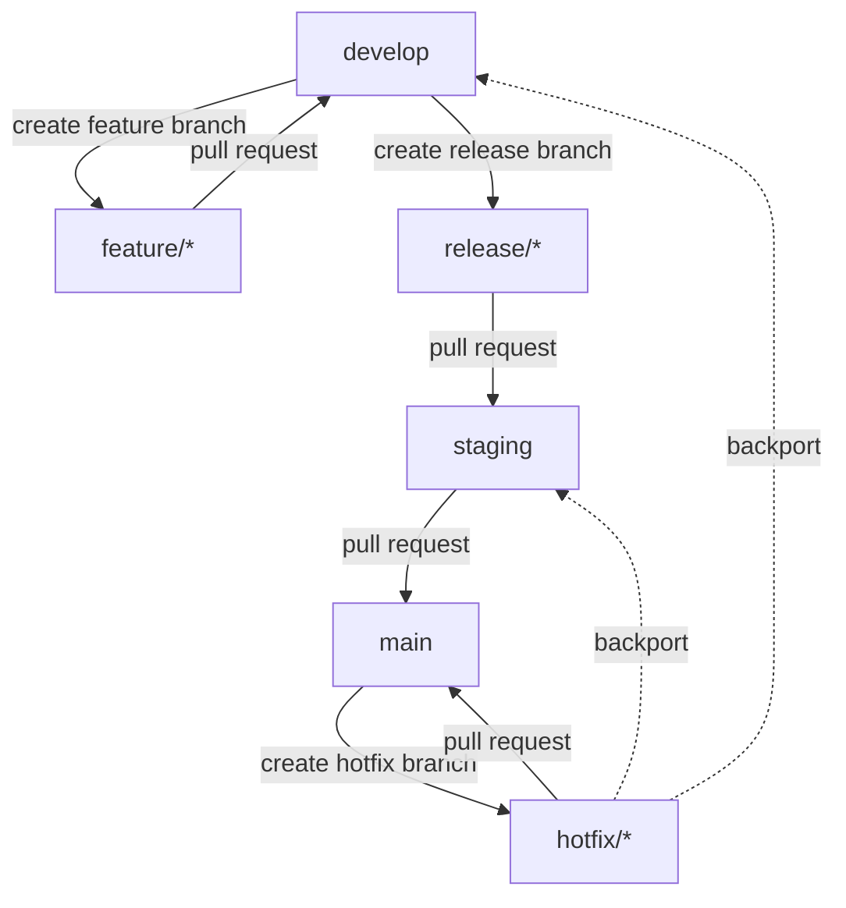
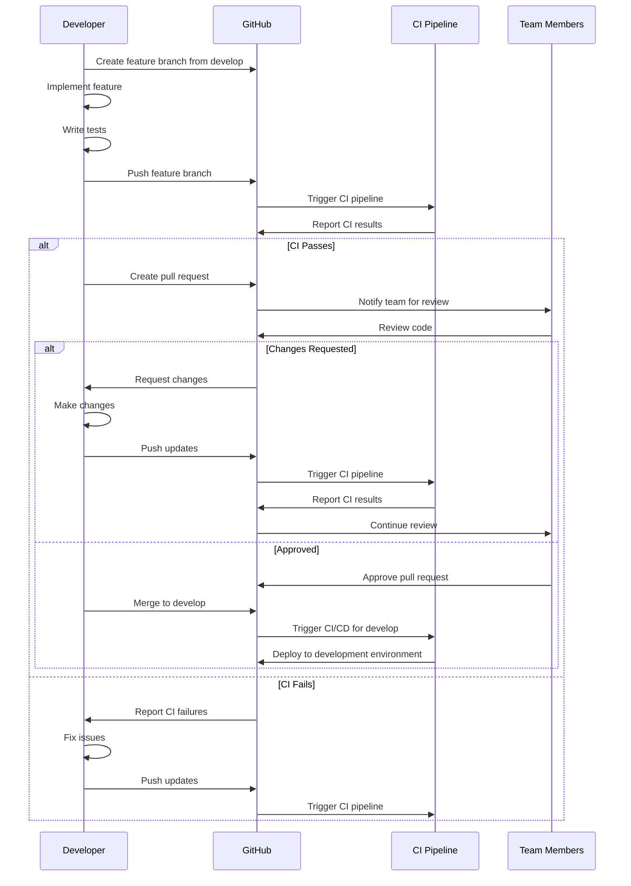
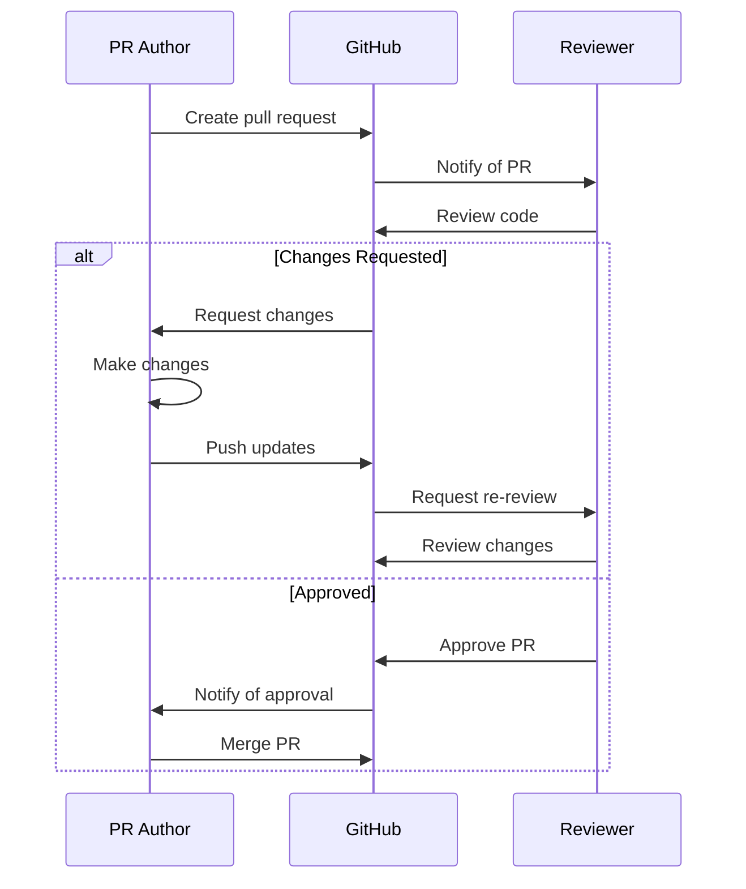
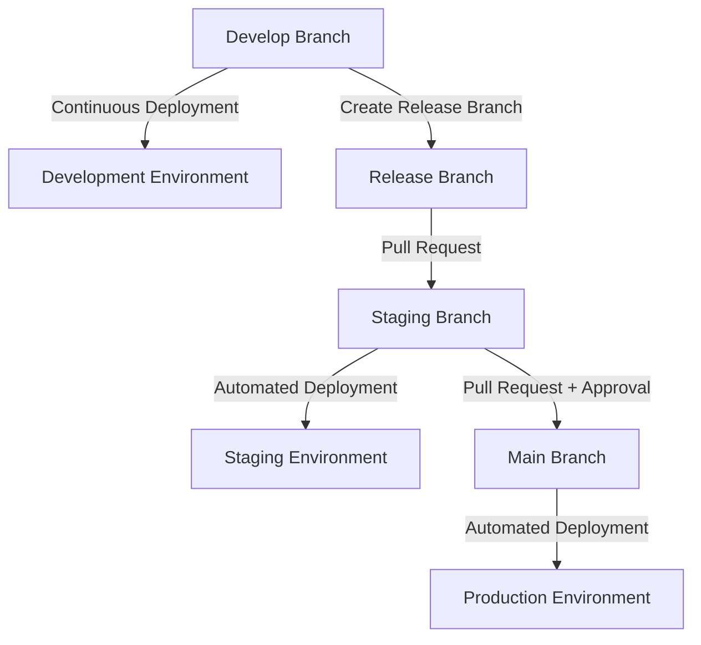

This document outlines the development workflows for the IndiVillage.com website project. It covers the entire development lifecycle from feature planning to production deployment, including branching strategy, code review process, testing procedures, and release management.

These workflows are designed to ensure code quality, maintain project stability, and facilitate collaboration among team members. All developers working on the IndiVillage.com project should follow these workflows.

## Branching Strategy

The IndiVillage.com project follows a modified GitFlow branching strategy to manage code changes and releases.

### Branch Types

The repository maintains the following branch types:

- `main`: Production-ready code, deployed to the production environment
- `staging`: Pre-production code, deployed to the staging environment
- `develop`: Development code, deployed to the development environment
- `feature/*`: Feature branches for new development
- `bugfix/*`: Bug fix branches for non-critical fixes
- `hotfix/*`: Hotfix branches for critical production issues
- `release/*`: Release preparation branches

Each branch type has a specific purpose and lifecycle within the development workflow.

### Branch Flow Diagram



This diagram illustrates how code flows through different branches from development to production.

### Branch Naming Conventions

Branch names should follow these conventions:

- Feature branches: `feature/short-description` or `feature/issue-number-short-description`
- Bug fix branches: `bugfix/short-description` or `bugfix/issue-number-short-description`
- Hotfix branches: `hotfix/short-description` or `hotfix/issue-number-short-description`
- Release branches: `release/version-number`

Examples:
- `feature/user-upload-form`
- `feature/123-service-cards`
- `bugfix/email-validation`
- `bugfix/456-header-alignment`
- `hotfix/critical-security-fix`
- `release/1.2.0`

Use kebab-case (lowercase with hyphens) for the descriptive part of branch names.

### Branch Protection Rules

The following branch protection rules are enforced in the repository:

- `main`, `staging`, and `develop` branches are protected
- Direct pushes to protected branches are not allowed
- Pull requests require at least one approval
- Status checks (CI) must pass before merging
- Pull requests must be up to date before merging
- Linear history is enforced (no merge commits)

These rules ensure code quality and prevent accidental changes to critical branches.

## Feature Development Workflow

This section describes the workflow for developing new features or enhancements.

### Feature Development Process



This diagram illustrates the feature development process from branch creation to merge.

### Starting Feature Development

To start working on a new feature:

1. Ensure you have the latest `develop` branch:
   ```bash
   git checkout develop
   git pull
   ```

2. Create a new feature branch:
   ```bash
   git checkout -b feature/your-feature-name
   ```

3. Implement your feature, following the [coding standards](standards.md)

4. Write appropriate tests according to the [testing guidelines](testing.md)

5. Commit your changes with clear, descriptive commit messages:
   ```bash
   git add .
   git commit -m "Add feature: clear description of changes"
   ```

6. Push your branch to GitHub:
   ```bash
   git push -u origin feature/your-feature-name
   ```

### Pull Request Process

Once your feature is ready for review:

1. Create a pull request (PR) to merge your feature branch into `develop`

2. Fill out the PR template with:
   - Clear description of the changes
   - Reference to related issues
   - Testing performed
   - Screenshots for UI changes
   - Any deployment notes

3. Assign reviewers from the appropriate teams

4. Address any CI failures immediately

5. Respond to review comments and make necessary changes

6. Once approved, merge your PR using the "Squash and merge" option

7. Delete your feature branch after successful merge

Pull requests should be focused on a single feature or change to facilitate effective code review.

### Feature Flags

For larger features that need to be merged incrementally or features that should not be immediately available in production, use feature flags:

1. Implement the feature behind a feature flag

2. Configure the feature flag to be disabled by default

3. Enable the feature flag in development and staging environments for testing

4. Keep the feature flag disabled in production until the feature is ready for release

5. Remove the feature flag once the feature is fully released

Feature flags allow for safer deployment of changes and easier rollback if issues are discovered.

## Bug Fix Workflow

This section describes the workflow for fixing bugs and issues.

### Non-Critical Bug Fix Process

For non-critical bugs that don't require immediate fixes in production:

1. Create a `bugfix` branch from `develop`:
   ```bash
   git checkout develop
   git pull
   git checkout -b bugfix/issue-description
   ```

2. Implement the fix and add appropriate tests

3. Push your branch and create a pull request to `develop`

4. Follow the standard code review process

5. Once approved, merge to `develop`

The fix will follow the normal release process to reach production.

### Hotfix Process

For critical bugs that require immediate fixes in production:

1. Create a `hotfix` branch from `main`:
   ```bash
   git checkout main
   git pull
   git checkout -b hotfix/critical-issue-description
   ```

2. Implement the minimal fix required to address the issue

3. Add appropriate tests to verify the fix

4. Push your branch and create a pull request to `main`

5. Request expedited review from team leads

6. Once approved, merge to `main`

7. Create additional pull requests to backport the fix to `staging` and `develop`

Hotfixes bypass the normal release cycle to address critical issues quickly.

### Bug Verification

Before considering a bug fixed:

1. Write tests that reproduce the bug

2. Implement the fix and verify that the tests now pass

3. Verify the fix manually in the appropriate environment

4. Document the root cause and solution in the issue tracker

5. Update documentation if the bug was related to documented behavior

Proper verification ensures that bugs are truly fixed and prevents regression.

## Code Review Process

Code reviews are a critical part of our development process to ensure code quality, knowledge sharing, and collaboration.

### Code Review Guidelines

When reviewing code, focus on the following aspects:

- **Functionality**: Does the code work as intended?
- **Architecture**: Is the code well-structured and maintainable?
- **Performance**: Are there any performance concerns?
- **Security**: Are there any security vulnerabilities?
- **Testing**: Are tests comprehensive and effective?
- **Documentation**: Is the code well-documented?
- **Standards**: Does the code follow project standards?

Provide constructive feedback and suggest improvements rather than just pointing out issues.

### Reviewer Responsibilities

As a code reviewer, you should:

1. Respond to review requests within one business day

2. Review the code thoroughly, not just skim it

3. Run the code locally if necessary to verify functionality

4. Provide specific, actionable feedback

5. Approve only when you're satisfied with the quality

6. Be respectful and constructive in your comments

7. Consider the context and constraints of the changes

Effective code reviews improve code quality and help developers grow.

### Author Responsibilities

As the author of a pull request, you should:

1. Create focused, manageable pull requests (ideally < 500 lines)

2. Provide clear descriptions of your changes

3. Respond to review comments promptly

4. Be open to feedback and suggestions

5. Make requested changes or explain why they're not appropriate

6. Resolve discussions when addressed

7. Request re-review after making significant changes

Well-prepared pull requests facilitate effective code reviews.

### Code Review Workflow



This diagram illustrates the code review workflow from PR creation to merge.

## Testing Workflow

Testing is an integral part of the development process to ensure code quality and prevent regressions.

### Testing Requirements

All code changes must include appropriate tests:

- **New features**: Unit tests, integration tests, and UI tests as appropriate
- **Bug fixes**: Tests that reproduce the bug and verify the fix
- **Refactoring**: Tests to ensure behavior remains unchanged

Refer to the [testing documentation](testing.md) for detailed testing guidelines and requirements.

### Local Testing

Before pushing changes, run tests locally to catch issues early:

**Frontend Tests**:
```bash
cd src/web
yarn test
```

**Backend Tests**:
```bash
cd src/backend
pytest
```

**End-to-End Tests**:
```bash
cd src/web
yarn cypress:open
```

Local testing saves time by catching issues before they reach the CI pipeline.

### CI Testing

The CI pipeline automatically runs tests for all pull requests and branch pushes:

1. Linting and static analysis
2. Unit tests
3. Integration tests
4. Security scans
5. Build verification

All tests must pass before a pull request can be merged. If CI tests fail, fix the issues before requesting review.

### Test-Driven Development

We encourage test-driven development (TDD) for complex features:

1. Write tests that define the expected behavior
2. Run the tests to verify they fail (red)
3. Implement the minimum code to make tests pass (green)
4. Refactor the code while keeping tests passing (refactor)
5. Repeat for additional functionality

TDD helps ensure that code is testable and meets requirements from the start.

## Release Management

This section describes the process for releasing changes to different environments.

### Release Cycle

The IndiVillage.com project follows a regular release cycle:

- **Development**: Continuous deployment of merged features
- **Staging**: Weekly releases for testing and validation
- **Production**: Bi-weekly releases for end users

This cadence may be adjusted based on business needs and release complexity.

### Release Planning

Release planning involves the following steps:

1. Review completed features and fixes in `develop`

2. Create a release plan documenting included changes

3. Create a `release/x.y.z` branch from `develop`

4. Perform any release-specific tasks (version updates, etc.)

5. Create a pull request to merge the release branch to `staging`

6. After testing in staging, create a pull request to merge to `main`

Release planning ensures that releases are well-documented and coordinated.

### Environment Promotion



Code changes flow through environments in a controlled manner, with appropriate testing and validation at each stage.

### Release Versioning

The project uses semantic versioning (SemVer) for releases:

- **Major version** (x.0.0): Significant changes, potentially breaking
- **Minor version** (0.x.0): New features, backward compatible
- **Patch version** (0.0.x): Bug fixes and minor changes

Version numbers are updated in the following files:
- `package.json` in the frontend
- `pyproject.toml` in the backend
- `CHANGELOG.md` in the root directory

Proper versioning helps track changes and communicate the nature of updates.

### Release Documentation

Each release should be documented in the `CHANGELOG.md` file with:

- Version number and release date
- Summary of changes
- New features
- Bug fixes
- Breaking changes
- Deprecations
- Migration instructions if applicable

Release notes should be written in a user-friendly manner, focusing on the impact and value of changes rather than technical details.

### Deployment Process

Deployment to different environments is handled by the CI/CD pipeline:

- **Development**: Automatic deployment after merges to `develop`
- **Staging**: Automatic deployment after merges to `staging`
- **Production**: Manual approval required after merges to `main`

Refer to the [CI/CD documentation](../deployment/ci-cd.md) for detailed information about the deployment process.

## Collaboration Workflow

Effective collaboration is essential for successful development. This section covers tools and practices for team collaboration.

### Issue Tracking

GitHub Issues is used for tracking tasks, bugs, and feature requests:

1. All work should be associated with an issue

2. Issues should include clear descriptions and acceptance criteria

3. Use labels to categorize issues (bug, feature, enhancement, etc.)

4. Assign issues to team members responsible for implementation

5. Use milestones to group issues for specific releases

6. Update issue status as work progresses

Effective issue tracking ensures that work is well-defined and progress is visible.

### Communication Channels

The team uses the following communication channels:

- **Slack**: Daily communication and quick questions
- **GitHub Issues/PRs**: Technical discussions and code reviews
- **JIRA**: Project management and sprint planning
- **Google Meet**: Video meetings and pair programming
- **Confluence**: Documentation and knowledge sharing

Use the appropriate channel for different types of communication to ensure efficiency and clarity.

### Pair Programming

Pair programming is encouraged for complex features and knowledge sharing:

1. Schedule pair programming sessions for complex tasks

2. Use screen sharing or collaborative coding tools

3. Rotate roles between driver and navigator

4. Document insights and decisions from pair programming

5. Use pair programming for onboarding new team members

Pair programming improves code quality and facilitates knowledge transfer.

### Documentation

Documentation is an important part of the development process:

1. Update documentation as part of feature development

2. Document APIs, components, and architecture decisions

3. Keep the README and getting started guides up to date

4. Use inline comments for complex code sections

5. Create diagrams for complex workflows and architecture

Good documentation helps new team members onboard and serves as a reference for the team.

## Continuous Integration and Deployment

The project uses GitHub Actions for continuous integration and deployment. This section provides an overview of the CI/CD workflow.

### CI Pipeline

The CI pipeline runs automatically for all pull requests and branch pushes:

1. Code checkout
2. Dependency installation
3. Linting and static analysis
4. Unit and integration tests
5. Build verification
6. Security scanning
7. Docker image building

The CI pipeline ensures that code changes meet quality standards before they can be merged.

### CD Pipeline

The CD pipeline deploys code to different environments:

1. Development: Automatic deployment after merges to `develop`
2. Staging: Automatic deployment after merges to `staging`
3. Production: Manual approval required after merges to `main`

The CD pipeline uses blue-green deployment to minimize downtime and enable easy rollback if issues are discovered.

### Pipeline Configuration

CI/CD pipelines are configured in the `.github/workflows` directory:

- `ci.yml`: Continuous integration workflow
- `cd-development.yml`: Deployment to development environment
- `cd-staging.yml`: Deployment to staging environment
- `cd-production.yml`: Deployment to production environment

Refer to the [CI/CD documentation](../deployment/ci-cd.md) for detailed information about pipeline configuration and behavior.

### Monitoring Deployments

Deployments are monitored to ensure successful completion and detect issues:

1. Check deployment status in GitHub Actions

2. Monitor application logs after deployment

3. Verify application health checks

4. Monitor error rates and performance metrics

5. Conduct smoke tests after deployment

Proactive monitoring helps detect and address issues quickly after deployment.

## Troubleshooting

This section provides guidance for troubleshooting common issues in the development workflow.

### Git Issues

**Issue: Merge conflicts**

Resolution:
1. Pull the latest changes from the target branch
2. Merge the target branch into your feature branch
3. Resolve conflicts in your IDE or text editor
4. Commit the resolved conflicts
5. Push your changes

**Issue: Accidentally committed to wrong branch**

Resolution:
1. Stash your changes: `git stash`
2. Switch to the correct branch: `git checkout correct-branch`
3. Apply your stashed changes: `git stash apply`
4. Commit to the correct branch

**Issue: Need to undo last commit**

Resolution:
- Undo commit but keep changes: `git reset --soft HEAD~1`
- Undo commit and discard changes: `git reset --hard HEAD~1`

### CI Pipeline Issues

**Issue: Linting failures**

Resolution:
1. Check the CI logs for specific linting errors
2. Run linting locally to reproduce the issues
3. Fix the issues or update linting configuration if appropriate
4. Commit and push the changes

**Issue: Test failures**

Resolution:
1. Check the CI logs for specific test failures
2. Run the failing tests locally to reproduce the issues
3. Fix the code or update tests as appropriate
4. Commit and push the changes

**Issue: Build failures**

Resolution:
1. Check the CI logs for build errors
2. Try building locally to reproduce the issues
3. Fix the build issues
4. Commit and push the changes

### Deployment Issues

**Issue: Deployment failure**

Resolution:
1. Check the deployment logs for specific errors
2. Verify infrastructure status
3. Check for configuration issues
4. Fix the issues and retry deployment

**Issue: Application issues after deployment**

Resolution:
1. Check application logs for errors
2. Verify environment variables and configuration
3. Consider rolling back to previous version
4. Fix issues and redeploy

**Issue: Need to rollback a deployment**

Resolution:
1. For development/staging: Redeploy the previous version
2. For production: Use the rollback feature in the deployment pipeline
3. Investigate and fix the issues in a new branch
4. Deploy the fixed version when ready

### Getting Help

If you encounter issues that you can't resolve:

1. Check the project documentation in the `docs` directory

2. Search for similar issues in GitHub Issues

3. Ask for help in the team Slack channel

4. Reach out to the tech lead or senior developers

5. Create a new issue with detailed information about the problem

When asking for help, always include:
- A clear description of the problem
- Steps to reproduce the issue
- Error messages and logs
- What you've already tried

## Workflow Customization

While the standard workflows should be followed in most cases, there may be situations that require customization.

### Expedited Process

For urgent changes that need to bypass the normal workflow:

1. Get approval from the tech lead or project manager

2. Document the reason for the expedited process

3. Follow the hotfix process even if the change is not a bug fix

4. Ensure that all required tests are still performed

5. Conduct a post-implementation review

The expedited process should be used sparingly and only for truly urgent changes.

### Experimental Features

For experimental features that need special handling:

1. Create a feature branch with the prefix `experimental/`

2. Implement the feature with appropriate feature flags

3. Document the experimental nature of the feature

4. Get approval for merging the experimental code

5. Monitor the feature closely after deployment

6. Decide whether to fully implement or remove the feature based on results

Experimental features allow for testing new ideas without committing to full implementation.

### Long-Running Branches

For large features that require extended development time:

1. Break the feature into smaller, mergeable components

2. Create a feature branch for the overall feature

3. Regularly merge `develop` into your feature branch to stay current

4. Consider creating sub-feature branches for parallel work

5. Merge components back to `develop` behind feature flags when possible

6. Plan for incremental testing and review

Long-running branches should be avoided when possible, but these strategies can help manage them when necessary.

## Workflow Evolution

Development workflows should evolve over time to address changing needs and incorporate lessons learned.

### Workflow Review Process

The development workflow is reviewed quarterly:

1. Collect feedback from team members

2. Analyze metrics (cycle time, deployment frequency, etc.)

3. Identify pain points and bottlenecks

4. Propose and discuss improvements

5. Update documentation and communicate changes

6. Monitor the impact of changes

Regular reviews ensure that workflows remain effective and efficient.

### Continuous Improvement

Everyone is encouraged to suggest workflow improvements:

1. Identify issues or inefficiencies in the current workflow

2. Propose specific improvements

3. Discuss with the team

4. Implement approved changes

5. Document and communicate the changes

6. Evaluate the impact

Continuous improvement helps refine workflows and increase team productivity.

### Learning Resources

Resources for learning more about development workflows:

- [GitHub Flow](https://guides.github.com/introduction/flow/)
- [GitFlow Workflow](https://www.atlassian.com/git/tutorials/comparing-workflows/gitflow-workflow)
- [Trunk-Based Development](https://trunkbaseddevelopment.com/)
- [The DevOps Handbook](https://itrevolution.com/book/the-devops-handbook/)
- [Continuous Delivery](https://continuousdelivery.com/)

Learning from industry best practices helps inform workflow improvements.

## References
- [Coding Standards](standards.md)
- [Testing Guidelines](testing.md)
- [CI/CD Pipeline Documentation](../deployment/ci-cd.md)
- [Architecture Documentation](../architecture.md)