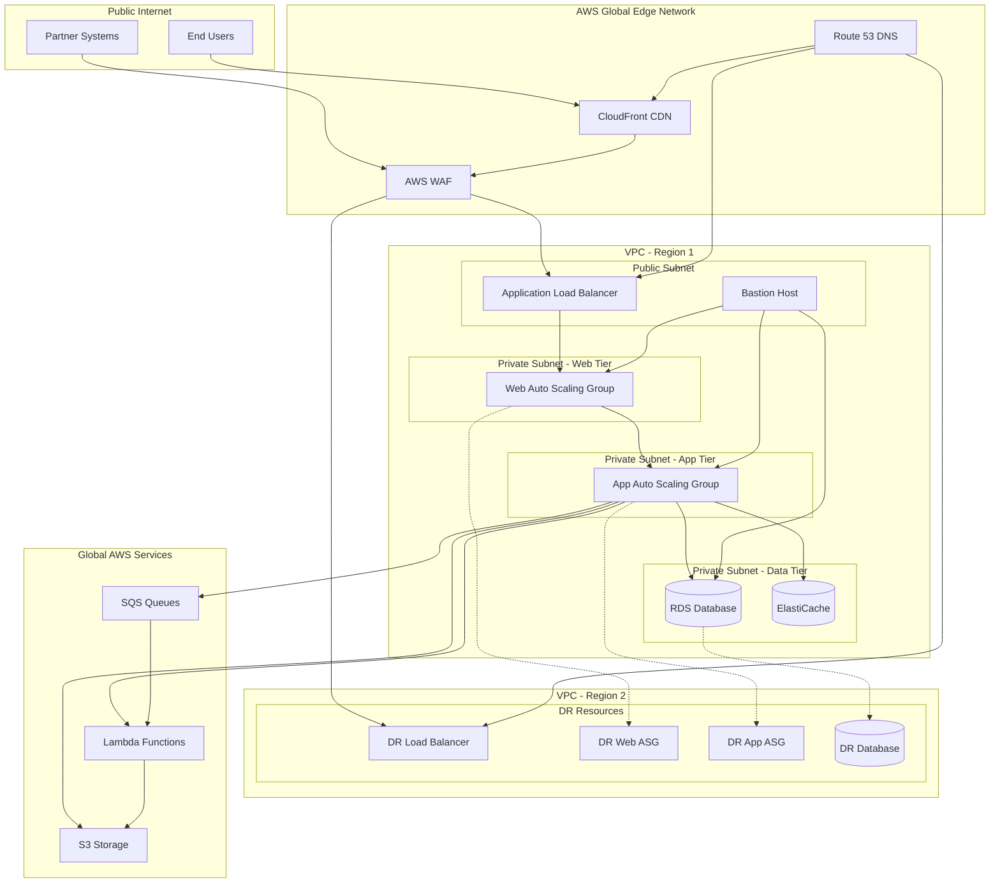

# IndiVillage.com Infrastructure Documentation

This documentation provides a comprehensive overview of the infrastructure that powers the IndiVillage.com website. The infrastructure is designed to be scalable, reliable, secure, and cost-effective, supporting the company's AI-as-a-service offerings and social impact mission.

## Infrastructure Overview

The IndiVillage.com website is built on a modern cloud infrastructure using AWS services. The architecture follows a multi-tier, multi-region design to ensure high availability, disaster recovery capabilities, and optimal performance for global users.



The infrastructure is defined and managed using Terraform as Infrastructure as Code (IaC), ensuring consistency, repeatability, and version control across all environments.

## Infrastructure Components

The IndiVillage.com infrastructure consists of the following key components:

### Compute Resources

- **Amazon EC2**: Provides the compute capacity for web and application servers
- **Auto Scaling Groups**: Automatically adjust capacity based on demand
- **AWS Lambda**: Serverless computing for file processing and event-driven tasks
- **Amazon ECS**: Container orchestration for consistent application deployment

### Storage Resources

- **Amazon S3**: Object storage for user uploads, processed files, and static assets
- **Amazon RDS**: Managed PostgreSQL database for structured data
- **Amazon ElastiCache**: Redis caching for improved performance
- **Amazon EBS**: Block storage for EC2 instances

### Networking Resources

- **Amazon VPC**: Isolated network environment with public and private subnets
- **Application Load Balancer**: Distributes traffic to web tier instances
- **Amazon CloudFront**: Global content delivery network
- **Amazon Route 53**: DNS service with health checks and failover routing
- **AWS WAF**: Web Application Firewall for protection against common exploits

### Security Resources

- **AWS IAM**: Identity and Access Management for secure resource access
- **AWS KMS**: Key Management Service for encryption
- **AWS Certificate Manager**: Manages SSL/TLS certificates
- **AWS Shield**: DDoS protection
- **AWS Security Hub**: Comprehensive security and compliance center

### Monitoring and Management

- **Amazon CloudWatch**: Monitoring and observability
- **AWS CloudTrail**: Audit logging of API activity
- **AWS Config**: Configuration management and compliance
- **AWS Systems Manager**: Server management and automation

## Environment Strategy

The IndiVillage.com infrastructure is deployed across three distinct environments:

### Development Environment

- **Purpose**: For ongoing development and feature testing
- **Configuration**: Minimal but sufficient for testing
- **Resource sizing**: t3.medium instances, single-AZ database
- **Region**: US East (us-east-1)
- **Access**: Development team and CI/CD pipeline
- **Update frequency**: Multiple times per day (on each merge to develop)

### Staging Environment

- **Purpose**: Pre-production validation and testing
- **Configuration**: Similar to production but at lower scale
- **Resource sizing**: t3.large instances, multi-AZ database
- **Region**: US East (us-east-1)
- **Access**: Limited to development team, QA, and project managers
- **Update frequency**: Several times per week

### Production Environment

- **Purpose**: Live environment for end users
- **Configuration**: Optimized for performance, reliability, and security
- **Resource sizing**: m5.large instances, multi-AZ with read replicas
- **Regions**: Primary: US East (us-east-1), Secondary: US West (us-west-2)
- **Access**: Strictly limited to operations team and automated processes
- **Update frequency**: Weekly or bi-weekly (scheduled releases)

## Infrastructure as Code

All infrastructure is defined and managed using Terraform, following Infrastructure as Code (IaC) best practices:

### Terraform Structure

```
infrastructure/terraform/
├── main.tf           # Main Terraform configuration
├── variables.tf      # Input variables
├── outputs.tf        # Output values
├── providers.tf      # Provider configuration
├── versions.tf       # Terraform and provider versions
├── modules/          # Reusable Terraform modules
│   ├── networking/   # VPC, subnets, routing
│   ├── compute/      # EC2, ASG, ECS
│   ├── database/     # RDS, ElastiCache
│   ├── storage/      # S3, EBS
│   ├── cdn/          # CloudFront
│   ├── monitoring/   # CloudWatch, alerting
│   └── security/     # IAM, security groups
└── environments/     # Environment-specific configurations
    ├── development/
    ├── staging/
    └── production/
```

This modular approach allows for consistent infrastructure implementation across environments while allowing environment-specific configurations.

### State Management

Terraform state is managed using the following approach:

- **State Storage**: S3 bucket with versioning enabled
- **State Locking**: DynamoDB table for state locking
- **Workspace Separation**: Separate workspaces for each environment
- **Access Control**: IAM policies restricting access to state

### Deployment Workflow

Infrastructure changes follow a defined workflow:

1. Infrastructure changes are proposed via pull requests
2. Terraform plan is automatically generated for review
3. Changes are approved by infrastructure team
4. Terraform apply is executed in the target environment
5. Post-deployment validation ensures correct implementation

This process ensures that infrastructure changes are properly reviewed, tested, and documented before implementation.

## Network Architecture

The network architecture is designed for security, scalability, and high availability. This section provides a comprehensive overview of the network design principles and implementations used in the IndiVillage.com infrastructure.

### VPC Design

Each environment has its own VPC with the following components:

- **CIDR Block**: 10.0.0.0/16
- **Availability Zones**: 3 AZs used in each region for high availability
- **Subnet Types**:
  - Public subnets: For load balancers and bastion hosts
  - Private web tier subnets: For web server instances
  - Private app tier subnets: For application server instances
  - Private database subnets: For database instances

### Security Groups

Security groups control traffic between different tiers:

- **Web Security Group**: Allows HTTP/HTTPS from load balancer
- **Application Security Group**: Allows traffic from web tier on specific ports
- **Database Security Group**: Allows traffic from application tier on database port
- **Load Balancer Security Group**: Allows HTTP/HTTPS from internet
- **Bastion Host Security Group**: Allows SSH from restricted IP ranges

### Connectivity

- **Internet Gateway**: Provides internet access for public subnets
- **NAT Gateway**: Provides outbound internet access for private subnets
- **VPC Endpoints**: Secure access to AWS services without internet exposure
- **Transit Gateway**: Connects multiple VPCs (production only)

### Network Flow

The network traffic flow follows a secure pattern:

1. **External Traffic**: Incoming traffic from users and partners enters through CloudFront and WAF
2. **Load Balancing**: Traffic is distributed by ALB to healthy instances in the web tier
3. **Web to App Communication**: Web tier instances communicate with app tier instances
4. **App to Data Communication**: App tier instances communicate with databases and other data services
5. **Outbound Traffic**: Private subnet instances use NAT Gateway for outbound internet access

This layered approach ensures secure and efficient traffic flow while maintaining isolation between different tiers.

### Network Access Controls

Multiple layers of network access controls are implemented:

- **Network ACLs**: Stateless packet filtering at the subnet level
- **Security Groups**: Stateful instance-level firewall rules
- **WAF Rules**: Protection against common web exploits
- **CloudFront Geo-restrictions**: Optional geographic access restrictions for specific content

## Security Implementation

Security is implemented at multiple layers throughout the infrastructure to ensure comprehensive protection of data and services.

### Defense in Depth

The security architecture implements defense in depth with multiple security layers:

- **Perimeter Security**: WAF, Shield, CloudFront security features
- **Network Security**: VPC design, security groups, NACLs
- **Compute Security**: Hardened AMIs, security patches, host-based firewalls
- **Data Security**: Encryption at rest and in transit
- **Application Security**: Input validation, authentication, authorization
- **Identity Security**: IAM policies, roles, MFA

### Encryption

All sensitive data is encrypted:

- **Data at Rest**: S3, RDS, EBS using AWS KMS
- **Data in Transit**: TLS 1.3+ for all communications
- **Key Management**: AWS KMS with automatic key rotation

### Monitoring and Detection

Security monitoring includes:

- **CloudTrail**: Logs all API activity
- **VPC Flow Logs**: Network traffic monitoring
- **GuardDuty**: Threat detection
- **Security Hub**: Comprehensive security posture management
- **Config**: Configuration compliance monitoring

### Identity and Access Management

Strict access controls are enforced:

- **IAM Policies**: Least privilege principle
- **IAM Roles**: Service and instance roles with limited permissions
- **Multi-Factor Authentication**: Required for console access
- **AWS SSO**: Centralized identity management

### Compliance Framework

The infrastructure is designed to meet compliance requirements:

- **GDPR**: Data protection mechanisms
- **SOC 2**: Security, availability, and confidentiality controls
- **CCPA**: California Consumer Privacy Act compliance
- **PCI-DSS**: Payment Card Industry standards for data security
- **Internal Policies**: Company-specific security policies

## High Availability and Disaster Recovery

The infrastructure is designed for high availability and disaster recovery:

### Multi-AZ Deployment

Resources are distributed across multiple Availability Zones:

- **Web and App Tiers**: Auto Scaling Groups span multiple AZs
- **Database Tier**: Multi-AZ RDS deployment
- **Load Balancers**: Deployed across multiple AZs

### Multi-Region Strategy

Production environment spans multiple regions:

- **Primary Region**: US East (us-east-1)
- **Secondary Region**: US West (us-west-2)
- **Data Replication**: Cross-region replication for critical data
- **Failover Mechanism**: Route 53 health checks and failover routing

### Backup and Recovery

Comprehensive backup strategy:

- **Content data**: Daily exports from Contentful CMS
- **User-uploaded files**: Replicated across multiple AWS regions
- **Configuration**: Infrastructure as Code stored in version control
- **Databases**: Automated backups with point-in-time recovery

### Recovery Procedures

Documented recovery procedures for different scenarios:

- **Instance Failure**: Automatic replacement via Auto Scaling
- **AZ Failure**: Traffic routed to healthy AZs
- **Region Failure**: Failover to secondary region
- **Data Corruption**: Restore from backups

## Monitoring and Alerting

Comprehensive monitoring and alerting ensure system health, performance, and security:

### Monitoring Tools

- **CloudWatch**: Metrics, logs, and alarms
- **CloudWatch Dashboards**: Visualization of key metrics
- **Prometheus**: Additional metrics collection (production)
- **Grafana**: Advanced visualization and dashboards (production)

### Key Metrics

- **Infrastructure Metrics**: CPU, memory, disk, network
- **Application Metrics**: Request rates, error rates, response times
- **Database Metrics**: Query performance, connection count, storage
- **Security Metrics**: Authentication events, suspicious activities

### Alerting Configuration

- **Critical Alerts**: Paged to on-call engineer (24/7)
- **High Priority**: Sent to Slack and email during business hours
- **Medium Priority**: Sent to Slack during business hours
- **Low Priority**: Logged in dashboard for review

### Dashboards

Custom dashboards provide visibility into system health and performance:

- **Executive Dashboard**: High-level system health and business metrics
- **Operations Dashboard**: Detailed infrastructure and application metrics
- **Security Dashboard**: Security posture and threat indicators
- **Cost Dashboard**: Resource utilization and cost metrics

## Cost Optimization

Cost optimization strategies are implemented to maximize value while controlling costs:

### Resource Optimization

- **Right-sized Instances**: Appropriate instance types for workloads
- **Auto Scaling**: Scale based on demand to avoid over-provisioning
- **Spot Instances**: Used for non-critical workloads (development/staging)
- **Reserved Instances**: 1-year commitments for baseline capacity

### Storage Optimization

- **S3 Lifecycle Policies**: Transition to lower-cost storage tiers
- **EBS Volume Optimization**: Right-sized volumes with appropriate types
- **RDS Storage Allocation**: Appropriate sizing with auto-scaling

### Cost Monitoring

- **AWS Budgets**: Monthly budgets by environment
- **Cost Explorer**: Regular cost analysis
- **Tagging Strategy**: Resources tagged for cost allocation

## Operational Procedures

Documented operational procedures ensure consistent management of the infrastructure:

### Deployment Procedures

- **Infrastructure Deployment**: Terraform-based deployment process
- **Application Deployment**: CI/CD pipeline with GitHub Actions
- **Configuration Management**: AWS Systems Manager Parameter Store
- **Change Management**: Pull request workflow with approvals

### Maintenance Procedures

- **Patching**: Regular security patching schedule
- **Backup Verification**: Regular testing of backup restoration
- **Performance Tuning**: Regular review and optimization
- **Security Updates**: Immediate application of critical security patches

### Incident Response

- **Incident Detection**: Automated alerting for issues
- **Incident Classification**: Severity-based classification
- **Escalation Procedures**: Clear escalation paths
- **Post-Incident Review**: Thorough analysis and improvement

### Runbooks

Detailed runbooks for common operational tasks:

- **Scaling Operations**: Procedures for scaling resources
- **Backup and Restore**: Procedures for data backup and recovery
- **Failover Procedures**: Steps for manual failover if needed
- **Security Incident Response**: Procedures for security incidents

## Getting Started

Instructions for setting up the local development environment for infrastructure management:

### Prerequisites

- **AWS CLI**: Version 2.0 or later
- **Terraform**: Version 1.5.x or later
- **Git**: For version control
- **AWS Account**: Access to the appropriate AWS account
- **IAM Permissions**: Appropriate permissions for infrastructure management

### Repository Setup

1. Clone the repository: `git clone https://github.com/indivillage/indivillage-website.git`
2. Navigate to the infrastructure directory: `cd infrastructure`
3. Initialize Terraform: `terraform init`

### AWS Authentication

Configure AWS credentials using one of the following methods:

- AWS CLI: `aws configure`
- Environment variables: `AWS_ACCESS_KEY_ID`, `AWS_SECRET_ACCESS_KEY`
- AWS SSO: `aws sso login`

Ensure you have the appropriate permissions for the environment you're working with.

### Working with Terraform

Basic Terraform commands for infrastructure management:

- Initialize: `terraform init`
- Select workspace: `terraform workspace select development`
- Plan changes: `terraform plan`
- Apply changes: `terraform apply`
- Destroy resources: `terraform destroy` (use with caution)

Always review plans carefully before applying changes.

## Additional Documentation

For more detailed information on specific aspects of the infrastructure, refer to the following documents:

### AWS Services

Detailed documentation of AWS services and configurations: [AWS Infrastructure](aws.md)

### Monitoring and Alerting

Detailed monitoring configuration: [Monitoring Documentation](../operations/monitoring.md)

### Disaster Recovery

Comprehensive disaster recovery procedures: [Disaster Recovery Documentation](../operations/disaster-recovery.md)

### Backup and Restore

Detailed backup and restore procedures: [Backup and Restore Documentation](../operations/backup-restore.md)