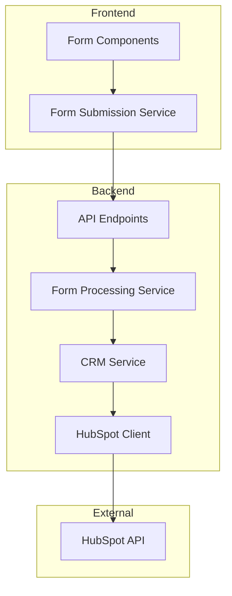
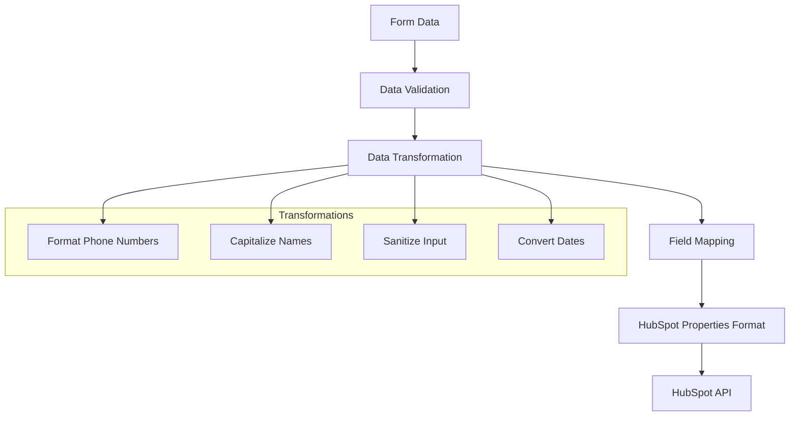
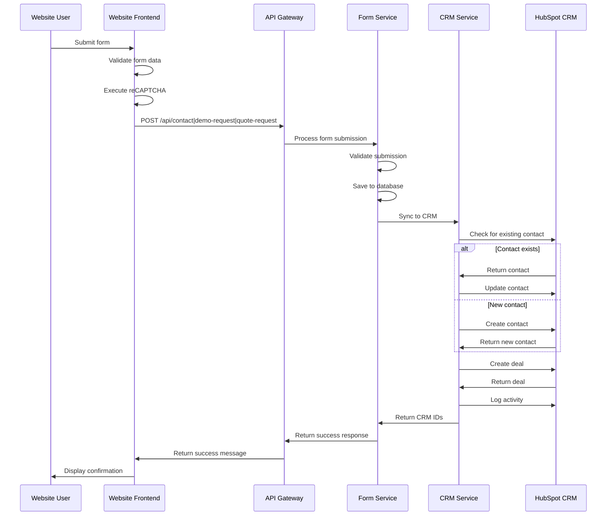
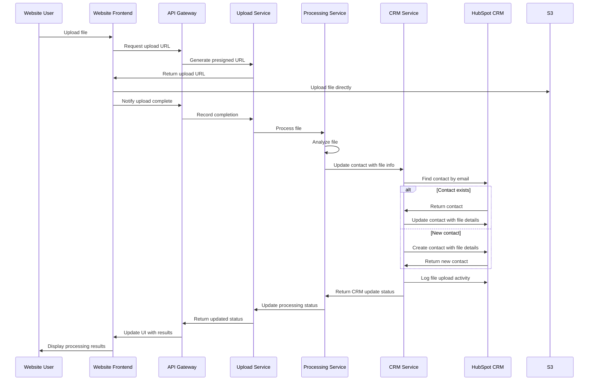
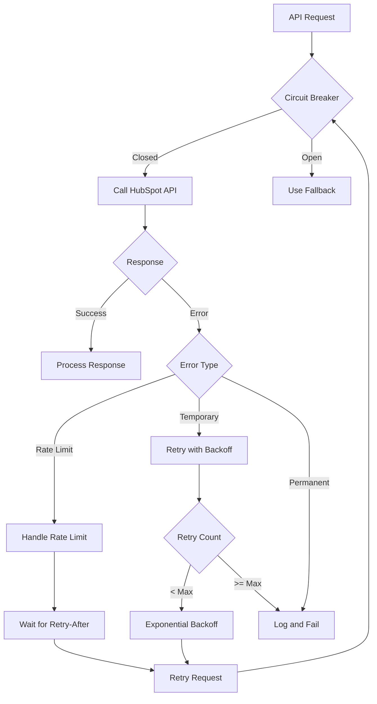

# HubSpot CRM Integration

## Introduction

The IndiVillage website integrates with HubSpot CRM to manage leads, track customer interactions, and provide a comprehensive view of customer engagement. This integration enables seamless data flow between the website and HubSpot, ensuring that all customer interactions—from form submissions to file uploads—are properly tracked and actioned.

Key features of this integration include:
- Automatic creation and updating of contacts in HubSpot
- Deal creation for qualified leads and opportunities
- Tracking file uploads and analysis results
- Activity logging for customer interactions
- Intelligent contact de-duplication
- Resilient API communication with error handling

This documentation provides comprehensive information on implementing, configuring, and maintaining the HubSpot CRM integration for the IndiVillage website.

## Prerequisites

Before implementing the HubSpot integration, ensure you have the following:

- **HubSpot Account**: Marketing Hub Professional or above recommended
- **API Access**: Enabled in your HubSpot account
- **API Key**: With the following permissions:
  - Contacts: Create, Read, Write
  - Deals: Create, Read, Write
  - Properties: Read
  - Timeline: Create, Write
- **HubSpot Properties**: Configured to match form fields (see Data Mapping section)
- **Deal Pipeline**: Configured with appropriate stages for demo and quote requests
- **Lifecycle Stages**: Properly configured in HubSpot
- **Development Access**: To the IndiVillage website codebase

## Architecture Overview

The HubSpot integration follows a layered architecture that separates concerns and provides resilience against API failures.



### Key Components

1. **Form Components**: React components that capture user data through various forms
2. **Form Submission Service**: Frontend service that validates form data and sends it to the API
3. **API Endpoints**: Backend REST API endpoints that receive form submissions
4. **Form Processing Service**: Backend service that processes and stores form submissions
5. **CRM Service**: Service that implements business logic for CRM operations
6. **HubSpot Client**: Low-level client that interacts directly with the HubSpot API
7. **HubSpot API**: External HubSpot REST API endpoints

## Integration Components

### HubSpotClient

The `HubSpotClient` class provides a low-level interface to the HubSpot API, handling authentication, request formatting, and response parsing.

**Key Features:**
- Token management and authentication
- Request/response handling
- Rate limit handling with adaptive backoff
- Circuit breaker implementation for API resilience
- Logging and error handling

**Methods:**
- `create_contact(data)`: Creates a new contact in HubSpot
- `update_contact(id, data)`: Updates an existing contact
- `find_contact(email)`: Finds a contact by email address
- `create_deal(data)`: Creates a new deal in HubSpot
- `update_deal(id, data)`: Updates an existing deal
- `log_activity(contact_id, activity_type, data)`: Logs an activity for a contact

### CRMService

The `CRMService` provides higher-level business functions for CRM operations, orchestrating interactions with the HubSpot client.

**Key Features:**
- Contact creation and update logic
- Deal creation and management
- De-duplication of contacts
- Data transformation and mapping
- Activity logging

**Methods:**
- `process_form_submission(form_data, form_type)`: Processes a form submission
- `update_contact_with_file_upload(upload_id, results)`: Updates a contact with file upload information
- `create_or_update_contact(contact_data)`: Creates or updates a contact
- `create_deal_for_contact(contact_id, deal_data)`: Creates a deal associated with a contact

### Form Submission Handlers

Form submission handlers process different types of form submissions and integrate with the CRM service.

**Types of Handlers:**
- **ContactFormHandler**: Processes general contact form submissions
- **DemoRequestHandler**: Processes demo request submissions
- **QuoteRequestHandler**: Processes quote request submissions
- **FileUploadHandler**: Processes file uploads and updates CRM

## Data Mapping

Form submissions from the IndiVillage website are mapped to HubSpot CRM fields according to the following schema:

| Form Field | HubSpot Property | Transformation | Validation |
|------------|------------------|----------------|------------|
| `email` | `email` | Lowercase | Valid email format |
| `firstName` | `firstname` | Capitalize first letter | Required, string |
| `lastName` | `lastname` | Capitalize first letter | Required, string |
| `company` | `company` | None | Required, string |
| `jobTitle` | `jobtitle` | None | Optional, string |
| `phone` | `phone` | Format to E.164 | Optional, valid phone |
| `country` | `country` | ISO country code | Required, valid country |
| `serviceInterest` | `service_interest` | Map to CRM picklist | Required, valid option |
| `projectDescription` | `project_description` | None | Optional, string |
| `leadSource` | `lead_source` | Set to "Website" | Fixed value |
| `formType` | `form_type` | Map to CRM picklist | Fixed based on form |
| `uploadId` | `sample_data_reference` | None | Optional, valid ID |

### Data Transformation Flow



### Creating a Contact in HubSpot

```python
from app.integrations.hubspot import HubSpotClient

# Initialize the client
client = HubSpotClient()

# Prepare contact data
contact_data = {
    'email': 'john.doe@example.com',
    'firstName': 'John',
    'lastName': 'Doe',
    'company': 'Example Corp',
    'phone': '+1 (555) 123-4567',
    'jobTitle': 'CTO'
}

# Create the contact
result = client.create_contact(contact_data)
print(f"Contact created with ID: {result['id']}")
```

## Form Submission Workflow

When a user submits a form on the IndiVillage website, the following workflow is triggered:



### Step-by-Step Process

1. **Form Submission**: User completes and submits a form
2. **Client-side Validation**: Frontend validates form data
3. **reCAPTCHA Verification**: Bot prevention check
4. **API Request**: Frontend sends form data to the appropriate API endpoint
5. **Server-side Validation**: Backend validates the submission
6. **Database Storage**: Form submission is stored in the database
7. **Contact Check**: System checks if the contact already exists in HubSpot
8. **Contact Creation/Update**: System creates a new contact or updates an existing one
9. **Deal Creation**: System creates a new deal associated with the contact
10. **Activity Logging**: System logs the form submission as an activity
11. **Response**: Success response sent back to the frontend
12. **Confirmation**: User sees a confirmation message

### Processing a Form Submission

```python
from app.integrations.hubspot import process_form_submission
from app.api.v1.models.form_submission import FormType

# Form data from a demo request
form_data = {
    'firstName': 'Jane',
    'lastName': 'Smith',
    'email': 'jane.smith@example.com',
    'company': 'Tech Solutions Inc',
    'jobTitle': 'Product Manager',
    'serviceInterests': ['Data Preparation', 'AI Model Development'],
    'projectDetails': 'Looking for AI solutions for customer data analysis'
}

# Process the form submission
result = process_form_submission(form_data, FormType.DEMO_REQUEST)

# Access the created CRM records
contact_id = result['contact_id']
deal_id = result['deal_id']
```

### Frontend Form Submission

```typescript
import { submitDemoRequestWithValidation } from '../services/formSubmissionService';

// Form data from user input
const formData = {
  firstName: 'Alex',
  lastName: 'Johnson',
  email: 'alex.johnson@example.com',
  phone: '+1 (555) 987-6543',
  company: 'Global Enterprises',
  jobTitle: 'Director of AI',
  serviceInterests: ['Human-in-the-Loop', 'AI Model Development'],
  preferredDate: '2023-12-15',
  preferredTime: '14:00',
  timeZone: 'America/New_York',
  projectDetails: 'Seeking AI solutions for document processing',
  referralSource: 'Google Search'
};

// Submit the form with validation and HubSpot integration
async function handleSubmit() {
  try {
    const response = await submitDemoRequestWithValidation(formData);
    
    if (response.success) {
      // Show success message to user
      console.log('Demo request submitted successfully');
      console.log('CRM data:', response.data);
    } else {
      // Show error message
      console.error('Form submission failed:', response.message);
      console.error('Errors:', response.errors);
    }
  } catch (error) {
    console.error('Unexpected error:', error);
  }
}
```

## File Upload Integration

The IndiVillage website allows users to upload sample datasets for analysis. Information about these uploads is tracked in HubSpot to provide a complete view of customer interactions.



### File Upload Information in HubSpot

The following information about file uploads is tracked in HubSpot:

1. **Custom Contact Properties**:
   - `last_file_upload_date`: Date of the most recent file upload
   - `file_upload_count`: Total number of files uploaded
   - `last_file_type`: Type of the most recently uploaded file
   - `last_file_quality_score`: Quality score of the most recent file
   - `sample_data_reference`: Reference ID for the most recent sample data

2. **Custom Activity Timeline**:
   - Activity type: "Sample Data Upload"
   - Timestamp of upload
   - File details (name, type, size)
   - Analysis summary
   - Link to detailed analysis results

### Updating a Contact with File Upload Information

```python
from app.services.crm_service import update_contact_with_file_upload
import uuid

# File upload ID
upload_id = uuid.UUID('12345678-1234-5678-1234-567812345678')

# Processing results from file analysis
processing_results = {
    'file_type': 'CSV',
    'row_count': 1500,
    'columns': ['customer_id', 'purchase_date', 'amount'],
    'summary': 'Customer purchase data with 1500 records',
    'quality_score': 0.95
}

# Update the contact in HubSpot
result = update_contact_with_file_upload(upload_id, processing_results)
print(f"Contact updated in CRM: {result['success']}")
```

## Error Handling and Resilience

The HubSpot integration implements robust error handling and resilience patterns to ensure reliable operation even when facing API issues or network problems.



### Circuit Breaker Pattern

The integration implements a circuit breaker pattern to prevent cascading failures:

- **Closed State**: Normal operation, requests pass through to HubSpot
- **Open State**: After multiple failures, requests return a fallback response
- **Half-Open State**: After a timeout, limited requests test if the API has recovered

**Configuration**:
- Failure threshold: 5 failures within 60 seconds
- Timeout period: 120 seconds
- Success threshold: 3 consecutive successful requests

### Retry Strategy

For transient errors, the integration implements exponential backoff:

- Initial retry delay: 1 second
- Maximum retry delay: 60 seconds
- Backoff multiplier: 2 (1s, 2s, 4s, 8s, etc.)
- Maximum retry attempts: 3
- Jitter: Random delay to prevent thundering herd

### Rate Limit Handling

HubSpot API imposes rate limits that the integration respects:

- Daily quota: 250,000 API calls
- Burst limit: 100 requests per 10 seconds

The integration implements:
- Rate limit detection from response headers
- Adaptive throttling based on remaining quota
- Automatic retry after the Retry-After period
- Request queuing during rate limit periods

### Fallback Mechanisms

When the HubSpot API is unavailable:

1. **Store and Forward**: Submissions stored locally and synchronized later
2. **Degraded Mode**: Critical features continue with local storage
3. **User Feedback**: Users receive appropriate feedback
4. **Admin Alerts**: System administrators are notified of issues

## Security Considerations

### API Key Management

- **Storage**: AWS Secrets Manager (not in code or configuration files)
- **Access**: Restricted by IAM roles with least privilege
- **Rotation**: Regular key rotation (90-day cycle)
- **Monitoring**: Unusual usage patterns trigger alerts

### Data Protection

- **Transport Security**: TLS 1.3 for all API communications
- **Data Minimization**: Only necessary fields sent to HubSpot
- **Compliance**: GDPR and CCPA compliant data handling
- **Data Cleanup**: Temporary data automatically purged

### Access Controls

- **Frontend Restrictions**: Form submission only, no direct HubSpot access
- **Backend Security**: Role-based access to integration services
- **API Protection**: Authentication and authorization for all endpoints
- **Audit Logging**: All CRM operations are logged for traceability

### Consent Management

- **Marketing Communications**: Explicit opt-in with timestamp
- **Privacy Policy**: Clear disclosure of data sharing with HubSpot
- **Data Subject Rights**: Procedures for access and deletion requests
- **Data Retention**: Compliance with retention policies

## Monitoring and Troubleshooting

### Monitoring Metrics

| Metric | Description | Alert Threshold |
|--------|-------------|----------------|
| API Success Rate | Percentage of successful API calls | < 95% over 5 minutes |
| API Response Time | Average response time | > 2000ms over 5 minutes |
| Error Rate | Percentage of errors | > 5% over 5 minutes |
| Circuit Breaker Status | Current state | Open for > 5 minutes |
| Queue Depth | Number of queued requests | > 50 requests for 5 minutes |
| Daily API Usage | Percentage of daily quota used | > 80% before end of day |

### Common Issues and Troubleshooting

#### Rate Limiting Issues

**Symptoms**:
- High error rate with 429 status codes
- Increasing queue depth
- Delayed processing

**Troubleshooting Steps**:
1. Check HubSpot Developer portal for current API usage
2. Review logs for rate limit patterns
3. Adjust request rate or implement further throttling
4. Consider upgrading HubSpot plan if consistently hitting limits

#### Contact Creation Failures

**Symptoms**:
- Forms submit successfully but contacts don't appear in HubSpot
- Error logs showing 400 status codes

**Troubleshooting Steps**:
1. Verify email format and required fields
2. Check HubSpot API response for validation errors
3. Test creating the contact manually in HubSpot
4. Review field mapping configuration

#### Authentication Issues

**Symptoms**:
- Consistent 401 or 403 errors
- Circuit breaker frequently open

**Troubleshooting Steps**:
1. Verify API key in Secrets Manager
2. Check API key permissions in HubSpot
3. Ensure API key hasn't expired
4. Rotate the API key if necessary

## API Reference

### HubSpot API Endpoints Used

#### Contacts API
- `POST /crm/v3/objects/contacts`: Create contact
- `PATCH /crm/v3/objects/contacts/{id}`: Update contact
- `GET /crm/v3/objects/contacts/search`: Search contacts

#### Deals API
- `POST /crm/v3/objects/deals`: Create deal
- `PATCH /crm/v3/objects/deals/{id}`: Update deal

#### Timeline API
- `POST /crm/v3/timeline/{appId}/events`: Create timeline event

### Rate Limits

| Endpoint | Daily Limit | 10-Second Limit |
|----------|------------|-----------------|
| Contact Operations | 250,000 | 100 |
| Deal Operations | 250,000 | 100 |
| Timeline Events | 250,000 | 100 |

## Configuration Reference

### Environment Variables

| Variable | Description | Default | Required |
|----------|-------------|---------|----------|
| `HUBSPOT_API_KEY` | HubSpot API key | None | Yes |
| `HUBSPOT_API_URL` | Base URL for HubSpot API | `https://api.hubapi.com` | No |
| `HUBSPOT_TIMEOUT` | Timeout for API requests (seconds) | 10 | No |
| `HUBSPOT_MAX_RETRIES` | Maximum number of retries | 3 | No |
| `HUBSPOT_RETRY_DELAY` | Initial retry delay (milliseconds) | 1000 | No |
| `HUBSPOT_CB_THRESHOLD` | Circuit breaker failure threshold | 5 | No |
| `HUBSPOT_CB_TIMEOUT` | Circuit breaker timeout (seconds) | 120 | No |
| `HUBSPOT_OWNER_ID` | Default HubSpot owner ID | None | No |

### Form to HubSpot Field Mapping

The `hubspot_properties.json` configuration file maps form fields to HubSpot properties:

```json
{
  "demo_request": {
    "field_mapping": {
      "firstName": "firstname",
      "lastName": "lastname",
      "email": "email",
      "company": "company",
      "jobTitle": "jobtitle",
      "phone": "phone",
      "serviceInterests": "service_interest",
      "projectDetails": "project_description",
      "preferredDate": "preferred_demo_date",
      "preferredTime": "preferred_demo_time",
      "referralSource": "lead_source"
    },
    "static_values": {
      "form_type": "demo_request",
      "lifecycle_stage": "salesqualifiedlead"
    }
  },
  "quote_request": {
    "field_mapping": {
      "firstName": "firstname",
      "lastName": "lastname",
      "email": "email",
      "company": "company",
      "jobTitle": "jobtitle",
      "phone": "phone",
      "serviceInterests": "service_interest",
      "projectDetails": "project_description",
      "budget": "budget",
      "timeline": "project_timeline",
      "referralSource": "lead_source"
    },
    "static_values": {
      "form_type": "quote_request",
      "lifecycle_stage": "opportunity"
    }
  }
}
```