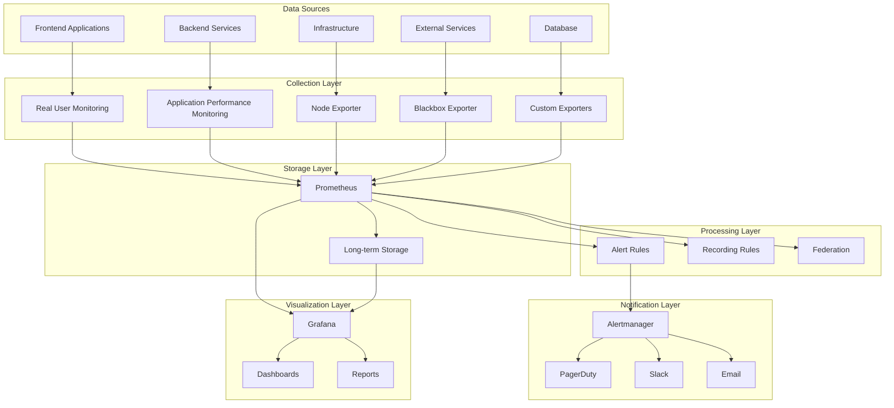
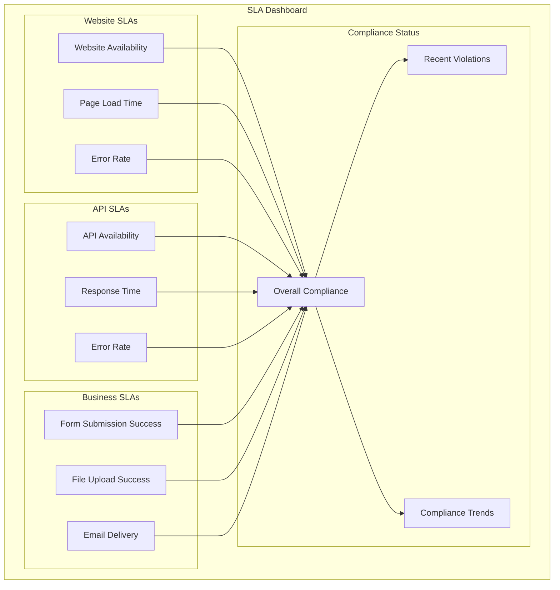
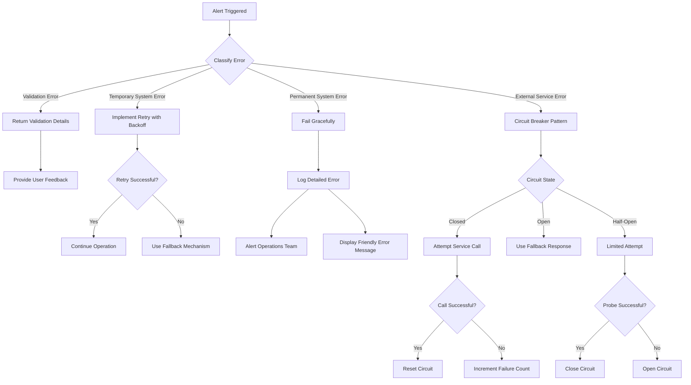

## Introduction

This document outlines the monitoring and observability strategy for IndiVillage.com, including objectives, scope, and architecture.

### Purpose

Comprehensive monitoring is critical for ensuring system reliability, performance, and user satisfaction. It enables proactive identification and resolution of issues, optimization of resource utilization, and informed decision-making based on real-time data.

### Scope

The monitoring system covers the following components:

- **Frontend**: Website performance, user experience, and error rates.
- **Backend**: API performance, service health, and database operations.
- **Infrastructure**: System resources (CPU, memory, disk), network traffic, and storage utilization.
- **Business Metrics**: Conversions, form submissions, file uploads, and user engagement.

### Monitoring Architecture

The monitoring architecture consists of the following components:

- **Data Sources**: Frontend applications, backend services, databases, infrastructure components, and external services.
- **Collection Layer**: Real User Monitoring (RUM), Application Performance Monitoring (APM), node_exporter, blackbox_exporter, and custom exporters.
- **Storage Layer**: Prometheus for metrics storage and long-term storage solutions.
- **Processing Layer**: Alert rules and recording rules for data aggregation and analysis.
- **Notification Layer**: Alertmanager for alert routing and notification via PagerDuty, Slack, and email.
- **Visualization Layer**: Grafana for creating dashboards and reports.



## Monitoring Infrastructure

Detailed explanation of the monitoring infrastructure components and their configuration.

### Prometheus

Prometheus <!-- 2.40.0 --> is used for metrics collection and storage. It is configured to scrape metrics from various exporters and services.

- **Configuration**: The Prometheus configuration is defined in `infrastructure/monitoring/prometheus.yml` and includes scrape targets, alerting rules, and storage settings.
- **Scrape Targets**: Prometheus scrapes metrics from node_exporter, blackbox_exporter, and custom exporters.
- **Alerting Rules**: Alerting rules are defined in `infrastructure/monitoring/alerting-rules.yml` and are used to trigger alerts based on metric thresholds.

### Grafana

Grafana <!-- 9.3.0 --> is used for visualization and dashboarding. It provides a user-friendly interface for creating and managing dashboards.

- **Dashboards**: Grafana dashboards are used to visualize metrics and monitor system performance.
- **Configuration**: Grafana is configured with Prometheus as a data source.
- **Web Dashboard**: The web dashboard monitors frontend performance and user experience.
- **API Dashboard**: The API dashboard monitors backend services and endpoints.
- **Infrastructure Dashboard**: The infrastructure dashboard monitors system resources and health.

### Alertmanager

Alertmanager <!-- 0.25.0 --> is used for alert handling and routing. It receives alerts from Prometheus and routes them to the appropriate notification channels.

- **Configuration**: Alertmanager is configured with alert rules and notification channels.
- **Alert Routing**: Alerts are routed to PagerDuty, Slack, and email based on severity and category.
- **Notification Channels**: Notification channels are configured to send alerts to the appropriate teams and individuals.

### Exporters and Agents

Various exporters and agents are used for metrics collection:

- **node_exporter <!-- 1.5.0 -->**: Collects system metrics from servers.
- **blackbox_exporter**: Probes external endpoints for availability and performance.
- **Custom Exporters**: Collects application-specific metrics.

## Metrics Collection

Comprehensive documentation of metrics collection across all system components.

### Frontend Metrics

Frontend metrics are collected using Real User Monitoring (RUM) and include:

- Page load times
- Core Web Vitals (FCP, LCP, CLS)
- User interactions
- Error rates

### Backend Metrics

Backend metrics are collected using Application Performance Monitoring (APM) and include:

- API performance
- Database operations
- Service health
- Error rates

### Infrastructure Metrics

Infrastructure metrics are collected using node_exporter and include:

- CPU utilization
- Memory utilization
- Disk utilization
- Network traffic

### Business Metrics

Business metrics are collected using custom exporters and include:

- Conversions
- Form submissions
- File uploads
- User engagement

### Custom Metrics

Custom metrics are implemented and collected for specific business needs. Examples:

- Number of active users
- Feature usage
- Social impact metrics

## Dashboards

Documentation of the various dashboards available for monitoring different aspects of the system.

### Web Dashboard

Overview of the web dashboard for monitoring frontend performance and user experience.

### API Dashboard

Description of the API dashboard for monitoring backend services and endpoints.

### Infrastructure Dashboard

Explanation of the infrastructure dashboard for monitoring system resources and health.

### Business Metrics Dashboard

Details on the business metrics dashboard for tracking conversions and user engagement.

### SLA Compliance Dashboard

Overview of the SLA compliance dashboard for tracking service level agreement metrics.



### Custom Dashboard Creation

Guidelines for creating custom dashboards for specific monitoring needs.

## Alerting

Comprehensive documentation of the alerting system, including rules, routing, and response procedures.

### Alert Rules

Explanation of alert rules configuration, including thresholds and evaluation periods.

### Alert Severity Levels

Definition of alert severity levels and their implications for response.

| Severity | Description | Response Time | Notification Channels |
|---|---|---|---|
| Critical | Service outage or severe degradation affecting all users | 15 minutes | PagerDuty, Slack, Email |
| High | Partial service degradation affecting some users | 30 minutes | PagerDuty, Slack, Email |
| Medium | Non-critical issue that may affect user experience | 4 hours | Slack, Email |
| Low | Minor issue with minimal user impact | Next business day | Slack, Email |

### Alert Routing

Documentation of how alerts are routed to appropriate teams and individuals.

### Alert Notification Channels

Overview of notification channels used for alerts, including email, Slack, and PagerDuty.

### Alert Silencing and Maintenance

Guidelines for silencing alerts during maintenance periods and preventing alert storms.

## Incident Response

Documentation of incident response procedures triggered by monitoring alerts.

### Incident Classification

Definition of incident severity levels and their characteristics.

### Response Procedures

Step-by-step procedures for responding to different types of incidents.

### Escalation Paths

Documentation of escalation paths for incidents that cannot be resolved at the initial response level.

### Communication Templates

Templates for communicating about incidents to stakeholders.

### Post-Incident Review

Guidelines for conducting post-incident reviews and implementing improvements.



## SLA Monitoring

Documentation of how service level agreements are monitored and reported.

### SLA Definitions

Definition of service level agreements for different components and services.

### SLA Metrics Collection

Explanation of how SLA-related metrics are collected and calculated.

### SLA Reporting

Documentation of SLA reporting procedures and formats.

### SLA Violation Alerts

Configuration of alerts for potential and actual SLA violations.

## Log Management

Documentation of log collection, storage, and analysis procedures.

### Log Collection

Explanation of how logs are collected from various system components.

### Log Storage

Details on log storage solutions, retention policies, and archiving.

### Log Analysis

Documentation of log analysis tools and techniques.

### Log-Based Alerting

Configuration of alerts based on log patterns and anomalies.

## Synthetic Monitoring

Documentation of synthetic monitoring for proactive issue detection.

### Endpoint Checks

Configuration of synthetic checks for key endpoints and APIs.

### User Journey Simulation

Setup of synthetic tests that simulate critical user journeys.

### Global Monitoring

Implementation of monitoring from multiple geographic locations.

### Synthetic Test Management

Guidelines for managing and updating synthetic tests.

## Capacity Planning

Using monitoring data for capacity planning and resource optimization.

### Trend Analysis

Techniques for analyzing metric trends to predict future resource needs.

### Resource Utilization Thresholds

Definition of thresholds that trigger capacity planning activities.

### Scaling Recommendations

Guidelines for making scaling recommendations based on monitoring data.

### Cost Optimization

Using monitoring data to identify cost optimization opportunities.

## Monitoring System Maintenance

Procedures for maintaining the monitoring system itself.

### Prometheus Maintenance

Guidelines for maintaining Prometheus, including storage management and upgrades.

### Grafana Maintenance

Procedures for maintaining Grafana, including plugin management and upgrades.

### Alertmanager Maintenance

Guidelines for maintaining Alertmanager, including configuration updates and upgrades.

### Exporter Maintenance

Procedures for maintaining various exporters and agents.

## Appendices

Additional reference information related to monitoring.

### Metric Naming Conventions

Standardized naming conventions for metrics.

### Alert Rule Reference

Comprehensive reference of all alert rules and their parameters.

### Dashboard Reference

Reference guide to all available dashboards and their contents.

### Troubleshooting Guide

Common monitoring issues and their solutions.

### Code Examples

#### Recording API Metrics in Backend Code

```python
from app.monitoring.metrics import record_api_metrics

def api_endpoint_handler(request):
    start_time = time.time()
    try:
        # Process the request
        result = process_request(request)
        success = True
        status_code = 200
    except Exception as e:
        success = False
        status_code = 500
        # Handle the exception
    finally:
        duration_ms = (time.time() - start_time) * 1000
        record_api_metrics(
            endpoint=request.path,
            method=request.method,
            status_code=status_code,
            duration_ms=duration_ms,
            success=success,
            trace_id=request.headers.get('X-Trace-ID')
        )
    return result
```

#### Recording Form Submission Metrics

```python
from app.monitoring.metrics import record_form_submission_metrics

def handle_form_submission(form_data):
    start_time = time.time()
    try:
        # Process the form submission
        result = process_form(form_data)
        success = True
    except Exception as e:
        success = False
        # Handle the exception
    finally:
        duration_ms = (time.time() - start_time) * 1000
        record_form_submission_metrics(
            form_type=form_data.get('form_type', 'unknown'),
            submission_duration_ms=duration_ms,
            success=success,
            trace_id=form_data.get('trace_id')
        )
    return result
```

#### Recording File Upload Metrics

```python
from app.monitoring.metrics import record_file_upload_metrics

def handle_file_upload(file_data):
    start_time = time.time()
    try:
        # Process the file upload
        result = process_upload(file_data)
        success = True
    except Exception as e:
        success = False
        # Handle the exception
    finally:
        duration_ms = (time.time() - start_time) * 1000
        record_file_upload_metrics(
            file_type=file_data.get('content_type', 'unknown'),
            file_size=file_data.get('size', 0),
            upload_duration_ms=duration_ms,
            success=success,
            trace_id=file_data.get('trace_id')
        )
    return result
```

#### Querying Prometheus API

```bash
# Get the current value of a metric
curl -G 'http://prometheus:9090/api/v1/query' --data-urlencode 'query=up{job="web-tier"}'

# Get the values of a metric over time
curl -G 'http://prometheus:9090/api/v1/query_range' \
  --data-urlencode 'query=rate(http_requests_total{job="api-tier"}[5m])' \
  --data-urlencode 'start=2023-06-01T00:00:00Z' \
  --data-urlencode 'end=2023-06-02T00:00:00Z' \
  --data-urlencode 'step=1h'
```

#### Creating a Silence in Alertmanager

```bash
# Create a silence for a specific alert
curl -X POST -H "Content-Type: application/json" -d '{
  "matchers": [
    {
      "name": "alertname",
      "value": "HighCPUUsage",
      "isRegex": false
    },
    {
      "name": "instance",
      "value": "web-server-1",
      "isRegex": false
    }
  ],
  "startsAt": "2023-06-15T00:00:00Z",
  "endsAt": "2023-06-15T02:00:00Z",
  "createdBy": "maintenance-user",
  "comment": "Scheduled maintenance"
}' http://alertmanager:9093/api/v2/silences
```

### Tables

#### Alert Severity Levels

| Severity | Description | Response Time | Notification Channels |
|---|---|---|---|
| Critical | Service outage or severe degradation affecting all users | 15 minutes | PagerDuty, Slack, Email |
| High | Partial service degradation affecting some users | 30 minutes | PagerDuty, Slack, Email |
| Medium | Non-critical issue that may affect user experience | 4 hours | Slack, Email |
| Low | Minor issue with minimal user impact | Next business day | Slack, Email |

#### Key Performance Metrics

| Metric | Description | Warning Threshold | Critical Threshold | Collection Method |
|---|---|---|---|---|
| Website Availability | Percentage of successful health checks | < 99.9% | < 99.5% | Synthetic monitoring |
| API Availability | Percentage of successful API health checks | < 99.95% | < 99.5% | Synthetic monitoring |
| Page Load Time | Time until page is fully interactive | > 3s | > 5s | Real User Monitoring |
| API Response Time | 95th percentile of API request duration | > 500ms | > 1s | Application metrics |
| Error Rate | Percentage of requests resulting in errors | > 1% | > 5% | Application logs |
| CPU Utilization | Percentage of CPU resources used | > 70% | > 90% | System metrics |
| Memory Utilization | Percentage of memory resources used | > 80% | > 95% | System metrics |
| Disk Utilization | Percentage of disk space used | > 75% | > 90% | System metrics |

#### SLA Targets

| Service | Availability Target | Performance Target | Measurement Method |
|---|---|---|---|
| Website | 99.9% uptime | 90% of pages load in < 3s | Synthetic monitoring from multiple regions |
| API Services | 99.95% uptime | 95% of requests complete in < 500ms | API health checks and timing metrics |
| File Upload | 99.5% availability | 95% of uploads process in < 2 minutes | Application logs and processing metrics |
| Form Submission | 99.9% availability | 99% of submissions process in < 10 seconds | Application logs and processing metrics |
| Email Notifications | 99.5% delivery | 95% of emails deliver in < 5 minutes | Delivery tracking and webhook metrics |

#### Monitoring Tools

| Tool | Purpose | Version | Configuration Location |
|---|---|---|---|
| Prometheus | Metrics collection and storage | 2.40.0 | infrastructure/monitoring/prometheus.yml |
| Grafana | Metrics visualization and dashboarding | 9.3.0 | infrastructure/monitoring/grafana/ |
| Alertmanager | Alert routing and notification | 0.25.0 | infrastructure/monitoring/alertmanager.yml |
| Node Exporter | System metrics collection | 1.5.0 | Deployed on all servers |
| Blackbox Exporter | External endpoint probing | 0.23.0 | infrastructure/monitoring/blackbox.yml |

### References

- [Prometheus Documentation](https://prometheus.io/docs/introduction/overview/)
- [Grafana Documentation](https://grafana.com/docs/grafana/latest/)
- [Alertmanager Documentation](https://prometheus.io/docs/alerting/latest/alertmanager/)
- [Google SRE Book - Monitoring Distributed Systems](https://sre.google/sre-book/monitoring-distributed-systems/)
- [AWS CloudWatch Documentation](https://docs.aws.amazon.com/cloudwatch/index.html)