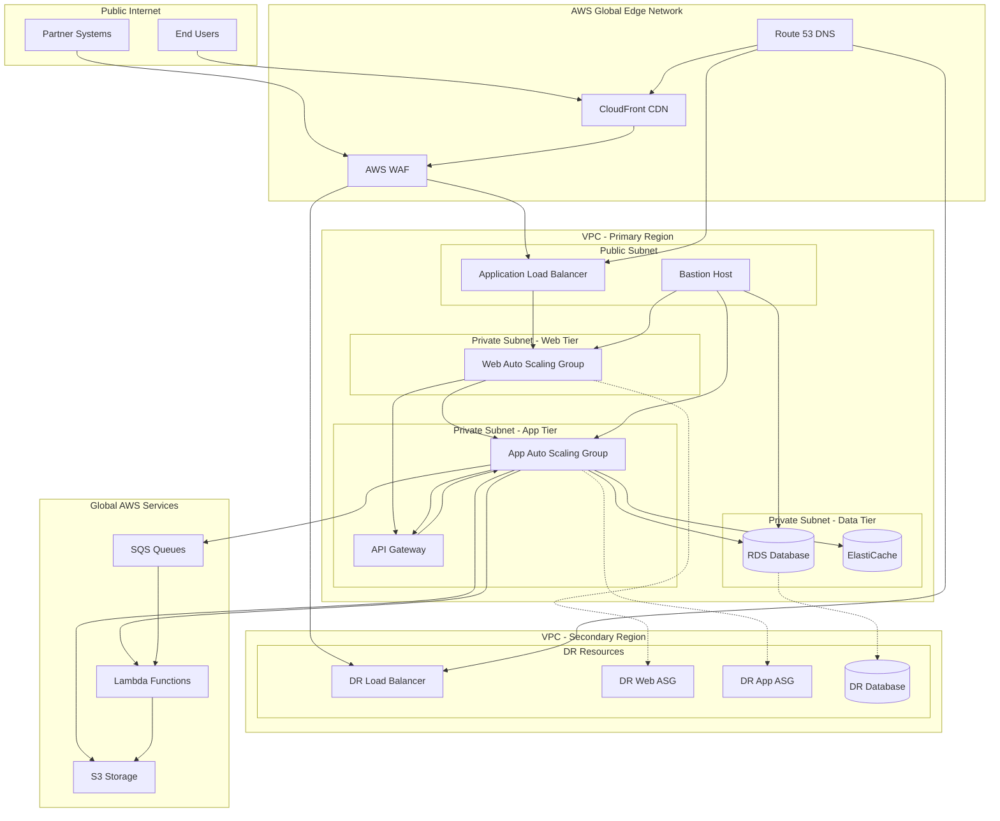
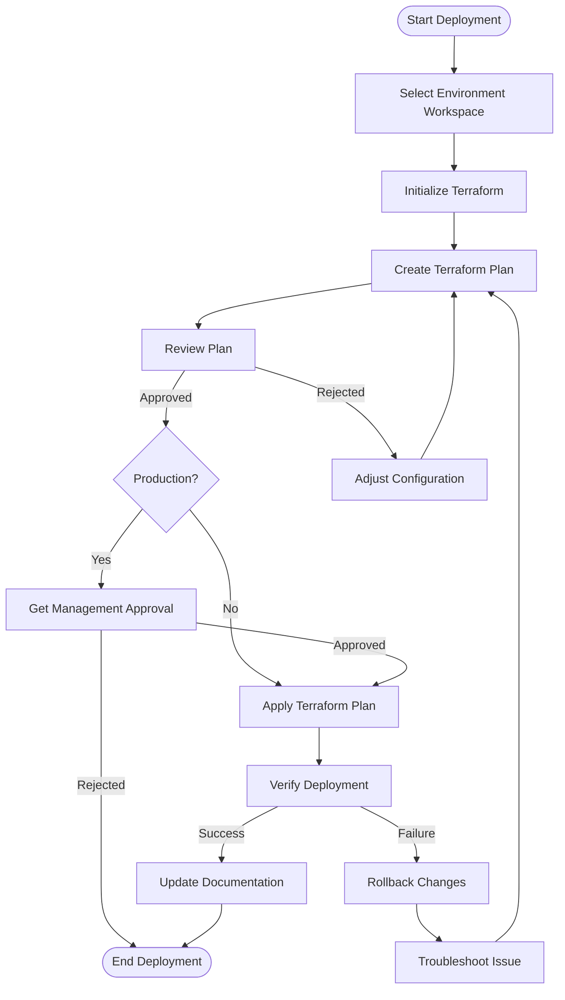
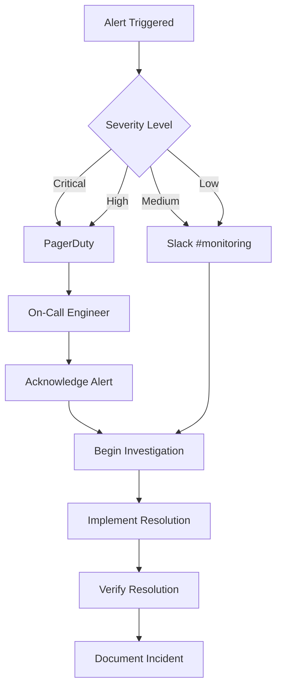
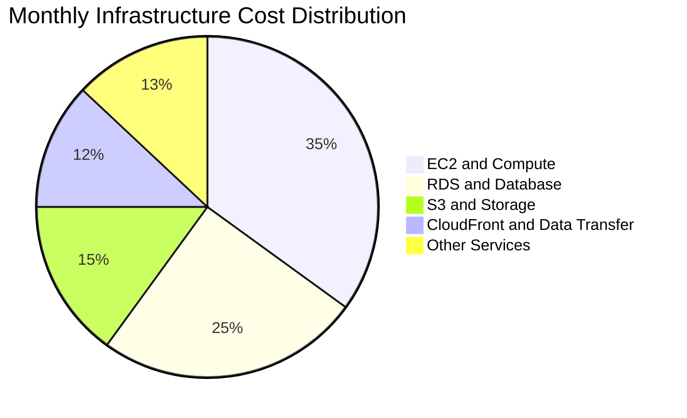

# IndiVillage.com Infrastructure

Documentation for the cloud infrastructure that powers the IndiVillage.com website, including setup instructions, architecture overview, and operational procedures.

## Table of Contents
- [Architecture Overview](#architecture-overview)
- [Infrastructure as Code](#infrastructure-as-code)
- [Getting Started](#getting-started)
- [Deployment Instructions](#deployment-instructions)
- [Environment Configuration](#environment-configuration)
- [Monitoring and Alerting](#monitoring-and-alerting)
- [Backup and Disaster Recovery](#backup-and-disaster-recovery)
- [Security Considerations](#security-considerations)
- [Operational Procedures](#operational-procedures)
- [Cost Optimization](#cost-optimization)

## Architecture Overview

IndiVillage.com uses a highly-available, multi-region AWS infrastructure designed for performance, reliability, and security. This architecture supports our AI-as-a-service offerings with specialized components for file processing, data analysis, and content delivery.

### Network Architecture



### Key Components

- **Edge Delivery**: CloudFront CDN, AWS WAF, Route 53
- **Compute**: EC2 in Auto Scaling Groups, Lambda for serverless processing
- **Containers**: ECS for containerized applications
- **Storage**: S3 for files, RDS for relational data, ElastiCache for caching
- **Networking**: VPC with public/private subnets, ALB for load balancing
- **API Management**: API Gateway for REST API management

### High Availability Design

Our infrastructure employs multiple strategies to ensure high availability:

1. **Multi-AZ Deployments**: Critical components are deployed across multiple Availability Zones
2. **Auto Scaling**: Dynamic adjustment of capacity based on demand
3. **Cross-Region Replication**: Data replication between primary and secondary regions
4. **Load Balancing**: Distribute traffic across multiple instances
5. **Automated Failover**: Automatic detection and rerouting around failures
6. **CDN**: Global edge network for static content delivery

## Infrastructure as Code

All infrastructure is defined and managed using Terraform, enabling consistent and repeatable deployments across environments.

### Repository Structure

```
infrastructure/
├── environments/
│   ├── common/
│   ├── development/
│   ├── staging/
│   └── production/
├── modules/
│   ├── networking/
│   ├── compute/
│   ├── database/
│   ├── storage/
│   ├── security/
│   ├── monitoring/
│   └── container/
├── scripts/
├── .gitignore
├── README.md
└── versions.tf
```

### Module Design

Our Terraform modules follow these principles:

- **Modularity**: Components are separated into logical modules
- **Reusability**: Modules are parameterized for reuse across environments
- **Versioning**: Module versions are explicitly pinned
- **Documentation**: Each module includes detailed README and example usage

### State Management

Terraform state is stored in an S3 backend with the following features:

- **S3 Storage**: Centralized, versioned state storage
- **DynamoDB Locking**: Prevents concurrent modifications
- **Encryption**: State files are encrypted at rest
- **Workspaces**: Separate workspaces for each environment

## Getting Started

This section covers the requirements and setup process for working with the infrastructure.

### Prerequisites

- AWS CLI v2.7.0 or later
- Terraform v1.3.0 or later
- Python 3.10 or later
- Docker 20.10.x or later
- Access credentials for AWS environments

### Local Environment Setup

1. **Install required tools**:

   ```bash
   # Install AWS CLI
   curl "https://awscli.amazonaws.com/awscli-exe-linux-x86_64.zip" -o "awscliv2.zip"
   unzip awscliv2.zip
   sudo ./aws/install

   # Install Terraform
   wget -O- https://apt.releases.hashicorp.com/gpg | gpg --dearmor | sudo tee /usr/share/keyrings/hashicorp-archive-keyring.gpg
   echo "deb [signed-by=/usr/share/keyrings/hashicorp-archive-keyring.gpg] https://apt.releases.hashicorp.com $(lsb_release -cs) main" | sudo tee /etc/apt/sources.list.d/hashicorp.list
   sudo apt update && sudo apt install terraform
   ```

2. **Configure AWS credentials**:

   ```bash
   aws configure
   # Enter your AWS Access Key ID, Secret Access Key, default region, and output format
   ```

3. **Clone the repository**:

   ```bash
   git clone https://github.com/IndiVillage/infrastructure.git
   cd infrastructure
   ```

4. **Initialize Terraform**:

   ```bash
   terraform init
   ```

## Deployment Instructions

### Development Environment

1. **Select workspace**:

   ```bash
   terraform workspace select development
   # If it doesn't exist: terraform workspace new development
   ```

2. **Create/update infrastructure plan**:

   ```bash
   terraform plan -var-file=environments/development/terraform.tfvars -out=dev.plan
   ```

3. **Review the plan** to ensure changes match expectations

4. **Apply the infrastructure changes**:

   ```bash
   terraform apply dev.plan
   ```

### Staging Environment

1. **Select workspace**:

   ```bash
   terraform workspace select staging
   ```

2. **Create/update infrastructure plan**:

   ```bash
   terraform plan -var-file=environments/staging/terraform.tfvars -out=staging.plan
   ```

3. **Review and apply**:

   ```bash
   terraform apply staging.plan
   ```

### Production Environment

Production deployments require additional approval and validation:

1. **Select workspace**:

   ```bash
   terraform workspace select production
   ```

2. **Create/update infrastructure plan**:

   ```bash
   terraform plan -var-file=environments/production/terraform.tfvars -out=prod.plan
   ```

3. **Review the plan** in detail with the infrastructure team

4. **Obtain approval** from the operations manager

5. **Apply with confirmation**:

   ```bash
   terraform apply prod.plan
   ```

6. **Verify deployment** using post-deployment validation scripts:

   ```bash
   ./scripts/verify-deployment.sh production
   ```

### Deployment Workflow



## Environment Configuration

Environment-specific configurations are managed through variable files and environment-specific modules.

### Configuration Hierarchy

1. **Base configurations**: Common settings shared across environments
2. **Environment-specific overrides**: Values specific to each environment
3. **Secret values**: Managed through AWS Parameter Store/Secrets Manager

### Environment Variables

Key variables for each environment are defined in `environments/<env>/terraform.tfvars`:

#### Development

```hcl
environment             = "development"
vpc_cidr                = "10.0.0.0/16"
instance_type           = "t3.medium"
rds_instance_class      = "db.t3.medium"
enable_enhanced_monitoring = false
multi_az_database       = false
cdn_price_class         = "PriceClass_100"
```

#### Staging

```hcl
environment             = "staging"
vpc_cidr                = "10.1.0.0/16"
instance_type           = "t3.large"
rds_instance_class      = "db.t3.large"
enable_enhanced_monitoring = true
multi_az_database       = true
cdn_price_class         = "PriceClass_200"
```

#### Production

```hcl
environment             = "production"
vpc_cidr                = "10.2.0.0/16"
instance_type           = "m5.large"
rds_instance_class      = "db.m5.large"
enable_enhanced_monitoring = true
multi_az_database       = true
cdn_price_class         = "PriceClass_All"
backup_retention_period = 30
```

### Secrets Management

Sensitive information is never stored in the Terraform code or state files. We use AWS Secrets Manager for credentials and sensitive configuration:

```hcl
data "aws_secretsmanager_secret" "database_credentials" {
  name = "/${var.environment}/database/credentials"
}

data "aws_secretsmanager_secret_version" "database_credentials" {
  secret_id = data.aws_secretsmanager_secret.database_credentials.id
}

# Reference in resources
resource "aws_db_instance" "main" {
  # ...
  username = jsondecode(data.aws_secretsmanager_secret_version.database_credentials.secret_string)["username"]
  password = jsondecode(data.aws_secretsmanager_secret_version.database_credentials.secret_string)["password"]
  # ...
}
```

## Monitoring and Alerting

Our monitoring infrastructure uses AWS CloudWatch with enhanced visibility through Prometheus and Grafana.

### Monitoring Components

- **CloudWatch Metrics**: Core AWS resource metrics
- **CloudWatch Logs**: Centralized log management
- **X-Ray**: Distributed tracing for microservices
- **Prometheus**: Metric collection and alerting
- **Grafana**: Visualization and dashboards

### Dashboard Access

- Development: [grafana-dev.indivillage.com](https://grafana-dev.indivillage.com)
- Staging: [grafana-staging.indivillage.com](https://grafana-staging.indivillage.com)
- Production: [grafana.indivillage.com](https://grafana.indivillage.com)

### Alert Configuration

Alerts are configured for:

1. **Infrastructure health**: Instance status, load balancer health
2. **Performance metrics**: CPU, memory, database connections
3. **Application metrics**: Error rates, response times
4. **Business metrics**: File upload volume, processing times

### Alert Routing



## Backup and Disaster Recovery

Our backup and disaster recovery strategy ensures data integrity and business continuity.

### Backup Strategy

| Component | Backup Method | Frequency | Retention |
|-----------|--------------|-----------|-----------|
| RDS Database | Automated snapshots | Daily | 30 days |
| S3 Data | Cross-region replication | Continuous | N/A |
| EBS Volumes | EBS Snapshots | Daily | 14 days |
| Configuration | Terraform state | Every change | Indefinite |

### Backup Monitoring

All backup operations are monitored with automated notifications for:
- Failed backups
- Skipped backup windows
- Backup restoration tests

### Disaster Recovery Procedures

#### Database Failure

1. **Automatic failover** for Multi-AZ deployments
2. **Manual restoration** process for single-AZ environments:

   ```bash
   # List available snapshots
   aws rds describe-db-snapshots --db-instance-identifier indivillage-db
   
   # Restore from snapshot
   aws rds restore-db-instance-from-db-snapshot \
     --db-instance-identifier indivillage-db-restored \
     --db-snapshot-identifier snapshot-identifier
   ```

#### Region Failure

1. **DNS Failover**: Route 53 health checks automatically route traffic to secondary region
2. **Database Promotion**: Promote read replica in secondary region to primary
3. **Capacity Scaling**: Scale up resources in secondary region

#### Recovery Time and Point Objectives

| Environment | Recovery Time Objective (RTO) | Recovery Point Objective (RPO) |
|-------------|------------------------------|------------------------------|
| Development | < 4 hours | < 24 hours |
| Staging | < 2 hours | < 12 hours |
| Production | < 1 hour | < 15 minutes |

## Security Considerations

Security is integrated throughout our infrastructure with defense-in-depth principles.

### Network Security

- **VPC Isolation**: Separate VPCs for different environments
- **Network ACLs**: Stateless packet filtering
- **Security Groups**: Stateful instance-level firewalls
- **Private Subnets**: No direct internet access for application and data tiers
- **VPC Flow Logs**: Network traffic logging and monitoring

### Data Protection

- **Encryption at Rest**: All data stored with AES-256 encryption
- **Encryption in Transit**: TLS 1.2+ for all communications
- **Key Management**: AWS KMS for encryption key management
- **S3 Bucket Policies**: Strict access controls on all buckets
- **RDS Encryption**: TDE for database encryption

### Identity and Access Management

- **IAM Roles**: Least privilege principle for all services
- **MFA**: Required for all human users
- **IAM Policy Boundaries**: Limit maximum permissions
- **Service Control Policies**: Organization-wide permission guardrails
- **Temporary Credentials**: No long-lived access keys

### Compliance Frameworks

Our infrastructure is designed to comply with:
- GDPR
- SOC 2
- ISO 27001
- HIPAA (where applicable)

### Security Monitoring

- **GuardDuty**: Threat detection service
- **SecurityHub**: Security posture management
- **Config**: Configuration compliance monitoring
- **CloudTrail**: API activity monitoring
- **Inspector**: Automated vulnerability management

## Operational Procedures

This section covers routine operational tasks and troubleshooting procedures.

### Scaling Operations

#### Horizontal Scaling

To adjust the number of instances in an Auto Scaling Group:

```bash
# Update min/max/desired capacity
aws autoscaling update-auto-scaling-group \
  --auto-scaling-group-name indivillage-web-asg \
  --min-size 2 \
  --max-size 10 \
  --desired-capacity 4
```

#### Vertical Scaling

Database instance class changes require downtime for non-Multi-AZ deployments:

```bash
# Modify instance class
aws rds modify-db-instance \
  --db-instance-identifier indivillage-db \
  --db-instance-class db.m5.xlarge \
  --apply-immediately
```

### Maintenance Procedures

#### OS Patching

EC2 instances use AWS Systems Manager Patch Manager with the following schedule:

| Environment | Patching Window | Frequency |
|-------------|----------------|-----------|
| Development | Anytime | Automatic |
| Staging | Tuesdays 02:00-04:00 UTC | Weekly |
| Production | Sundays 02:00-04:00 UTC | Bi-weekly |

#### Database Maintenance

RDS maintenance windows are configured as follows:

| Environment | Maintenance Window |
|-------------|-------------------|
| Development | Wednesdays 06:00-07:00 UTC |
| Staging | Tuesdays 05:00-06:00 UTC |
| Production | Sundays 05:00-06:00 UTC |

### Troubleshooting Guide

#### Common Issues and Resolutions

1. **Auto Scaling Group not scaling out**
   - Check target tracking metrics
   - Verify launch template configuration
   - Review instance launch failures in ASG Activity History

2. **High database CPU utilization**
   - Review slow query log
   - Check for missing indexes
   - Consider read replicas for read-heavy workloads

3. **S3 access denied errors**
   - Verify bucket policies
   - Check IAM role permissions
   - Ensure correct endpoint configuration

#### Log Access

Access CloudWatch Logs for troubleshooting:

```bash
# List log groups
aws logs describe-log-groups

# Get log streams
aws logs describe-log-streams --log-group-name /aws/lambda/file-processor

# Get log events
aws logs get-log-events \
  --log-group-name /aws/lambda/file-processor \
  --log-stream-name 2023/04/15/[$LATEST]58f5d8e7
```

## Cost Optimization

Our infrastructure employs several strategies to optimize AWS costs while maintaining performance and reliability.

### Cost-saving Strategies

1. **Right-sizing**: Match instance types to workload requirements
2. **Reserved Instances**: 1-year standard RIs for baseline capacity
3. **Auto Scaling**: Scale down during low-demand periods
4. **S3 Lifecycle Policies**: Automatically transition objects to lower-cost storage classes
5. **Spot Instances**: For fault-tolerant workloads (development/staging)

### Resource Tagging

All resources are tagged for cost allocation and management:

```hcl
tags = {
  Environment = var.environment
  Project     = "IndiVillage-Website"
  Owner       = "DevOps"
  CostCenter  = "IT-${var.environment}"
  Terraform   = "true"
}
```

### Cost Monitoring

- **AWS Cost Explorer**: Monthly spend analysis
- **AWS Budgets**: Budget alerts at 50%, 80%, and 100% thresholds
- **Cost Anomaly Detection**: Alerts for unusual spending patterns

### Cost Optimization Recommendations

| Resource | Optimization Strategy | Potential Savings |
|----------|----------------------|-------------------|
| EC2 | Use Graviton2 instances | 10-15% |
| RDS | Right-size and use reserved instances | 30-40% |
| CloudFront | Optimize caching behaviors | 15-20% |
| S3 | Implement lifecycle policies | 20-30% |
| Data Transfer | Use VPC endpoints for AWS services | 5-10% |

### Monthly Cost Breakdown



---

## Contributing to Infrastructure

For any infrastructure changes:

1. Create a feature branch from `main`
2. Make changes and test locally
3. Open a pull request with detailed description
4. Request review from the infrastructure team
5. Merge after approval and successful CI checks

For urgent production fixes, use the hotfix process described in our operations playbook.